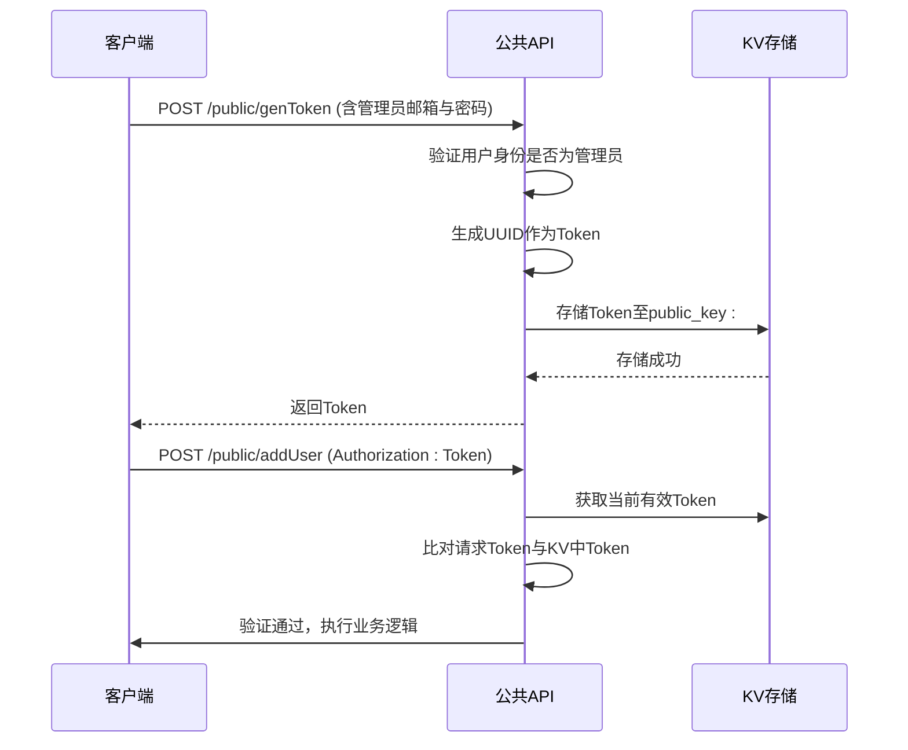
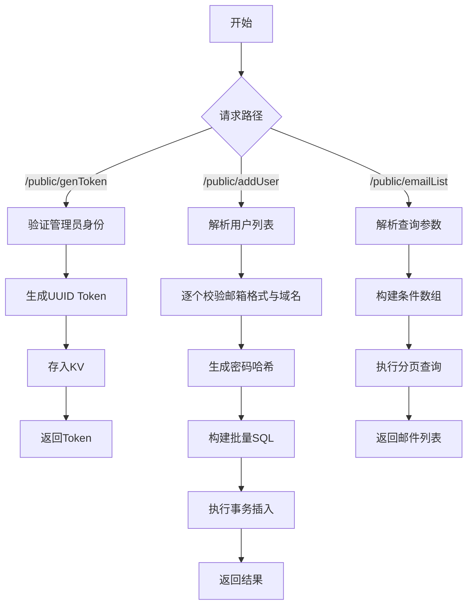

# 开放API接口

<cite>
**本文档中引用的文件**  
- [public-service.js](file://mail-worker/src/service/public-service.js)
- [public-api.js](file://mail-worker/src/api/public-api.js)
- [reg-key-service.js](file://mail-worker/src/service/reg-key-service.js)
- [security.js](file://mail-worker/src/security/security.js)
- [constant.js](file://mail-worker/src/const/constant.js)
- [kv-const.js](file://mail-worker/src/const/kv-const.js)
</cite>

## 目录
1. [简介](#简介)
2. [认证机制](#认证机制)
3. [API 接口说明](#api-接口说明)
4. [权限与数据隔离策略](#权限与数据隔离策略)
5. [业务逻辑与安全校验](#业务逻辑与安全校验)
6. [使用示例](#使用示例)
7. [自动化脚本集成指南](#自动化脚本集成指南)
8. [附录](#附录)

## 简介
本文档旨在为外部系统提供 `cloud-mail` 项目的开放API接口文档，重点描述 `/api/public/create-users`（批量创建用户）与 `/api/public/emails`（查询邮件）两个接口的使用方式。文档涵盖认证机制、请求格式、速率限制、API Token管理、权限边界及数据隔离策略，并结合代码逻辑说明安全校验流程，适用于CI/CD或批量用户导入等场景。

## 认证机制

### API Token 认证方式
所有公开API接口均需通过专用API Token进行认证。该Token通过调用 `/public/genToken` 接口生成，并在后续请求中以 `Authorization` 头部传递。

Token存储于Cloudflare KV中，键名为 `public_key:`，每次生成新Token时会覆盖旧值，确保全局唯一性与时效性。



**Diagram sources**
- [public-service.js](file://mail-worker/src/service/public-service.js#L165-L175)
- [security.js](file://mail-worker/src/security/security.js#L99-L105)
- [kv-const.js](file://mail-worker/src/const/kv-const.js#L4)

**Section sources**
- [public-service.js](file://mail-worker/src/service/public-service.js#L165-L175)
- [security.js](file://mail-worker/src/security/security.js#L99-L105)

## API 接口说明

### POST /api/public/create-users（批量创建用户）

#### 请求格式
```json
{
  "list": [
    {
      "email": "user@domain.com",
      "password": "optional_password",
      "roleName": "optional_role_name"
    }
  ]
}
```

- `email`: 必填，需符合邮箱格式。
- `password`: 可选，未提供则自动生成随机密码。
- `roleName`: 可选，指定用户角色，若不存在则使用默认角色。

#### 响应格式
```json
{
  "code": 200,
  "msg": "OK"
}
```

#### 速率限制
无显式速率限制，但受底层数据库写入性能约束。

**Section sources**
- [public-api.js](file://mail-worker/src/api/public-api.js#L13-L17)
- [public-service.js](file://mail-worker/src/service/public-service.js#L45-L99)

### GET /api/public/emails（查询邮件）

#### 请求格式
支持POST方式传递查询参数：
```json
{
  "toEmail": "recipient@domain.com",
  "sendEmail": "sender@domain.com",
  "subject": "邮件主题",
  "content": "邮件内容",
  "timeSort": "desc|asc",
  "num": 1,
  "size": 20
}
```

- 支持模糊匹配和分页（`num`, `size`）。
- `timeSort` 控制排序方向，默认为 `desc`。

#### 响应格式
返回邮件列表，包含发件人、收件人、主题、内容、时间等字段。

#### 权限边界
仅能查询指定域名下的邮件，域名由环境变量 `domain` 控制。

**Section sources**
- [public-api.js](file://mail-worker/src/api/public-api.js#L7-L11)
- [public-service.js](file://mail-worker/src/service/public-service.js#L1-L43)

## 权限与数据隔离策略

### 域名限制
在创建用户时，系统会校验邮箱域名是否属于允许注册的域名范围（`c.env.domain`），防止越权创建非授权域名用户。

```javascript
if (!c.env.domain.includes(emailUtils.getDomain(emailRow.email))) {
    throw new BizError(t('notEmailDomain'));
}
```

### 数据隔离
- 所有邮件查询均基于域名白名单机制，确保只能访问授权域名的数据。
- 用户角色由注册密钥（regKey）控制，不同角色可赋予不同权限。
- 管理员专属操作（如生成Token）需验证管理员邮箱与密码。

**Section sources**
- [public-service.js](file://mail-worker/src/service/public-service.js#L67-L71)
- [reg-key-service.js](file://mail-worker/src/service/reg-key-service.js#L45-L55)

## 业务逻辑与安全校验

### 核心服务逻辑（public-service.js）
`public-service.js` 实现了三大核心功能：
1. `genToken`: 验证管理员身份后生成UUID Token并存入KV。
2. `addUser`: 批量插入用户与账户记录，自动分配角色，密码加盐哈希存储。
3. `emailList`: 构建动态SQL查询邮件，支持多条件模糊搜索与分页。

安全校验包括：
- 邮箱格式验证
- 域名校验
- 密码哈希处理
- SQL注入防护（使用Drizzle ORM参数化查询）



**Diagram sources**
- [public-service.js](file://mail-worker/src/service/public-service.js#L1-L195)

**Section sources**
- [public-service.js](file://mail-worker/src/service/public-service.js#L1-L195)

## 使用示例

### 获取API Token
```bash
curl -X POST https://your-api.com/public/genToken \
  -H "Content-Type: application/json" \
  -d '{
    "email": "admin@yourdomain.com",
    "password": "your_admin_password"
  }'
```

### 批量创建用户
```bash
curl -X POST https://your-api.com/public/addUser \
  -H "Authorization: your-generated-token" \
  -H "Content-Type: application/json" \
  -d '{
    "list": [
      {
        "email": "user1@yourdomain.com",
        "password": "pwd123",
        "roleName": "user"
      },
      {
        "email": "user2@yourdomain.com"
      }
    ]
  }'
```

### 查询邮件
```bash
curl -X POST https://your-api.com/public/emailList \
  -H "Authorization: your-generated-token" \
  -H "Content-Type: application/json" \
  -d '{
    "toEmail": "user@yourdomain.com",
    "size": 10,
    "num": 1
  }'
```

**Section sources**
- [public-api.js](file://mail-worker/src/api/public-api.js#L7-L17)

## 自动化脚本集成指南

### CI/CD 集成
可在CI流程中使用如下脚本自动创建测试用户：

```bash
#!/bin/bash
API_URL="https://your-api.com"
ADMIN_EMAIL="admin@yourdomain.com"
ADMIN_PWD="your_admin_password"

# 获取Token
TOKEN=$(curl -s -X POST $API_URL/public/genToken \
  -H "Content-Type: application/json" \
  -d "{\"email\":\"$ADMIN_EMAIL\",\"password\":\"$ADMIN_PWD\"}" | jq -r '.data.token')

# 创建用户
curl -X POST $API_URL/public/addUser \
  -H "Authorization: $TOKEN" \
  -H "Content-Type: application/json" \
  -d '{
    "list": [
      {"email": "test1@yourdomain.com"},
      {"email": "test2@yourdomain.com"}
    ]
  }'
```

### 批量导入场景
建议分批次调用（每批≤100），避免单次请求过大导致超时。

## 附录

### 错误码说明
| 错误码 | 说明 |
|-------|------|
| 401   | Token无效或未提供 |
| 403   | 无权限操作 |
| 400   | 请求参数错误 |
| 500   | 服务器内部错误 |

### 相关配置项
- `TOKEN_HEADER`: 认证头名称，定义于 `constant.js`
- `PUBLIC_KEY`: KV中Token键名，定义于 `kv-const.js`

**Section sources**
- [constant.js](file://mail-worker/src/const/constant.js#L1)
- [kv-const.js](file://mail-worker/src/const/kv-const.js#L4)