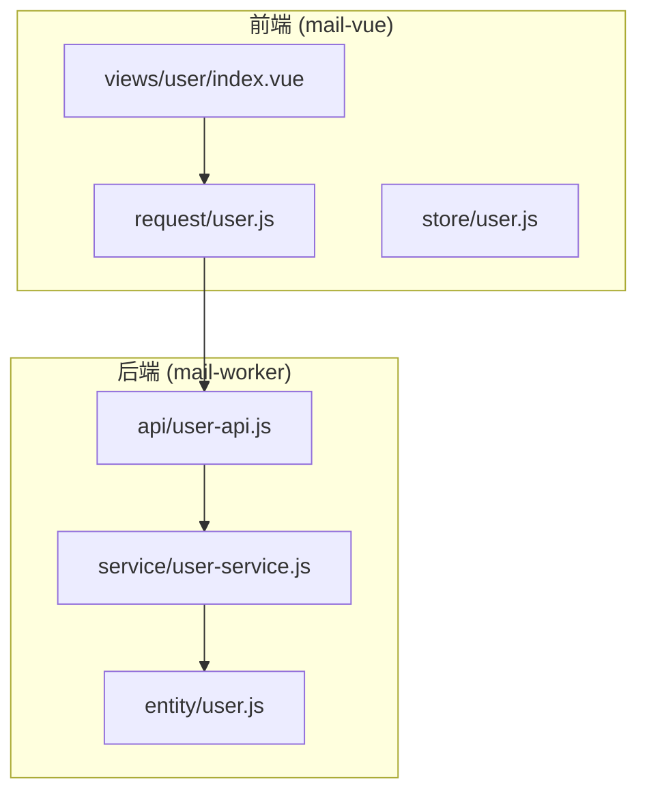
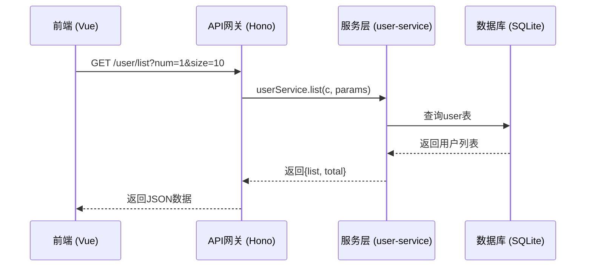
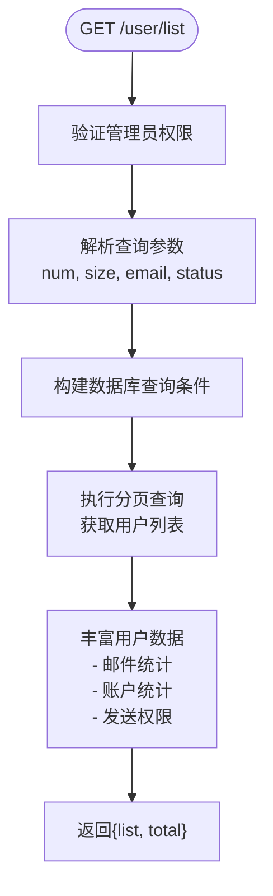
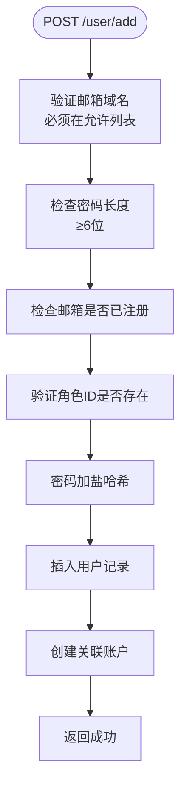
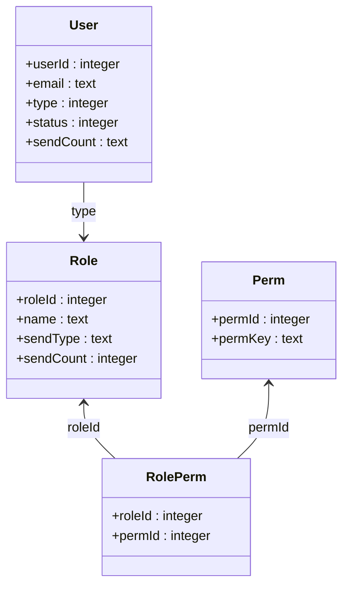
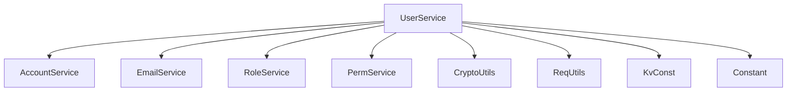

# 用户管理接口

<cite>
**本文档引用的文件**
- [user-service.js](file://mail-worker/src/service/user-service.js)
- [user.js](file://mail-vue/src/request/user.js)
- [user.js](file://mail-worker/src/entity/user.js)
- [user-api.js](file://mail-worker/src/api/user-api.js)
</cite>

## 目录
1. [简介](#简介)
2. [项目结构](#项目结构)
3. [核心组件](#核心组件)
4. [架构概述](#架构概述)
5. [详细组件分析](#详细组件分析)
6. [依赖分析](#依赖分析)
7. [性能考虑](#性能考虑)
8. [故障排除指南](#故障排除指南)
9. [结论](#结论)

## 简介
本文档详细说明了用户管理接口的功能，涵盖用户创建、查询、更新、删除及权限分配等操作。重点描述了 `GET /api/user`（分页查询）、`POST /api/user`（创建用户）、`PUT /api/user/:id`（更新用户）等关键端点。文档涵盖请求参数、管理员权限要求、响应数据结构（User 实体字段）、用户状态字段（如是否启用）与角色关联逻辑。结合 `user-service.js` 说明业务规则（如用户名唯一性校验），并提供前端请求封装示例（`user.js`）与异常处理策略。同时包含分页参数（page, size）与过滤选项的使用说明。

## 项目结构
用户管理功能分布在前后端两个主要模块中：前端 Vue 应用（`mail-vue`）负责用户界面和请求封装，后端 Hono 服务（`mail-worker`）负责业务逻辑和数据持久化。

**Diagram sources**
- [mail-vue/src/views/user/index.vue](file://mail-vue/src/views/user/index.vue)
- [mail-vue/src/request/user.js](file://mail-vue/src/request/user.js)
- [mail-worker/src/api/user-api.js](file://mail-worker/src/api/user-api.js)
- [mail-worker/src/service/user-service.js](file://mail-worker/src/service/user-service.js)
- [mail-worker/src/entity/user.js](file://mail-worker/src/entity/user.js)

**Section sources**
- [mail-vue/src/request/user.js](file://mail-vue/src/request/user.js#L1-L44)
- [mail-worker/src/api/user-api.js](file://mail-worker/src/api/user-api.js#L1-L58)

## 核心组件
核心组件包括前端请求封装、后端 API 路由、业务服务层和数据实体。`user.js`（前端）封装 HTTP 请求，`user-api.js` 定义 REST 端点，`user-service.js` 实现核心业务逻辑，`user.js`（后端实体）定义数据库表结构。

**Section sources**
- [mail-vue/src/request/user.js](file://mail-vue/src/request/user.js#L1-L44)
- [mail-worker/src/api/user-api.js](file://mail-worker/src/api/user-api.js#L1-L58)
- [mail-worker/src/service/user-service.js](file://mail-worker/src/service/user-service.js#L1-L364)
- [mail-worker/src/entity/user.js](file://mail-worker/src/entity/user.js#L1-L23)

## 架构概述
系统采用典型的前后端分离架构。前端通过 Axios 发起请求，后端使用 Hono 框架处理路由，调用 Service 层进行业务处理，最终通过 Drizzle ORM 操作 SQLite 数据库。

**Diagram sources**
- [mail-worker/src/api/user-api.js](file://mail-worker/src/api/user-api.js#L15-L20)
- [mail-worker/src/service/user-service.js](file://mail-worker/src/service/user-service.js#L93-L158)
- [mail-worker/src/entity/user.js](file://mail-worker/src/entity/user.js#L2-L20)

## 详细组件分析

### 用户查询分析
实现分页查询用户列表，支持按邮箱模糊搜索和状态过滤。

#### 接口定义

**Diagram sources**
- [mail-worker/src/api/user-api.js](file://mail-worker/src/api/user-api.js#L15-L20)
- [mail-worker/src/service/user-service.js](file://mail-worker/src/service/user-service.js#L93-L158)

**Section sources**
- [mail-worker/src/service/user-service.js](file://mail-worker/src/service/user-service.js#L93-L158)

### 用户创建分析
实现新用户注册功能，包含邮箱域名校验、密码强度检查和唯一性验证。

#### 业务规则流程

**Diagram sources**
- [mail-worker/src/service/user-service.js](file://mail-worker/src/service/user-service.js#L305-L348)
- [mail-worker/src/api/user-api.js](file://mail-worker/src/api/user-api.js#L27-L30)

**Section sources**
- [mail-worker/src/service/user-service.js](file://mail-worker/src/service/user-service.js#L305-L348)

### 用户更新分析
实现用户信息更新，包括密码重置、状态变更和角色分配。

#### 权限分配逻辑

**Diagram sources**
- [mail-worker/src/entity/user.js](file://mail-worker/src/entity/user.js#L2-L20)
- [mail-worker/src/entity/role.js](file://mail-worker/src/entity/role.js)
- [mail-worker/src/entity/perm.js](file://mail-worker/src/entity/perm.js)
- [mail-worker/src/entity/role-perm.js](file://mail-worker/src/entity/role-perm.js)

**Section sources**
- [mail-worker/src/service/user-service.js](file://mail-worker/src/service/user-service.js#L255-L275)

## 依赖分析
用户管理模块依赖多个核心服务和配置。

**Diagram sources**
- [mail-worker/src/service/user-service.js](file://mail-worker/src/service/user-service.js#L1-L10)
- [mail-worker/src/service/user-service.js](file://mail-worker/src/service/user-service.js#L305-L348)

**Section sources**
- [mail-worker/src/service/user-service.js](file://mail-worker/src/service/user-service.js#L1-L10)

## 性能考虑
- 分页查询限制最大 `size` 为 50，防止性能问题
- 使用 `Promise.all` 并行获取统计信息，减少数据库往返
- 对邮箱字段使用 `COLLATE NOCASE` 实现不区分大小写的搜索
- 通过 KV 存储缓存认证信息，提高登录验证效率

## 故障排除指南
常见问题及解决方案：

| 问题 | 原因 | 解决方案 |
|------|------|----------|
| 创建用户失败 | 邮箱域名不在允许列表 | 检查 `c.env.domain` 配置 |
| 密码重置失败 | 密码长度不足6位 | 确保密码≥6位 |
| 用户无法登录 | 账户已被禁用 | 检查用户 `status` 字段 |
| 权限不正确 | 角色权限未正确关联 | 检查 `role-perm` 表配置 |

**Section sources**
- [mail-worker/src/service/user-service.js](file://mail-worker/src/service/user-service.js#L310-L315)
- [mail-worker/src/service/user-service.js](file://mail-worker/src/service/user-service.js#L320-L325)
- [mail-worker/src/service/login-service.js](file://mail-worker/src/service/login-service.js#L210-L257)

## 结论
用户管理接口提供了完整的 CRUD 操作和权限控制功能。通过清晰的分层架构和严谨的业务规则，确保了系统的安全性和可靠性。前端请求封装简化了调用，后端服务层实现了复杂的业务逻辑，为系统提供了稳定可靠的用户管理能力。