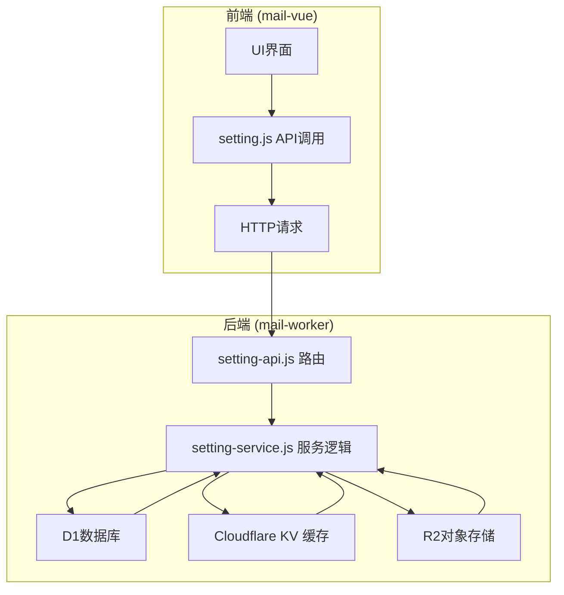
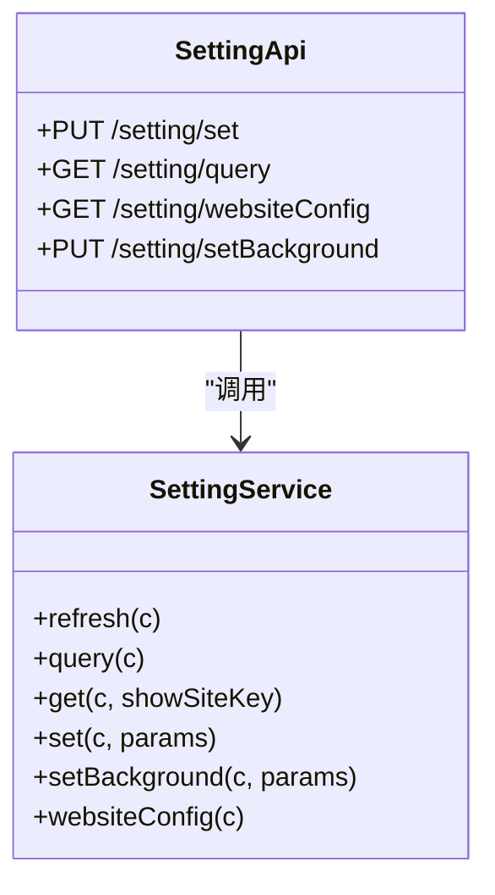
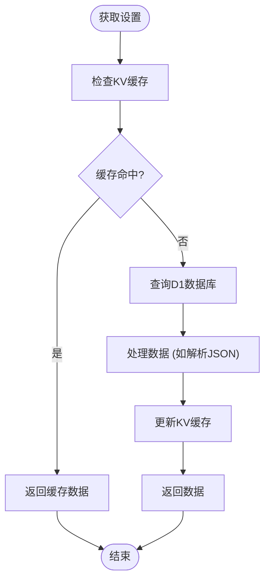
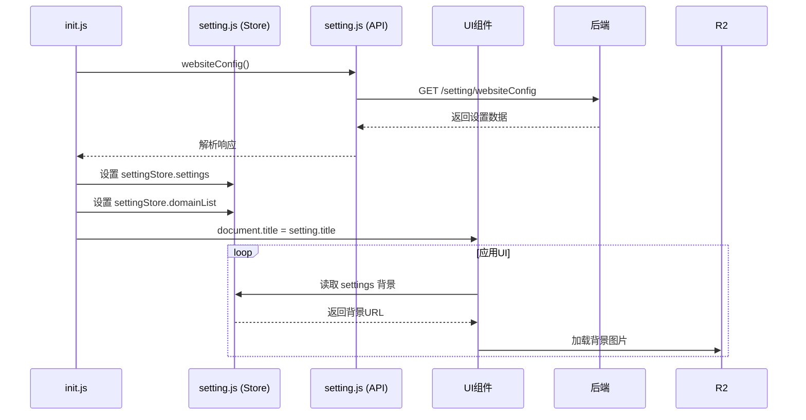
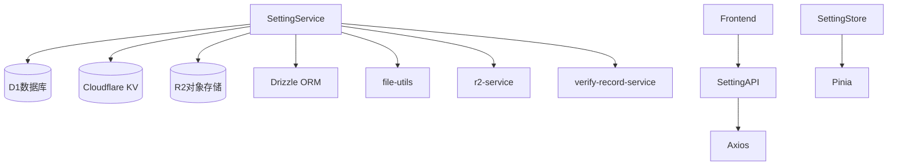

# 系统设置接口

<cite>
**本文档引用的文件**
- [setting-api.js](file://mail-worker/src/api/setting-api.js)
- [setting-service.js](file://mail-worker/src/service/setting-service.js)
- [setting.js](file://mail-worker/src/entity/setting.js)
- [setting.js](file://mail-vue/src/request/setting.js)
- [setting.js](file://mail-vue/src/store/setting.js)
- [init.js](file://mail-vue/src/init/init.js)
- [kv-const.js](file://mail-worker/src/const/kv-const.js)
- [index.vue](file://mail-vue/src/views/sys-setting/index.vue)
- [router/index.js](file://mail-vue/src/router/index.js)
</cite>

## 目录
1. [简介](#简介)
2. [项目结构](#项目结构)
3. [核心组件](#核心组件)
4. [架构概览](#架构概览)
5. [详细组件分析](#详细组件分析)
6. [依赖分析](#依赖分析)
7. [性能考虑](#性能考虑)
8. [故障排除指南](#故障排除指南)
9. [结论](#结论)

## 简介
本文档旨在详细说明系统设置相关API的使用方式，支持动态配置系统行为。涵盖 `GET /api/setting`（获取所有设置）和 `PUT /api/setting`（批量更新）接口的使用方法。列出所有可配置项，包括系统标题、背景图URL、注册开关、发送配额、Resend API密钥等。解释设置项的存储机制（D1数据库）与缓存策略（KV）。描述前端 `setting.js` 如何初始化加载配置并应用于UI（如header、login页）。提供安全建议，如敏感设置项的访问控制与更新审计。

## 项目结构
系统设置功能分布在前后端两个主要模块中：
- **前端 (mail-vue)**：负责UI展示与用户交互，设置请求通过Axios发送至后端。
- **后端 (mail-worker)**：处理API请求，管理设置数据的持久化与缓存。

关键文件分布如下：
- 前端API请求封装：`mail-vue/src/request/setting.js`
- 前端状态管理：`mail-vue/src/store/setting.js`
- 后端API路由：`mail-worker/src/api/setting-api.js`
- 后端服务逻辑：`mail-worker/src/service/setting-service.js`
- 数据库实体定义：`mail-worker/src/entity/setting.js`

**Section sources**
- [setting-api.js](file://mail-worker/src/api/setting-api.js#L1-L23)
- [setting.js](file://mail-vue/src/request/setting.js#L1-L21)
- [setting.js](file://mail-vue/src/store/setting.js#L1-L16)

## 核心组件
系统设置的核心功能由后端API和服务层实现，前端通过调用API与之交互。主要功能包括：
- 获取所有系统设置（`/setting/query` 和 `/setting/websiteConfig`）
- 批量更新系统设置（`/setting/set`）
- 设置和上传背景图片（`/setting/setBackground`）

设置数据存储在D1数据库中，并通过Cloudflare KV进行缓存，以提高读取性能。

**Section sources**
- [setting-service.js](file://mail-worker/src/service/setting-service.js#L1-L181)
- [setting.js](file://mail-worker/src/entity/setting.js#L1-L45)

## 架构概览
系统设置的架构分为三层：前端展示层、后端API层和数据存储层。

**Diagram sources**
- [setting-api.js](file://mail-worker/src/api/setting-api.js#L1-L23)
- [setting-service.js](file://mail-worker/src/service/setting-service.js#L1-L181)
- [setting.js](file://mail-vue/src/request/setting.js#L1-L21)

## 详细组件分析

### 后端API与服务分析
后端通过Hono框架暴露设置相关的REST API。

#### API路由

**Diagram sources**
- [setting-api.js](file://mail-worker/src/api/setting-api.js#L1-L23)
- [setting-service.js](file://mail-worker/src/service/setting-service.js#L1-L181)

#### 数据存储与缓存流程

**Diagram sources**
- [setting-service.js](file://mail-worker/src/service/setting-service.js#L30-L50)
- [kv-const.js](file://mail-worker/src/const/kv-const.js#L1-L9)

### 前端初始化与应用分析
前端在应用启动时初始化加载系统设置，并将其应用于UI。

#### 初始化流程

**Diagram sources**
- [init.js](file://mail-vue/src/init/init.js#L1-L72)
- [setting.js](file://mail-vue/src/store/setting.js#L1-L16)
- [router/index.js](file://mail-vue/src/router/index.js#L1-L167)

## 依赖分析
系统设置功能依赖于多个内部和外部组件。

**Diagram sources**
- [setting-service.js](file://mail-worker/src/service/setting-service.js#L1-L10)
- [setting.js](file://mail-vue/src/request/setting.js#L1-L2)
- [setting.js](file://mail-vue/src/store/setting.js#L1-L2)

## 性能考虑
- **缓存策略**：使用Cloudflare KV缓存设置数据，避免每次请求都查询D1数据库，显著提升读取性能。
- **数据预处理**：在`get`方法中，对敏感信息进行脱敏处理（如密钥打码），减少前端处理负担。
- **图片上传优化**：上传背景图时，先删除旧图再上传新图，并设置长期缓存头，优化存储和加载性能。

## 故障排除指南
- **设置未生效**：检查KV缓存是否正确更新，调用`refresh`方法强制刷新缓存。
- **背景图无法加载**：确认R2存储桶配置正确，且`r2Domain`设置无误。
- **敏感信息未脱敏**：确保调用`get`方法时`showSiteKey`参数为`false`。
- **注册验证不工作**：检查`regVerifyCount`和`addVerifyCount`设置，以及`verifyRecordService`的数据。

**Section sources**
- [setting-service.js](file://mail-worker/src/service/setting-service.js#L60-L130)
- [init.js](file://mail-vue/src/init/init.js#L40-L69)
- [router/index.js](file://mail-vue/src/router/index.js#L123-L165)

## 结论
系统设置接口设计合理，实现了动态配置系统行为的功能。通过D1数据库持久化存储和KV缓存提升性能，前端在初始化时加载配置并应用于UI。建议在更新敏感设置时增加审计日志，并对`/setting/set`接口实施严格的权限控制。