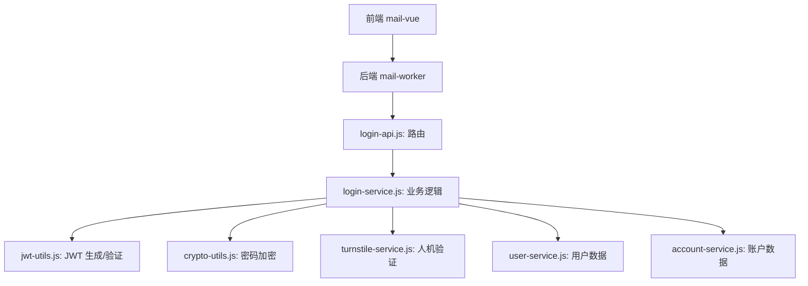
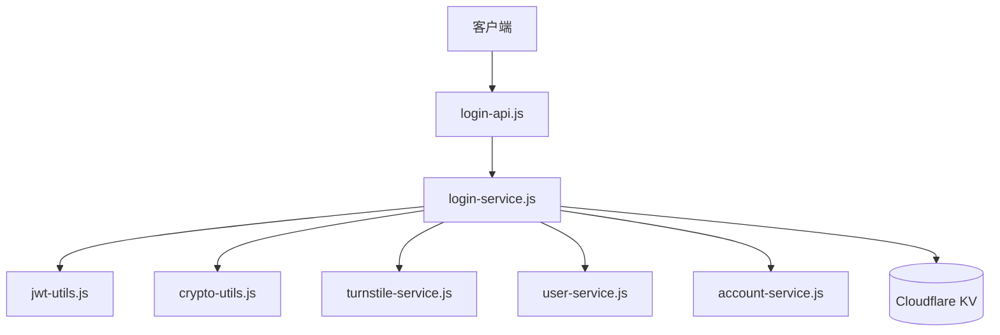
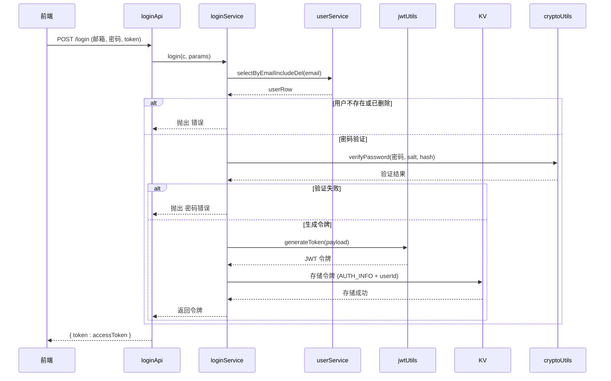
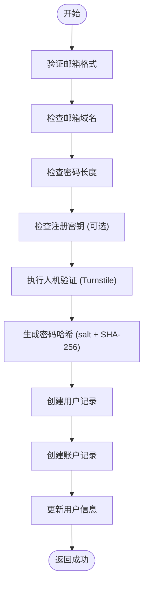
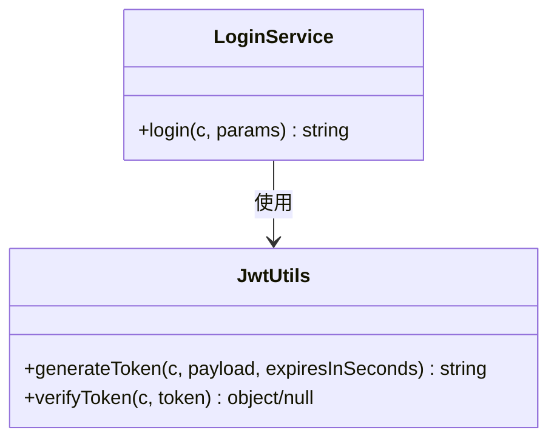
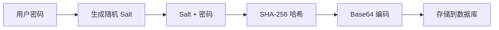
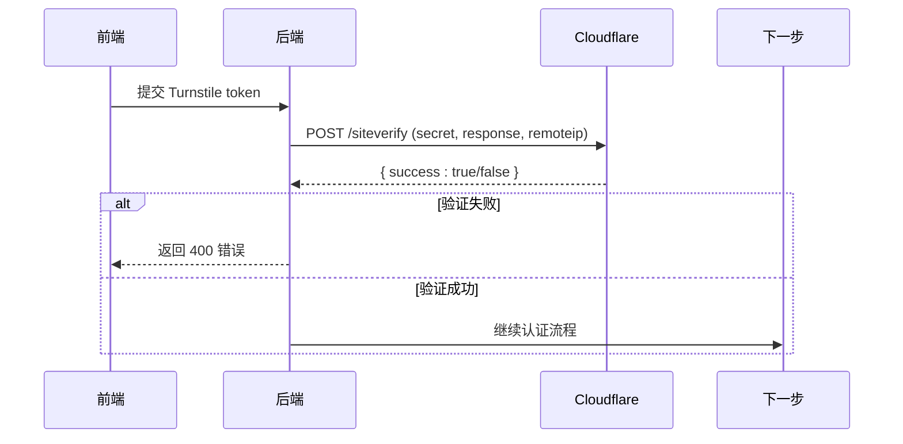
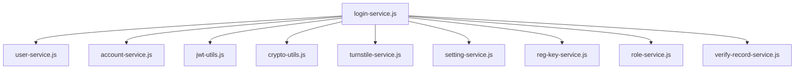

# 认证接口

<cite>
**本文档引用的文件**  
- [login-api.js](file://mail-worker/src/api/login-api.js)
- [login-service.js](file://mail-worker/src/service/login-service.js)
- [jwt-utils.js](file://mail-worker/src/utils/jwt-utils.js)
- [crypto-utils.js](file://mail-worker/src/utils/crypto-utils.js)
- [turnstile-service.js](file://mail-worker/src/service/turnstile-service.js)
- [user-service.js](file://mail-worker/src/service/user-service.js)
- [account-service.js](file://mail-worker/src/service/account-service.js)
</cite>

## 目录
1. [简介](#简介)
2. [项目结构](#项目结构)
3. [核心组件](#核心组件)
4. [架构概览](#架构概览)
5. [详细组件分析](#详细组件分析)
6. [依赖分析](#依赖分析)
7. [性能考虑](#性能考虑)
8. [故障排除指南](#故障排除指南)
9. [结论](#结论)

## 简介
本文档详细描述了 cloud-mail 系统中的认证接口，涵盖用户登录、注册、JWT 令牌的签发与刷新机制。文档明确了 `/api/login` 接口的请求与响应结构，说明了 JWT 的生成与验证流程、密码加密存储机制（bcrypt 类似 SHA-256 加盐哈希）、人机验证（Turnstile）集成方式，并提供前端调用示例与错误处理策略。

## 项目结构
cloud-mail 项目由前端（mail-vue）与后端（mail-worker）组成。认证相关逻辑集中在 mail-worker 的 `src/api` 与 `src/service` 目录下，其中 `login-api.js` 定义路由，`login-service.js` 实现业务逻辑，`jwt-utils.js` 负责令牌处理，`crypto-utils.js` 处理密码哈希，`turnstile-service.js` 集成 Cloudflare Turnstile 验证。

**Diagram sources**
- [login-api.js](file://mail-worker/src/api/login-api.js#L1-L20)
- [login-service.js](file://mail-worker/src/service/login-service.js#L1-L259)

**Section sources**
- [login-api.js](file://mail-worker/src/api/login-api.js#L1-L20)
- [login-service.js](file://mail-worker/src/service/login-service.js#L1-L259)

## 核心组件
认证系统的核心组件包括登录与注册 API 接口、JWT 令牌管理、密码安全存储、人机验证集成以及用户与账户服务。这些组件协同工作，确保用户身份的安全验证与会话管理。

**Section sources**
- [login-api.js](file://mail-worker/src/api/login-api.js#L1-L20)
- [login-service.js](file://mail-worker/src/service/login-service.js#L1-L259)

## 架构概览
系统采用 Hono 框架构建 RESTful API，通过 `login-api.js` 定义 `/login`、`/register` 和 `/logout` 路由。所有请求由 `login-service.js` 处理，该服务调用多个工具类和服务完成认证逻辑。JWT 令牌用于无状态会话管理，用户令牌信息存储在 Cloudflare KV 中以支持多实例环境。

**Diagram sources**
- [login-api.js](file://mail-worker/src/api/login-api.js#L1-L20)
- [login-service.js](file://mail-worker/src/service/login-service.js#L1-L259)

## 详细组件分析

### 登录与注册流程分析
本节详细分析登录与注册的业务逻辑，包括请求处理、数据验证、安全检查与响应生成。

#### 登录流程
用户提交邮箱、密码和可选的 Turnstile 令牌。服务验证凭证，检查用户状态，验证密码哈希，生成 JWT 令牌，并将令牌记录在 KV 存储中。

**Diagram sources**
- [login-api.js](file://mail-worker/src/api/login-api.js#L3-L7)
- [login-service.js](file://mail-worker/src/service/login-service.js#L180-L220)
- [jwt-utils.js](file://mail-worker/src/utils/jwt-utils.js#L1-L89)
- [crypto-utils.js](file://mail-worker/src/utils/crypto-utils.js#L1-L41)

#### 注册流程
注册流程包括邮箱格式验证、域名限制、密码强度检查、注册密钥（regKey）验证、人机验证（Turnstile）以及用户数据持久化。

**Diagram sources**
- [login-service.js](file://mail-worker/src/service/login-service.js#L10-L170)

**Section sources**
- [login-service.js](file://mail-worker/src/service/login-service.js#L1-L259)

### JWT 令牌机制
系统使用自定义 JWT 工具实现令牌的签发与验证。令牌包含用户 ID 和一个随机 UUID，用于在 KV 存储中进行会话管理。

#### JWT 生成与验证

**Diagram sources**
- [jwt-utils.js](file://mail-worker/src/utils/jwt-utils.js#L1-L89)

#### 令牌过期与刷新
当前实现中，JWT 的过期时间由 `generateToken` 方法的 `expiresInSeconds` 参数控制。令牌信息存储在 KV 中，TTL（生存时间）由 `constant.TOKEN_EXPIRE` 定义。登出操作会从用户的令牌列表中移除当前令牌。

**Section sources**
- [jwt-utils.js](file://mail-worker/src/utils/jwt-utils.js#L1-L89)
- [login-service.js](file://mail-worker/src/service/login-service.js#L222-L258)

### 安全机制分析

#### 密码加密存储
系统使用 `crypto-utils.js` 中的 `hashPassword` 方法对密码进行加密。该方法生成随机盐值（salt），并将 salt 与密码拼接后进行 SHA-256 哈希，最终结果以 Base64 编码存储。

**Diagram sources**
- [crypto-utils.js](file://mail-worker/src/utils/crypto-utils.js#L1-L41)

#### 人机验证（Turnstile）集成
`turnstile-service.js` 负责与 Cloudflare Turnstile 服务交互。在注册或登录时，若配置开启验证，服务会将前端提供的 token 发送到 `challenges.cloudflare.com` 进行验证。

**Diagram sources**
- [turnstile-service.js](file://mail-worker/src/service/turnstile-service.js#L1-L36)

**Section sources**
- [turnstile-service.js](file://mail-worker/src/service/turnstile-service.js#L1-L36)

## 依赖分析
认证服务依赖多个内部服务和工具类，形成清晰的依赖链。`login-service` 是核心，协调 `user-service`、`account-service`、`jwt-utils`、`crypto-utils` 和 `turnstile-service`。

**Diagram sources**
- [login-service.js](file://mail-worker/src/service/login-service.js#L1-L259)

**Section sources**
- [login-service.js](file://mail-worker/src/service/login-service.js#L1-L259)

## 性能考虑
- **KV 存储**：使用 Cloudflare KV 存储会话信息，具有低延迟和高可用性。
- **密码哈希**：SHA-256 计算快速，但应监控其安全性，未来可考虑迁移到更安全的算法如 Argon2。
- **外部请求**：Turnstile 验证增加了外部 HTTP 请求，可能影响注册/登录延迟，建议在高并发场景下评估其影响。

## 故障排除指南
常见错误及其解决方案：

| 错误码 | 错误信息 | 原因 | 解决方案 |
|--------|--------|------|---------|
| 400 | emailAndPwdEmpty | 邮箱或密码为空 | 检查前端请求体是否包含 `email` 和 `password` 字段 |
| 400 | notExistUser | 用户不存在 | 确认邮箱已注册 |
| 400 | IncorrectPwd | 密码错误 | 检查密码是否正确 |
| 400 | emptyBotToken | 人机验证 Token 为空 | 确保前端正确集成 Turnstile 并提交 token |
| 400 | botVerifyFail | 人机验证失败 | 检查 Cloudflare secretKey 配置及网络连接 |
| 403 | noDomainPermReg | 域名无注册权限 | 检查邮箱域名是否在允许列表中 |
| 400 | regDisabled | 注册已关闭 | 检查系统设置中的注册开关 |

**Section sources**
- [login-service.js](file://mail-worker/src/service/login-service.js#L1-L259)
- [turnstile-service.js](file://mail-worker/src/service/turnstile-service.js#L1-L36)

## 结论
cloud-mail 的认证系统设计合理，集成了现代安全实践，包括密码加盐哈希、JWT 令牌管理和第三方人机验证。通过清晰的模块划分和依赖管理，系统具备良好的可维护性和扩展性。建议未来增加 refreshToken 机制以支持令牌刷新，并考虑使用更安全的密码哈希算法。