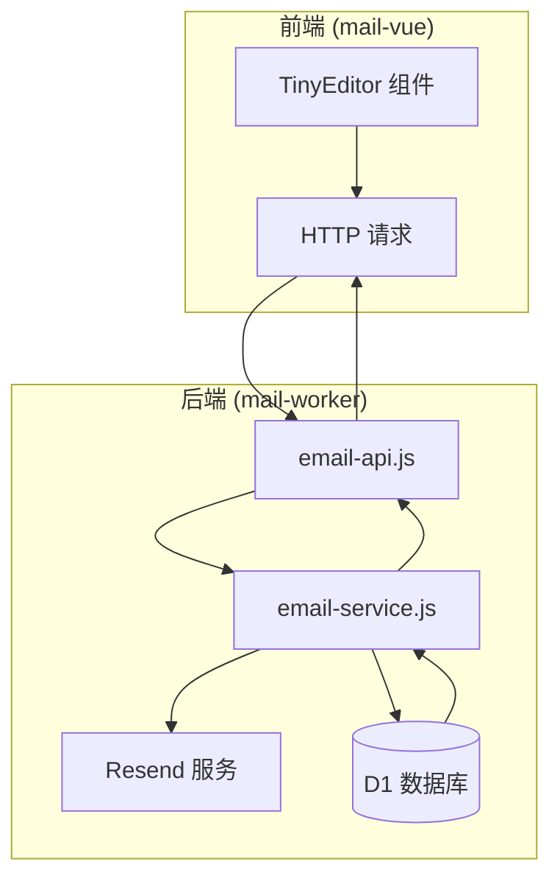
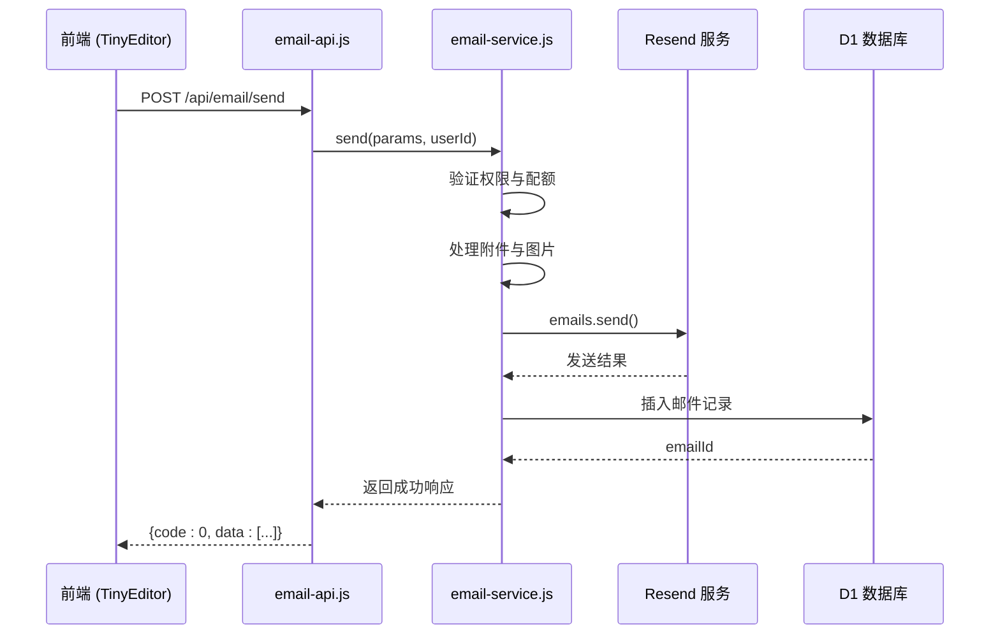
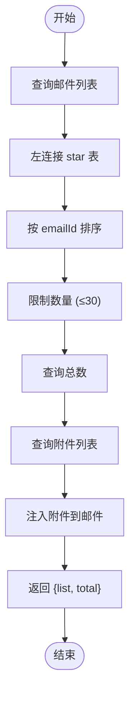
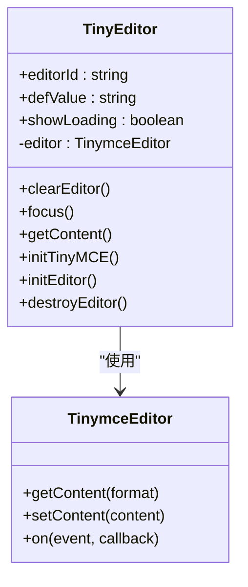
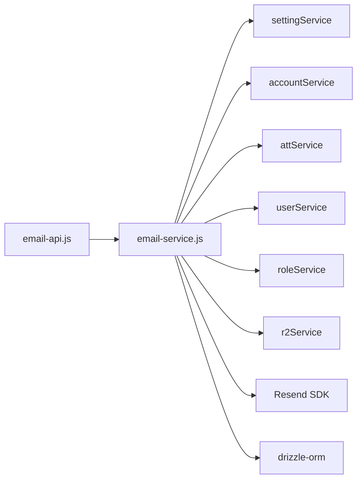

# 发送与接收

<cite>
**本文档中引用的文件**  
- [email-service.js](file://mail-worker/src/service/email-service.js)
- [email-api.js](file://mail-worker/src/api/email-api.js)
- [tiny-editor/index.vue](file://mail-vue/src/components/tiny-editor/index.vue)
- [email.js](file://mail-worker/src/email/email.js)
</cite>

## 目录
1. [简介](#简介)
2. [项目结构](#项目结构)
3. [核心组件](#核心组件)
4. [架构概览](#架构概览)
5. [详细组件分析](#详细组件分析)
6. [依赖分析](#依赖分析)
7. [性能考虑](#性能考虑)
8. [故障排除指南](#故障排除指南)
9. [结论](#结论)

## 简介
本文档旨在为 `cloud-mail` 项目中的邮件发送与接收功能提供全面的技术说明。重点描述两个核心 API 接口：`POST /api/email/send` 和 `GET /api/email/inbox`，涵盖请求体结构、响应格式、分页机制、错误码处理以及前后端协作流程。文档结合 `email-service.js` 解释邮件构建逻辑、Resend 服务集成方式及收件箱查询机制，并通过 `tiny-editor` 组件说明富文本内容的序列化与提交过程。

## 项目结构
项目由前端（`mail-vue`）和后端（`mail-worker`）组成，采用前后端分离架构。前端基于 Vue 框架，集成 TinyMCE 富文本编辑器；后端使用 Hono 框架构建 RESTful API，通过 Resend 服务实现邮件发送，并利用 Cloudflare Workers 和 D1 数据库处理邮件接收与存储。



**Diagram sources**
- [email-api.js](file://mail-worker/src/api/email-api.js#L0-L29)
- [email-service.js](file://mail-worker/src/service/email-service.js#L0-L44)
- [tiny-editor/index.vue](file://mail-vue/src/components/tiny-editor/index.vue#L0-L233)

**Section sources**
- [email-api.js](file://mail-worker/src/api/email-api.js#L0-L29)
- [email-service.js](file://mail-worker/src/service/email-service.js#L0-L44)
- [tiny-editor/index.vue](file://mail-vue/src/components/tiny-editor/index.vue#L0-L233)

## 核心组件
本节分析邮件发送与接收的核心组件，包括 API 路由定义、服务层业务逻辑及前端编辑器集成。

**Section sources**
- [email-api.js](file://mail-worker/src/api/email-api.js#L0-L29)
- [email-service.js](file://mail-worker/src/service/email-service.js#L98-L154)
- [tiny-editor/index.vue](file://mail-vue/src/components/tiny-editor/index.vue#L0-L233)

## 架构概览
系统采用典型的三层架构：表现层（前端 UI）、应用层（Hono API）、数据层（D1 + KV + R2）。邮件发送流程由前端触发，经 API 路由调用服务层，最终通过 Resend 客户端发送；邮件接收则由 Cloudflare Inbound Email 触发，解析 MIME 后存入数据库。



**Diagram sources**
- [email-api.js](file://mail-worker/src/api/email-api.js#L25-L29)
- [email-service.js](file://mail-worker/src/service/email-service.js#L98-L154)

## 详细组件分析

### 发送接口分析
`POST /api/email/send` 接口负责处理邮件发送请求，包含完整的身份验证、权限控制、配额检查和外部服务调用。

#### 请求体结构
请求体为 JSON 格式，主要字段如下：

| 字段 | 类型 | 必填 | 说明 |
|------|------|------|------|
| accountId | number | 是 | 发送账户 ID |
| name | string | 否 | 发件人姓名（默认取邮箱前缀） |
| receiveEmail | string[] | 是 | 收件人邮箱列表 |
| subject | string | 是 | 邮件主题 |
| content | string | 是 | HTML 正文内容 |
| text | string | 否 | 纯文本内容（可选） |
| attachments | array | 否 | 附件列表（文件名、大小、类型等） |
| manyType | string | 否 | 群发模式（`normal` 或 `divide`） |

#### 响应数据格式
成功响应示例：
```json
{
  "code": 0,
  "msg": "Success",
  "data": [
    {
      "emailId": 123,
      "resendEmailId": "ca1a-...",
      "attList": [...]
    }
  ]
}
```

支持分页参数：
- `emailId`: 分页游标（上一页最后一条的 ID）
- `size`: 每页数量（最大 30）
- `timeSort`: 时间排序方向（0 降序，1 升序）

**Section sources**
- [email-api.js](file://mail-worker/src/api/email-api.js#L25-L29)
- [email-service.js](file://mail-worker/src/service/email-service.js#L98-L154)

### 接收逻辑分析
`GET /api/email/inbox` 接口用于获取用户收件箱邮件列表，支持分页和状态过滤。

#### 查询逻辑
服务层 `list` 方法执行以下操作：
1. 构建 SQL 查询条件（用户 ID、账户 ID、邮件类型、删除状态）
2. 左连接 `star` 表以判断是否已标记星标
3. 按 `emailId` 分页排序（支持正序/倒序）
4. 查询附件列表并注入到每封邮件中



**Diagram sources**
- [email-service.js](file://mail-worker/src/service/email-service.js#L0-L44)

**Section sources**
- [email-service.js](file://mail-worker/src/service/email-service.js#L0-L44)

### 前端编辑器集成
`tiny-editor` 组件封装了 TinyMCE 富文本编辑器，负责内容输入、图片上传和序列化。

#### 内容序列化流程
1. 用户在编辑器中输入富文本内容
2. 图片通过 `file_picker_callback` 上传至临时 Blob 缓存
3. 编辑器内容通过 `getContent()` 方法获取 HTML 字符串
4. 内容变更时通过 `@change` 事件提交至父组件
5. 最终随表单一起提交至 `/api/email/send`



**Diagram sources**
- [tiny-editor/index.vue](file://mail-vue/src/components/tiny-editor/index.vue#L0-L233)

**Section sources**
- [tiny-editor/index.vue](file://mail-vue/src/components/tiny-editor/index.vue#L0-L233)

## 依赖分析
系统依赖关系清晰，各模块职责分明。



**Diagram sources**
- [email-service.js](file://mail-worker/src/service/email-service.js#L0-L44)

**Section sources**
- [email-service.js](file://mail-worker/src/service/email-service.js#L0-L44)

## 性能考虑
- 分页限制：每页最多返回 30 条记录，防止大数据量查询
- 批量操作：附件查询使用 `selectByEmailIds` 批量加载，减少数据库往返
- 缓存机制：发送计数使用 KV 存储，避免频繁写库
- 异步处理：邮件接收使用流式解析，避免内存溢出

## 故障排除指南
常见错误码及处理建议：

| 错误码 | 错误信息 | 原因 | 建议 |
|--------|--------|------|------|
| 403 | disabledSend | 发送功能已关闭 | 检查系统设置 |
| 403 | bannedSend | 用户被禁止发送 | 检查角色权限 |
| 403 | daySendLimit | 当日发送配额超限 | 升级账户或次日重试 |
| 403 | totalSendLimit | 总发送配额耗尽 | 升级账户 |
| 403 | noDomainPermSend | 无域名发送权限 | 检查可用域名配置 |
| - | noResendToken | 缺少 Resend API Token | 配置对应域名的 Token |
| - | noOsSendPic | 未配置对象存储无法发送图片 | 配置 R2/OSS 域名 |

**Section sources**
- [email-service.js](file://mail-worker/src/service/email-service.js#L98-L154)

## 结论
本文档详细解析了 `cloud-mail` 系统的邮件发送与接收机制，涵盖 API 设计、服务逻辑、前端集成与错误处理。系统设计合理，具备良好的扩展性与可维护性，适合进一步优化如支持更多邮件协议、增强安全策略等。