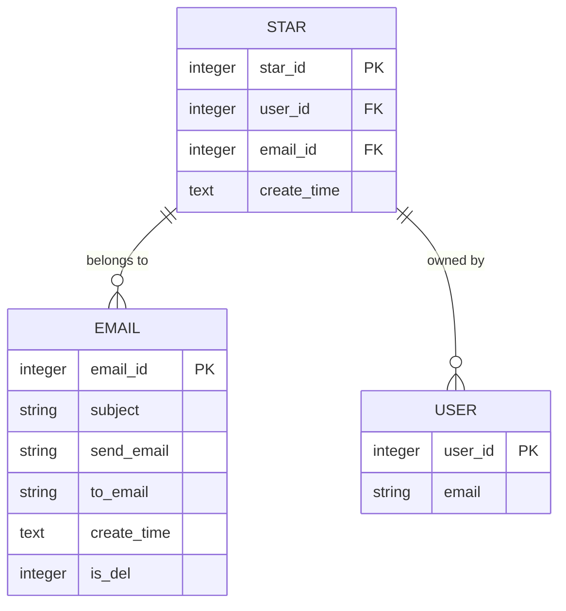
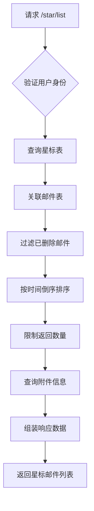
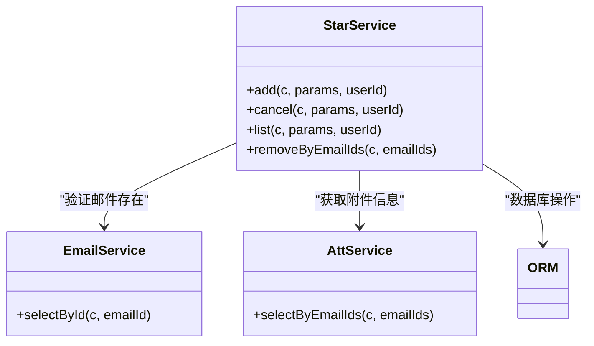
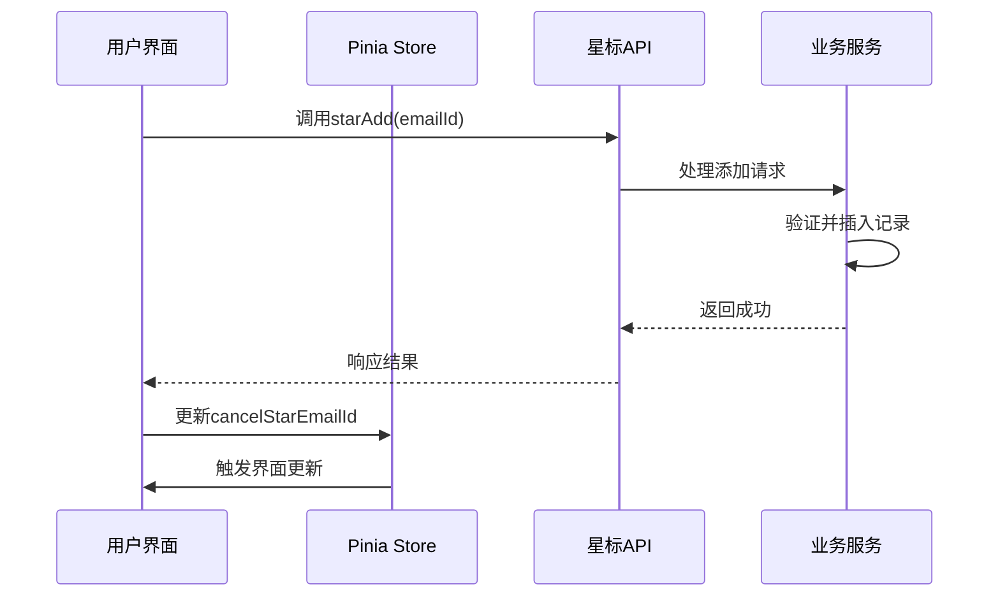

# 星标与归档

<cite>
**本文档引用文件**  
- [star.js](file://mail-vue/src/request/star.js)
- [star-api.js](file://mail-worker/src/api/star-api.js)
- [star-service.js](file://mail-worker/src/service/star-service.js)
- [star.js](file://mail-worker/src/entity/star.js)
- [perm.js](file://mail-vue/src/perm/perm.js)
- [index.vue](file://mail-vue/src/views/star/index.vue)
- [email.js](file://mail-vue/src/store/email.js)
</cite>

## 目录
1. [简介](#简介)
2. [核心接口说明](#核心接口说明)
3. [星标状态存储机制](#星标状态存储机制)
4. [收件箱视图过滤逻辑](#收件箱视图过滤逻辑)
5. [前端权限控制：v-perm指令](#前端权限控制v-perm指令)
6. [业务逻辑处理流程](#业务逻辑处理流程)
7. [批量星标API使用示例](#批量星标api使用示例)
8. [用户界面交互一致性](#用户界面交互一致性)
9. [常见问题排查](#常见问题排查)
10. [附录](#附录)

## 简介
本文档详细说明云邮件系统中的星标与归档功能，重点解析`PUT /api/star`和`DELETE /api/star`接口的实现机制。涵盖星标状态在数据库中的持久化方式、前端权限控制、业务逻辑处理流程以及常见问题的排查方法。

## 核心接口说明
系统提供以下两个核心接口用于管理邮件星标状态：

- **添加星标（POST /star/add）**：将指定邮件标记为星标状态
- **取消星标（DELETE /star/cancel）**：移除邮件的星标状态

这些接口通过Hono框架注册，并由`star-api.js`统一处理请求路由。

**Section sources**
- [star-api.js](file://mail-worker/src/api/star-api.js#L1-L18)

## 星标状态存储机制
星标状态通过D1数据库表进行持久化存储，而非使用KV存储。具体表结构定义在`star.js`实体文件中。



**Diagram sources**
- [star.js](file://mail-worker/src/entity/star.js#L3-L10)

**Section sources**
- [star.js](file://mail-worker/src/entity/star.js#L3-L10)

## 收件箱视图过滤逻辑
星标邮件的查询通过`/star/list`接口实现，其核心逻辑如下：

1. 查询当前用户的所有星标记录
2. 关联邮件表获取完整邮件信息
3. 过滤已删除邮件（isDel = NORMAL）
4. 按星标时间倒序排列
5. 支持分页查询（emailId, size参数）

查询结果中包含`isStar: 1`字段，用于标识邮件的星标状态。



**Diagram sources**
- [star-service.js](file://mail-worker/src/service/star-service.js#L40-L70)

**Section sources**
- [star-service.js](file://mail-worker/src/service/star-service.js#L40-L70)

## 前端权限控制：v-perm指令
前端通过自定义`v-perm`指令控制星标功能的可见性。该指令根据用户权限列表（permKeys）动态决定是否渲染相关UI元素。

```javascript
// 权限验证逻辑
if (permKeys.includes('*')) {
    return; // 超级管理员拥有所有权限
}
const hasPermission = permKeys.includes(value);
if (!hasPermission) {
    el.parentNode && el.parentNode.removeChild(el);
}
```

当用户不具备相应权限时，星标按钮将被从DOM中移除，确保功能不可见且不可访问。

**Section sources**
- [perm.js](file://mail-vue/src/perm/perm.js#L1-L36)
- [main.js](file://mail-vue/src/main.js#L1-L17)

## 业务逻辑处理流程
星标功能的完整业务逻辑由`star-service.js`实现，包含以下核心方法：



**Diagram sources**
- [star-service.js](file://mail-worker/src/service/star-service.js#L9-L80)

**Section sources**
- [star-service.js](file://mail-worker/src/service/star-service.js#L9-L80)

### 添加星标流程
1. 验证邮件存在且属于当前用户
2. 检查是否已存在星标记录
3. 插入新的星标记录

### 取消星标流程
1. 根据用户ID和邮件ID删除星标记录

## 批量星标API使用示例
虽然核心接口为单邮件操作，但可通过批量调用实现多邮件星标：

```javascript
// 批量添加星标
async function batchStar(emailIds) {
    const promises = emailIds.map(id => starAdd(id));
    return Promise.all(promises);
}

// 批量取消星标
async function batchUnstar(emailIds) {
    const promises = emailIds.map(id => starCancel(id));
    return Promise.all(promises);
}
```

**Section sources**
- [star.js](file://mail-vue/src/request/star.js#L2-L8)

## 用户界面交互一致性
星标功能在用户界面中的交互保持一致性，主要体现在：

1. **状态同步**：通过Pinia状态管理(store)维护星标相关状态
2. **组件复用**：使用`emailScroll`组件统一处理邮件列表展示
3. **事件驱动**：通过事件回调机制更新UI状态



**Diagram sources**
- [index.vue](file://mail-vue/src/views/star/index.vue#L1-L47)
- [email.js](file://mail-vue/src/store/email.js#L1-L21)

**Section sources**
- [index.vue](file://mail-vue/src/views/star/index.vue#L1-L47)
- [email.js](file://mail-vue/src/store/email.js#L1-L21)

## 常见问题排查
### 星标状态不同步问题
当出现星标状态显示不一致时，可按以下步骤排查：

1. **检查数据库记录**：确认D1数据库中`star`表是否存在对应记录
2. **验证用户ID**：确保操作的用户ID与星标记录中的userId匹配
3. **检查缓存状态**：清除前端缓存或强制刷新页面
4. **查看API响应**：确认`/star/list`接口返回的数据是否正确

### 排查方法
```bash
# 1. 查询用户星标记录
SELECT * FROM star WHERE user_id = ? AND email_id = ?;

# 2. 检查邮件是否存在且未删除
SELECT * FROM email WHERE email_id = ? AND is_del = 0;
```

**Section sources**
- [star-service.js](file://mail-worker/src/service/star-service.js#L9-L80)
- [star-api.js](file://mail-worker/src/api/star-api.js#L1-L18)

## 附录
### 接口规范表
| 接口路径 | HTTP方法 | 参数 | 描述 |
|--------|--------|------|------|
| /star/add | POST | {emailId} | 添加星标 |
| /star/cancel | DELETE | emailId | 取消星标 |
| /star/list | GET | emailId, size | 获取星标邮件列表 |

### 错误码说明
| 错误码 | 含义 | 解决方案 |
|-------|------|---------|
| starNotExistEmail | 邮件不存在或不属于当前用户 | 检查邮件ID和用户权限 |
| 500 | 服务器内部错误 | 检查数据库连接和日志 |