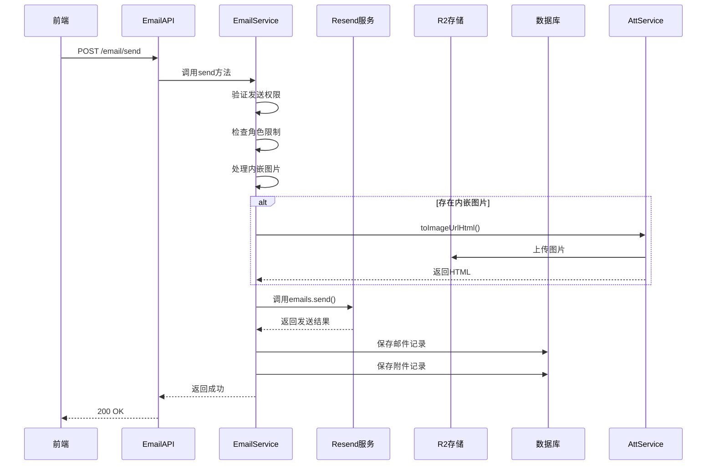
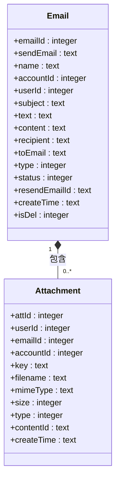
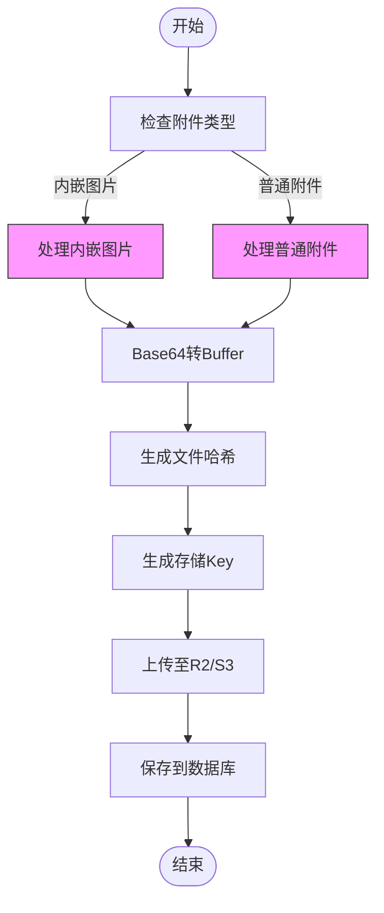
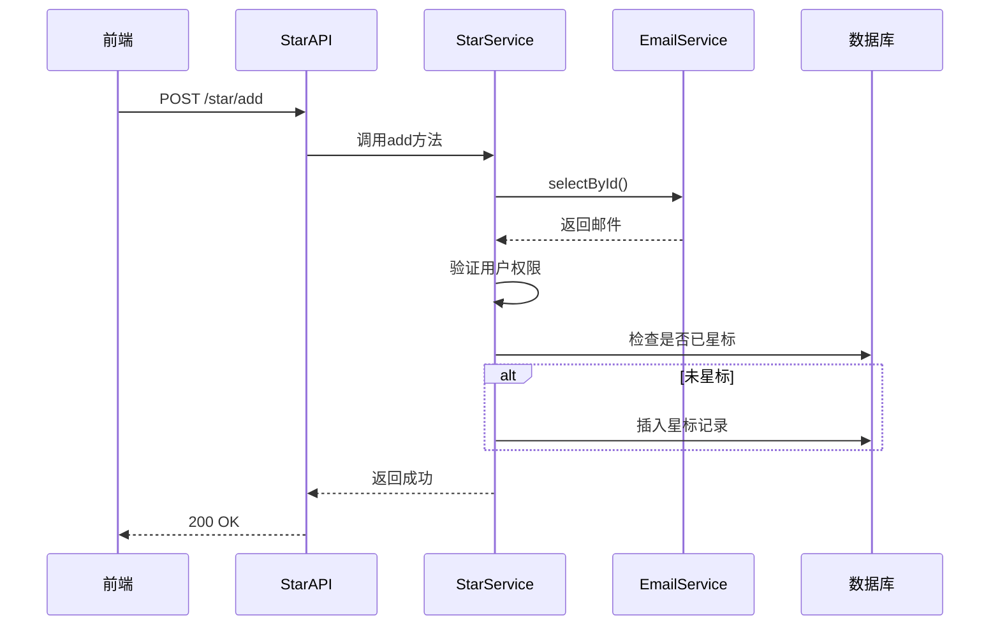
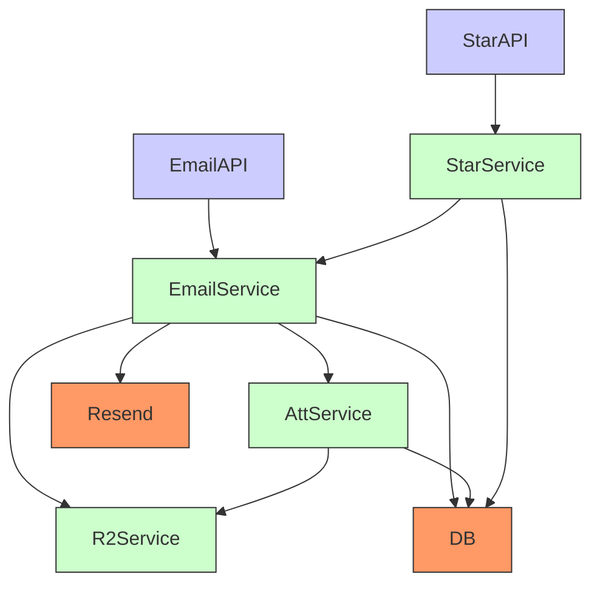

# 邮件操作接口

<cite>
**本文档中引用的文件**  
- [email-api.js](file://mail-worker/src/api/email-api.js)
- [email-service.js](file://mail-worker/src/service/email-service.js)
- [att-service.js](file://mail-worker/src/service/att-service.js)
- [r2-service.js](file://mail-worker/src/service/r2-service.js)
- [star-api.js](file://mail-worker/src/api/star-api.js)
- [star-service.js](file://mail-worker/src/service/star-service.js)
- [entity-const.js](file://mail-worker/src/const/entity-const.js)
- [email.js](file://mail-worker/src/entity/email.js)
- [att.js](file://mail-worker/src/entity/att.js)
- [tiny-editor.vue](file://mail-vue/src/components/tiny-editor/index.vue)
- [email.js](file://mail-vue/src/request/email.js)
- [star.js](file://mail-vue/src/request/star.js)
</cite>

## 目录
1. [简介](#简介)
2. [项目结构](#项目结构)
3. [核心组件](#核心组件)
4. [架构概览](#架构概览)
5. [详细组件分析](#详细组件分析)
6. [依赖分析](#依赖分析)
7. [性能考虑](#性能考虑)
8. [故障排除指南](#故障排除指南)
9. [结论](#结论)

## 简介
本文档为云邮件系统提供完整的邮件核心操作API文档，涵盖发送、接收、星标、删除与附件处理等关键功能。重点描述了`POST /api/email/send`（发送邮件）、`GET /api/email/inbox`（收件箱）、`PUT /api/email/star`（星标）等核心接口。详细说明了邮件内容结构（主题、正文、收件人列表）、附件上传流程（通过R2存储）与内嵌图片支持机制。文档化了分页查询、邮件状态字段与搜索过滤参数。结合`email-service.js`解释了邮件构建、Resend服务调用与R2附件存储的协同流程。提供了包含HTML正文与附件的复杂请求示例，以及前端tiny-editor集成调用方式。

## 项目结构
本项目采用前后端分离架构，前端位于`mail-vue`目录，后端Worker服务位于`mail-worker`目录。后端使用Hono框架构建REST API，通过Drizzle ORM操作SQLite数据库，利用Resend服务发送邮件，并通过R2或S3兼容对象存储处理附件。

```mermaid
graph TB
subgraph "前端 (mail-vue)"
UI[TinyMCE编辑器]
API[HTTP请求]
end
subgraph "后端 (mail-worker)"
API[/api/email/*]
Service[EmailService]
Resend[Resend API]
R2[R2/S3存储]
DB[(SQLite)]
end
UI --> API
API --> Service
Service --> Resend
Service --> R2
Service --> DB
```

**Diagram sources**  
- [email-api.js](file://mail-worker/src/api/email-api.js#L1-L31)
- [email-service.js](file://mail-worker/src/service/email-service.js#L1-L666)
- [tiny-editor.vue](file://mail-vue/src/components/tiny-editor/index.vue#L1-L233)

**Section sources**
- [email-api.js](file://mail-worker/src/api/email-api.js#L1-L31)
- [email-service.js](file://mail-worker/src/service/email-service.js#L1-L666)
- [tiny-editor.vue](file://mail-vue/src/components/tiny-editor/index.vue#L1-L233)

## 核心组件
系统核心功能由`email-service.js`实现，负责邮件的发送、接收、状态管理与附件处理。`att-service.js`专门处理附件的上传、存储与引用，`r2-service.js`提供对象存储的统一接口。前端通过`tiny-editor.vue`组件集成富文本编辑器，支持HTML邮件内容与图片插入。

**Section sources**
- [email-service.js](file://mail-worker/src/service/email-service.js#L1-L666)
- [att-service.js](file://mail-worker/src/service/att-service.js#L1-L202)
- [r2-service.js](file://mail-worker/src/service/r2-service.js#L1-L53)
- [tiny-editor.vue](file://mail-vue/src/components/tiny-editor/index.vue#L1-L233)

## 架构概览
系统采用分层架构，前端通过HTTP API与后端交互。后端API层路由请求到服务层，服务层协调业务逻辑、数据库操作、外部服务调用和对象存储。

```mermaid
graph TB
Client[客户端]
API[API层]
Service[服务层]
Storage[存储层]
Client --> API
API --> Service
Service --> Storage
Service --> External[Resend服务]
subgraph API层
A1[/api/email/send]
A2[/api/email/list]
A3[/api/star/add]
end
subgraph 服务层
S1[EmailService]
S2[AttService]
S3[StarService]
end
subgraph 存储层
D1[(SQLite)]
D2[R2/S3]
end
A1 --> S1
A2 --> S1
A3 --> S3
S1 --> D1
S1 --> D2
S2 --> D2
```

**Diagram sources**  
- [email-api.js](file://mail-worker/src/api/email-api.js#L1-L31)
- [star-api.js](file://mail-worker/src/api/star-api.js#L1-L19)
- [email-service.js](file://mail-worker/src/service/email-service.js#L1-L666)
- [att-service.js](file://mail-worker/src/service/att-service.js#L1-L202)
- [star-service.js](file://mail-worker/src/service/star-service.js#L1-L83)

## 详细组件分析

### 邮件发送流程分析
该流程详细描述了从API调用到邮件成功发送的完整过程，包括附件处理、权限验证和外部服务调用。



**Diagram sources**  
- [email-api.js](file://mail-worker/src/api/email-api.js#L26-L31)
- [email-service.js](file://mail-worker/src/service/email-service.js#L100-L300)
- [att-service.js](file://mail-worker/src/service/att-service.js#L50-L100)
- [r2-service.js](file://mail-worker/src/service/r2-service.js#L1-L53)

**Section sources**
- [email-api.js](file://mail-worker/src/api/email-api.js#L26-L31)
- [email-service.js](file://mail-worker/src/service/email-service.js#L100-L300)
- [att-service.js](file://mail-worker/src/service/att-service.js#L50-L100)

### 邮件数据结构分析
该类图展示了邮件核心数据结构及其与附件的关系。



**Diagram sources**  
- [email.js](file://mail-worker/src/entity/email.js#L1-L27)
- [att.js](file://mail-worker/src/entity/att.js#L1-L21)

**Section sources**
- [email.js](file://mail-worker/src/entity/email.js#L1-L27)
- [att.js](file://mail-worker/src/entity/att.js#L1-L21)

### 附件处理流程分析
该流程图展示了附件从上传到存储的完整处理过程。



**Diagram sources**  
- [att-service.js](file://mail-worker/src/service/att-service.js#L100-L200)
- [r2-service.js](file://mail-worker/src/service/r2-service.js#L1-L53)

**Section sources**
- [att-service.js](file://mail-worker/src/service/att-service.js#L100-L200)

### 星标功能分析
该序列图展示了星标功能的API调用流程。



**Diagram sources**  
- [star-api.js](file://mail-worker/src/api/star-api.js#L1-L19)
- [star-service.js](file://mail-worker/src/service/star-service.js#L1-L83)
- [email-service.js](file://mail-worker/src/service/email-service.js#L500-L550)

**Section sources**
- [star-api.js](file://mail-worker/src/api/star-api.js#L1-L19)
- [star-service.js](file://mail-worker/src/service/star-service.js#L1-L83)

## 依赖分析
系统各组件之间存在明确的依赖关系，服务层组件依赖于数据库和外部存储服务。



**Diagram sources**  
- [email-api.js](file://mail-worker/src/api/email-api.js#L1-L31)
- [star-api.js](file://mail-worker/src/api/star-api.js#L1-L19)
- [email-service.js](file://mail-worker/src/service/email-service.js#L1-L666)
- [att-service.js](file://mail-worker/src/service/att-service.js#L1-L202)
- [r2-service.js](file://mail-worker/src/service/r2-service.js#L1-L53)
- [star-service.js](file://mail-worker/src/service/star-service.js#L1-L83)

**Section sources**
- [email-service.js](file://mail-worker/src/service/email-service.js#L1-L666)
- [att-service.js](file://mail-worker/src/service/att-service.js#L1-L202)

## 性能考虑
系统在设计时考虑了多项性能优化措施：
- 使用批处理操作减少数据库交互次数
- 通过KV存储缓存每日发送统计
- 附件上传采用分批删除策略
- 前端富文本编辑器按需加载
- 查询操作均使用索引字段作为条件

## 故障排除指南
常见问题及解决方案：

**Section sources**
- [email-service.js](file://mail-worker/src/service/email-service.js#L150-L200)
- [att-service.js](file://mail-worker/src/service/att-service.js#L1-L202)
- [r2-service.js](file://mail-worker/src/service/r2-service.js#L1-L53)

## 结论
本文档全面介绍了云邮件系统的邮件操作接口，涵盖了从API设计到实现细节的各个方面。系统通过清晰的分层架构和模块化设计，实现了邮件发送、接收、星标和附件处理等核心功能。通过整合Resend邮件服务和R2对象存储，确保了邮件发送的可靠性和附件处理的高效性。前端与后端的紧密集成提供了流畅的用户体验。