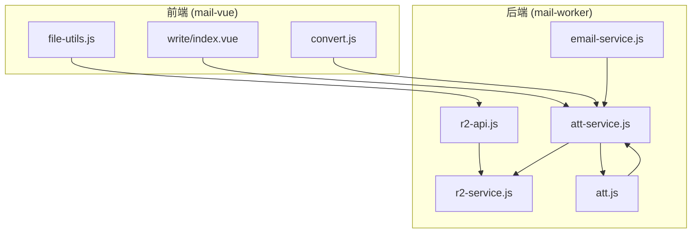
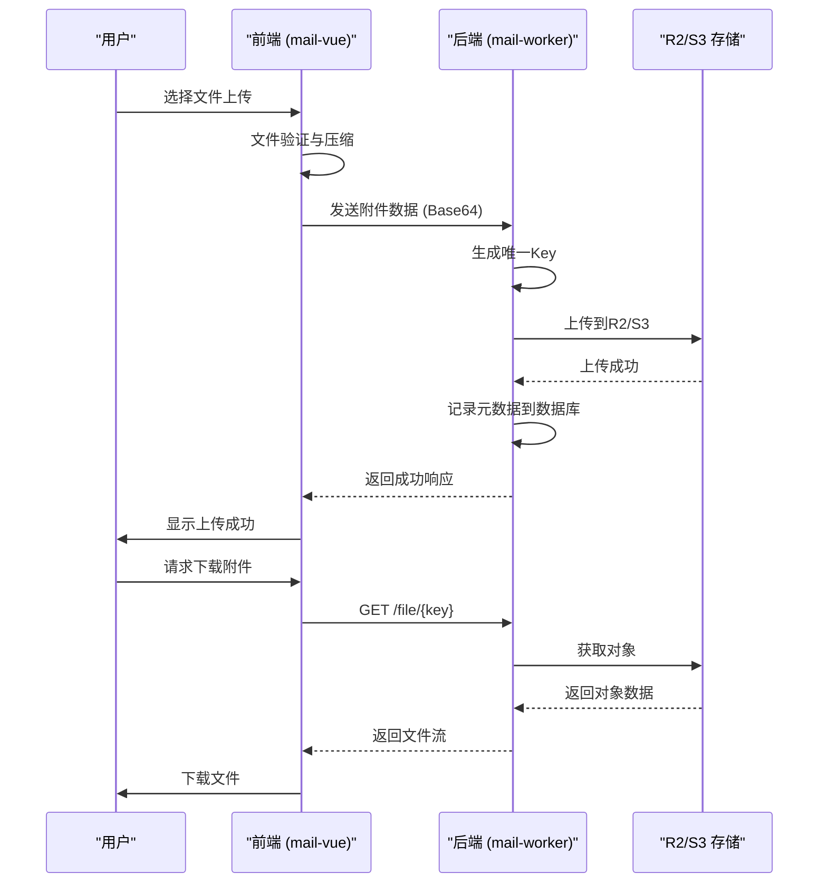
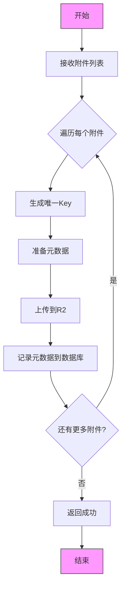
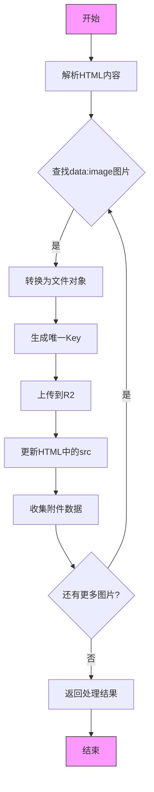
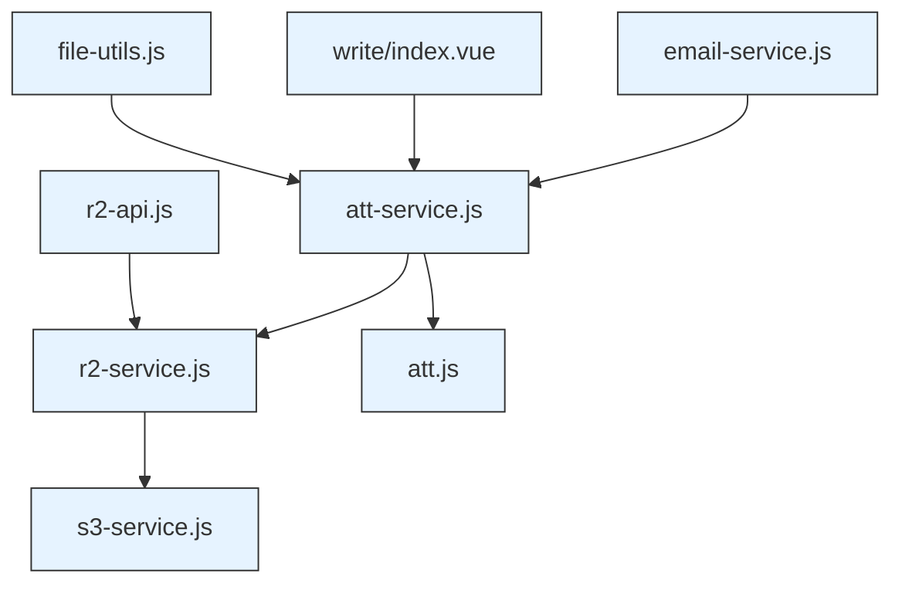

# 附件管理

<cite>
**本文档引用的文件**
- [att.js](file://mail-worker/src/entity/att.js)
- [r2-api.js](file://mail-worker/src/api/r2-api.js)
- [r2-service.js](file://mail-worker/src/service/r2-service.js)
- [att-service.js](file://mail-worker/src/service/att-service.js)
- [file-utils.js](file://mail-vue/src/utils/file-utils.js)
- [file-utils.js](file://mail-worker/src/utils/file-utils.js)
- [write/index.vue](file://mail-vue/src/layout/write/index.vue)
- [email-service.js](file://mail-worker/src/service/email-service.js)
</cite>

## 目录
1. [简介](#简介)
2. [项目结构](#项目结构)
3. [核心组件](#核心组件)
4. [架构概述](#架构概述)
5. [详细组件分析](#详细组件分析)
6. [依赖分析](#依赖分析)
7. [性能考虑](#性能考虑)
8. [故障排除指南](#故障排除指南)
9. [结论](#结论)

## 简介
本文档详细说明了云邮件系统中附件管理功能的技术实现，涵盖上传、存储、下载全流程。重点介绍R2对象存储的集成方式、附件元数据记录、邮件正文内嵌图片支持、Content-ID关联机制、大文件分片上传建议、MIME类型验证规则、安全扫描机制以及前端文件处理逻辑。

## 项目结构
附件管理功能分布在前后端两个主要模块中：`mail-vue`（前端）和`mail-worker`（后端）。前端负责用户交互和文件预处理，后端负责存储集成、元数据管理和业务逻辑处理。



**Diagram sources**
- [att.js](file://mail-worker/src/entity/att.js)
- [r2-api.js](file://mail-worker/src/api/r2-api.js)
- [r2-service.js](file://mail-worker/src/service/r2-service.js)
- [att-service.js](file://mail-worker/src/service/att-service.js)
- [file-utils.js](file://mail-vue/src/utils/file-utils.js)
- [write/index.vue](file://mail-vue/src/layout/write/index.vue)

**Section sources**
- [att.js](file://mail-worker/src/entity/att.js)
- [r2-api.js](file://mail-worker/src/api/r2-api.js)
- [file-utils.js](file://mail-vue/src/utils/file-utils.js)

## 核心组件
附件管理功能的核心组件包括：附件实体定义（att.js）、R2存储服务（r2-service.js）、附件业务服务（att-service.js）、前端文件工具（file-utils.js）和邮件发送界面（write/index.vue）。这些组件协同工作，实现完整的附件管理流程。

**Section sources**
- [att.js](file://mail-worker/src/entity/att.js)
- [r2-service.js](file://mail-worker/src/service/r2-service.js)
- [att-service.js](file://mail-worker/src/service/att-service.js)
- [file-utils.js](file://mail-vue/src/utils/file-utils.js)

## 架构概述
附件管理采用分层架构，从前端用户界面到后端存储服务，形成清晰的数据流和控制流。



**Diagram sources**
- [r2-api.js](file://mail-worker/src/api/r2-api.js)
- [r2-service.js](file://mail-worker/src/service/r2-service.js)
- [att-service.js](file://mail-worker/src/service/att-service.js)
- [file-utils.js](file://mail-vue/src/utils/file-utils.js)

## 详细组件分析

### 附件实体分析
附件实体定义了存储在数据库中的附件元数据结构，包括文件信息、关联关系和状态标记。

```mermaid
classDiagram
class att {
+attId : integer
+userId : integer
+emailId : integer
+accountId : integer
+key : text
+filename : text
+mimeType : text
+size : integer
+status : text
+type : integer
+disposition : text
+related : text
+contentId : text
+encoding : text
+createTime : text
}
note right of att
附件元数据实体
key : R2存储中的唯一标识
contentId : 用于内嵌图片的Content-ID
type : 0=普通附件, 1=内嵌附件
end note
```

**Diagram sources**
- [att.js](file://mail-worker/src/entity/att.js#L0-L19)

**Section sources**
- [att.js](file://mail-worker/src/entity/att.js#L0-L21)

### R2存储服务分析
R2存储服务提供了与Cloudflare R2或兼容S3的存储后端的集成，支持对象的增删改查操作。

```mermaid
classDiagram
class r2Service {
+hasOSS(c) : Promise~boolean~
+putObj(c, key, content, metadata) : Promise~void~
+getObj(c, key) : Promise~Object~
+delete(c, key) : Promise~void~
}
class s3Service {
+putObj(c, key, content, metadata) : Promise~void~
+deleteObj(c, key) : Promise~void~
}
r2Service --> s3Service : "委托"
note right of r2Service
支持两种模式：
1. Cloudflare R2原生模式
2. 兼容S3的第三方存储模式
自动根据环境变量选择
end note
```

**Diagram sources**
- [r2-service.js](file://mail-worker/src/service/r2-service.js#L0-L52)

**Section sources**
- [r2-service.js](file://mail-worker/src/service/r2-service.js#L0-L53)

### 附件业务服务分析
附件业务服务处理附件管理的核心业务逻辑，包括上传、保存、删除和内嵌图片处理。

#### 附件上传流程


**Diagram sources**
- [att-service.js](file://mail-worker/src/service/att-service.js#L13-L28)

#### 内嵌图片处理流程


**Diagram sources**
- [att-service.js](file://mail-worker/src/service/att-service.js#L35-L52)

**Section sources**
- [att-service.js](file://mail-worker/src/service/att-service.js#L0-L202)

### 前端文件工具分析
前端文件工具提供了文件处理的实用函数，包括格式化、压缩和Base64转换。

```mermaid
classDiagram
class fileUtils {
+getExtName(fileName) : string
+formatBytes(bytes) : string
+fileToBase64(file, type) : Promise~string~
+base64Size(base64String) : number
+compressImage(file, config) : Promise~File~
}
note right of fileUtils
前端文件处理工具类
提供文件扩展名获取、大小格式化、
Base64转换和图片压缩功能
end note
```

**Diagram sources**
- [file-utils.js](file://mail-vue/src/utils/file-utils.js#L0-L57)

**Section sources**
- [file-utils.js](file://mail-vue/src/utils/file-utils.js#L0-L57)
- [file-utils.js](file://mail-worker/src/utils/file-utils.js#L0-L59)

## 依赖分析
附件管理功能的组件依赖关系清晰，形成了良好的分层结构。



**Diagram sources**
- [att-service.js](file://mail-worker/src/service/att-service.js)
- [r2-service.js](file://mail-worker/src/service/r2-service.js)
- [file-utils.js](file://mail-vue/src/utils/file-utils.js)

**Section sources**
- [att-service.js](file://mail-worker/src/service/att-service.js)
- [r2-service.js](file://mail-worker/src/service/r2-service.js)

## 性能考虑
系统在附件管理方面考虑了多项性能优化措施：

1. **大文件处理**：前端限制单次上传总大小不超过29MB（29360128字节）
2. **图片压缩**：小于1MB的图片不压缩，大于1MB的图片使用Compressor.js进行压缩
3. **批量操作**：删除对象时采用批量处理，每批最多1000个
4. **缓存策略**：内嵌图片设置max-age=259200（3天）的缓存控制
5. **异步处理**：所有I/O操作均采用异步方式，避免阻塞主线程

**Section sources**
- [write/index.vue](file://mail-vue/src/layout/write/index.vue#L146-L213)
- [att-service.js](file://mail-worker/src/service/att-service.js#L178-L185)
- [r2-service.js](file://mail-worker/src/service/r2-service.js#L45-L52)

## 故障排除指南
### 常见问题及解决方案

| 问题现象 | 可能原因 | 解决方案 |
|---------|--------|---------|
| 上传失败 | 文件总大小超过29MB | 减少附件数量或压缩文件 |
| 图片无法显示 | HTML中的图片仍为data:image格式 | 检查toImageUrlHtml方法是否正确执行 |
| 下载文件损坏 | R2对象上传不完整 | 检查网络连接，重试上传 |
| 内嵌图片不显示 | Content-ID不匹配 | 确保cid:前缀与contentId完全匹配 |
| 存储配置无效 | R2环境变量或设置不完整 | 检查bucket、region、endpoint等配置 |

**Section sources**
- [att-service.js](file://mail-worker/src/service/att-service.js)
- [r2-service.js](file://mail-worker/src/service/r2-service.js)
- [write/index.vue](file://mail-vue/src/layout/write/index.vue)

## 结论
附件管理功能通过前后端协同工作，实现了完整的上传、存储和下载流程。系统采用R2对象存储作为主要存储后端，支持普通附件和内嵌图片两种模式。通过Content-ID机制，实现了邮件正文与附件的精确关联。前端提供了文件验证和压缩功能，后端实现了元数据管理和安全存储。整体架构清晰，性能优化到位，为用户提供可靠的附件管理体验。