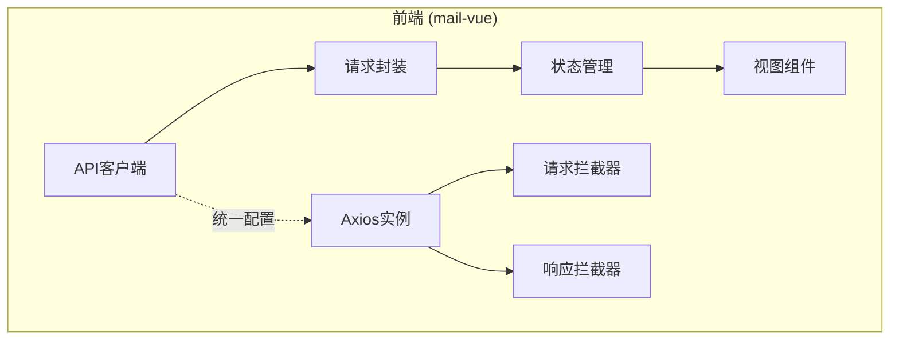
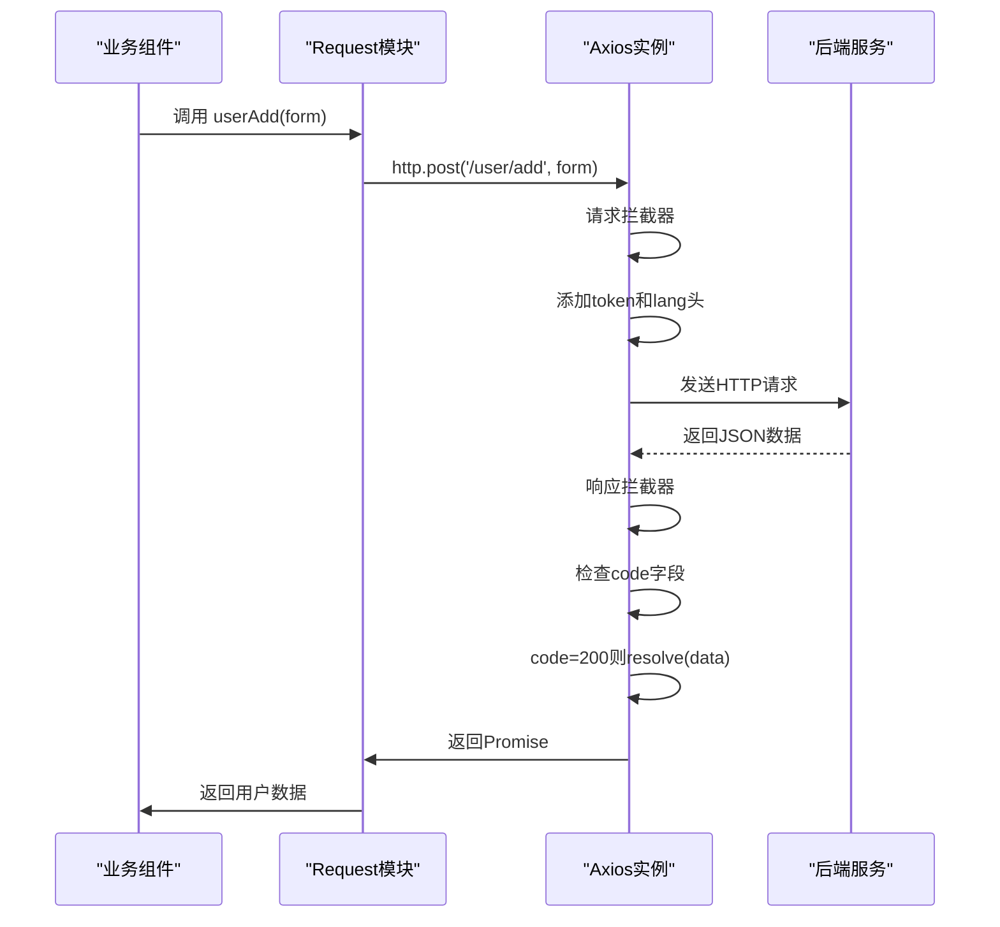
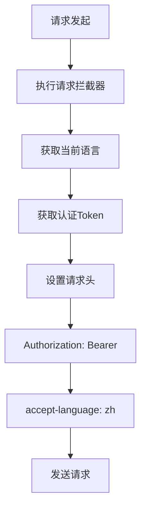
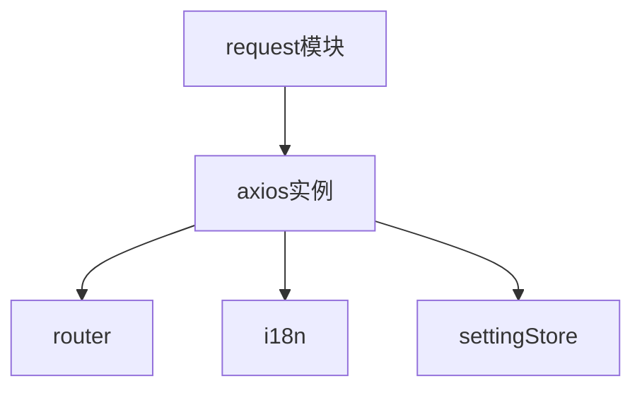

# API请求封装

<cite>
**本文档引用的文件**
- [index.js](file://mail-vue/src/axios/index.js)
- [login.js](file://mail-vue/src/request/login.js)
- [user.js](file://mail-vue/src/request/user.js)
- [email.js](file://mail-vue/src/request/email.js)
- [account.js](file://mail-vue/src/request/account.js)
- [setting.js](file://mail-vue/src/store/setting.js)
</cite>

## 目录
1. [项目结构](#项目结构)
2. [核心组件](#核心组件)
3. [架构概述](#架构概述)
4. [详细组件分析](#详细组件分析)
5. [依赖分析](#依赖分析)
6. [性能考虑](#性能考虑)
7. [故障排除指南](#故障排除指南)
8. [结论](#结论)

## 项目结构

cloud-mail 前端项目采用模块化设计，`mail-vue` 目录为前端核心。`src/axios` 存放 Axios 实例配置，`src/request` 按业务模块封装 API，`src/store` 使用 Pinia 管理状态。这种分层结构清晰地分离了网络请求、业务逻辑和状态管理。

**图示来源**
- [index.js](file://mail-vue/src/axios/index.js#L1-L123)

**本节来源**
- [index.js](file://mail-vue/src/axios/index.js#L1-L123)
- [login.js](file://mail-vue/src/request/login.js#L1-L12)

## 核心组件

系统的核心是 Axios 的封装，通过 `http` 实例提供统一的 API 调用入口。`request` 模块将此实例按业务（如用户、邮件、账户）进行二次封装，形成高内聚、低耦合的 API 函数。`setting` Store 提供了语言等全局配置，供拦截器动态读取。

**本节来源**
- [index.js](file://mail-vue/src/axios/index.js#L1-L123)
- [login.js](file://mail-vue/src/request/login.js#L1-L12)
- [setting.js](file://mail-vue/src/store/setting.js#L1-L15)

## 架构概述

系统采用分层架构，上层业务组件通过调用 `request` 模块的函数发起请求。这些函数内部使用统一配置的 `http` 实例。在请求发出前，请求拦截器会自动注入认证信息和语言头；在响应返回后，响应拦截器会统一处理业务状态码和网络错误。

**图示来源**
- [index.js](file://mail-vue/src/axios/index.js#L1-L123)
- [user.js](file://mail-vue/src/request/user.js#L1-L43)

## 详细组件分析

### Axios实例与拦截器分析

`axios/index.js` 创建了全局的 `http` 实例，并配置了 baseURL。其核心是请求和响应拦截器。

#### 请求拦截器
请求拦截器在每次请求前执行，从 `useSettingStore` 获取当前语言，并从 `localStorage` 获取 `token`，将其注入到 `Authorization` 头中，实现了认证信息的自动携带。

**图示来源**
- [index.js](file://mail-vue/src/axios/index.js#L10-L18)

#### 响应拦截器
响应拦截器处理所有返回的响应。它首先检查响应数据中的 `code` 字段，根据不同的值进行统一处理：
- `code === 200`: 成功，`resolve(data.data)` 返回实际数据。
- `code === 401`: 未认证，清除 `token` 并跳转到登录页。
- `code === 403`: 权限不足，弹出警告消息。
- 其他非200状态码：弹出错误消息。
此外，它还处理网络错误、超时等异常情况，并根据 `noMsg` 配置决定是否静默处理错误。

**本节来源**
- [index.js](file://mail-vue/src/axios/index.js#L20-L123)

### 业务接口封装分析

`request` 目录下的文件将通用的 `http` 实例封装为具体的业务函数，极大地提升了代码的可维护性和可读性。

#### 登录模块封装
`login.js` 封装了登录、登出和注册接口。`login` 函数接受邮箱和密码，调用 `http.post` 发起请求。这种方式将复杂的请求细节（如URL、方法、参数格式）隐藏在函数内部，使用者只需关心业务参数。

**本节来源**
- [login.js](file://mail-vue/src/request/login.js#L1-L12)

#### 用户模块封装
`user.js` 提供了用户管理的完整接口，如 `userList`（获取用户列表）、`userAdd`（添加用户）、`userDelete`（删除用户）。这些函数都基于 `http` 实例，确保了配置和拦截器的统一性。

**本节来源**
- [user.js](file://mail-vue/src/request/user.js#L1-L43)

#### 邮件模块封装
`email.js` 封装了邮件相关的操作。`emailSend` 函数展示了如何传递额外的配置，如 `onUploadProgress` 用于监听上传进度，以及 `noMsg: true` 用于静默处理错误，这体现了封装的灵活性。

**本节来源**
- [email.js](file://mail-vue/src/request/email.js#L1-L21)

#### 账户模块封装
`account.js` 提供了账户管理接口，如 `accountList` 和 `accountAdd`。这种按业务划分的模块化设计，使得代码结构清晰，易于维护和扩展。

**本节来源**
- [account.js](file://mail-vue/src/request/account.js#L1-L18)

## 依赖分析

系统组件间存在明确的依赖关系。`request` 模块依赖于 `axios/index.js` 提供的 `http` 实例。`http` 实例又依赖于 `router` 进行页面跳转，依赖于 `i18n` 进行国际化消息展示，并依赖于 `store/setting.js` 获取全局设置。这种依赖注入模式保证了功能的集中管理和复用。

**图示来源**
- [index.js](file://mail-vue/src/axios/index.js#L1-L123)
- [setting.js](file://mail-vue/src/store/setting.js#L1-L15)

## 性能考虑

该封装设计在性能方面表现良好。通过统一的拦截器处理认证和错误，避免了在每个请求中重复编写相同逻辑，减少了代码体积和潜在的错误。`noMsg` 机制允许对特定请求进行静默处理，避免了不必要的UI更新。对于上传进度的监听，通过 `onUploadProgress` 回调实现，提供了良好的用户体验。

## 故障排除指南

当API调用出现问题时，可按以下步骤排查：
1.  **401错误**: 检查 `localStorage` 中的 `token` 是否存在且有效。确认登录流程是否正确。
2.  **403错误**: 检查用户权限是否足够。确认后端权限校验逻辑。
3.  **网络错误**: 检查网络连接，确认 `VITE_BASE_URL` 环境变量配置正确。
4.  **请求超时**: 检查后端服务是否响应缓慢。确认 `ECONNABORTED` 错误处理逻辑。
5.  **静默失败**: 检查请求配置中是否设置了 `noMsg: true`，这可能导致错误被忽略。

**本节来源**
- [index.js](file://mail-vue/src/axios/index.js#L20-L123)

## 结论

cloud-mail 的前端 API 封装设计精良，通过 Axios 实例的统一配置和拦截器，实现了认证、国际化、错误处理的自动化。`request` 模块的业务分类封装，显著提升了代码的可维护性和开发效率。与 Pinia 状态管理的联动，使得全局配置（如语言）能够动态生效。该设计模式是Vue.js项目中处理API请求的最佳实践。