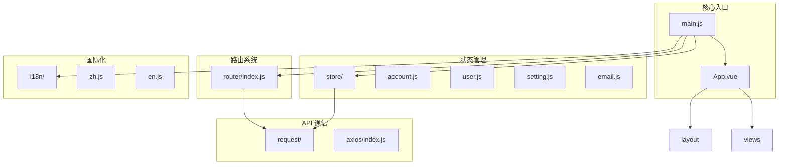
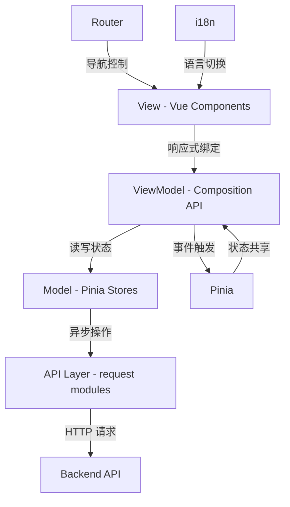
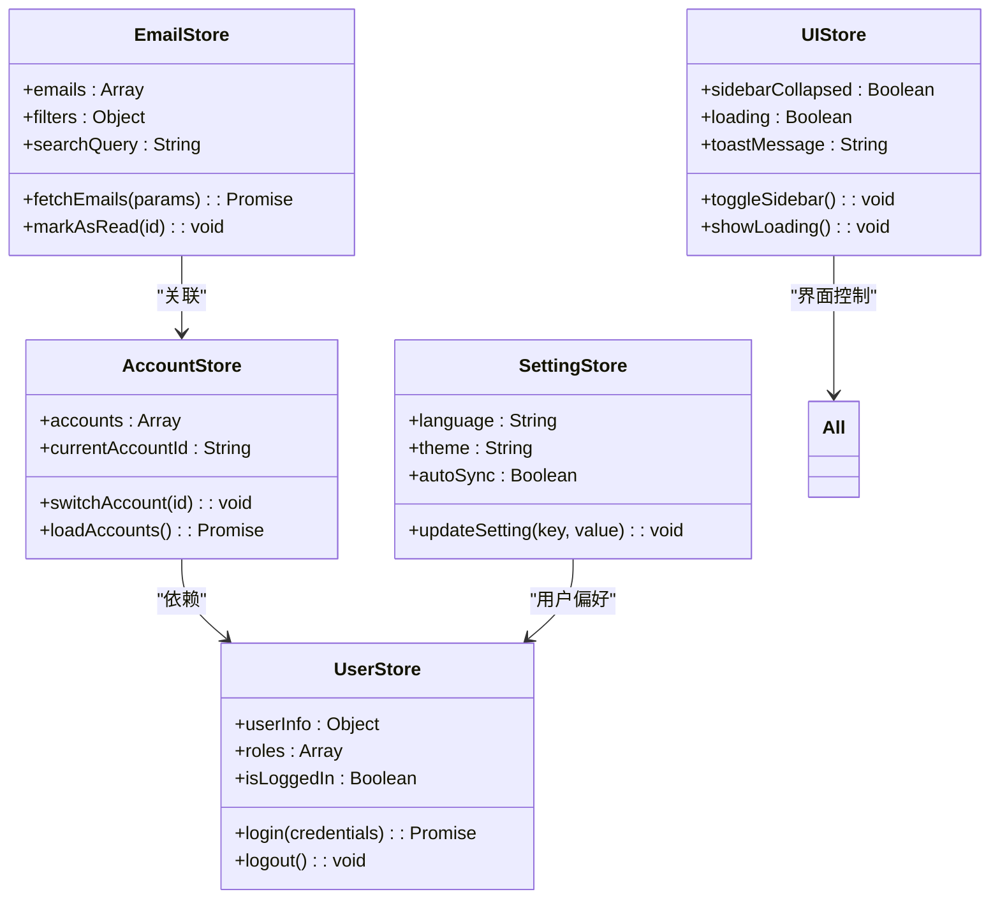
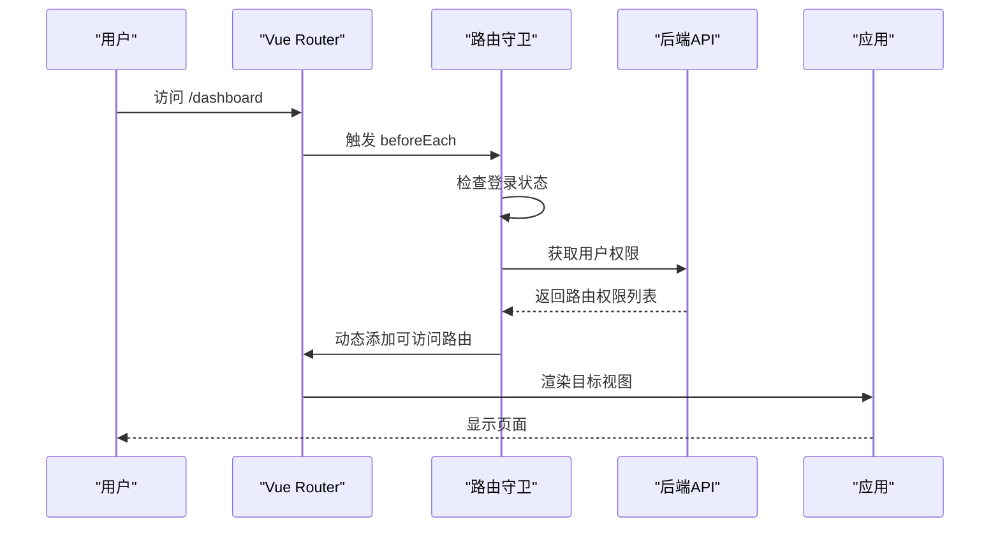
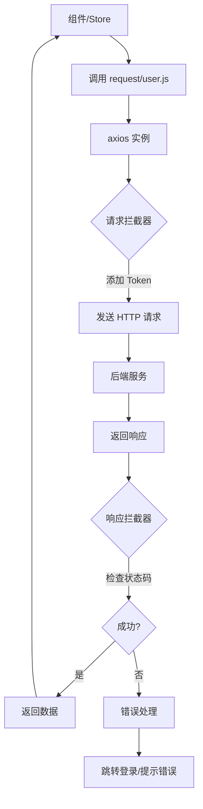
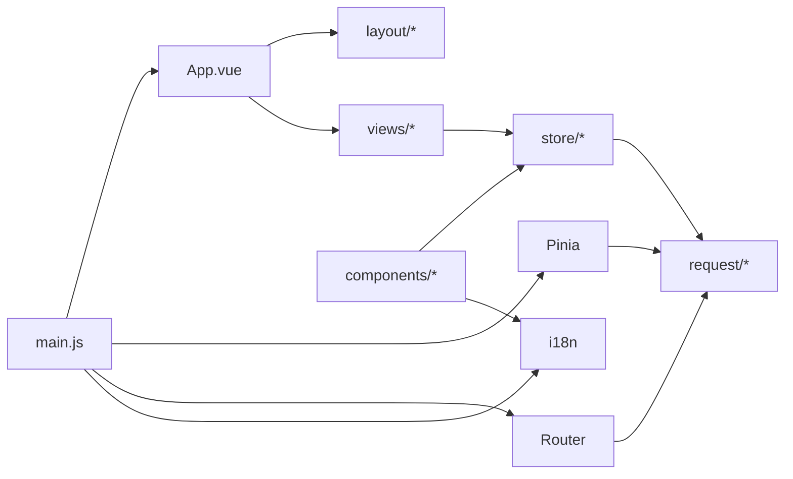

# 前端架构设计

<cite>
**本文档引用文件**  
- [main.js](file://mail-vue/src/main.js)
- [App.vue](file://mail-vue/src/App.vue)
- [router/index.js](file://mail-vue/src/router/index.js)
- [store/account.js](file://mail-vue/src/store/account.js)
- [store/user.js](file://mail-vue/src/store/user.js)
- [store/setting.js](file://mail-vue/src/store/setting.js)
- [store/email.js](file://mail-vue/src/store/email.js)
- [request/index.js](file://mail-vue/src/request/index.js)
- [i18n/index.js](file://mail-vue/src/i18n/index.js)
- [i18n/zh.js](file://mail-vue/src/i18n/zh.js)
- [i18n/en.js](file://mail-vue/src/i18n/en.js)
</cite>

## 目录
1. [引言](#引言)
2. [项目结构](#项目结构)
3. [核心组件](#核心组件)
4. [架构概览](#架构概览)
5. [详细组件分析](#详细组件分析)
6. [依赖分析](#依赖分析)
7. [性能考虑](#性能考虑)
8. [故障排除指南](#故障排除指南)
9. [结论](#结论)

## 引言
本文档深入解析 cloud-mail 前端架构，重点阐述基于 Vue3 的 MVVM 模式实现。涵盖应用初始化、状态管理、路由控制、API 封装、国际化支持等核心机制，并提供关键功能的代码路径与设计思路。

## 项目结构
cloud-mail 前端项目（mail-vue）采用标准 Vue3 + Vite 架构，遵循模块化组织原则。主要目录包括：
- `src/components`：通用 UI 组件
- `src/views`：页面级视图组件
- `src/layout`：布局容器组件
- `src/store`：Pinia 状态管理模块
- `src/router`：路由配置
- `src/request`：API 请求封装
- `src/i18n`：国际化语言包
- `src/utils`：工具函数集合

该结构清晰分离关注点，便于维护与扩展。



**Diagram sources**
- [main.js](file://mail-vue/src/main.js#L1-L50)
- [App.vue](file://mail-vue/src/App.vue#L1-L30)
- [router/index.js](file://mail-vue/src/router/index.js#L1-L20)

**Section sources**
- [main.js](file://mail-vue/src/main.js#L1-L50)
- [App.vue](file://mail-vue/src/App.vue#L1-L30)

## 核心组件

`main.js` 作为应用入口，负责初始化 Vue 实例并挂载 Pinia 状态管理器与 Vue Router 路由系统。通过 `createApp` 创建应用实例后，依次使用 `.use()` 方法集成 Pinia 和 Router，最终将根组件 `App.vue` 挂载至 DOM。

`App.vue` 是应用的根组件，采用组合式 API（Composition API）组织逻辑。其模板结构以 `<router-view>` 为核心，结合 `<layout>` 组件实现整体页面布局，支持动态渲染不同视图。

**Section sources**
- [main.js](file://mail-vue/src/main.js#L1-L50)
- [App.vue](file://mail-vue/src/App.vue#L1-L100)

## 架构概览

cloud-mail 前端采用典型的 MVVM 架构，Vue3 提供响应式视图层（View），Pinia 承担模型状态管理（Model），开发者通过组件逻辑（ViewModel）连接二者。整体架构如下图所示：



**Diagram sources**
- [main.js](file://mail-vue/src/main.js#L1-L50)
- [App.vue](file://mail-vue/src/App.vue#L1-L100)
- [store/user.js](file://mail-vue/src/store/user.js#L1-L40)

## 详细组件分析

### Pinia 状态管理设计

Pinia 在本项目中被用于集中管理全局状态，包括用户信息、账户配置、邮件数据、系统设置等。各 store 模块职责分明：

- `account.js`：管理账户相关状态与操作，如账户列表、当前账户切换
- `user.js`：存储用户身份信息、权限角色、登录状态
- `setting.js`：保存用户个性化设置，如主题、语言、通知偏好
- `email.js`：维护邮件列表、标签、搜索状态等
- `ui.js`：控制界面状态，如侧边栏展开、加载状态、弹窗控制

每个 store 使用 `defineStore` 定义，包含 `state`（状态）、`getters`（计算属性）、`actions`（方法）三部分，支持同步与异步操作，并通过 `$patch` 或直接修改实现状态更新。



**Diagram sources**
- [store/account.js](file://mail-vue/src/store/account.js#L1-L50)
- [store/user.js](file://mail-vue/src/store/user.js#L1-L50)
- [store/setting.js](file://mail-vue/src/store/setting.js#L1-L50)
- [store/email.js](file://mail-vue/src/store/email.js#L1-L50)
- [store/ui.js](file://mail-vue/src/store/ui.js#L1-L50)

**Section sources**
- [store/account.js](file://mail-vue/src/store/account.js#L1-L100)
- [store/user.js](file://mail-vue/src/store/user.js#L1-L100)
- [store/setting.js](file://mail-vue/src/store/setting.js#L1-L100)

### Vue Router 动态路由机制

Vue Router 实现了基于用户权限的动态路由注册。在 `router/index.js` 中，首先定义静态路由（如登录页），然后通过 `beforeEach` 路由守卫拦截导航。当用户登录后，根据其角色权限从后端获取可访问的路由配置，动态调用 `router.addRoute()` 注册对应视图组件，实现按需加载与权限隔离。

该机制确保未授权用户无法访问受限页面，同时提升首屏加载性能。



**Diagram sources**
- [router/index.js](file://mail-vue/src/router/index.js#L1-L80)

**Section sources**
- [router/index.js](file://mail-vue/src/router/index.js#L1-L100)

### Request 模块与 Axios 封装

`request` 模块基于 Axios 进行封装，统一处理 API 请求。在 `axios/index.js` 中创建 Axios 实例，配置基础 URL、超时时间，并注册请求与响应拦截器。

- **请求拦截器**：自动添加认证 Token（如 JWT）
- **响应拦截器**：统一处理错误码（如 401 重定向登录）、成功响应解包

各业务模块（如 `request/user.js`、`request/email.js`）封装具体接口，返回 Promise，便于在组件或 store 中调用。



**Diagram sources**
- [axios/index.js](file://mail-vue/src/axios/index.js#L1-L60)
- [request/user.js](file://mail-vue/src/request/user.js#L1-L20)

**Section sources**
- [axios/index.js](file://mail-vue/src/axios/index.js#L1-L100)
- [request/user.js](file://mail-vue/src/request/user.js#L1-L50)

### i18n 国际化机制

国际化通过 `i18n` 模块实现，包含 `zh.js`（中文）和 `en.js`（英文）语言包，导出键值对形式的翻译文本。`i18n/index.js` 创建 i18n 实例，注入 Vue 应用。

在组件中可通过 `$t('key')` 方法获取对应语言的文本。语言切换通过调用 `i18n.global.locale.value = 'en'` 动态更改，并触发视图响应式更新。

```mermaid
flowchart LR
A[zh.js] --> D[i18n Instance]
B[en.js] --> D
D --> E[Vue App]
E --> F[Component]
F --> G{$t('login.title')}
G --> |locale=zh| H["登录"]
G --> |locale=en| I["Login"]
```

**Diagram sources**
- [i18n/zh.js](file://mail-vue/src/i18n/zh.js#L1-L30)
- [i18n/en.js](file://mail-vue/src/i18n/en.js#L1-L30)
- [i18n/index.js](file://mail-vue/src/i18n/index.js#L1-L20)

**Section sources**
- [i18n/zh.js](file://mail-vue/src/i18n/zh.js#L1-L50)
- [i18n/en.js](file://mail-vue/src/i18n/en.js#L1-L50)
- [i18n/index.js](file://mail-vue/src/i18n/index.js#L1-L50)

## 依赖分析

项目前端模块间依赖关系清晰，核心依赖链如下：



所有模块通过 ES6 模块系统导入导出，无循环依赖，结构健康。

**Diagram sources**
- [main.js](file://mail-vue/src/main.js#L1-L50)
- [store/user.js](file://mail-vue/src/store/user.js#L1-L20)
- [request/user.js](file://mail-vue/src/request/user.js#L1-L10)

**Section sources**
- [main.js](file://mail-vue/src/main.js#L1-L50)
- [store/user.js](file://mail-vue/src/store/user.js#L1-L50)

## 性能考虑

为优化性能，项目采用以下策略：
- **组件懒加载**：路由视图组件使用 `defineAsyncComponent` 或动态 `import()` 实现按需加载，减少首包体积。
- **状态缓存**：Pinia store 中对频繁访问的数据（如用户信息）进行本地缓存，避免重复请求。
- **API 请求节流**：对搜索、分页等高频请求添加防抖（debounce）处理。
- **虚拟滚动**：在邮件列表等长列表场景使用 `email-scroll` 组件实现虚拟滚动，提升渲染性能。

**Section sources**
- [router/index.js](file://mail-vue/src/router/index.js#L20-L40)
- [components/email-scroll/index.vue](file://mail-vue/src/components/email-scroll/index.vue#L1-L50)

## 故障排除指南

常见问题及解决方案：
- **页面空白**：检查 `main.js` 中是否正确挂载应用，确认 `index.html` 存在且 ID 匹配。
- **路由无法跳转**：验证路由守卫逻辑，确保权限判断正确，动态路由已注册。
- **状态未更新**：确认 Pinia store 使用 `ref` 或 `reactive` 正确声明状态，避免直接替换整个 state。
- **请求失败**：检查 Axios 拦截器是否正确设置 Token，确认后端接口可用。
- **语言未切换**：确保 `i18n.global.locale.value` 被正确修改，组件使用 `$t` 函数。

**Section sources**
- [main.js](file://mail-vue/src/main.js#L1-L50)
- [router/index.js](file://mail-vue/src/router/index.js#L50-L80)
- [store/user.js](file://mail-vue/src/store/user.js#L30-L50)
- [axios/index.js](file://mail-vue/src/axios/index.js#L40-L60)
- [i18n/index.js](file://mail-vue/src/i18n/index.js#L10-L20)

## 结论

cloud-mail 前端架构基于 Vue3 的 MVVM 模式，结合 Pinia、Vue Router、Axios 和 i18n 构建了可维护、可扩展的应用体系。通过合理的模块划分、状态管理与路由控制，实现了功能丰富且性能优良的邮件客户端界面。未来可进一步优化懒加载策略、引入 Web Worker 处理密集计算，持续提升用户体验。