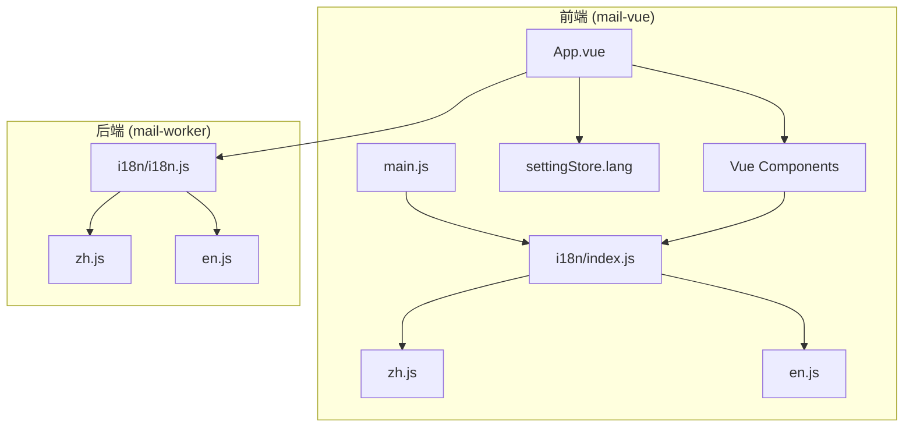
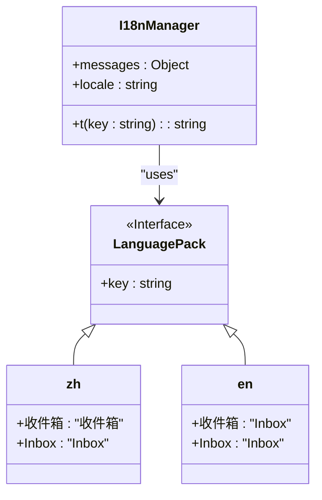
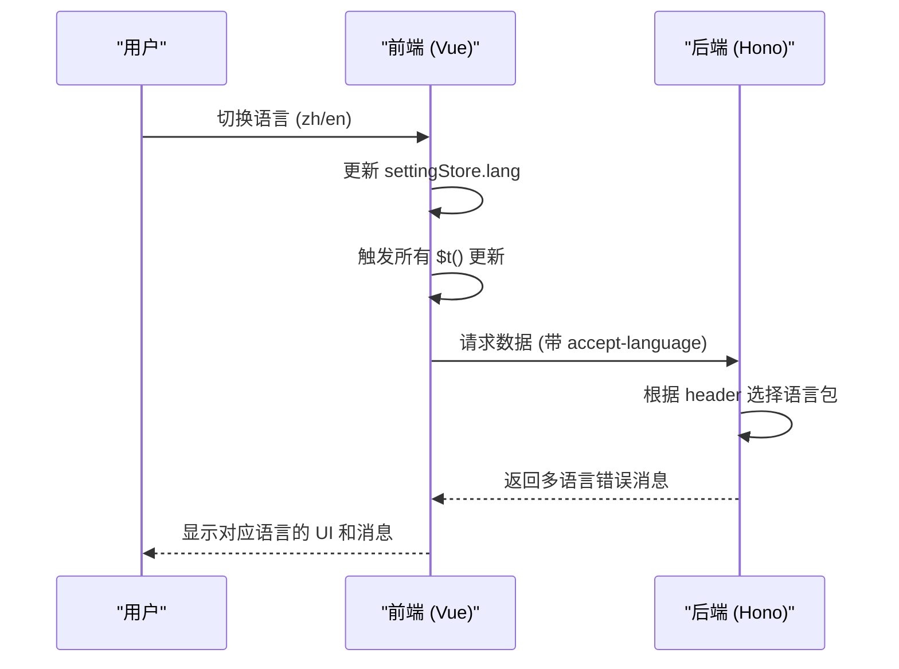
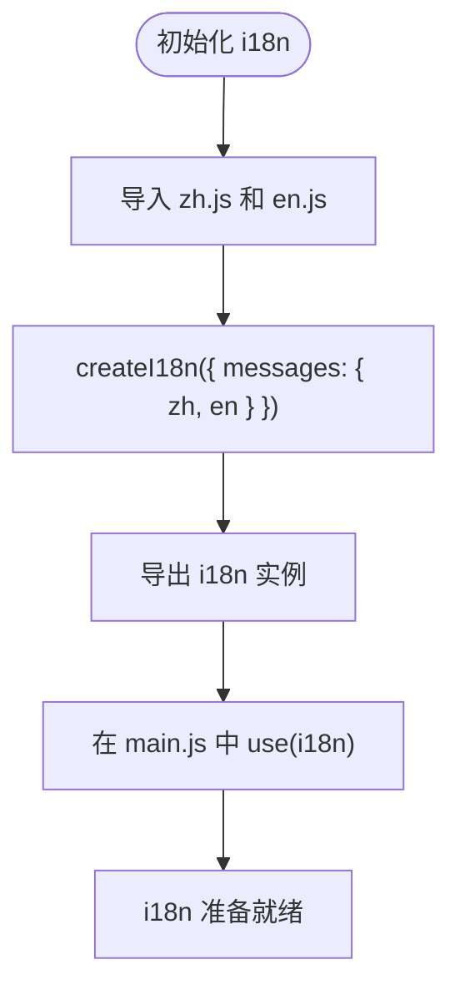
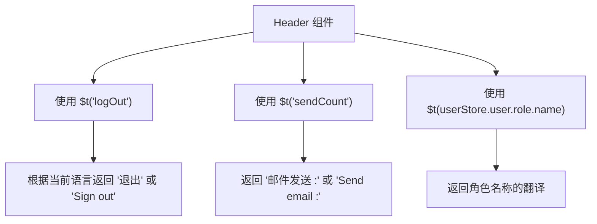
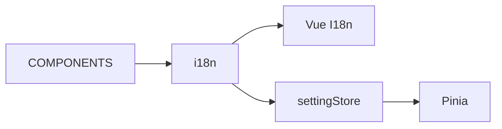

# 国际化实现

<cite>
**本文档引用的文件**
- [index.js](file://mail-vue/src/i18n/index.js)
- [zh.js](file://mail-vue/src/i18n/zh.js)
- [en.js](file://mail-vue/src/i18n/en.js)
- [App.vue](file://mail-vue/src/App.vue)
- [main.js](file://mail-vue/src/main.js)
- [header/index.vue](file://mail-vue/src/layout/header/index.vue)
- [hamburger/index.vue](file://mail-vue/src/components/hamburger/index.vue)
- [i18n.js](file://mail-worker/src/i18n/i18n.js)
- [zh.js](file://mail-worker/src/i18n/zh.js)
- [en.js](file://mail-worker/src/i18n/en.js)
</cite>

## 目录
1. [简介](#简介)
2. [项目结构](#项目结构)
3. [核心组件](#核心组件)
4. [架构概览](#架构概览)
5. [详细组件分析](#详细组件分析)
6. [依赖分析](#依赖分析)
7. [性能考虑](#性能考虑)
8. [故障排除指南](#故障排除指南)
9. [结论](#结论)

## 简介
本文档详细介绍了 cloud-mail 项目中前端国际化（i18n）机制的实现方式。重点说明了如何通过 `i18n/index.js` 统一管理中英文语言包（`zh.js`, `en.js`），并在 Vue 组件中使用 `$t()` 语法进行文本替换。文档还描述了语言切换逻辑如何触发全局 UI 更新，包括动态修改页面标题、按钮文字、表单提示等，并结合实际组件（如 hamburger、header）展示多语言支持的具体应用。

此外，本文档讨论了语言包的扩展性，包括如何添加新语言，以及与后端返回消息的多语言协调策略。最后，提供了常见问题如文本未更新、语言包加载失败的排查方法。

**Section sources**
- [index.js](file://mail-vue/src/i18n/index.js#L0-L11)
- [App.vue](file://mail-vue/src/App.vue#L0-L14)

## 项目结构
cloud-mail 项目的国际化功能主要集中在 `mail-vue/src/i18n/` 目录下，包含中英文语言包文件 `zh.js` 和 `en.js`，以及统一的 `index.js` 入口文件。前端通过 Vue I18n 插件实现多语言支持，而后端（`mail-worker`）则使用 i18next 实现错误消息的多语言处理。

前端语言包通过 `main.js` 注册到 Vue 应用中，并通过 Pinia 状态管理中的 `settingStore.lang` 控制当前语言环境。UI 组件通过 `$t()` 方法动态获取对应语言的文本内容。

**Diagram sources**
- [index.js](file://mail-vue/src/i18n/index.js#L0-L11)
- [main.js](file://mail-vue/src/main.js#L0-L18)
- [App.vue](file://mail-vue/src/App.vue#L0-L14)
- [i18n.js](file://mail-worker/src/i18n/i18n.js#L0-L29)

**Section sources**
- [index.js](file://mail-vue/src/i18n/index.js#L0-L11)
- [zh.js](file://mail-vue/src/i18n/zh.js#L0-L297)
- [en.js](file://mail-vue/src/i18n/en.js#L0-L297)
- [i18n.js](file://mail-worker/src/i18n/i18n.js#L0-L29)
- [zh.js](file://mail-worker/src/i18n/zh.js#L0-L103)
- [en.js](file://mail-worker/src/i18n/en.js#L0-L103)

## 核心组件
cloud-mail 的国际化核心由 `i18n/index.js` 驱动，通过 Vue I18n 的 `createI18n` 方法创建国际化实例，并注入中英文语言包。语言切换通过 `settingStore.lang` 状态控制，所有使用 `$t()` 的组件会自动响应语言变化。

后端通过 `i18n/i18n.js` 使用 i18next 实现多语言错误消息，根据请求头 `accept-language` 自动选择语言，并提供 `t()` 函数供业务逻辑调用。

**Diagram sources**
- [index.js](file://mail-vue/src/i18n/index.js#L0-L11)
- [zh.js](file://mail-vue/src/i18n/zh.js#L0-L297)
- [en.js](file://mail-vue/src/i18n/en.js#L0-L297)

**Section sources**
- [index.js](file://mail-vue/src/i18n/index.js#L0-L11)
- [i18n.js](file://mail-worker/src/i18n/i18n.js#L0-L29)

## 架构概览
cloud-mail 的国际化架构分为前端和后端两部分。前端使用 Vue I18n 实现 UI 多语言，后端使用 i18next 实现错误消息多语言。两者通过统一的语言键（key）进行协调，确保用户在不同场景下获得一致的语言体验。

**Diagram sources**
- [App.vue](file://mail-vue/src/App.vue#L0-L14)
- [i18n.js](file://mail-worker/src/i18n/i18n.js#L0-L29)

## 详细组件分析

### i18n 模块分析
`i18n/index.js` 是前端国际化的入口，通过 `createI18n` 创建实例并注入中英文语言包。`legacy: false` 表示使用 Composition API 模式。

**Diagram sources**
- [index.js](file://mail-vue/src/i18n/index.js#L0-L11)

**Section sources**
- [index.js](file://mail-vue/src/i18n/index.js#L0-L11)

### Header 组件分析
`header/index.vue` 组件展示了多语言的实际应用，通过 `$t()` 动态渲染文本，如 `{{ $t('logOut') }}`、`{{ $t('sendCount') }}` 等。

**Diagram sources**
- [header/index.vue](file://mail-vue/src/layout/header/index.vue#L0-L471)

**Section sources**
- [header/index.vue](file://mail-vue/src/layout/header/index.vue#L0-L471)

### Hamburger 组件分析
`hamburger/index.vue` 虽然没有直接使用 `$t()`，但它是 UI 的一部分，其图标和行为会随整体语言环境变化而间接影响用户体验。

**Section sources**
- [hamburger/index.vue](file://mail-vue/src/components/hamburger/index.vue#L0-L42)

## 依赖分析
国际化模块依赖于 Vue I18n 插件，并与 Pinia 状态管理（`settingStore`）紧密耦合。语言切换通过 `settingStore.lang` 触发，所有使用 `$t()` 的组件都会响应此变化。

**Diagram sources**
- [index.js](file://mail-vue/src/i18n/index.js#L0-L11)
- [App.vue](file://mail-vue/src/App.vue#L0-L14)

**Section sources**
- [index.js](file://mail-vue/src/i18n/index.js#L0-L11)
- [App.vue](file://mail-vue/src/App.vue#L0-L14)

## 性能考虑
- 语言包在构建时静态加载，无额外网络请求
- 使用 `computed` 和 `watch` 确保语言切换的响应性
- 所有翻译键在编译时解析，运行时性能开销极小

## 故障排除指南
### 文本未更新
- 检查 `settingStore.lang` 是否正确更新
- 确认组件是否正确使用 `$t()` 语法
- 检查语言包中是否存在对应键

### 语言包加载失败
- 确认 `zh.js` 和 `en.js` 文件路径正确
- 检查文件导出是否为 `export default`
- 验证 `index.js` 中的导入路径

### 后端消息未翻译
- 检查请求头 `accept-language` 是否正确发送
- 确认后端 `i18n.js` 是否正确初始化
- 验证语言键是否在 `zh.js`/`en.js` 中定义

**Section sources**
- [index.js](file://mail-vue/src/i18n/index.js#L0-L11)
- [i18n.js](file://mail-worker/src/i18n/i18n.js#L0-L29)
- [App.vue](file://mail-vue/src/App.vue#L0-L14)

## 结论
cloud-mail 的国际化机制设计合理，前后端分离清晰。前端通过 Vue I18n 实现 UI 多语言，后端通过 i18next 处理错误消息，两者通过统一的语言键协调。语言切换流畅，支持动态更新，具备良好的扩展性，可轻松添加新语言。