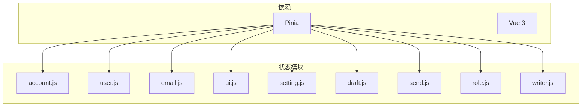
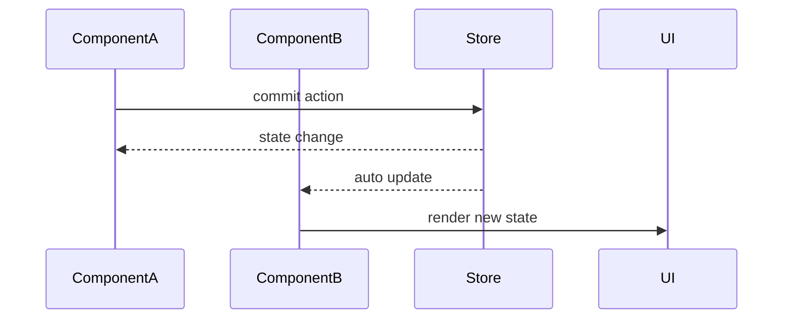

# 状态管理设计

<cite>
**本文档引用的文件**  
- [account.js](file://mail-vue/src/store/account.js)
- [email.js](file://mail-vue/src/store/email.js)
- [user.js](file://mail-vue/src/store/user.js)
- [setting.js](file://mail-vue/src/store/setting.js)
- [ui.js](file://mail-vue/src/store/ui.js)
- [draft.js](file://mail-vue/src/store/draft.js)
- [send.js](file://mail-vue/src/store/send.js)
- [role.js](file://mail-vue/src/store/role.js)
- [writer.js](file://mail-vue/src/store/writer.js)
- [package.json](file://mail-vue/package.json)
</cite>

## 目录
1. [简介](#简介)
2. [项目结构与状态管理布局](#项目结构与状态管理布局)
3. 核心状态模块分析
   - [账户状态 (account)](#账户状态-account)
   - [用户状态 (user)](#用户状态-user)
   - [邮件状态 (email)](#邮件状态-email)
   - [UI状态 (ui)](#ui状态-ui)
   - [设置状态 (setting)](#设置状态-setting)
   - [其他状态模块](#其他状态模块)
4. [模块化状态共享与跨组件通信](#模块化状态共享与跨组件通信)
5. [状态持久化策略](#状态持久化策略)
6. [异步操作与API集成模式](#异步操作与api集成模式)
7. [错误处理机制](#错误处理机制)
8. [模块依赖与避免循环引用](#模块依赖与避免循环引用)
9. [性能优化建议](#性能优化建议)
10. [在组件中使用Store](#在组件中使用store)
11. [总结](#总结)

## 简介
本项目采用Pinia作为Vue 3应用的状态管理方案，实现前端全局状态的集中管理。通过模块化设计，将不同功能域的状态分离到独立的store中，提升代码可维护性与可测试性。各模块通过响应式机制实现跨组件数据同步，支持状态持久化、异步操作处理及模块间协作。

## 项目结构与状态管理布局
状态管理模块集中存放于`mail-vue/src/store/`目录下，采用Pinia的模块化store设计。每个store文件对应一个功能域，如用户、邮件、UI等，通过`defineStore`定义独立状态容器。



**图示来源**  
- [account.js](file://mail-vue/src/store/account.js)
- [user.js](file://mail-vue/src/store/user.js)
- [email.js](file://mail-vue/src/store/email.js)
- [ui.js](file://mail-vue/src/store/ui.js)
- [setting.js](file://mail-vue/src/store/setting.js)

**本节来源**  
- [mail-vue/src/store/](file://mail-vue/src/store/)

## 账户状态 (account)
`useAccountStore`管理当前账户上下文，包括当前账户ID、账户信息及账户名称变更状态。

- **状态属性**：
  - `currentAccountId`: 当前账户唯一标识
  - `currentAccount`: 当前账户完整信息对象
  - `changeUserAccountName`: 账户名称变更标记

该模块为多账户场景提供基础支持，通过共享状态实现账户切换时的全局同步。

**本节来源**  
- [account.js](file://mail-vue/src/store/account.js#L2-L8)

## 用户状态 (user)
`useUserStore`负责用户登录信息的管理与刷新，包含用户数据获取与列表更新逻辑。

- **状态属性**：
  - `user`: 当前登录用户信息
  - `refreshList`: 列表刷新计数器

- **Action方法**：
  - `refreshUserList()`: 触发用户列表刷新，通过`loginUserInfo()`请求更新计数器
  - `refreshUserInfo()`: 获取最新用户信息并更新`user`状态

该模块通过异步请求集成API，实现用户数据的动态更新。

**本节来源**  
- [user.js](file://mail-vue/src/store/user.js#L3-L20)

## 邮件状态 (email)
`useEmailStore`管理邮件相关的UI状态与内容展示逻辑。

- **状态属性**：
  - `deleteIds`, `cancelStarEmailId`, `addStarEmailId`: 邮件操作标识
  - `emailScroll`, `starScroll`, `sendScroll`: 滚动位置状态
  - `contentData`: 邮件内容展示数据（含邮件对象、删除类型、星标与回复显示控制）

- **持久化配置**：
  - 使用`pinia-plugin-persistedstate`插件，仅持久化`contentData`字段

该模块通过状态标记驱动UI更新，实现邮件操作的响应式反馈。

**本节来源**  
- [email.js](file://mail-vue/src/store/email.js#L2-L20)

## UI状态 (ui)
`useUiStore`集中管理全局UI状态与交互控制。

- **状态属性**：
  - `asideShow`, `accountShow`: 侧边栏与账户面板显示控制
  - `backgroundLoading`: 背景加载状态
  - `dark`: 深色主题开关
  - `asideCount`: 各分类邮件数量统计
  - `previewData`: 预览数据传递

- **Action方法**：
  - `showNotice()`: 触发通知更新
  - `previewNotice(data)`: 设置预览数据并触发更新

- **持久化配置**：
  - 持久化`accountShow`和`dark`状态，实现用户偏好记忆

该模块是跨组件通信的核心枢纽，尤其在主题切换与面板控制中发挥关键作用。

**本节来源**  
- [ui.js](file://mail-vue/src/store/ui.js#L2-L31)

## 设置状态 (setting)
`useSettingStore`管理应用配置与国际化设置。

- **状态属性**：
  - `domainList`: 域名列表
  - `settings`: 系统设置对象（含R2域名、登录页透明度）
  - `lang`: 当前语言环境

该模块为多语言与多域名支持提供基础，未来可扩展更多配置项。

**本节来源**  
- [setting.js](file://mail-vue/src/store/setting.js#L2-L14)

## 其他状态模块
- `draft.js`: 管理草稿箱状态，含`refreshList`与`setDraft`字段
- `send.js`: 发件箱状态，跟踪删除操作`deleteId`
- `role.js`: 角色管理状态，通过`refresh`计数器触发更新
- `writer.js`: 存在命名冲突（重复`useUserStore`），需修正

**本节来源**  
- [draft.js](file://mail-vue/src/store/draft.js)
- [send.js](file://mail-vue/src/store/send.js)
- [role.js](file://mail-vue/src/store/role.js)
- [writer.js](file://mail-vue/src/store/writer.js)

## 模块化状态共享与跨组件通信
通过Pinia的全局store实例，各组件可访问共享状态，实现无需props层层传递的数据同步。典型应用场景包括：

- **用户登录状态同步**：`useUserStore`在多个视图间共享用户信息
- **邮件列表更新**：通过`refreshList`计数器触发列表刷新
- **UI主题切换**：`ui.dark`状态变更自动同步至所有组件
- **侧边栏计数更新**：`asideCount`集中管理各分类数量



**图示来源**  
- [user.js](file://mail-vue/src/store/user.js)
- [ui.js](file://mail-vue/src/store/ui.js)

**本节来源**  
- [user.js](file://mail-vue/src/store/user.js)
- [ui.js](file://mail-vue/src/store/ui.js)

## 状态持久化策略
项目使用`pinia-plugin-persistedstate`实现状态持久化：

- **持久化插件**：已在`package.json`中声明依赖
- **选择性持久化**：
  - `ui`模块：持久化`accountShow`和`dark`（用户偏好）
  - `email`模块：持久化`contentData`（邮件内容上下文）

持久化策略合理控制存储范围，避免敏感数据泄露与存储膨胀。

**本节来源**  
- [ui.js](file://mail-vue/src/store/ui.js#L28-L30)
- [email.js](file://mail-vue/src/store/email.js#L18-L20)
- [package.json](file://mail-vue/package.json#L25)

## 异步操作与API集成模式
异步逻辑通过Action方法封装API调用：

- **模式**：在Action中调用`@/request/`模块的API函数
- **示例**：`refreshUserInfo()`中调用`loginUserInfo()`获取用户数据
- **响应处理**：使用`.then()`链式处理成功响应，更新本地状态

建议统一错误处理机制，当前未见异常捕获逻辑。

**本节来源**  
- [user.js](file://mail-vue/src/store/user.js#L10-L19)

## 错误处理机制
当前代码中未显式实现错误处理。建议在异步Action中添加`.catch()`或使用`try/catch`：

```javascript
actions: {
  async refreshUserInfo() {
    try {
      const user = await loginUserInfo()
      this.user = user
    } catch (error) {
      // 处理错误，更新错误状态
    }
  }
}
```

可引入全局错误状态模块统一管理UI错误提示。

**本节来源**  
- [user.js](file://mail-vue/src/store/user.js)

## 模块依赖与避免循环引用
当前模块间无显式依赖注入。建议：

- **避免直接导入其他store**：防止循环引用
- **通过事件或共享状态通信**：如通过`ui`模块中转
- **命名规范**：修复`writer.js`中的`useUserStore`命名冲突

模块应保持高内聚、低耦合，通过清晰的边界划分职责。

**本节来源**  
- [writer.js](file://mail-vue/src/store/writer.js)
- [user.js](file://mail-vue/src/store/user.js)

## 性能优化建议
1. **状态分割**：将大对象拆分为独立状态，避免不必要的响应式开销
2. **懒加载store**：对非核心模块（如`draft`、`role`）按需引入
3. **计算属性优化**：对于衍生数据，使用getter而非在组件中重复计算
4. **批量更新**：避免频繁触发小状态变更，可合并为对象更新

## 在组件中使用store
在Vue组件中通过以下方式使用：

```javascript
import { useUserStore } from '@/store/user.js'

export default {
  setup() {
    const userStore = useUserStore()
    return { userStore }
  }
}
```

通过`store.state`访问数据，`store.action()`调用方法，自动响应式更新。

**本节来源**  
- [user.js](file://mail-vue/src/store/user.js)

## 总结
本项目基于Pinia构建了模块化的前端状态管理体系，覆盖账户、用户、邮件、UI等核心功能域。通过响应式状态共享实现跨组件通信，结合持久化插件记忆用户偏好。建议完善错误处理、修复命名冲突，并进一步优化状态粒度与加载策略，以提升应用稳定性与性能。