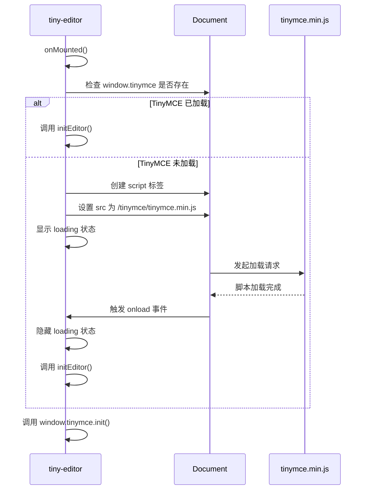
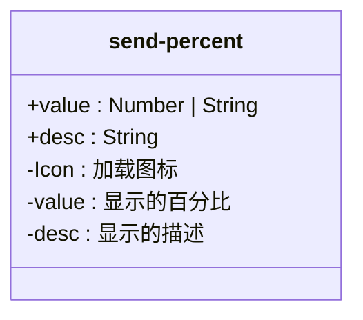

# 组件体系结构

<cite>
**本文档中引用的文件**  
- [tiny-editor/index.vue](file://mail-vue/src/components/tiny-editor/index.vue)
- [email-scroll/index.vue](file://mail-vue/src/components/email-scroll/index.vue)
- [email-scroll/skeleton/index.vue](file://mail-vue/src/components/email-scroll/skeleton/index.vue)
- [send-percent/index.vue](file://mail-vue/src/components/send-percent/index.vue)
- [loading/index.vue](file://mail-vue/src/components/loading/index.vue)
- [shadow-html/index.vue](file://mail-vue/src/components/shadow-html/index.vue)
- [ui.js](file://mail-vue/src/store/ui.js)
- [setting.js](file://mail-vue/src/store/setting.js)
- [file-utils.js](file://mail-vue/src/utils/file-utils.js)
- [day.js](file://mail-vue/src/utils/day.js)
- [time-utils.js](file://mail-vue/src/utils/time-utils.js)
</cite>

## 目录
1. [简介](#简介)
2. [核心组件概览](#核心组件概览)
3. [tiny-editor 组件分析](#tiny-editor-组件分析)
4. [email-scroll 组件分析](#email-scroll-组件分析)
5. [send-percent 组件分析](#send-percent-组件分析)
6. [loading 与 shadow-html 组件分析](#loading-与-shadow-html-组件分析)
7. [API 文档与集成示例](#api-文档与集成示例)
8. [可访问性、响应式设计与主题定制](#可访问性响应式设计与主题定制)
9. [结论](#结论)

## 简介
`cloud-mail` 前端采用 Vue 3 框架构建，其组件体系结构围绕可复用 UI 组件设计，旨在提升开发效率与用户体验。本文档深入分析其核心组件的设计与实现，重点涵盖富文本编辑、滚动加载、进度可视化、异步状态反馈等关键功能模块。

## 核心组件概览
`cloud-mail` 的前端组件主要位于 `mail-vue/src/components` 目录下，核心组件包括：
- **tiny-editor**: 封装 TinyMCE 的富文本编辑器，用于邮件内容编辑。
- **email-scroll**: 实现邮件列表的滚动加载与骨架屏展示。
- **send-percent**: 可视化邮件发送进度。
- **loading**: 自定义加载指示器。
- **shadow-html**: 利用 Shadow DOM 安全渲染 HTML 内容。

这些组件通过清晰的 props、事件和插槽进行通信，实现了高内聚、低耦合的设计。

## tiny-editor 组件分析

该组件将 TinyMCE 富文本编辑器封装为 Vue 3 的 `setup` 语法糖组件，提供了无缝的集成体验。

### 集成与初始化机制
组件通过动态创建 `<script>` 标签异步加载 TinyMCE 的核心库 (`tinymce.min.js`)，避免阻塞主应用的加载。加载过程中，`showLoading` 状态被激活，显示内部的 `loading` 组件，提供视觉反馈。



**Diagram sources**
- [tiny-editor/index.vue](file://mail-vue/src/components/tiny-editor/index.vue#L100-L135)

### 富文本编辑与内嵌图片上传
组件通过 `window.tinymce.init()` 配置编辑器，支持加粗、斜体、链接、图片插入、表格等常用功能。其核心亮点在于内嵌图片上传的实现。

当用户通过编辑器的图片选择器上传图片时，会触发 `file_picker_callback` 回调。该回调会：
1.  创建一个隐藏的 `<input type="file">` 元素并触发点击。
2.  用户选择图片后，使用 `compressImage` 工具函数对图片进行压缩，以优化上传性能。
3.  使用 `FileReader` 将图片读取为 Data URL。
4.  利用 TinyMCE 提供的 `blobCache` API 将图片数据缓存，并生成一个临时的 Blob URI。
5.  将此 Blob URI 作为图片的 `src` 返回给编辑器，实现图片的内嵌显示。

此机制避免了直接上传到服务器，提升了编辑体验的流畅性。

**Section sources**
- [tiny-editor/index.vue](file://mail-vue/src/components/tiny-editor/index.vue#L170-L218)
- [file-utils.js](file://mail-vue/src/utils/file-utils.js#L39-L57)

### 主题与国际化适配
组件通过监听 `uiStore.dark` 和 `settingStore.lang` 的变化，动态销毁并重新初始化编辑器，以切换其皮肤（`oxide` 或 `oxide-dark`）和语言（`zh_CN`, `zh_TW`, `en`）。这确保了编辑器的外观与应用的整体主题和语言设置保持一致。

**Section sources**
- [tiny-editor/index.vue](file://mail-vue/src/components/tiny-editor/index.vue#L137-L148)
- [ui.js](file://mail-vue/src/store/ui.js#L2-L31)
- [setting.js](file://mail-vue/src/store/setting.js#L2-L14)

## email-scroll 组件分析

`email-scroll` 组件负责邮件列表的展示，其核心功能是滚动加载和骨架屏，以优化长列表的用户体验。

### 滚动加载机制
组件利用 `v-infinite-scroll` 指令实现无限滚动。当用户滚动到距离容器底部 600px 时，会触发 `loadData` 方法。

`loadData` 方法会调用由父组件传入的 `getEmailList` 函数，该函数通常是一个 API 请求。请求参数 `queryParam` 中的 `emailId` 作为分页的游标（cursor），`size` 为每页大小。每次成功加载后，新数据会被追加到 `emailList` 数组中，并更新游标，为下一次加载做准备。

```mermaid
flowchart TD
A[用户滚动] --> B{距离底部 < 600px?}
B --> |是| C[调用 loadData()]
C --> D[调用 getEmailList(queryParam)]
D --> E[API 请求]
E --> F{请求成功?}
F --> |是| G[更新 emailList 和 queryParam]
F --> |否| H[处理错误]
G --> I[更新 UI]
H --> I
I --> J[等待下次滚动]
```

**Section sources**
- [email-scroll/index.vue](file://mail-vue/src/components/email-scroll/index.vue#L280-L298)

### 骨架屏的配合使用
组件通过 `skeleton` prop 控制是否启用骨架屏。当 `skeleton` 为 `true` 时，组件会根据不同的加载状态显示对应的骨架屏组件 `skeletonBlock`：
- **首次加载 (`firstLoad`)**: 显示 20 行骨架。
- **常规加载 (`loading`)**: 显示与当前列表行数匹配的骨架行。
- **后续加载 (`followLoading`)**: 显示 1-2 行骨架，表示正在加载更多内容。

这种分层的骨架屏策略为用户提供了明确的加载反馈，减少了“白屏”带来的不确定性，显著提升了用户体验。

**Section sources**
- [email-scroll/index.vue](file://mail-vue/src/components/email-scroll/index.vue#L50-L70)
- [email-scroll/skeleton/index.vue](file://mail-vue/src/components/email-scroll/skeleton/index.vue#L1-L133)

## send-percent 组件分析

`send-percent` 是一个轻量级的进度可视化组件，用于在发送邮件时向用户展示当前的发送进度。

### 组件设计与实现
该组件设计简洁，仅接收两个 prop：
- `value`: 当前的百分比数值。
- `desc`: 附加的描述文本（如“正在发送...”）。

其 UI 由一个旋转的加载图标（`line-md:loading-loop`）和一个包含百分比及描述的文本区域组成。通过简单的 Flex 布局，实现了清晰直观的进度展示。



**Diagram sources**
- [send-percent/index.vue](file://mail-vue/src/components/send-percent/index.vue#L1-L23)

## loading 与 shadow-html 组件分析

### loading 组件
`loading` 组件是一个自定义的加载指示器，它不依赖于 Element Plus 的默认样式，而是通过 SVG 和 CSS 动画实现了一个独特的四点旋转动画。

其核心是一个包含四个圆形 (`circle`) 的 SVG。通过为每个圆点设置不同的 `animation-delay`，并配合 `@keyframes custom-spin-move` 动画，实现了四个点依次变亮、变暗的循环效果，营造出旋转的视觉错觉。`size` prop 允许外部控制组件的大小。

**Section sources**
- [loading/index.vue](file://mail-vue/src/components/loading/index.vue#L1-L109)

### shadow-html 组件
`shadow-html` 组件利用 Web Components 的 Shadow DOM 技术来安全地渲染 HTML 内容。其主要目的是隔离邮件内容的样式，防止其污染应用的全局样式。

#### 工作流程
1.  **创建 Shadow Root**: 在 `onMounted` 钩子中，通过 `attachShadow({ mode: 'open' })` 在 `container` 元素上创建一个 Shadow Root。
2.  **注入样式与内容**: `updateContent` 方法会：
    -   提取原始 HTML 中 `<body>` 标签的 `style` 属性。
    -   移除 `<body>` 标签，保留其内部内容。
    -   向 Shadow Root 的 `<style>` 标签中注入重置样式、字体定义和从 `<body>` 提取的样式。
    -   将清理后的内容包裹在 `.shadow-content` 容器中，插入到 Shadow Root。
3.  **自动缩放**: `autoScale` 方法会计算 Shadow DOM 内容的实际尺寸与宿主容器的尺寸，并通过设置 `zoom` 属性，确保内容能完整地适应容器，避免溢出。

此组件有效解决了 HTML 内容样式冲突和布局溢出的问题。

**Section sources**
- [shadow-html/index.vue](file://mail-vue/src/components/shadow-html/index.vue#L30-L128)

## API 文档与集成示例

### 组件 Props、事件与插槽

| 组件 | Props | 事件 | 插槽 |
| :--- | :--- | :--- | :--- |
| **tiny-editor** | `defValue`: 默认内容<br>`editorId`: 编辑器唯一ID | `change`: 内容变更时触发，携带 HTML 和纯文本 | 无 |
| **email-scroll** | `getEmailList`: 获取数据的函数<br>`emailDelete`: 删除邮件的函数<br>`starAdd/Cancel`: 星标操作函数<br>`skeleton`: 是否启用骨架屏<br>`showStar/Status/UserInfo`: 显示控制 | `jump`: 点击邮件项时触发<br>`refresh-before`: 刷新前触发 | `first`: 头部操作区<br>`name`: 发件人自定义<br>`subject`: 主题自定义 |
| **send-percent** | `value`: 进度百分比<br>`desc`: 描述文本 | 无 | 无 |
| **loading** | `size`: 组件大小 (px) | 无 | 无 |
| **shadow-html** | `html`: 需要渲染的 HTML 字符串 | 无 | 无 |

### 集成代码示例

```vue
<template>
  <!-- 集成 tiny-editor -->
  <tiny-editor 
    v-model="emailContent" 
    @change="handleContentChange" 
  />

  <!-- 集成 email-scroll -->
  <email-scroll 
    :getEmailList="fetchEmails" 
    @jump="openEmail"
    :skeleton="true"
  >
    <template #first>
      <el-button @click="composeNew">写邮件</el-button>
    </template>
  </email-scroll>

  <!-- 集成 send-percent -->
  <send-percent 
    v-if="isSending" 
    :value="sendProgress" 
    desc="正在发送..." 
  />

  <!-- 集成 shadow-html -->
  <shadow-html :html="emailBodyHtml" />
</template>
```

## 可访问性、响应式设计与主题定制

### 可访问性 (Accessibility)
组件体系在可访问性方面有基础考虑：
- 使用了语义化的 HTML 元素（如 `<button>`, `<input>`）。
- `el-checkbox` 和 `el-tooltip` 等 Element Plus 组件本身具备一定的 ARIA 支持。
- 但文档中未发现对 `aria-*` 属性的显式增强或键盘导航的深度优化，此方面有提升空间。

### 响应式设计
组件普遍采用了响应式设计：
- **tiny-editor**: 通过 CSS 媒体查询调整全屏模式下的内边距。
- **email-scroll**: 在不同屏幕宽度下调整网格布局（`grid-template-columns`）、隐藏/显示特定列（如星标、状态）、调整字体大小和间距。
- **skeleton**: 骨架屏的宽度会根据屏幕尺寸动态调整。

### 主题定制
主题定制主要通过 CSS 变量和状态管理实现：
- **CSS 变量**: 组件使用 `var(--el-bg-color)`, `var(--el-text-color-primary)` 等来自 Element Plus 的 CSS 变量，确保与框架主题一致。
- **状态驱动**: `tiny-editor` 和 `email-scroll` 通过监听 `uiStore.dark` 状态来动态切换深色/浅色模式，实现了主题的实时切换。

## 结论
`cloud-mail` 的前端组件体系结构设计良好，充分体现了现代 Web 应用的开发理念。通过 `tiny-editor` 实现了功能强大的富文本编辑，`email-scroll` 结合骨架屏优化了长列表性能，`send-percent` 和 `loading` 提供了清晰的用户反馈，而 `shadow-html` 则巧妙地解决了 HTML 内容渲染的安全与布局问题。整体上，这些组件具有高复用性、清晰的 API 和良好的用户体验，为应用的稳定运行和可维护性奠定了坚实基础。