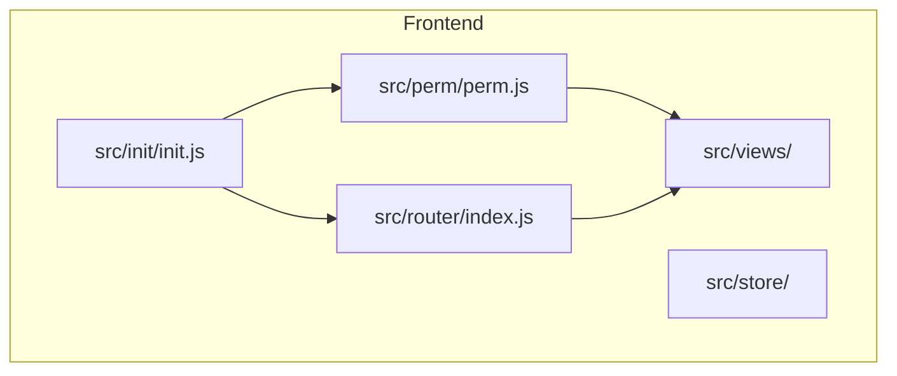
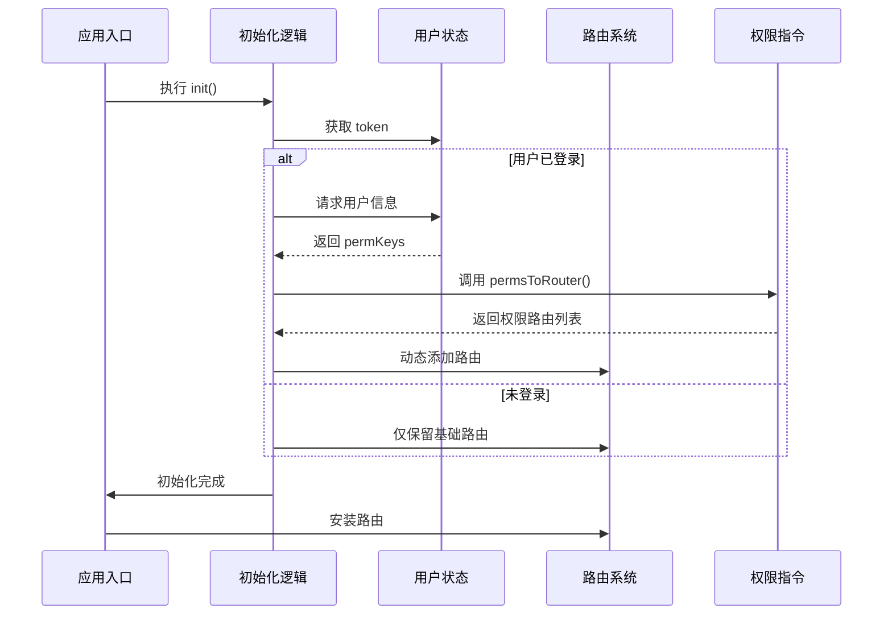
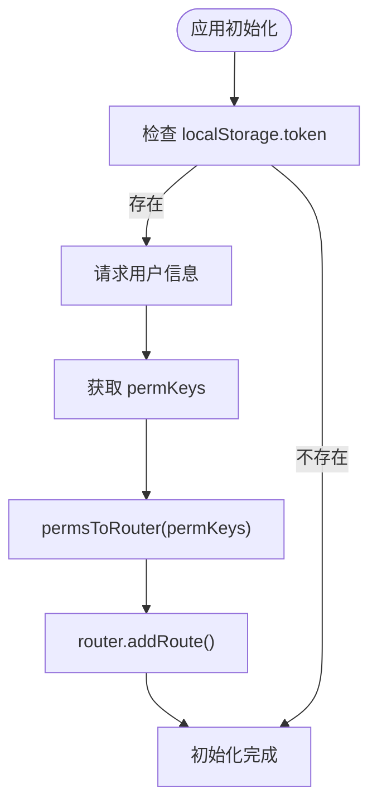
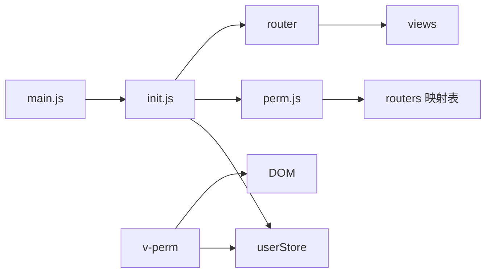

# 路由与导航机制

<cite>
**本文档中引用的文件**  
- [index.js](file://mail-vue/src/router/index.js)
- [perm.js](file://mail-vue/src/perm/perm.js)
- [init.js](file://mail-vue/src/init/init.js)
- [user.js](file://mail-vue/src/store/user.js)
- [setting.js](file://mail-vue/src/store/setting.js)
- [convert.js](file://mail-vue/src/utils/convert.js)
- [main.js](file://mail-vue/src/main.js)
</cite>

## 目录
1. [简介](#简介)
2. [项目结构](#项目结构)
3. [核心组件](#核心组件)
4. [架构概览](#架构概览)
5. [详细组件分析](#详细组件分析)
6. [依赖分析](#依赖分析)
7. [性能考量](#性能考量)
8. [故障排除指南](#故障排除指南)
9. [结论](#结论)

## 简介
本文档详细阐述了 cloud-mail 项目中基于 Vue Router 的前端路由机制，重点分析动态路由注册、权限控制、路由守卫逻辑、懒加载策略以及实际页面应用。通过结合代码结构与运行机制，说明系统如何根据用户权限动态生成可访问的路由表，并防止未授权访问。

## 项目结构
cloud-mail 项目采用前后端分离架构，前端位于 `mail-vue` 目录，使用 Vue 3 + Vite + Pinia 技术栈。路由系统集中管理于 `src/router/index.js`，权限指令定义在 `src/perm/perm.js`，初始化逻辑在 `src/init/init.js` 中完成。



**图示来源**  
- [index.js](file://mail-vue/src/router/index.js#L1-L166)
- [perm.js](file://mail-vue/src/perm/perm.js#L1-L121)
- [init.js](file://mail-vue/src/init/init.js#L1-L69)

**本节来源**  
- [index.js](file://mail-vue/src/router/index.js#L1-L166)
- [perm.js](file://mail-vue/src/perm/perm.js#L1-L121)
- [init.js](file://mail-vue/src/init/init.js#L1-L69)

## 核心组件
核心路由机制由 Vue Router 驱动，结合 Pinia 状态管理实现权限动态控制。系统在应用初始化时根据用户权限信息动态注册路由，并通过全局前置守卫进行访问控制。

**本节来源**  
- [index.js](file://mail-vue/src/router/index.js#L74-L77)
- [init.js](file://mail-vue/src/init/init.js#L40-L69)
- [perm.js](file://mail-vue/src/perm/perm.js#L80-L90)

## 架构概览
系统采用“静态基础路由 + 动态权限路由”的混合模式。基础路由（如登录页、404页）在启动时注册，而功能路由（如发件箱、用户管理）则根据用户权限动态注入。



**图示来源**  
- [init.js](file://mail-vue/src/init/init.js#L40-L69)
- [perm.js](file://mail-vue/src/perm/perm.js#L80-L90)
- [index.js](file://mail-vue/src/router/index.js#L100-L120)

## 详细组件分析

### 动态路由注册机制
系统在 `init.js` 中通过 `loginUserInfo()` 获取用户权限标识（permKeys），并调用 `permsToRouter()` 函数将权限映射为可访问的路由配置，随后使用 `router.addRoute()` 动态注入到“layout”父路由下。



**图示来源**  
- [init.js](file://mail-vue/src/init/init.js#L40-L69)
- [perm.js](file://mail-vue/src/perm/perm.js#L80-L90)

### 路由守卫与权限控制
全局前置守卫 `beforeEach` 实现登录状态校验与页面跳转控制。若用户未登录且访问非登录页，则重定向至登录页；若已登录则阻止返回登录页。

权限指令 `v-perm` 在 DOM 挂载时检查当前用户 `permKeys` 是否包含指令值，若无权限则直接移除该 DOM 节点，实现细粒度 UI 层权限控制。

```mermaid
classDiagram
class RouterGuard {
+beforeEach(to, from, next)
+token 存在?
+重定向逻辑
}
class PermDirective {
+mounted(el, binding)
+permKeys 包含 value?
+移除 el.parentNode
}
class UserStore {
+user : { permKeys : string[] }
}
RouterGuard --> UserStore : 读取状态
PermDirective --> UserStore : 读取状态
```

**图示来源**  
- [index.js](file://mail-vue/src/router/index.js#L100-L120)
- [perm.js](file://mail-vue/src/perm/perm.js#L1-L36)
- [user.js](file://mail-vue/src/store/user.js#L3-L20)

### 路由元信息与懒加载
所有路由均配置 `meta` 字段，包含页面标题、名称及是否显示在菜单中。组件采用动态导入（`() => import(...)`）实现路由级懒加载，提升首屏加载性能。

**本节来源**  
- [index.js](file://mail-vue/src/router/index.js#L10-L50)
- [perm.js](file://mail-vue/src/perm/perm.js#L92-L121)

### 实际页面应用
- **收件箱**：路径 `/inbox`，静态注册，所有用户可见
- **发件箱**：路径 `/sent`，需 `'email:send'` 权限，动态注册
- **设置页**：路径 `/settings`，静态注册；系统设置 `/system-setting` 需 `'setting:query'` 权限
- **用户管理**：路径 `/all-users`，需 `'user:query'` 权限，动态注册

**本节来源**  
- [index.js](file://mail-vue/src/router/index.js#L10-L50)
- [perm.js](file://mail-vue/src/perm/perm.js#L92-L121)

## 依赖分析
系统路由机制依赖多个核心模块协同工作：



**图示来源**  
- [main.js](file://mail-vue/src/main.js#L1-L17)
- [init.js](file://mail-vue/src/init/init.js#L1-L69)
- [perm.js](file://mail-vue/src/perm/perm.js#L1-L121)

**本节来源**  
- [main.js](file://mail-vue/src/main.js#L1-L17)
- [init.js](file://mail-vue/src/init/init.js#L1-L69)
- [perm.js](file://mail-vue/src/perm/perm.js#L1-L121)

## 性能考量
- **懒加载**：所有页面组件均采用动态导入，有效分割代码包，减少初始加载体积
- **NProgress**：集成进度条，提升用户体验，配置 `showSpinner: false` 优化视觉效果
- **权限预加载**：在应用初始化阶段一次性获取权限并注册路由，避免每次路由切换重复校验
- **图片预加载**：登录页背景图在进入登录路由时预加载，避免白屏

**本节来源**  
- [index.js](file://mail-vue/src/router/index.js#L60-L70)
- [init.js](file://mail-vue/src/init/init.js#L40-L69)
- [convert.js](file://mail-vue/src/utils/convert.js#L1-L23)

## 故障排除指南
### 权限变更后路由未更新
**问题**：用户权限变更后刷新页面，新权限对应的路由未出现。  
**原因**：动态路由在 `init()` 阶段注册，刷新后需重新获取用户信息。  
**解决方案**：确保 `loginUserInfo()` 接口返回最新 `permKeys`，并确认 `init()` 被正确执行。

### 路由守卫阻塞页面
**问题**：页面无法跳转，NProgress 进度条卡住。  
**原因**：`beforeEach` 守卫中 `next()` 未被调用。  
**调试方法**：检查 `loadBackground()` 中图片加载逻辑，确保 `onload` 和 `onerror` 均调用 `next()`。

### v-perm 指令不生效
**问题**：无权限元素仍显示在页面上。  
**原因**：`permKeys` 未正确加载或指令值错误。  
**调试方法**：在浏览器控制台检查 `useUserStore().user.permKeys` 内容，确认与后端权限配置一致。

**本节来源**  
- [index.js](file://mail-vue/src/router/index.js#L100-L120)
- [perm.js](file://mail-vue/src/perm/perm.js#L1-L36)
- [user.js](file://mail-vue/src/store/user.js#L3-L20)

## 结论
cloud-mail 的前端路由机制通过 Vue Router 实现了灵活的动态权限控制。系统在初始化阶段根据用户权限动态注册路由，并结合 `v-perm` 指令实现 UI 层细粒度控制。全局路由守卫确保了登录状态的安全校验，而懒加载策略优化了应用性能。整体设计兼顾安全性、灵活性与用户体验，为后续功能扩展提供了良好的架构基础。