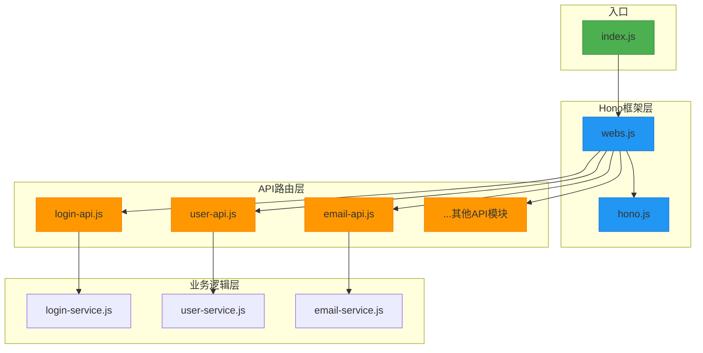
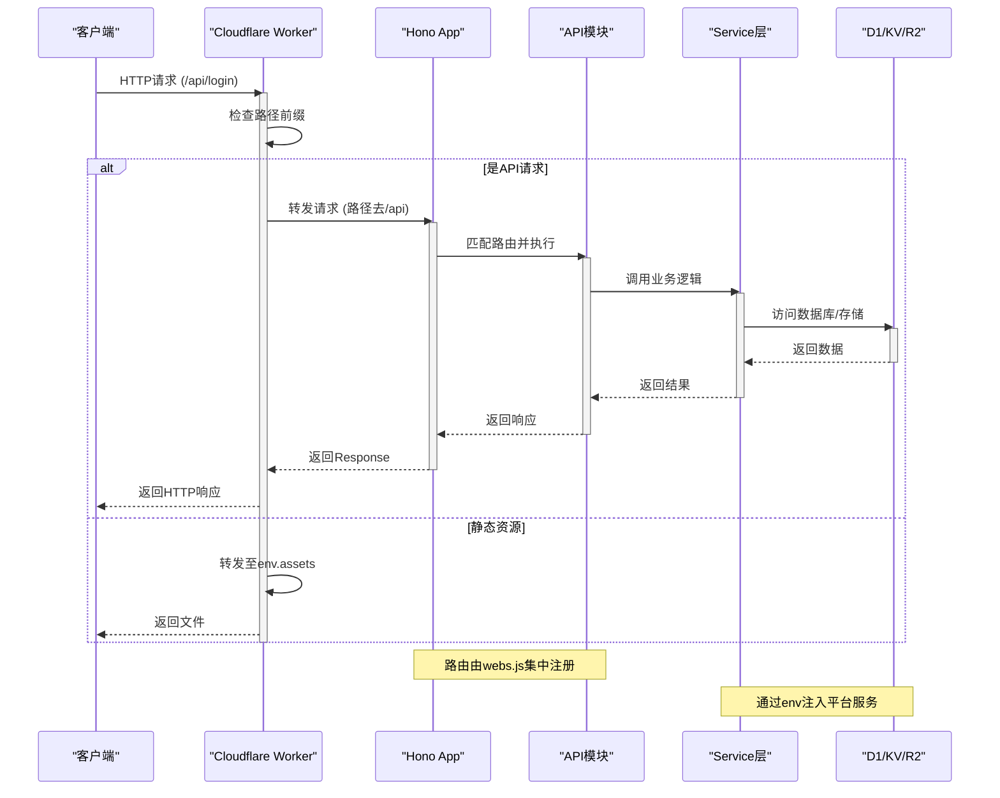
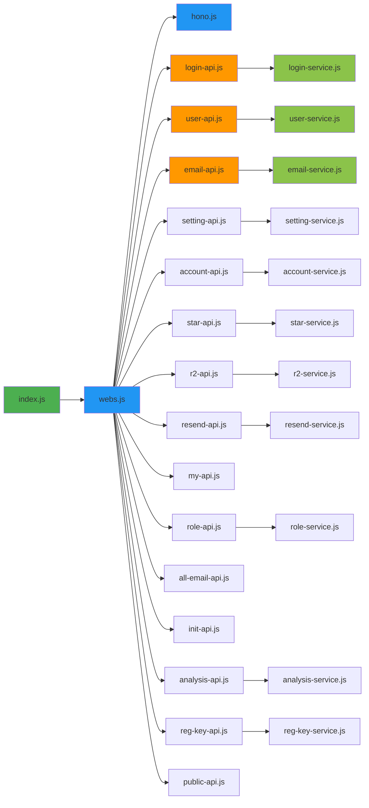

# Hono框架初始化

<cite>
**本文档引用文件**  
- [index.js](file://mail-worker/src/index.js)
- [hono.js](file://mail-worker/src/hono/hono.js)
- [webs.js](file://mail-worker/src/hono/webs.js)
- [login-api.js](file://mail-worker/src/api/login-api.js)
- [user-api.js](file://mail-worker/src/api/user-api.js)
- [package.json](file://mail-worker/package.json)
- [wrangler.toml](file://mail-worker/wrangler.toml)
</cite>

## 目录
1. [简介](#简介)
2. [项目结构](#项目结构)
3. [核心组件](#核心组件)
4. [架构概览](#架构概览)
5. [详细组件分析](#详细组件分析)
6. [依赖分析](#依赖分析)
7. [性能考虑](#性能考虑)
8. [故障排除指南](#故障排除指南)
9. [结论](#结论)

## 简介
本文档详细描述了基于Hono框架的Cloudflare Worker应用初始化流程。重点解析`index.js`作为入口如何启动应用，`hono.js`如何配置中间件与上下文环境，以及`webs.js`如何集中注册API路由模块，实现解耦与可维护性。同时说明Hono轻量级路由机制与Cloudflare平台服务（D1、KV、R2）的集成方式。

## 项目结构
`mail-worker`目录为Cloudflare Worker核心服务模块，采用分层结构组织代码：

- `src/`：源码主目录
  - `api/`：各功能模块的API路由定义
  - `hono/`：Hono框架初始化与路由聚合
  - `service/`：业务逻辑处理
  - `entity/`：数据模型定义
  - `utils/`：工具函数
  - `security/`：安全与上下文管理
- `wrangler.*.toml`：Cloudflare部署配置
- `package.json`：依赖声明

该结构实现了清晰的关注点分离，便于维护和扩展。

**图示来源**  
- [index.js](file://mail-worker/src/index.js#L1)
- [hono.js](file://mail-worker/src/hono/hono.js#L1)
- [webs.js](file://mail-worker/src/hono/webs.js#L1)
- [login-api.js](file://mail-worker/src/api/login-api.js#L1)
- [user-api.js](file://mail-worker/src/api/user-api.js#L1)

**本节来源**  
- [mail-worker/src](file://mail-worker/src)

## 核心组件

### 入口文件 index.js
作为Cloudflare Worker的入口点，`index.js`导出符合Worker规范的`fetch`处理器。它拦截以`/api/`开头的请求，剥离前缀后交由Hono应用处理；静态资源则通过`env.assets`转发至绑定的R2存储。

**本节来源**  
- [index.js](file://mail-worker/src/index.js#L1-L24)

### 框架配置 hono.js
`hono.js`创建Hono实例并配置全局中间件：
- 使用`cors()`启用跨域资源共享
- 定义全局错误处理器，捕获常见平台服务未绑定异常（如KV、D1），返回结构化错误响应
- 统一输出格式通过`result`模型封装

**本节来源**  
- [hono.js](file://mail-worker/src/hono/hono.js#L1-L33)

### 路由聚合 webs.js
`webs.js`是路由注册中心，其作用包括：
- 引入基础Hono实例
- 导入所有API模块（如`login-api`、`user-api`等），触发其内部路由注册
- 导出聚合后的应用实例供入口使用

此设计实现了路由的集中管理与模块解耦。

**本节来源**  
- [webs.js](file://mail-worker/src/hono/webs.js#L1-L21)

## 架构概览

**图示来源**  
- [index.js](file://mail-worker/src/index.js#L5-L15)
- [hono.js](file://mail-worker/src/hono/hono.js#L1)
- [webs.js](file://mail-worker/src/hono/webs.js#L1)
- [login-api.js](file://mail-worker/src/api/login-api.js#L1)

## 详细组件分析

### 请求生命周期管理
Hono通过中间件链统一管理请求生命周期：
1. **CORS中间件**：自动处理预检请求
2. **i18n中间件**：解析`Accept-Language`头，初始化国际化
3. **安全上下文**：`user-context`从JWT提取用户ID
4. **业务处理**：各API模块调用对应Service
5. **错误处理**：全局`onError`捕获异常并返回JSON

此机制确保了请求处理的一致性和健壮性。

**本节来源**  
- [hono.js](file://mail-worker/src/hono/hono.js#L5-L33)
- [i18n/i18n.js](file://mail-worker/src/i18n/i18n.js#L1-L29)
- [security/user-context.js](file://mail-worker/src/security/user-context.js)

### 环境变量与平台服务集成
Cloudflare平台服务通过`env`对象注入：
- `env.jwt_secret`：用于JWT签名验证
- `env.DB`：D1数据库绑定
- `env.KV`：KV命名空间绑定
- `env.R2`：R2存储桶绑定
- `env.assets`：静态资源服务

在`wrangler.toml`中配置这些绑定，运行时自动注入至`fetch`函数参数。代码中通过`c.env`访问，实现配置与代码分离。

**本节来源**  
- [index.js](file://mail-worker/src/index.js#L1)
- [jwt-utils.js](file://mail-worker/src/utils/jwt-utils.js#L15)
- [wrangler.toml](file://mail-worker/wrangler.toml)

## 依赖分析

**图示来源**  
- [index.js](file://mail-worker/src/index.js#L1)
- [webs.js](file://mail-worker/src/hono/webs.js#L1-L21)
- [package.json](file://mail-worker/package.json#L1)

**本节来源**  
- [package.json](file://mail-worker/package.json#L1-L28)

## 性能考虑
- **轻量级框架**：Hono专为边缘计算优化，启动快、内存占用低
- **按需加载**：API模块在`webs.js`中导入时才注册路由，避免不必要的初始化
- **平台原生集成**：直接使用Cloudflare的D1、KV、R2，延迟低
- **定时任务**：通过`scheduled`事件清理过期数据，避免阻塞主请求流

## 故障排除指南
### 常见配置问题
1. **KV/D1/R2未绑定**
   - 现象：返回"数据库未绑定"错误
   - 解决：检查`wrangler.toml`中`kv_namespaces`、`d1_databases`、`r2_buckets`配置，并确保在`index.js`中正确引用`env`名称

2. **JWT签名失败**
   - 现象：登录返回500错误
   - 解决：确认`env.jwt_secret`已设置且长度足够（建议32字符以上）

3. **路由404**
   - 现象：API请求返回404
   - 解决：检查`webs.js`是否导入了对应API模块，确认路径前缀处理逻辑

4. **CORS失败**
   - 现象：浏览器报跨域错误
   - 解决：Hono的`cors()`中间件默认允许所有来源，若有限制需在`hono.js`中配置选项

**本节来源**  
- [hono.js](file://mail-worker/src/hono/hono.js#L10-L30)
- [wrangler.toml](file://mail-worker/wrangler.toml)
- [index.js](file://mail-worker/src/index.js#L1)

## 结论
本项目通过`index.js`作为入口，`hono.js`进行框架配置，`webs.js`集中注册路由，构建了一个结构清晰、易于维护的Cloudflare Worker应用。Hono框架的轻量级特性和中间件机制，结合Cloudflare平台服务，实现了高性能、高可用的边缘计算服务。合理的分层设计和错误处理策略，为后续功能扩展提供了坚实基础。