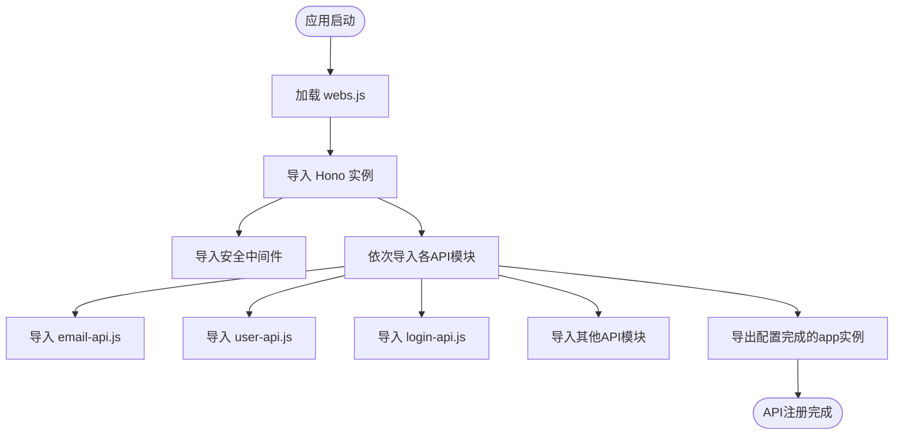
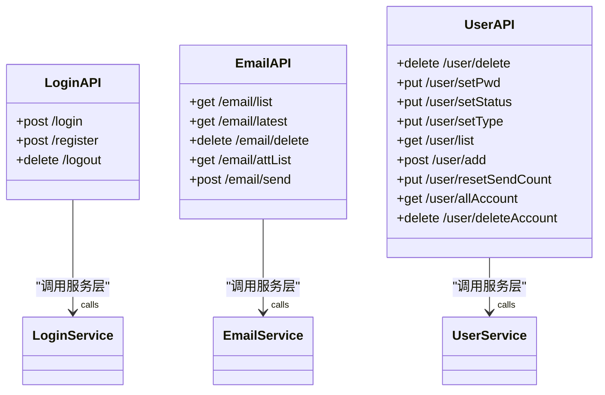
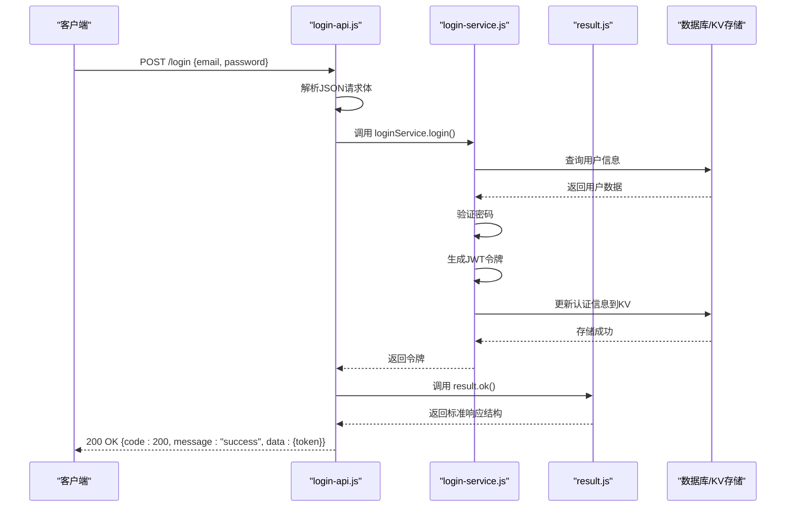
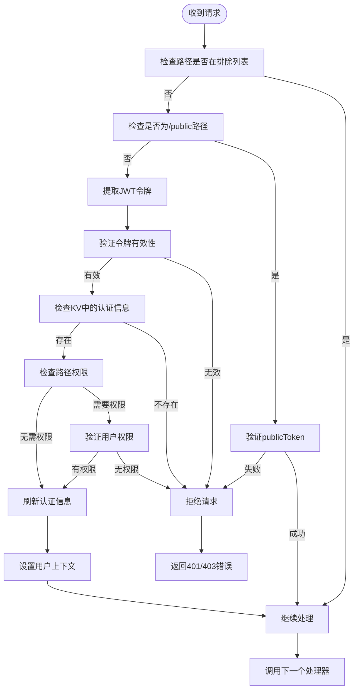
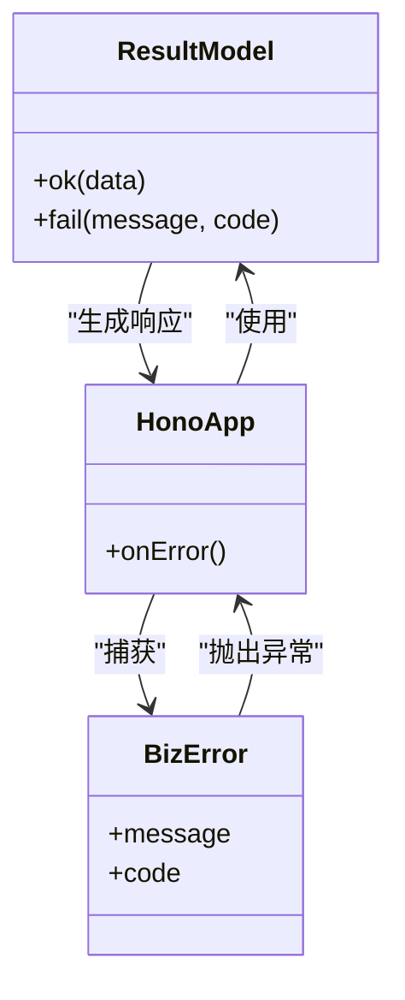
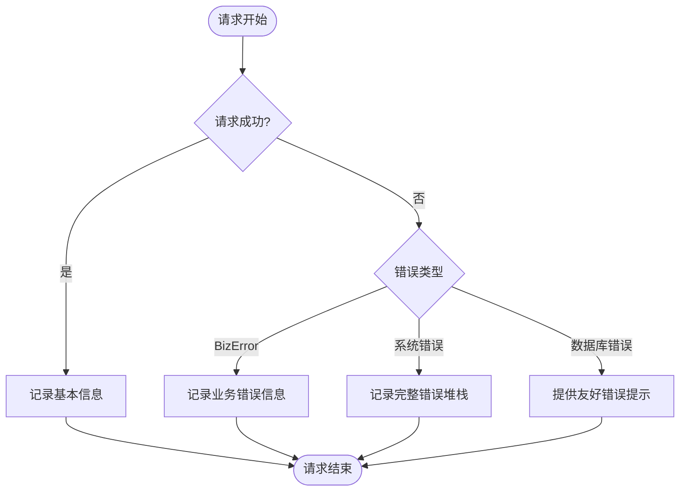

# API层设计

<cite>
**本文档引用的文件**
- [webs.js](file://mail-worker/src/hono/webs.js)
- [hono.js](file://mail-worker/src/hono/hono.js)
- [login-api.js](file://mail-worker/src/api/login-api.js)
- [email-api.js](file://mail-worker/src/api/email-api.js)
- [user-api.js](file://mail-worker/src/api/user-api.js)
- [security.js](file://mail-worker/src/security/security.js)
- [result.js](file://mail-worker/src/model/result.js)
- [login-service.js](file://mail-worker/src/service/login-service.js)
- [index.js](file://mail-worker/src/index.js)
</cite>

## 目录
1. [简介](#简介)
2. [项目结构与API注册机制](#项目结构与api注册机制)
3. [核心API模块职责分析](#核心api模块职责分析)
4. [API请求处理流程详解](#api请求处理流程详解)
5. [中间件与安全机制](#中间件与安全机制)
6. [错误处理与响应标准化](#错误处理与响应标准化)
7. [日志与监控机制](#日志与监控机制)
8. [新增API端点指南](#新增api端点指南)
9. [总结](#总结)

## 简介
本文档详细说明cloud-mail后端API层的设计与实现机制。系统基于Hono框架构建，采用模块化API注册方式，通过`webs.js`集中注册各功能模块的接口。文档将深入解析API路由注册机制、各API文件职责划分、请求处理流程、中间件使用、错误处理及响应标准化策略，并提供新增API端点的具体指导。

## 项目结构与API注册机制

cloud-mail的API层采用集中式注册模式，所有API模块通过`webs.js`统一加载。该机制确保了API路由的可维护性和扩展性。



**Diagram sources**
- [webs.js](file://mail-worker/src/hono/webs.js#L1-L22)

**Section sources**
- [webs.js](file://mail-worker/src/hono/webs.js#L1-L22)
- [hono.js](file://mail-worker/src/hono/hono.js#L1-L34)

## 核心API模块职责分析

### email-api.js 模块
负责邮件相关操作的API接口，包括邮件列表获取、最新邮件查询、附件管理及邮件发送等功能。

**Section sources**
- [email-api.js](file://mail-worker/src/api/email-api.js#L1-L32)

### user-api.js 模块
处理用户管理相关的API接口，包括用户增删改查、密码重置、状态设置、账户管理等操作。

**Section sources**
- [user-api.js](file://mail-worker/src/api/user-api.js#L1-L58)

### login-api.js 模块
实现用户认证相关功能，包括登录、注册、登出等核心身份验证操作。



**Diagram sources**
- [login-api.js](file://mail-worker/src/api/login-api.js#L1-L21)
- [email-api.js](file://mail-worker/src/api/email-api.js#L1-L32)
- [user-api.js](file://mail-worker/src/api/user-api.js#L1-L58)

## API请求处理流程详解

以用户登录API为例，展示完整的请求处理流程：



**Diagram sources**
- [login-api.js](file://mail-worker/src/api/login-api.js#L5-L8)
- [login-service.js](file://mail-worker/src/service/login-service.js#L150-L200)
- [result.js](file://mail-worker/src/model/result.js#L1-L10)

**Section sources**
- [login-api.js](file://mail-worker/src/api/login-api.js#L5-L8)
- [login-service.js](file://mail-worker/src/service/login-service.js#L150-L200)

## 中间件与安全机制

系统通过`security.js`实现了全面的安全中间件，包含身份认证、权限控制和请求过滤等功能。



**Diagram sources**
- [security.js](file://mail-worker/src/security/security.js#L1-L173)

**Section sources**
- [security.js](file://mail-worker/src/security/security.js#L1-L173)

## 错误处理与响应标准化

系统通过统一的错误处理机制和响应格式，确保API返回的一致性和可预测性。

### 标准化响应结构
```json
{
  "code": 200,
  "message": "success",
  "data": {}
}
```

### 错误响应结构
```json
{
  "code": 500,
  "message": "错误信息"
}
```



**Diagram sources**
- [result.js](file://mail-worker/src/model/result.js#L1-L10)
- [hono.js](file://mail-worker/src/hono/hono.js#L10-L30)

**Section sources**
- [result.js](file://mail-worker/src/model/result.js#L1-L10)
- [hono.js](file://mail-worker/src/hono/hono.js#L10-L30)

## 日志与监控机制

系统在关键节点实现了日志记录和监控功能，便于问题排查和系统维护。

### 请求日志记录
- 成功请求：记录基本信息
- 错误请求：详细记录错误信息
- 特殊错误：针对数据库绑定等关键错误提供友好提示



**Section sources**
- [hono.js](file://mail-worker/src/hono/hono.js#L10-L30)

## 新增API端点指南

### 添加新API的步骤
1. 创建新的API文件（如`new-feature-api.js`）
2. 导入Hono实例、服务层和结果模型
3. 定义路由和HTTP方法
4. 实现请求处理逻辑
5. 在`webs.js`中导入新API模块

### 示例代码结构
```javascript
import app from '../hono/hono';
import newService from '../service/new-service';
import result from '../model/result';
import userContext from '../security/user-context';

app.get('/new-feature/list', async (c) => {
    const data = await newService.list(c, c.req.query(), userContext.getUserId(c));
    return c.json(result.ok(data));
});

app.post('/new-feature/create', async (c) => {
    const item = await newService.create(c, await c.req.json(), userContext.getUserId(c));
    return c.json(result.ok(item));
});
```

**Section sources**
- [webs.js](file://mail-worker/src/hono/webs.js#L1-L22)
- [login-api.js](file://mail-worker/src/api/login-api.js#L1-L21)

## 总结
cloud-mail的API层设计体现了清晰的分层架构和模块化思想。通过Hono框架的路由机制，结合`webs.js`的集中注册模式，实现了API接口的高效管理和维护。系统具备完善的中间件安全机制、标准化的响应格式和健壮的错误处理能力，为前端应用提供了稳定可靠的后端服务支持。新增API端点的流程简单明了，有利于系统的持续扩展和迭代开发。