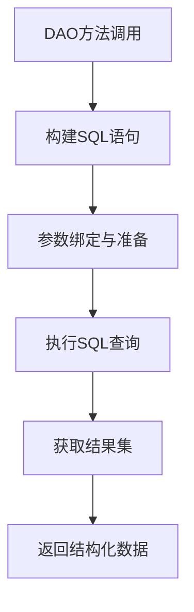
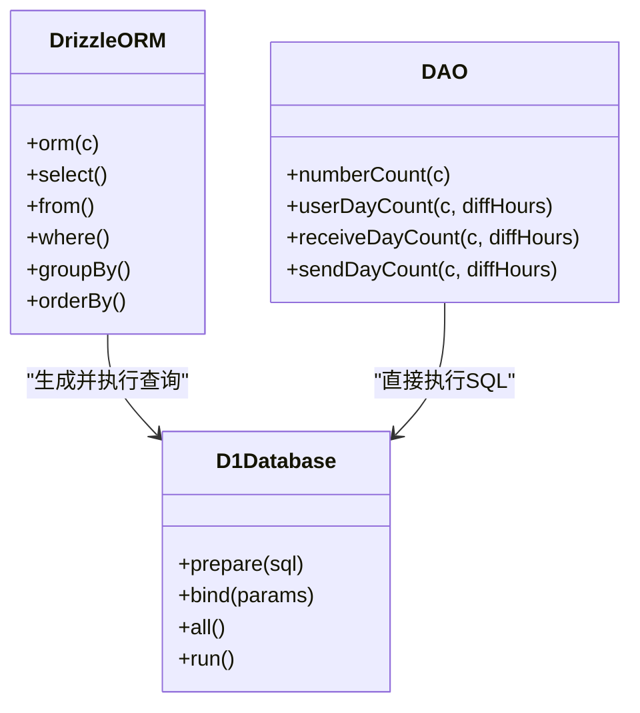
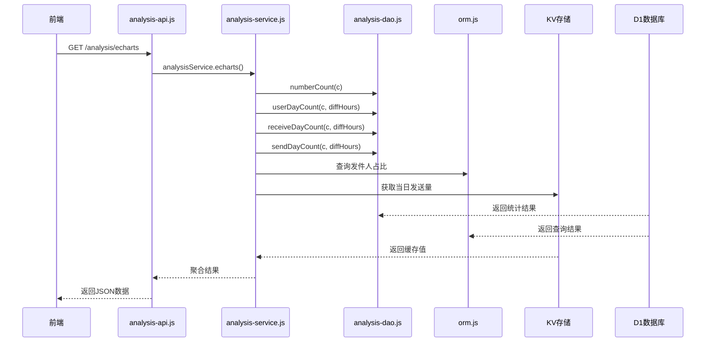
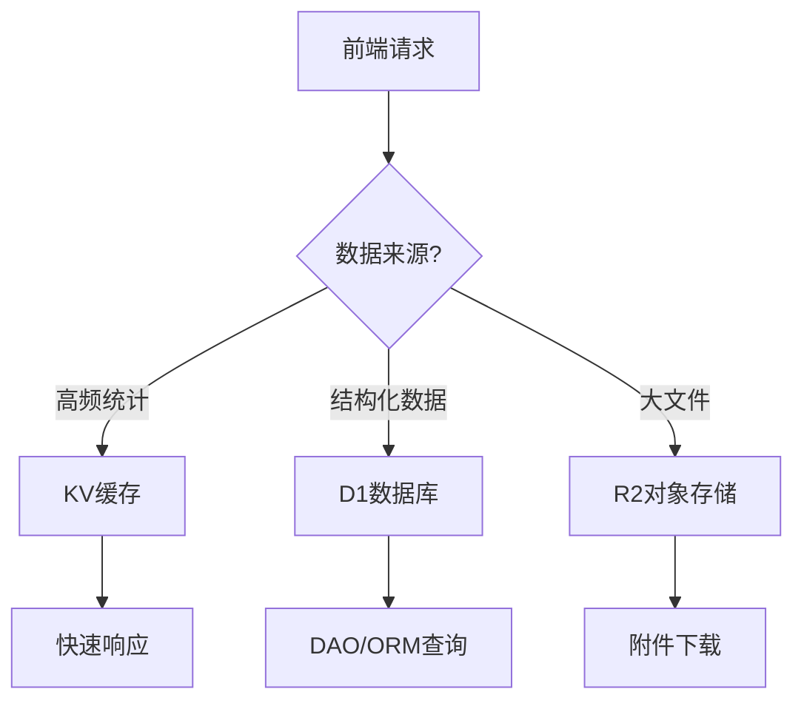

# DAO与数据访问层

<cite>
**本文档引用的文件**
- [analysis-dao.js](file://mail-worker/src/dao/analysis-dao.js)
- [orm.js](file://mail-worker/src/entity/orm.js)
- [analysis-service.js](file://mail-worker/src/service/analysis-service.js)
- [email.js](file://mail-worker/src/entity/email.js)
- [user.js](file://mail-worker/src/entity/user.js)
- [account.js](file://mail-worker/src/entity/account.js)
- [kv-const.js](file://mail-worker/src/const/kv-const.js)
</cite>

## 目录
1. [DAO层设计与作用](#dao层设计与作用)
2. [analysis-dao.js中的SQL操作封装](#analysis-daojs中的sql操作封装)
3. [DAO与Drizzle ORM的协作关系](#dao与drizzle-orm的协作关系)
4. [SQL语句构造与参数绑定](#sql语句构造与参数绑定)
5. [结果映射与数据处理](#结果映射与数据处理)
6. [邮件分析数据统计的数据流示例](#邮件分析数据统计的数据流示例)
7. [KV缓存与R2对象存储的辅助角色](#kv缓存与r2对象存储的辅助角色)

## DAO层设计与作用

数据访问对象（DAO）层是应用程序与数据库之间的桥梁，负责封装对数据库的原始操作。在本项目中，DAO层通过直接编写SQL语句实现高效的数据查询与写入，同时将复杂的数据库操作逻辑从服务层中解耦，提升代码的可维护性与性能。

DAO层的核心职责包括：
- 执行原始SQL查询与更新
- 处理数据库连接与事务
- 封装常见的CRUD操作
- 提供针对特定业务场景的优化查询

**Section sources**
- [analysis-dao.js](file://mail-worker/src/dao/analysis-dao.js#L1-L104)

## analysis-dao.js中的SQL操作封装

`analysis-dao.js` 文件实现了对D1数据库的原始SQL操作封装，专注于邮件系统中的统计分析功能。该文件通过Cloudflare Workers环境下的`c.env.db.prepare()`方法构建并执行SQL语句，确保了与D1数据库的高效交互。

主要方法包括：
- `numberCount(c)`：统计系统中用户、账户、邮件的总数及状态分布
- `userDayCount(c, diffHours)`：按天统计用户注册数量
- `receiveDayCount(c, diffHours)`：按天统计接收邮件数量
- `sendDayCount(c, diffHours)`：按天统计发送邮件数量

这些方法均使用SQL聚合函数（如`COUNT`、`SUM`、`CASE WHEN`）进行复杂的数据计算，并通过`COALESCE`确保空值处理的安全性。



**Diagram sources**
- [analysis-dao.js](file://mail-worker/src/dao/analysis-dao.js#L1-L104)

**Section sources**
- [analysis-dao.js](file://mail-worker/src/dao/analysis-dao.js#L1-L104)

## DAO与Drizzle ORM的协作关系

在本项目中，DAO层与Drizzle ORM形成互补关系：
- **Drizzle ORM**：负责数据库模式定义、类型安全与基本的CRUD操作，适用于简单的查询和实体映射
- **DAO层**：负责复杂查询、性能优化与批量数据处理，直接操作SQL以实现更高的灵活性与效率

例如，在`analysis-service.js`中，`numberCount`等统计操作由DAO层完成，而如`nameRatio`这类需要类型安全和条件过滤的查询则通过Drizzle ORM实现。

这种分工使得系统既能享受ORM带来的开发便利，又能通过DAO实现关键路径上的性能优化。



**Diagram sources**
- [orm.js](file://mail-worker/src/entity/orm.js#L1-L5)
- [analysis-dao.js](file://mail-worker/src/dao/analysis-dao.js#L1-L104)

**Section sources**
- [orm.js](file://mail-worker/src/entity/orm.js#L1-L5)
- [analysis-dao.js](file://mail-worker/src/dao/analysis-dao.js#L1-L104)

## SQL语句构造与参数绑定

`analysis-dao.js`中的SQL语句采用模板字符串构造，支持动态参数注入。例如，在`userDayCount`方法中，`diffHours`参数通过字符串插值方式嵌入SQL语句，用于调整时区偏移：

```sql
DATE(create_time,'+${diffHours} hours')
```

此方式允许根据客户端时区动态调整日期计算逻辑，确保统计数据的准确性。尽管使用了字符串拼接，但由于`diffHours`为数值型参数且来自可信上下文，因此不会引入SQL注入风险。

此外，所有查询均使用`.all()`方法获取结果集，返回标准化的`{ results }`对象，便于后续处理。

**Section sources**
- [analysis-dao.js](file://mail-worker/src/dao/analysis-dao.js#L48-L104)

## 结果映射与数据处理

DAO层返回的结果为原始SQL查询结果，通常为对象数组。服务层负责进一步的数据处理与映射。例如，`analysis-service.js`中的`filterEmptyDay`方法会补全过去15天中缺失的日期数据，确保前端图表显示连续的时间序列。

结果映射过程包括：
- 将SQL结果转换为业务对象
- 补全缺失的时间点
- 转换数据类型（如字符串转数字）
- 聚合多源数据（DAO + KV + ORM）

**Section sources**
- [analysis-service.js](file://mail-worker/src/service/analysis-service.js#L50-L90)

## 邮件分析数据统计的数据流示例

以获取邮件分析图表数据为例，完整数据流如下：

1. 前端调用 `/analysis/echarts` API
2. `analysis-api.js` 调用 `analysisService.echarts(c, params)`
3. 服务层并行执行多个数据源查询：
   - DAO层：`numberCount`, `userDayCount`, `receiveDayCount`, `sendDayCount`
   - ORM层：`nameRatio`（发件人占比）
   - KV存储：当日发送总量
4. 服务层聚合并处理数据，补全空缺日期
5. 返回统一结构的分析结果



**Diagram sources**
- [analysis-api.js](file://mail-worker/src/api/analysis-api.js#L1-L7)
- [analysis-service.js](file://mail-worker/src/service/analysis-service.js#L1-L90)
- [analysis-dao.js](file://mail-worker/src/dao/analysis-dao.js#L1-L104)

**Section sources**
- [analysis-api.js](file://mail-worker/src/api/analysis-api.js#L1-L7)
- [analysis-service.js](file://mail-worker/src/service/analysis-service.js#L1-L90)

## KV缓存与R2对象存储的辅助角色

除了D1数据库外，系统还利用KV和R2进行高效数据访问：
- **KV缓存**：用于存储高频读取、低频更新的数据，如每日发送总量（`SEND_DAY_COUNT`），减少数据库压力
- **R2对象存储**：用于存储邮件附件等大文件，避免占用数据库空间

在`analysis-service.js`中，通过`c.env.kv.get()`直接读取KV中的计数，显著提升响应速度。KV的键由常量`SEND_DAY_COUNT`与日期拼接而成，确保数据按天隔离。



**Diagram sources**
- [kv-const.js](file://mail-worker/src/const/kv-const.js#L1-L8)
- [analysis-service.js](file://mail-worker/src/service/analysis-service.js#L49-L50)

**Section sources**
- [kv-const.js](file://mail-worker/src/const/kv-const.js#L1-L8)
- [analysis-service.js](file://mail-worker/src/service/analysis-service.js#L49-L50)