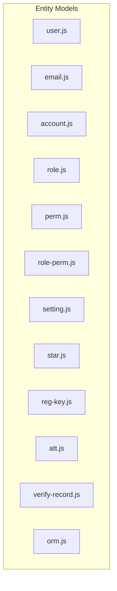
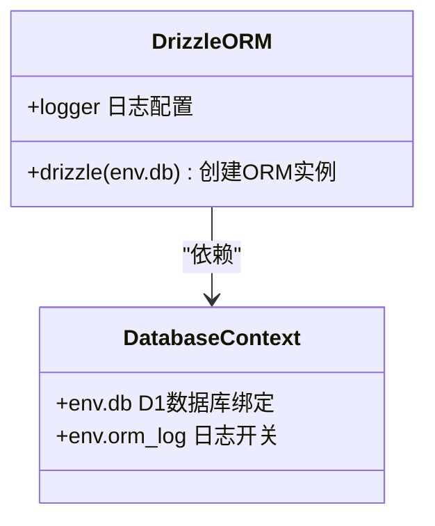
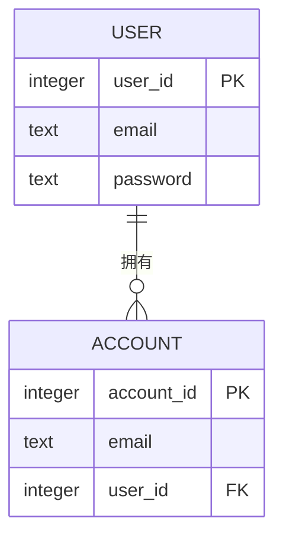
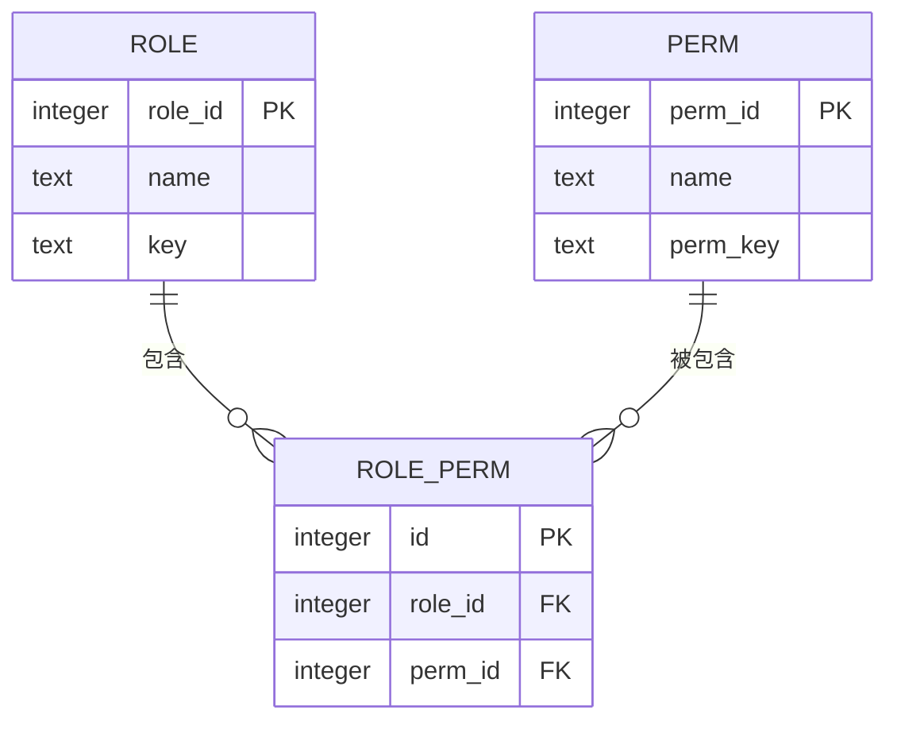

# Entity模型层

<cite>
**本文档中引用的文件**
- [user.js](file://mail-worker/src/entity/user.js)
- [email.js](file://mail-worker/src/entity/email.js)
- [orm.js](file://mail-worker/src/entity/orm.js)
- [account.js](file://mail-worker/src/entity/account.js)
- [role.js](file://mail-worker/src/entity/role.js)
- [perm.js](file://mail-worker/src/entity/perm.js)
- [role-perm.js](file://mail-worker/src/entity/role-perm.js)
- [setting.js](file://mail-worker/src/entity/setting.js)
- [star.js](file://mail-worker/src/entity/star.js)
- [reg-key.js](file://mail-worker/src/entity/reg-key.js)
- [att.js](file://mail-worker/src/entity/att.js)
- [verify-record.js](file://mail-worker/src/entity/verify-record.js)
</cite>

## 目录
1. [简介](#简介)
2. [项目结构](#项目结构)
3. [核心实体定义](#核心实体定义)
4. [ORM配置与数据库映射](#orm配置与数据库映射)
5. [实体间关联关系](#实体间关联关系)
6. [类型安全的数据操作接口](#类型安全的数据操作接口)
7. [迁移脚本中的使用方式](#迁移脚本中的使用方式)
8. [最佳实践示例](#最佳实践示例)
9. [结论](#结论)

## 简介
本文档全面介绍`cloud-mail`项目中Entity模型层的设计与实现。该层基于Drizzle ORM构建，负责定义所有数据实体结构及其与D1数据库表的映射关系。文档详细说明了各JS文件如何定义实体字段、约束和索引，并阐述了实体间的关联关系及在服务层中的类型安全访问机制。

## 项目结构
Entity模型层位于`mail-worker/src/entity`目录下，采用模块化设计，每个实体对应一个独立的JS文件。整体结构清晰，职责分明，便于维护和扩展。



**Diagram sources**
- [user.js](file://mail-worker/src/entity/user.js#L1-L22)
- [email.js](file://mail-worker/src/entity/email.js#L1-L27)
- [account.js](file://mail-worker/src/entity/account.js#L1-L13)
- [role.js](file://mail-worker/src/entity/role.js#L1-L19)
- [perm.js](file://mail-worker/src/entity/perm.js#L1-L10)
- [role-perm.js](file://mail-worker/src/entity/role-perm.js#L1-L7)
- [setting.js](file://mail-worker/src/entity/setting.js#L1-L44)
- [star.js](file://mail-worker/src/entity/star.js#L1-L11)
- [reg-key.js](file://mail-worker/src/entity/reg-key.js#L1-L12)
- [att.js](file://mail-worker/src/entity/att.js#L1-L21)
- [verify-record.js](file://mail-worker/src/entity/verify-record.js#L1-L10)

**Section sources**
- [user.js](file://mail-worker/src/entity/user.js#L1-L22)
- [email.js](file://mail-worker/src/entity/email.js#L1-L27)

## 核心实体定义
各实体文件通过Drizzle ORM的`sqliteTable`函数定义数据库表结构，包含字段类型、默认值、非空约束等元信息。

### 用户实体 (user.js)
定义系统用户的基本信息，包括登录凭证、状态、设备信息等。

**Section sources**
- [user.js](file://mail-worker/src/entity/user.js#L2-L20)

### 邮件实体 (email.js)
描述邮件的核心属性，如发件人、收件人、主题、内容、状态等，支持抄送、密送和附件关联。

**Section sources**
- [email.js](file://mail-worker/src/entity/email.js#L2-L25)

### 账户实体 (account.js)
表示用户的邮箱账户，关联到具体用户，记录账户状态和最新邮件时间。

**Section sources**
- [account.js](file://mail-worker/src/entity/account.js#L2-L11)

## ORM配置与数据库映射
`orm.js`文件封装了Drizzle ORM实例的创建逻辑，为整个应用提供统一的数据库访问接口。



**Diagram sources**
- [orm.js](file://mail-worker/src/entity/orm.js#L1-L5)

**Section sources**
- [orm.js](file://mail-worker/src/entity/orm.js#L1-L5)

## 实体间关联关系
模型层通过外键和中间表实现复杂的业务关系建模。

### 一对多关系：用户与账户
一个用户可拥有多个邮箱账户，通过`userId`字段建立关联。



**Diagram sources**
- [user.js](file://mail-worker/src/entity/user.js#L2-L20)
- [account.js](file://mail-worker/src/entity/account.js#L2-L11)

### 多对多关系：角色与权限
通过`role_perm`中间表实现角色与权限的多对多映射。



**Diagram sources**
- [role.js](file://mail-worker/src/entity/role.js#L2-L17)
- [perm.js](file://mail-worker/src/entity/perm.js#L1-L8)
- [role-perm.js](file://mail-worker/src/entity/role-perm.js#L1-L5)

**Section sources**
- [role.js](file://mail-worker/src/entity/role.js#L2-L17)
- [perm.js](file://mail-worker/src/entity/perm.js#L1-L8)
- [role-perm.js](file://mail-worker/src/entity/role-perm.js#L1-L5)

## 类型安全的数据操作接口
实体定义为Service层提供了静态类型的数据库操作基础。通过Drizzle ORM的类型推导能力，确保查询、插入、更新操作的字段安全性。

例如，在`userService`中操作`user`实体时，所有字段名和类型均受TS编译时检查保护，避免运行时错误。

**Section sources**
- [user.js](file://mail-worker/src/entity/user.js#L2-L20)
- [email.js](file://mail-worker/src/entity/email.js#L2-L25)

## 迁移脚本中的使用方式
实体定义直接用于数据库迁移脚本生成。Drizzle CLI可通过读取这些表结构自动生成SQL迁移文件，确保开发、测试、生产环境的一致性。

迁移流程：
1. 修改实体定义
2. 生成迁移diff
3. 执行迁移脚本
4. 验证数据库结构

**Section sources**
- [user.js](file://mail-worker/src/entity/user.js#L2-L20)
- [email.js](file://mail-worker/src/entity/email.js#L2-L25)
- [orm.js](file://mail-worker/src/entity/orm.js#L1-L5)

## 最佳实践示例
以下是定义新实体的标准模板：

```javascript
import { sqliteTable, text, integer } from 'drizzle-orm/sqlite-core';
import { sql } from 'drizzle-orm';

export const newEntity = sqliteTable('new_entity', {
	id: integer('id').primaryKey({ autoIncrement: true }),
	name: text('name').notNull(),
	createdAt: text('create_time').default(sql`CURRENT_TIMESTAMP`).notNull(),
	// 其他字段...
});

export default newEntity;
```

关键要点：
- 使用明确的命名规范（驼峰式JS变量，下划线式数据库列）
- 合理设置默认值和约束
- 时间字段统一使用`text`类型存储ISO字符串
- 外键关系通过整数ID实现

**Section sources**
- [user.js](file://mail-worker/src/entity/user.js#L2-L20)
- [email.js](file://mail-worker/src/entity/email.js#L2-L25)
- [orm.js](file://mail-worker/src/entity/orm.js#L1-L5)

## 结论
Entity模型层作为`cloud-mail`系统的数据基石，通过Drizzle ORM实现了类型安全、结构清晰、易于维护的数据访问层。其模块化设计和标准化实践为系统的可扩展性和稳定性提供了有力保障。建议后续开发严格遵循现有模式，确保代码一致性。