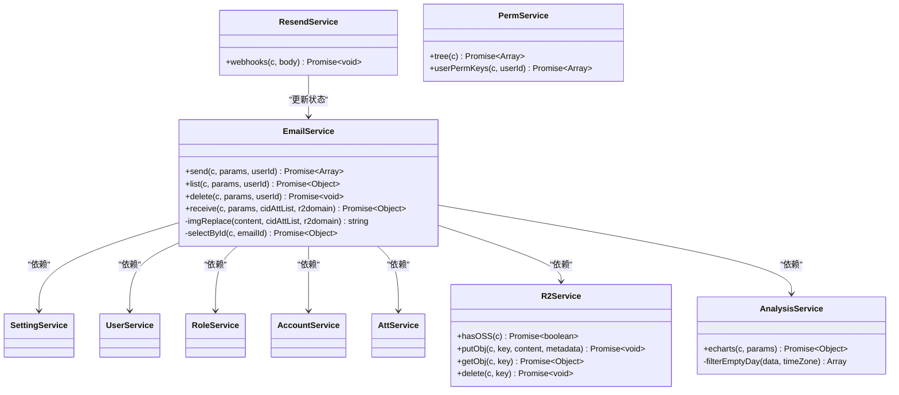

# Service层设计

<cite>
**本文档引用的文件**
- [email-service.js](file://mail-worker/src/service/email-service.js)
- [resend-service.js](file://mail-worker/src/service/resend-service.js)
- [r2-service.js](file://mail-worker/src/service/r2-service.js)
- [analysis-service.js](file://mail-worker/src/service/analysis-service.js)
- [perm-service.js](file://mail-worker/src/service/perm-service.js)
</cite>

## 目录
1. [引言](#引言)
2. [核心业务流程分析](#核心业务流程分析)
3. [服务间调用关系](#服务间调用关系)
4. [事务管理与数据一致性](#事务管理与数据一致性)
5. [权限校验机制](#权限校验机制)
6. [异常处理策略](#异常处理策略)
7. [业务参数校验逻辑](#业务参数校验逻辑)
8. [典型服务方法实现规范](#典型服务方法实现规范)
9. [总结](#总结)

## 引言
Service业务逻辑层是系统的核心执行单元，负责协调多个数据实体与外部服务完成复杂业务操作。本文档以发送邮件流程为例，深入解析该层的设计与实现，涵盖事务管理、服务调用、异常处理等关键机制。

## 核心业务流程分析

邮件发送流程是系统中最复杂的业务场景之一，涉及多个服务的协同工作。当用户发起邮件发送请求时，`email-service.js`作为主协调者，依次调用多个服务完成完整流程。

流程主要包含以下步骤：
1. 参数校验与权限验证
2. 附件处理与资源上传
3. 邮件内容构建与发送
4. 统计信息记录与状态更新

该流程体现了Service层作为业务规则执行者的核心角色，通过协调不同服务完成端到端的业务操作。

**Section sources**
- [email-service.js](file://mail-worker/src/service/email-service.js#L200-L600)

## 服务间调用关系

**Diagram sources**
- [email-service.js](file://mail-worker/src/service/email-service.js#L200-L600)
- [resend-service.js](file://mail-worker/src/service/resend-service.js#L1-L47)
- [r2-service.js](file://mail-worker/src/service/r2-service.js#L1-L54)
- [analysis-service.js](file://mail-worker/src/service/analysis-service.js#L1-L91)

## 事务管理与数据一致性

系统采用分阶段事务管理策略确保数据一致性。在邮件发送过程中，关键数据操作通过数据库事务保证原子性，而外部服务调用则采用补偿机制处理失败情况。

主要事务边界包括：
- 用户发送计数更新与邮件记录插入的原子性保证
- 附件元数据与实际文件存储的一致性维护
- KV存储中的每日发送统计与数据库记录的同步

对于外部服务调用（如Resend API），系统通过webhooks机制实现最终一致性，由`resend-service.js`接收状态回调并更新本地邮件状态。

**Diagram sources**
- [email-service.js](file://mail-worker/src/service/email-service.js#L300-L500)
- [resend-service.js](file://mail-worker/src/service/resend-service.js#L1-L47)
- [r2-service.js](file://mail-worker/src/service/r2-service.js#L1-L54)

## 权限校验机制

权限校验通过`perm-service.js`与角色系统集成实现，采用基于角色的访问控制（RBAC）模型。权限验证贯穿整个业务流程，确保操作的安全性。

主要权限校验点包括：
- 发送功能是否启用的全局配置检查
- 用户角色的发送权限验证
- 域名发送权限的细粒度控制
- 管理员特殊权限的例外处理

**Diagram sources**
- [email-service.js](file://mail-worker/src/service/email-service.js#L250-L300)
- [perm-service.js](file://mail-worker/src/service/perm-service.js#L1-L38)

## 异常处理策略

系统采用分层异常处理机制，通过`BizError`类统一管理业务异常。所有异常都包含明确的错误码和本地化消息，便于前端展示和问题定位。

关键异常处理模式包括：
- 参数校验异常：对输入参数进行严格验证
- 权限异常：403状态码标识权限不足
- 外部服务调用异常：封装API错误信息
- 数据一致性异常：处理数据库操作失败

异常处理遵循fail-fast原则，在流程早期进行验证，避免资源浪费。

**Section sources**
- [email-service.js](file://mail-worker/src/service/email-service.js#L200-L600)
- [biz-error.js](file://mail-worker/src/error/biz-error.js#L1-L9)

## 业务参数校验逻辑

业务参数校验在`email-service.js`中实现，采用防御性编程原则确保数据质量。校验逻辑分为多个层次：

1. **基础参数校验**：检查必填字段和数据类型
2. **业务规则校验**：验证发送配额、附件限制等
3. **安全校验**：防止越权访问和非法操作
4. **外部依赖校验**：确认服务可用性和配置完整性

校验过程采用短路求值策略，按优先级顺序执行，确保性能最优。

**Section sources**
- [email-service.js](file://mail-worker/src/service/email-service.js#L200-L350)

## 典型服务方法实现规范

**Diagram sources**
- [email-service.js](file://mail-worker/src/service/email-service.js#L1-L667)
- [resend-service.js](file://mail-worker/src/service/resend-service.js#L1-L47)
- [r2-service.js](file://mail-worker/src/service/r2-service.js#L1-L54)
- [analysis-service.js](file://mail-worker/src/service/analysis-service.js#L1-L91)
- [perm-service.js](file://mail-worker/src/service/perm-service.js#L1-L38)

## 总结
Service业务逻辑层通过精心设计的服务协作模式，实现了复杂业务流程的可靠执行。各服务职责清晰，通过明确的接口契约进行通信，形成了高内聚、低耦合的架构体系。权限校验、异常处理和事务管理等横切关注点的统一实现，确保了系统的安全性和稳定性。