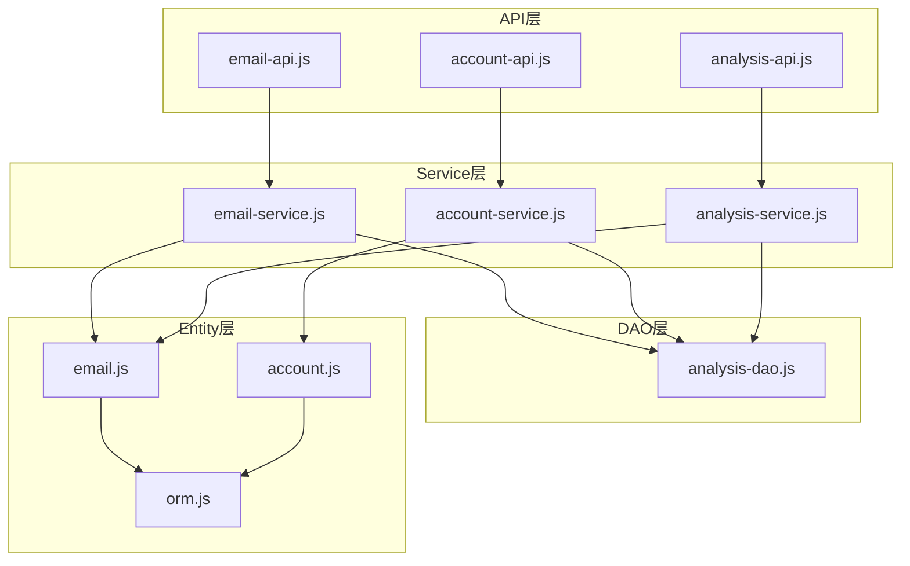
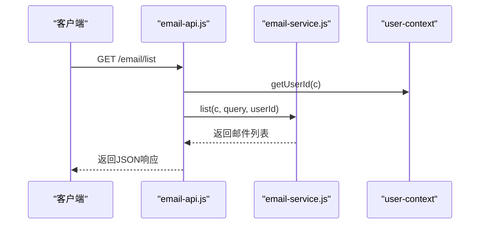
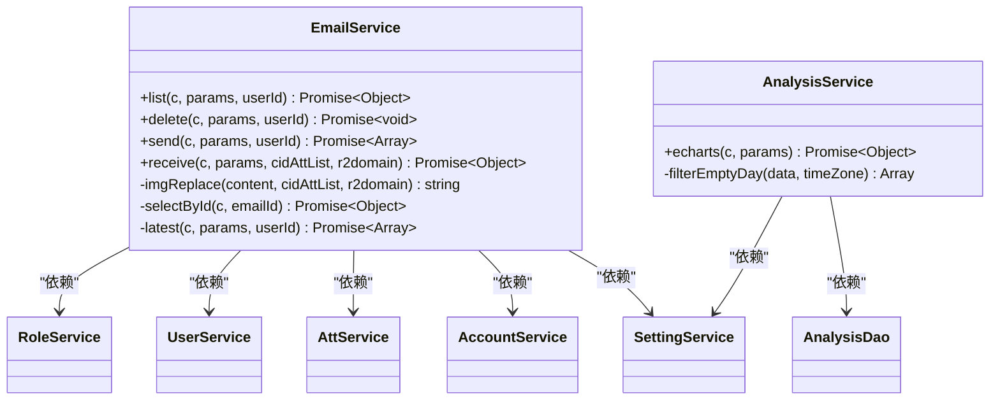
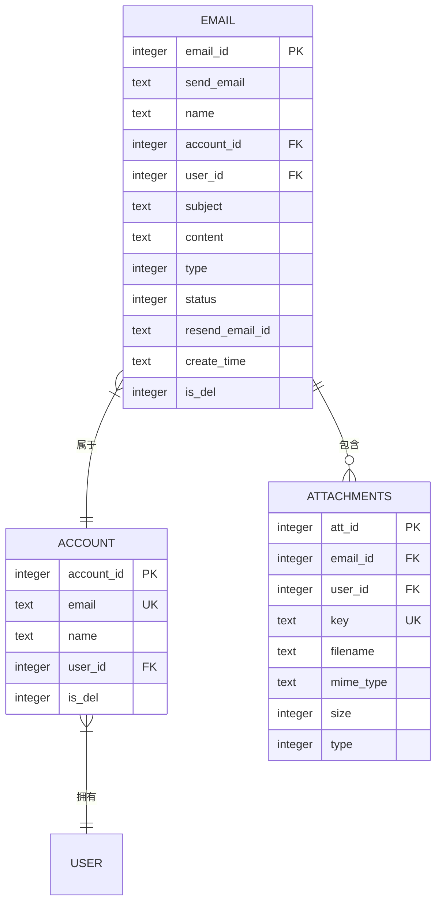
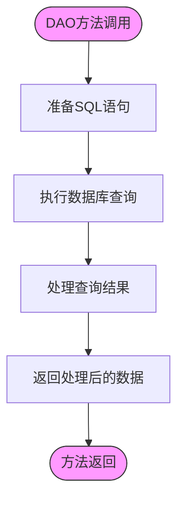
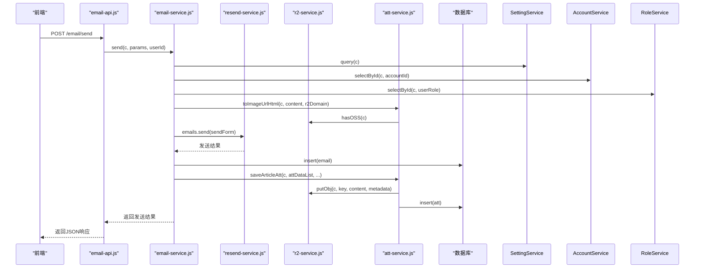
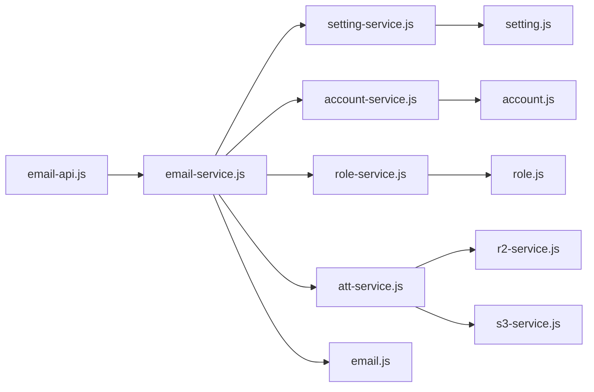

# 分层架构设计

<cite>
**本文档引用的文件**  
- [email-api.js](file://mail-worker/src/api/email-api.js)
- [email-service.js](file://mail-worker/src/service/email-service.js)
- [analysis-dao.js](file://mail-worker/src/dao/analysis-dao.js)
- [email.js](file://mail-worker/src/entity/email.js)
- [orm.js](file://mail-worker/src/entity/orm.js)
- [r2-service.js](file://mail-worker/src/service/r2-service.js)
- [resend-service.js](file://mail-worker/src/service/resend-service.js)
- [analysis-service.js](file://mail-worker/src/service/analysis-service.js)
</cite>

## 目录
1. [简介](#简介)
2. [项目结构概览](#项目结构概览)
3. [核心分层架构](#核心分层架构)
4. [API层分析](#api层分析)
5. [Service层分析](#service层分析)
6. [DAO与Entity层分析](#dao与entity层分析)
7. [跨层调用链示例](#跨层调用链示例)
8. [依赖关系与通信机制](#依赖关系与通信机制)
9. [高内聚低耦合设计原则](#高内聚低耦合设计原则)
10. [总结](#总结)

## 简介
本文件深入解析cloud-mail后端系统的Clean Architecture分层结构。系统采用清晰的分层设计，包括API层、Service层、DAO层和Entity层，各层职责分明，通过依赖注入实现松耦合。文档将详细阐述各层之间的协作机制，展示如何通过分层架构实现业务逻辑的集中管理与高可维护性。

## 项目结构概览
cloud-mail后端项目采用模块化结构，主要分为API、Service、DAO和Entity四个核心层次。API层负责HTTP请求的接收与响应，Service层封装核心业务逻辑，DAO层处理数据访问操作，Entity层定义数据模型。这种分层结构确保了代码的可读性和可维护性。

**图源**
- [email-api.js](file://mail-worker/src/api/email-api.js)
- [email-service.js](file://mail-worker/src/service/email-service.js)
- [analysis-dao.js](file://mail-worker/src/dao/analysis-dao.js)
- [email.js](file://mail-worker/src/entity/email.js)
- [orm.js](file://mail-worker/src/entity/orm.js)

## 核心分层架构
cloud-mail后端采用Clean Architecture设计模式，将系统划分为四个主要层次：API层、Service层、DAO层和Entity层。这种分层架构确保了各组件之间的低耦合和高内聚，使得系统更易于维护和扩展。

### 分层职责划分
- **API层**：负责接收HTTP请求，进行参数校验，并调用Service层处理业务逻辑
- **Service层**：协调多个Entity与DAO操作，保持业务规则的集中管理
- **DAO层**：封装数据访问逻辑，提供对数据库的抽象访问接口
- **Entity层**：定义ORM模型，映射数据库表结构

## API层分析
API层作为系统的入口，负责接收HTTP请求并进行初步处理。以email-api.js为例，该文件定义了邮件相关的API端点，包括邮件列表获取、删除和发送等操作。

**图源**
- [email-api.js](file://mail-worker/src/api/email-api.js#L0-L31)
- [email-service.js](file://mail-worker/src/service/email-service.js#L22-L663)

**本节来源**
- [email-api.js](file://mail-worker/src/api/email-api.js#L0-L31)

## Service层分析
Service层是业务逻辑的核心，负责协调多个Entity与DAO操作。以email-service.js为例，该服务类封装了邮件处理的所有业务规则，包括发送限制检查、附件处理和邮件状态管理。

### 业务逻辑集中管理
Service层通过以下方式保持业务规则的集中管理：
1. **权限验证**：检查用户角色和发送权限
2. **业务规则**：验证发送数量限制和域名权限
3. **事务协调**：协调邮件记录创建和附件存储

**图源**
- [email-service.js](file://mail-worker/src/service/email-service.js#L22-L663)
- [analysis-service.js](file://mail-worker/src/service/analysis-service.js#L8-L87)

**本节来源**
- [email-service.js](file://mail-worker/src/service/email-service.js#L22-L663)
- [analysis-service.js](file://mail-worker/src/service/analysis-service.js#L8-L87)

## DAO与Entity层分析
DAO与Entity层负责数据持久化和模型定义。Entity层使用Drizzle ORM定义数据库表结构，DAO层提供对数据库的直接访问接口。

### Entity层ORM模型
Entity层通过Drizzle ORM定义数据模型，每个实体文件对应一个数据库表。以email.js为例，该文件定义了邮件表的结构和字段类型。

**图源**
- [email.js](file://mail-worker/src/entity/email.js#L0-L27)
- [att.js](file://mail-worker/src/entity/att.js#L0-L21)
- [account.js](file://mail-worker/src/entity/account.js#L0-L13)

### DAO层数据访问
DAO层封装了复杂的SQL查询逻辑，为Service层提供简洁的数据访问接口。以analysis-dao.js为例，该文件定义了用于数据分析的原始SQL查询。

**图源**
- [analysis-dao.js](file://mail-worker/src/dao/analysis-dao.js#L0-L104)

**本节来源**
- [email.js](file://mail-worker/src/entity/email.js#L0-L27)
- [analysis-dao.js](file://mail-worker/src/dao/analysis-dao.js#L0-L104)
- [orm.js](file://mail-worker/src/entity/orm.js#L0-L5)

## 跨层调用链示例
通过具体的调用链示例，可以清晰地看到各层之间的协作关系。以发送邮件为例，展示了从API层到数据访问层的完整调用流程。

### 邮件发送调用链

**图源**
- [email-api.js](file://mail-worker/src/api/email-api.js#L0-L31)
- [email-service.js](file://mail-worker/src/service/email-service.js#L22-L663)
- [resend-service.js](file://mail-worker/src/service/resend-service.js#L0-L46)
- [r2-service.js](file://mail-worker/src/service/r2-service.js#L0-L53)
- [att-service.js](file://mail-worker/src/service/att-service.js#L11-L199)

**本节来源**
- [email-api.js](file://mail-worker/src/api/email-api.js#L0-L31)
- [email-service.js](file://mail-worker/src/service/email-service.js#L22-L663)

## 依赖关系与通信机制
系统各层之间通过明确的依赖关系和通信机制进行交互，确保了架构的清晰性和可维护性。

### 依赖注入模式
系统采用依赖注入模式管理组件间的依赖关系，避免了硬编码的耦合。各Service通过import语句引入所需依赖，实现了松耦合的设计。

**图源**
- [email-service.js](file://mail-worker/src/service/email-service.js#L22-L663)
- [r2-service.js](file://mail-worker/src/service/r2-service.js#L3-L51)

## 高内聚低耦合设计原则
cloud-mail后端系统充分体现了高内聚低耦合的设计原则，通过清晰的职责划分和接口定义，实现了系统的可维护性和可扩展性。

### 设计原则体现
1. **单一职责原则**：每个类和方法都有明确的职责
2. **依赖倒置原则**：高层模块不依赖低层模块的具体实现
3. **接口隔离原则**：提供细粒度的接口，避免不必要的依赖
4. **开闭原则**：对扩展开放，对修改关闭

这些设计原则确保了系统在面对需求变化时能够快速响应，同时保持代码的稳定性和可测试性。

## 总结
cloud-mail后端系统通过Clean Architecture分层设计，实现了清晰的职责划分和良好的代码组织。API层、Service层、DAO层和Entity层各司其职，通过依赖注入实现松耦合。这种架构不仅提高了代码的可读性和可维护性，还为系统的扩展和重构提供了坚实的基础。通过遵循高内聚低耦合的设计原则，系统能够灵活应对业务需求的变化，确保了长期的可维护性和稳定性。