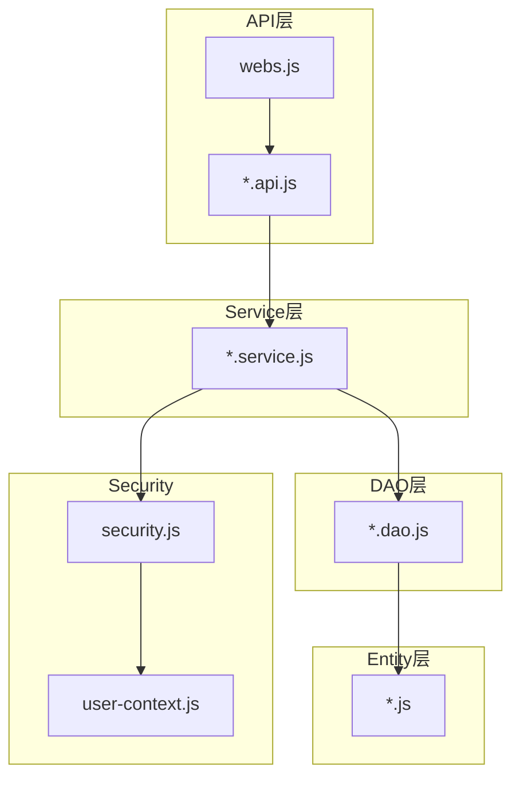
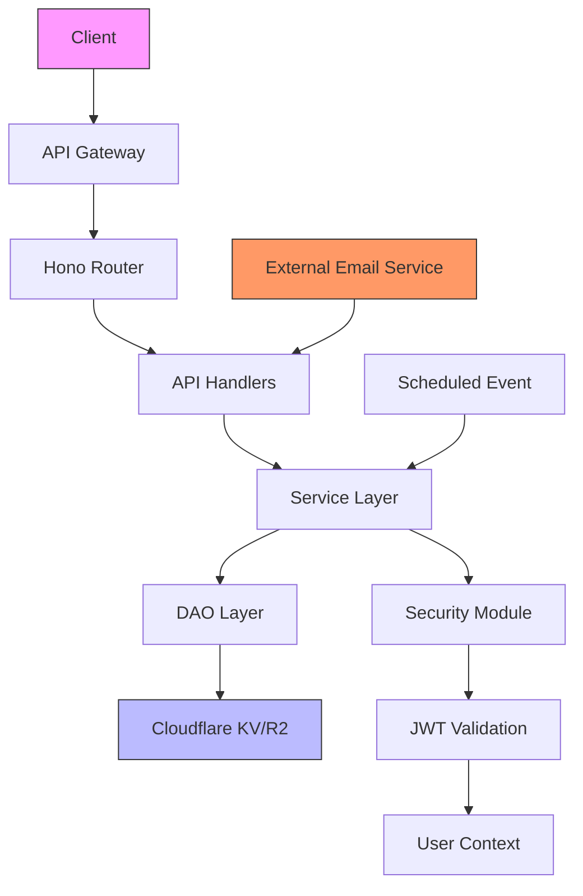
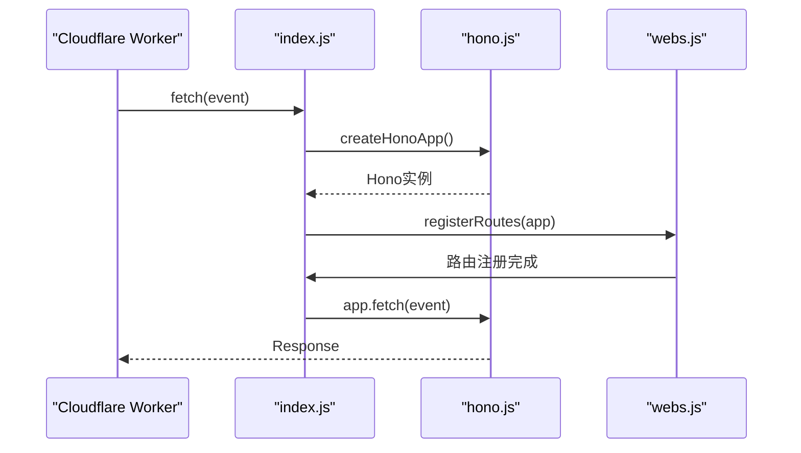
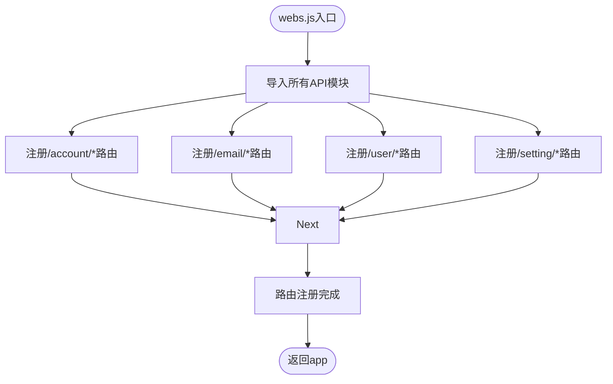
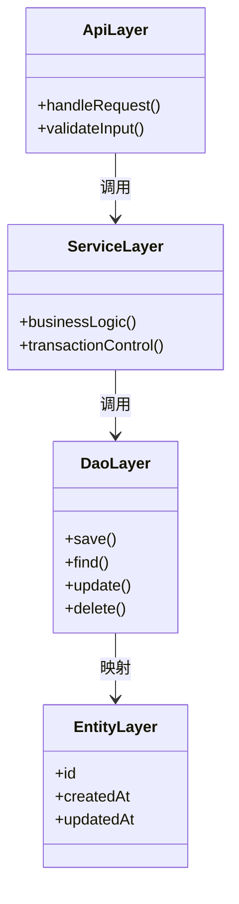
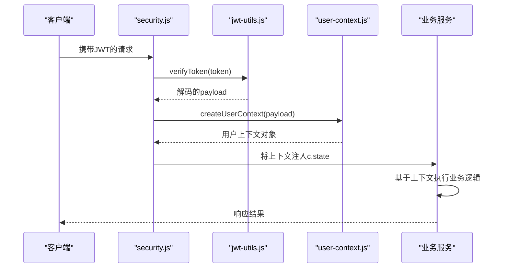
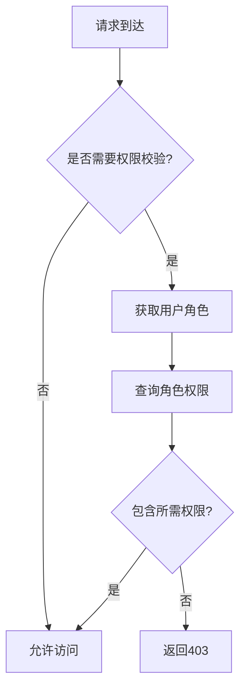
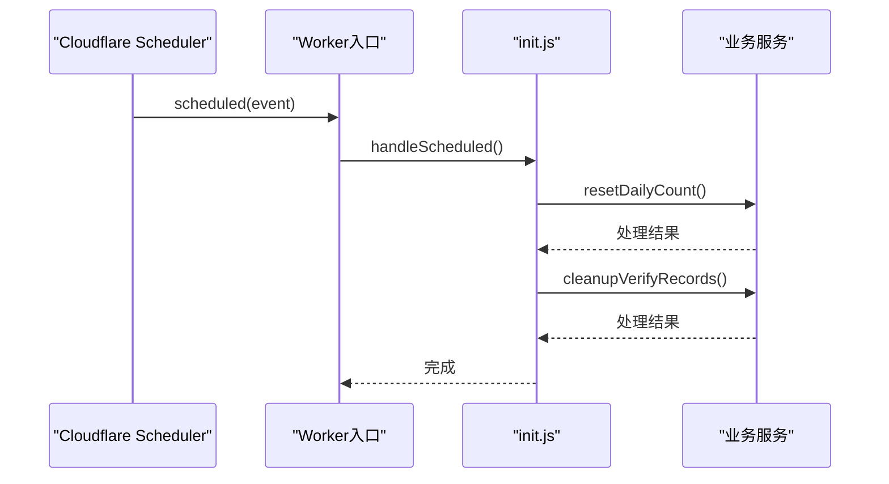
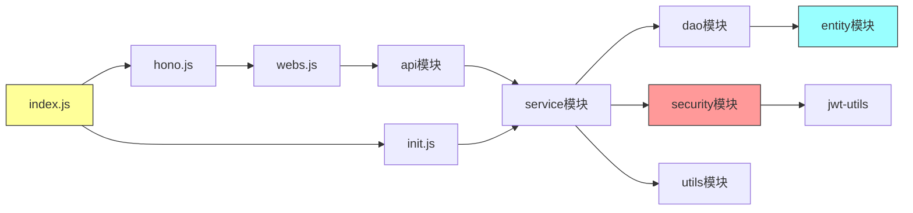
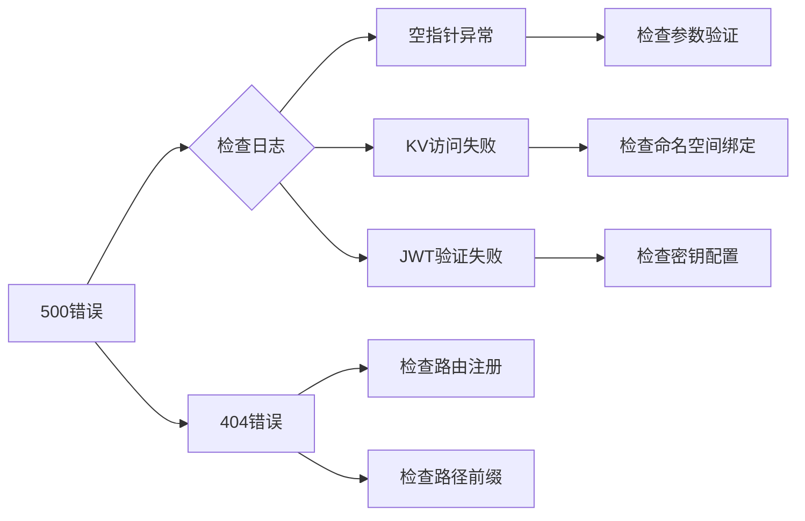

# 后端架构设计

<cite>
**本文档引用的文件**  
- [index.js](file://mail-worker/src/index.js)
- [hono.js](file://mail-worker/src/hono/hono.js)
- [webs.js](file://mail-worker/src/hono/webs.js)
- [security.js](file://mail-worker/src/security/security.js)
- [user-context.js](file://mail-worker/src/security/user-context.js)
- [perm-service.js](file://mail-worker/src/service/perm-service.js)
- [account-service.js](file://mail-worker/src/service/account-service.js)
- [login-service.js](file://mail-worker/src/service/login-service.js)
- [email-service.js](file://mail-worker/src/service/email-service.js)
- [analysis-dao.js](file://mail-worker/src/dao/analysis-dao.js)
- [init.js](file://mail-worker/src/init/init.js)
- [constant.js](file://mail-worker/src/const/constant.js)
- [entity.js](file://mail-worker/src/entity/user.js)
- [biz-error.js](file://mail-worker/src/error/biz-error.js)
- [jwt-utils.js](file://mail-worker/src/utils/jwt-utils.js)
</cite>

## 目录
1. [简介](#简介)
2. [项目结构](#项目结构)
3. [核心组件](#核心组件)
4. [架构概览](#架构概览)
5. [详细组件分析](#详细组件分析)
6. [依赖分析](#依赖分析)
7. [性能考虑](#性能考虑)
8. [故障排除指南](#故障排除指南)
9. [结论](#结论)

## 简介
本文档旨在全面描述cloud-mail后端服务的架构设计，重点阐述基于Hono框架的Cloudflare Worker实现机制。文档详细说明了系统如何通过分层架构实现高内聚低耦合的设计原则，涵盖API注册、认证授权、定时任务、无状态会话管理等关键机制。

## 项目结构
cloud-mail后端服务采用模块化分层架构，主要分为以下几个核心目录：

- `api/`：存放所有API路由处理函数，负责请求解析与响应封装
- `service/`：业务逻辑层，实现核心功能处理
- `dao/`：数据访问层，与KV、R2等Cloudflare存储服务交互
- `entity/`：实体层，定义数据模型与ORM映射
- `hono/`：Hono框架初始化与路由注册中心
- `security/`：安全模块，包含JWT认证与用户上下文管理
- `utils/`：通用工具函数库
- `const/`：常量定义
- `model/`：响应模型定义

该结构清晰划分了各层职责，确保代码可维护性与可扩展性。

**Diagram sources**
- [webs.js](file://mail-worker/src/hono/webs.js)
- [security.js](file://mail-worker/src/security/security.js)
- [entity/user.js](file://mail-worker/src/entity/user.js)

**Section sources**
- [mail-worker/src](file://mail-worker/src)

## 核心组件

系统核心组件包括Hono应用实例、安全认证模块、权限服务、定时任务处理器等。其中，`index.js`作为Cloudflare Worker入口，初始化Hono应用并注册中间件；`webs.js`集中管理所有API路由注册；`security.js`实现JWT认证流程与用户上下文传递；`perm-service.js`实现基于角色的访问控制（RBAC）。

**Section sources**
- [index.js](file://mail-worker/src/index.js)
- [hono.js](file://mail-worker/src/hono/hono.js)
- [security.js](file://mail-worker/src/security/security.js)
- [perm-service.js](file://mail-worker/src/service/perm-service.js)

## 架构概览

系统采用典型的分层架构模式，各层之间通过明确定义的接口进行通信，确保低耦合高内聚。

**Diagram sources**
- [index.js](file://mail-worker/src/index.js)
- [webs.js](file://mail-worker/src/hono/webs.js)
- [security.js](file://mail-worker/src/security/security.js)

## 详细组件分析

### 入口与Hono初始化
`index.js`作为Cloudflare Worker的入口文件，负责创建Hono应用实例并注册全局中间件。`hono.js`模块封装了Hono应用的初始化逻辑，包括CORS配置、错误处理、日志记录等基础功能。

**Diagram sources**
- [index.js](file://mail-worker/src/index.js)
- [hono.js](file://mail-worker/src/hono/hono.js)
- [webs.js](file://mail-worker/src/hono/webs.js)

**Section sources**
- [index.js](file://mail-worker/src/index.js)
- [hono.js](file://mail-worker/src/hono/hono.js)

### API路由注册机制
`webs.js`作为路由注册中心，集中导入并注册所有API路由。每个API模块（如`account-api.js`、`email-api.js`）负责定义其所属路径下的具体路由处理函数。

**Diagram sources**
- [webs.js](file://mail-worker/src/hono/webs.js)
- [account-api.js](file://mail-worker/src/api/account-api.js)
- [email-api.js](file://mail-worker/src/api/email-api.js)

**Section sources**
- [webs.js](file://mail-worker/src/hono/webs.js)
- [api/*.js](file://mail-worker/src/api/)

### 分层架构与调用链路
系统严格遵循分层架构原则，各层职责明确：

**Diagram sources**
- [account-api.js](file://mail-worker/src/api/account-api.js)
- [account-service.js](file://mail-worker/src/service/account-service.js)
- [analysis-dao.js](file://mail-worker/src/dao/analysis-dao.js)
- [user.js](file://mail-worker/src/entity/user.js)

**Section sources**
- [api/account-api.js](file://mail-worker/src/api/account-api.js)
- [service/account-service.js](file://mail-worker/src/service/account-service.js)
- [dao/analysis-dao.js](file://mail-worker/src/dao/analysis-dao.js)
- [entity/user.js](file://mail-worker/src/entity/user.js)

### 安全认证与权限控制
安全模块采用JWT进行身份认证，并通过中间件将用户上下文注入请求链路。

**Diagram sources**
- [security.js](file://mail-worker/src/security/security.js)
- [jwt-utils.js](file://mail-worker/src/utils/jwt-utils.js)
- [user-context.js](file://mail-worker/src/security/user-context.js)
- [perm-service.js](file://mail-worker/src/service/perm-service.js)

**Section sources**
- [security.js](file://mail-worker/src/security/security.js)
- [user-context.js](file://mail-worker/src/security/user-context.js)
- [perm-service.js](file://mail-worker/src/service/perm-service.js)

#### RBAC权限控制流程
`perm-service.js`实现基于角色的访问控制，通过角色-权限映射关系进行权限校验。

**Diagram sources**
- [perm-service.js](file://mail-worker/src/service/perm-service.js)
- [role-service.js](file://mail-worker/src/service/role-service.js)

**Section sources**
- [perm-service.js](file://mail-worker/src/service/perm-service.js)

### 定时任务处理
系统通过Cloudflare Workers的Scheduled Event机制执行定时任务。

**Diagram sources**
- [index.js](file://mail-worker/src/index.js)
- [init.js](file://mail-worker/src/init/init.js)
- [account-service.js](file://mail-worker/src/service/account-service.js)
- [verify-record-service.js](file://mail-worker/src/service/verify-record-service.js)

**Section sources**
- [index.js](file://mail-worker/src/index.js)
- [init.js](file://mail-worker/src/init/init.js)

## 依赖分析

系统依赖关系清晰，遵循单向依赖原则，高层模块依赖低层模块。

**Diagram sources**
- [index.js](file://mail-worker/src/index.js)
- [hono.js](file://mail-worker/src/hono/hono.js)
- [webs.js](file://mail-worker/src/hono/webs.js)
- [api/*.js](file://mail-worker/src/api/)
- [service/*.js](file://mail-worker/src/service/)

**Section sources**
- [index.js](file://mail-worker/src/index.js)
- [hono.js](file://mail-worker/src/hono/hono.js)
- [webs.js](file://mail-worker/src/hono/webs.js)

## 性能考虑
系统针对Serverless环境进行了多项优化：
- 利用Cloudflare KV的边缘缓存特性降低延迟
- 采用无状态设计，便于水平扩展
- 所有异步操作均进行错误处理，避免阻塞事件循环
- 合理使用Durable Objects处理长时任务
- 通过批量操作减少KV读写次数

## 故障排除指南
常见问题及解决方案：

**Section sources**
- [biz-error.js](file://mail-worker/src/error/biz-error.js)
- [hono.js](file://mail-worker/src/hono/hono.js)
- [security.js](file://mail-worker/src/security/security.js)

## 结论
cloud-mail后端服务通过采用Hono框架与Cloudflare Workers的结合，实现了高性能、可扩展的无服务器架构。系统通过清晰的分层设计、严格的权限控制和完善的定时任务机制，确保了功能完整性与安全性。未来可进一步优化点包括引入更精细的监控指标、增强错误追踪能力以及优化KV数据结构以提升查询效率。