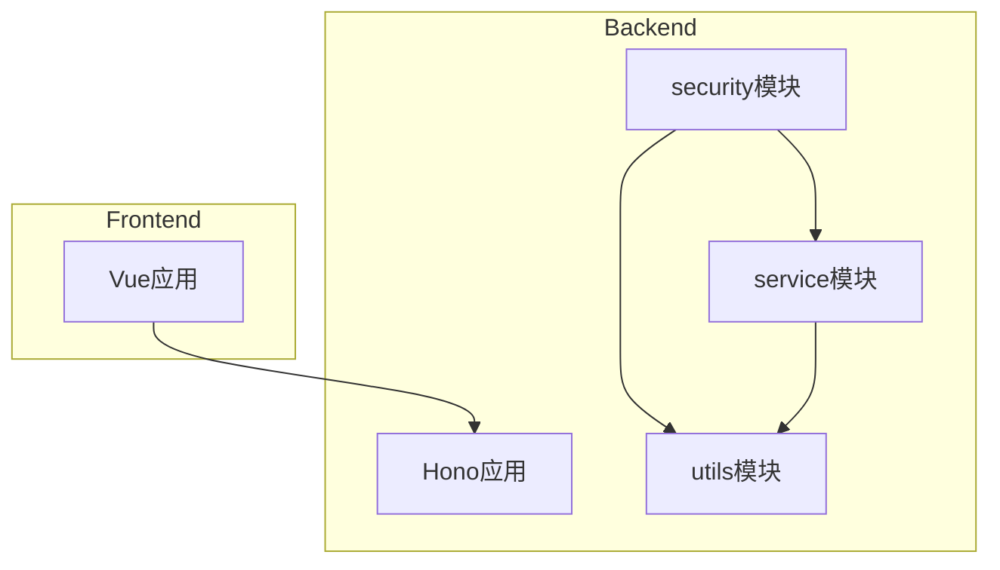
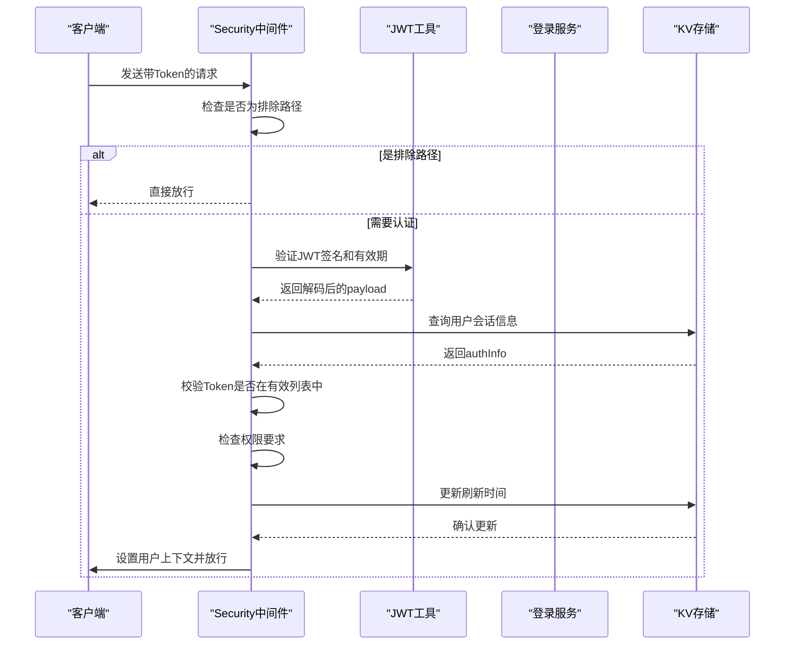
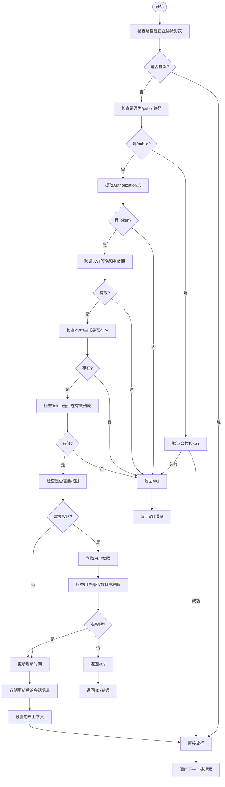
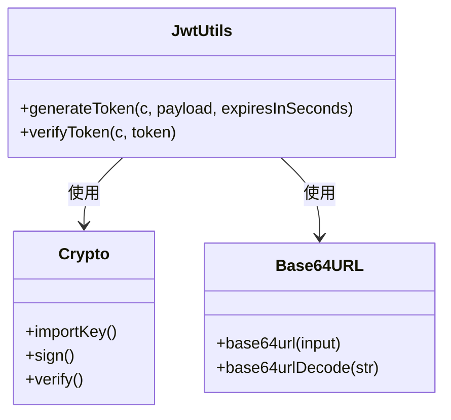
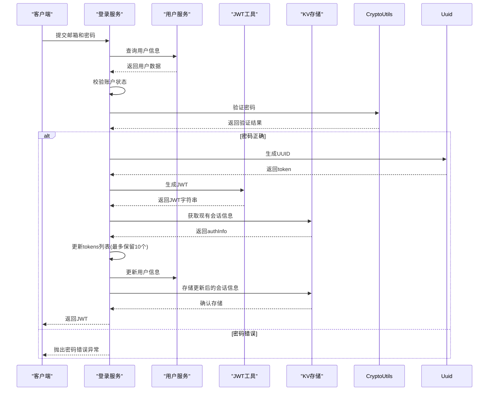
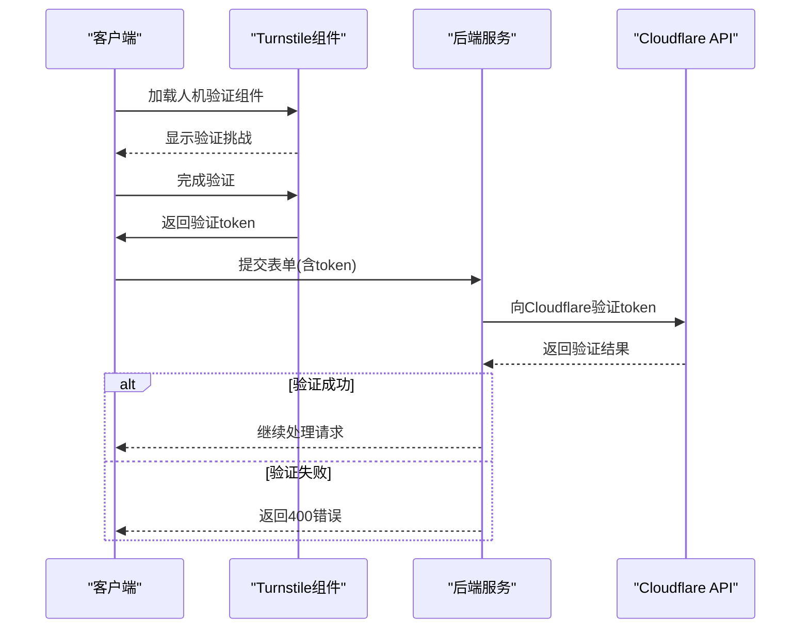
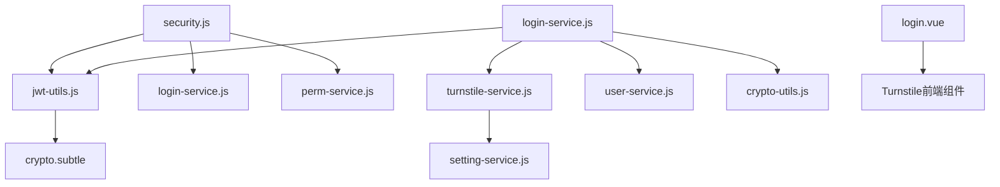

# JWT认证

<cite>
**本文档引用的文件**
- [security.js](file://mail-worker/src/security/security.js)
- [jwt-utils.js](file://mail-worker/src/utils/jwt-utils.js)
- [login-service.js](file://mail-worker/src/service/login-service.js)
- [turnstile-service.js](file://mail-worker/src/service/turnstile-service.js)
- [constant.js](file://mail-worker/src/const/constant.js)
- [result.js](file://mail-worker/src/model/result.js)
- [biz-error.js](file://mail-worker/src/error/biz-error.js)
</cite>

## 目录
1. [简介](#简介)
2. [项目结构](#项目结构)
3. [核心组件](#核心组件)
4. [架构概述](#架构概述)
5. [详细组件分析](#详细组件分析)
6. [依赖分析](#依赖分析)
7. [性能考虑](#性能考虑)
8. [故障排除指南](#故障排除指南)
9. [结论](#结论)

## 简介
本文档详细说明了基于JWT的身份认证机制的实现。重点分析了用户登录流程中的身份验证、Token签发与刷新逻辑，以及如何集成Turnstile人机验证来增强安全性。文档还涵盖了Token生成规则、签名算法、有效期管理及防止Token泄露和重放攻击的安全实践。

## 项目结构
系统由前端（mail-vue）和后端（mail-worker）组成。后端采用Hono框架构建REST API服务，使用Cloudflare Workers环境运行。认证相关逻辑主要集中在`mail-worker/src`目录下的`security`、`utils`和`service`子模块中。

**图示来源**
- [security.js](file://mail-worker/src/security/security.js)
- [jwt-utils.js](file://mail-worker/src/utils/jwt-utils.js)
- [login-service.js](file://mail-worker/src/service/login-service.js)

**本节来源**
- [security.js](file://mail-worker/src/security/security.js)
- [jwt-utils.js](file://mail-worker/src/utils/jwt-utils.js)

## 核心组件
核心认证组件包括：
- `security.js`：实现全局中间件进行JWT验证和权限控制
- `jwt-utils.js`：提供JWT生成与验证工具函数
- `login-service.js`：处理用户登录、注册及会话管理
- `turnstile-service.js`：集成Cloudflare Turnstile人机验证

**本节来源**
- [security.js](file://mail-worker/src/security/security.js#L1-L172)
- [jwt-utils.js](file://mail-worker/src/utils/jwt-utils.js#L1-L88)
- [login-service.js](file://mail-worker/src/service/login-service.js#L1-L258)

## 架构概述
系统采用基于JWT的无状态认证机制，结合KV存储维护用户会话状态。请求到达时，通过中间件链依次处理：排除路径检查 → 公共Token验证 → JWT验证 → 权限校验 → 刷新会话信息。

**图示来源**
- [security.js](file://mail-worker/src/security/security.js#L50-L172)
- [jwt-utils.js](file://mail-worker/src/utils/jwt-utils.js#L10-L88)

## 详细组件分析

### 安全中间件分析
`security.js`实现了全局认证中间件，负责拦截请求并执行认证流程。

#### 认证流程

**图示来源**
- [security.js](file://mail-worker/src/security/security.js#L50-L172)

**本节来源**
- [security.js](file://mail-worker/src/security/security.js#L1-L172)

### JWT工具分析
`jwt-utils.js`提供了JWT的生成和验证功能，使用HMAC-SHA256算法进行签名。

#### JWT生成与验证

**图示来源**
- [jwt-utils.js](file://mail-worker/src/utils/jwt-utils.js#L10-L88)

**本节来源**
- [jwt-utils.js](file://mail-worker/src/utils/jwt-utils.js#L1-L88)

### 登录服务分析
`login-service.js`处理用户登录逻辑，包括密码校验、Token签发和会话管理。

#### 登录流程

**图示来源**
- [login-service.js](file://mail-worker/src/service/login-service.js#L200-L258)
- [jwt-utils.js](file://mail-worker/src/utils/jwt-utils.js#L10-L88)

**本节来源**
- [login-service.js](file://mail-worker/src/service/login-service.js#L1-L258)

### 人机验证集成
`turnstile-service.js`集成了Cloudflare Turnstile服务，用于防止自动化攻击。

#### 人机验证流程

**图示来源**
- [turnstile-service.js](file://mail-worker/src/service/turnstile-service.js#L1-L35)
- [login-service.js](file://mail-worker/src/service/login-service.js#L100-L150)

**本节来源**
- [turnstile-service.js](file://mail-worker/src/service/turnstile-service.js#L1-L35)

## 依赖分析
系统各组件之间的依赖关系如下：

**图示来源**
- [security.js](file://mail-worker/src/security/security.js)
- [login-service.js](file://mail-worker/src/service/login-service.js)
- [turnstile-service.js](file://mail-worker/src/service/turnstile-service.js)

**本节来源**
- [security.js](file://mail-worker/src/security/security.js#L1-L172)
- [login-service.js](file://mail-worker/src/service/login-service.js#L1-L258)

## 性能考虑
- JWT验证在内存中完成，无需数据库查询，性能较高
- 使用KV存储会话信息，读写速度快
- Token有效期长达30天（由`TOKEN_EXPIRE`常量定义），减少频繁登录
- 每个用户最多保留10个有效Token，避免无限增长
- 会话信息每天只更新一次刷新时间，减少KV写操作频率

## 故障排除指南
常见问题及解决方案：

| 问题现象 | 可能原因 | 解决方案 |
|--------|--------|--------|
| 401错误 "authExpired" | Token无效或过期 | 检查Token格式，重新登录获取新Token |
| 401错误 "publicTokenFail" | 公共接口Token不匹配 | 检查请求头中的Token值是否与系统设置一致 |
| 403错误 "unauthorized" | 用户权限不足 | 检查用户角色权限配置 |
| 400错误 "botVerifyFail" | 人机验证失败 | 检查Cloudflare Turnstile配置，确保secretKey正确 |
| 密码错误提示 | 密码校验失败 | 确认密码输入正确，注意大小写 |

**本节来源**
- [security.js](file://mail-worker/src/security/security.js#L150-L160)
- [biz-error.js](file://mail-worker/src/error/biz-error.js)
- [turnstile-service.js](file://mail-worker/src/service/turnstile-service.js#L15-L25)

## 结论
该系统实现了完整的基于JWT的身份认证机制，具有以下特点：
- 使用标准JWT格式，便于跨系统集成
- 结合KV存储实现会话管理，既保持无状态性又支持主动注销
- 集成Cloudflare Turnstile增强安全性，防止自动化攻击
- 精细的权限控制系统，支持基于角色的访问控制
- 完善的错误处理机制，提供清晰的错误信息

建议的安全实践包括：
- 定期轮换JWT密钥（`jwt_secret`）
- 监控异常登录行为
- 对敏感操作增加二次验证
- 定期审计权限分配情况