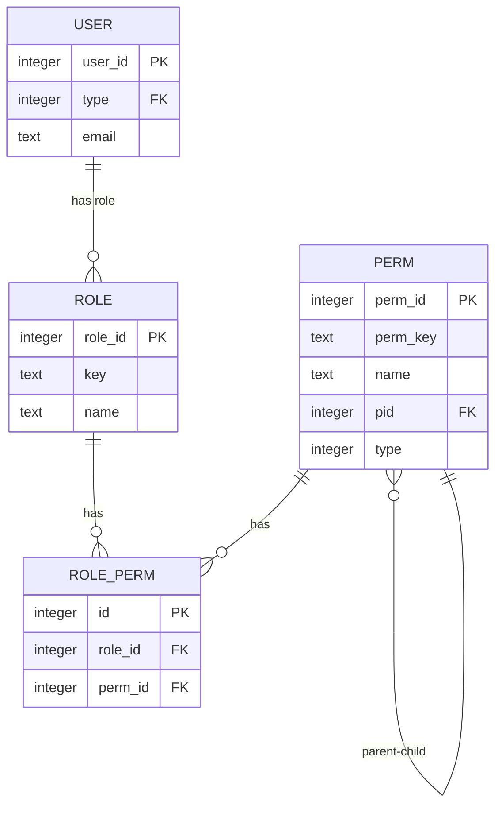
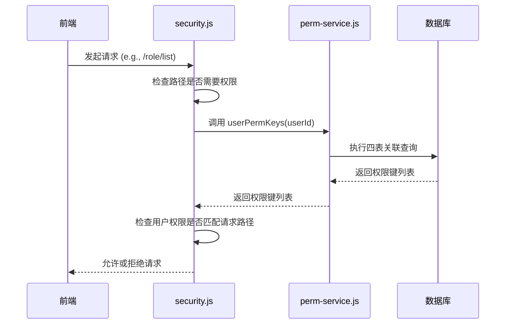
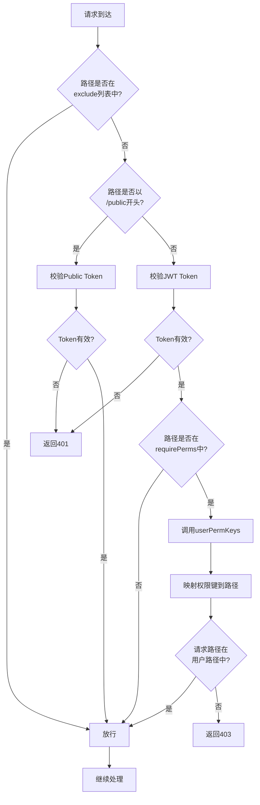

# RBAC权限控制

<cite>
**本文档引用的文件**
- [perm-service.js](file://mail-worker/src/service/perm-service.js)
- [role.js](file://mail-worker/src/entity/role.js)
- [perm.js](file://mail-worker/src/entity/perm.js)
- [role-perm.js](file://mail-worker/src/entity/role-perm.js)
- [entity-const.js](file://mail-worker/src/const/entity-const.js)
- [security.js](file://mail-worker/src/security/security.js)
- [perm.js](file://mail-vue/src/perm/perm.js)
- [role.js](file://mail-vue/src/request/role.js)
</cite>

## 目录
1. [简介](#简介)
2. [项目结构](#项目结构)
3. [核心组件](#核心组件)
4. [架构概述](#架构概述)
5. [详细组件分析](#详细组件分析)
6. [依赖分析](#依赖分析)
7. [性能考虑](#性能考虑)
8. [故障排除指南](#故障排除指南)
9. [结论](#结论)

## 简介
本文档深入解析基于角色的访问控制（RBAC）权限模型的实现细节。重点说明后端 `perm-service.js` 如何通过 `user`、`role`、`role_perm`、`perm` 四张数据库表的关联查询，获取用户的权限键集合，并支持按钮级别的细粒度权限控制。同时，阐述前端权限校验指令、权限与路由映射的实现逻辑，以及权限校验中间件的工作流程。

## 项目结构
该项目采用前后端分离架构。后端服务（`mail-worker`）使用 Hono 框架，权限相关的实体定义和业务逻辑位于 `src/entity` 和 `src/service` 目录下。前端（`mail-vue`）使用 Vue 3 和 Pinia，权限相关的校验逻辑和路由映射位于 `src/perm` 目录下。

**Section sources**
- [perm-service.js](file://mail-worker/src/service/perm-service.js#L1-L37)
- [perm.js](file://mail-vue/src/perm/perm.js#L1-L121)

## 核心组件
核心权限组件包括：
- **perm-service.js**: 后端权限服务，负责查询用户权限和构建权限树。
- **perm.js (前端)**: 前端权限指令和工具函数，用于控制元素显示和路由生成。
- **security.js**: 后端安全中间件，负责全局的权限校验。
- **role.js, perm.js, role-perm.js**: Drizzle ORM 实体，定义了角色、权限及两者映射关系的数据表结构。

**Section sources**
- [perm-service.js](file://mail-worker/src/service/perm-service.js#L1-L37)
- [perm.js](file://mail-vue/src/perm/perm.js#L1-L121)
- [security.js](file://mail-worker/src/security/security.js#L1-L172)

## 架构概述
系统采用标准的 RBAC 模型。用户（`user`）通过其 `type` 字段关联到一个角色（`role`）。角色（`role`）与权限（`perm`）通过中间表 `role_perm` 进行多对多关联。权限（`perm`）本身具有树形结构，通过 `pid` 字段表示父子关系。权限校验发生在请求到达业务逻辑之前，由 `security.js` 中间件统一处理。



**Diagram sources**
- [user.js](file://mail-worker/src/entity/user.js#L1-L10)
- [role.js](file://mail-worker/src/entity/role.js#L1-L20)
- [perm.js](file://mail-worker/src/entity/perm.js#L1-L11)
- [role-perm.js](file://mail-worker/src/entity/role-perm.js#L1-L8)

## 详细组件分析

### 权限服务分析 (perm-service.js)
`perm-service.js` 提供了两个核心方法：
1.  **`tree(c)`**: 构建权限树。首先查询所有顶级权限（`pid=0`），然后查询所有子级权限（`pid!=0`）。遍历子级权限，使用 `t()` 函数进行国际化处理。最后，将子级权限按 `pid` 归属到对应的父级权限的 `children` 数组中，形成树结构。
2.  **`userPermKeys(c, userId)`**: 查询用户权限键。通过四表关联查询（`user` -> `role` -> `role_perm` -> `perm`），根据用户ID找到其角色，再找到该角色拥有的所有权限。查询时通过 `eq(perm.type,permConst.type.BUTTON)` 筛选出类型为按钮的权限，并返回这些权限的 `permKey` 集合。



**Diagram sources**
- [perm-service.js](file://mail-worker/src/service/perm-service.js#L1-L37)
- [security.js](file://mail-worker/src/security/security.js#L94-L149)

### 前端权限分析 (perm.js)
前端 `perm.js` 文件导出了一个 Vue 指令和两个工具函数：
1.  **`v-perm` 指令**: 在元素挂载时，获取当前用户的 `permKeys`。如果用户拥有 `'*'`（超级管理员权限）则直接显示。否则，检查指令绑定的值（单个权限键或数组）是否在用户的 `permKeys` 中。若无权限，则从 DOM 中移除该元素，实现按钮级控制。
2.  **`hasPerm(permKey)`**: 工具函数，用于在 JavaScript 代码中判断用户是否拥有某项权限。
3.  **`permsToRouter(permKeys)`**: 将用户的权限键列表转换为可访问的路由列表。通过查找 `routers` 映射对象，将权限键对应的路由配置合并，生成最终的动态路由。

**Section sources**
- [perm.js](file://mail-vue/src/perm/perm.js#L1-L121)

### 权限校验中间件分析 (security.js)
`security.js` 是全局中间件，负责身份认证和权限校验。
1.  **排除路径**: 对登录、注册等公共路径直接放行。
2.  **JWT 认证**: 对需要认证的路径，解析并验证 JWT Token，获取用户ID和Token。
3.  **会话校验**: 从 KV 存储中获取用户会话信息，验证其有效性。
4.  **权限校验**: 对于 `requirePerms` 数组中定义的敏感路径，调用 `permService.userPermKeys` 获取用户权限键。通过 `permKeyToPaths` 函数，将权限键（如 `'role:query'`）映射回其对应的 API 路径（如 `/role/list`）。如果用户权限映射出的路径集合中不包含当前请求路径，则抛出 403 错误。



**Diagram sources**
- [security.js](file://mail-worker/src/security/security.js#L54-L171)

## 依赖分析
权限系统的核心依赖关系清晰：
- 前端 `perm.js` 依赖于 Pinia store 中的用户信息（`permKeys`）。
- 后端 `security.js` 依赖于 `perm-service.js` 来获取用户权限。
- `perm-service.js` 依赖于 `orm`、`user`、`role`、`rolePerm`、`perm` 等实体和数据库操作模块。
- `role.js` (前端请求) 依赖于 HTTP 客户端来调用后端 `/role` 开头的 API。

```mermaid
graph TD
A[前端 perm.js] --> B[Pinia UserStore]
C[security.js] --> D[perm-service.js]
D --> E[ORM]
D --> F[user 实体]
D --> G[role 实体]
D --> H[rolePerm 实体]
D --> I[perm 实体]
J[role.js (请求)] --> K[HTTP 客户端]
```

**Diagram sources**
- [perm.js](file://mail-vue/src/perm/perm.js#L1-L121)
- [security.js](file://mail-worker/src/security/security.js#L1-L172)
- [perm-service.js](file://mail-worker/src/service/perm-service.js#L1-L37)

## 性能考虑
- **数据库查询**: `userPermKeys` 方法使用单次四表关联查询，效率较高。`tree` 方法使用两次查询，避免了递归查询的性能问题。
- **缓存**: 用户的权限信息（`permKeys`）存储在 KV 存储（`authInfo`）中，避免了每次请求都查询数据库。权限树（`/role/permTree`）也可以考虑在前端或服务端进行缓存。
- **中间件**: 权限校验在中间件层完成，避免了在每个业务处理函数中重复校验，提高了代码复用性和执行效率。

## 故障排除指南
### 常见权限配置错误
1.  **权限不生效**: 检查 `role_perm` 表中，目标角色是否已正确关联了所需的权限ID。确保前端请求的 API 路径在 `requirePerms` 数组中，并且权限键（`permKey`）在 `premKey` 映射对象中有正确的路径配置。
2.  **页面或按钮不显示**: 确认用户角色的 `permKeys` 是否包含页面或按钮所需的权限键。检查 `v-perm` 指令的使用语法是否正确（`v-perm="'user:query'"` 或 `v-perm="['user:query', 'user:add']"`）。
3.  **403 Forbidden 错误**: 首先确认用户已登录且 Token 有效。检查请求的 API 路径是否被 `requirePerms` 正确拦截。核对 `premKey` 映射表，确保权限键到 API 路径的映射无误。
4.  **权限树显示异常**: 检查 `perm` 表中的 `pid` 字段设置是否正确，确保父子关系无环。确认 `name` 字段的国际化键（如 `perms.emailSend`）在语言包中已定义。

**Section sources**
- [perm-service.js](file://mail-worker/src/service/perm-service.js#L1-L37)
- [security.js](file://mail-worker/src/security/security.js#L54-L98)
- [perm.js](file://mail-vue/src/perm/perm.js#L1-L121)

## 结论
本系统实现了一个高效、灵活的 RBAC 权限控制模型。通过清晰的数据库设计和分层的代码实现，将权限的存储、查询、校验和应用分离。后端服务提供数据支持，前端指令实现细粒度控制，中间件保证全局安全。该设计易于维护和扩展，能够满足复杂的权限管理需求。