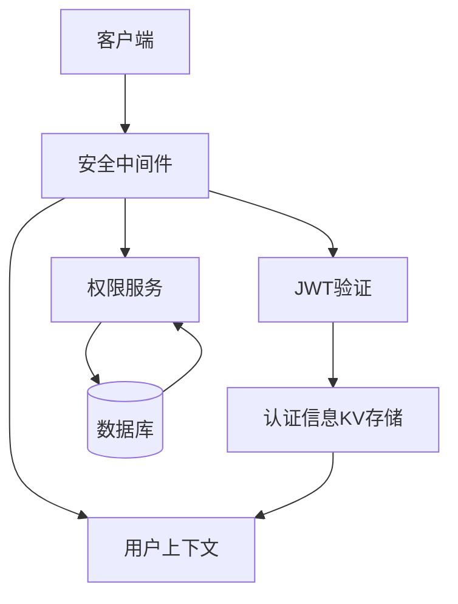
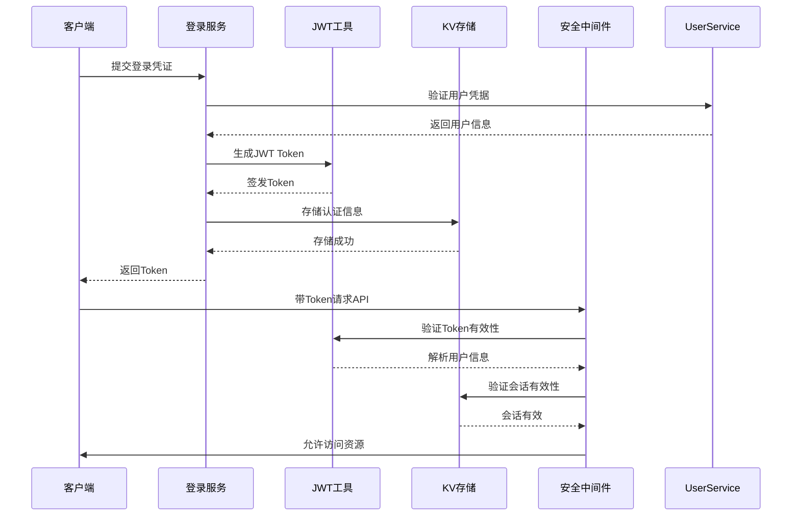
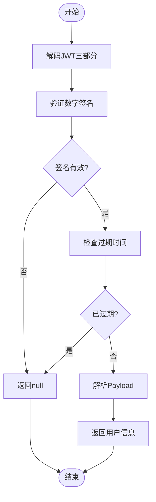
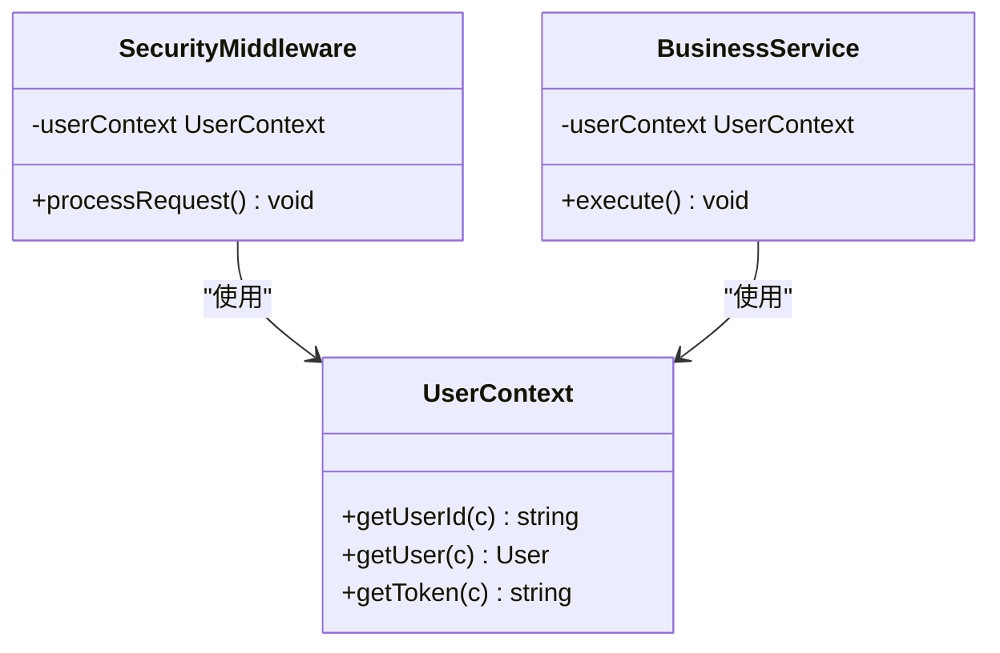
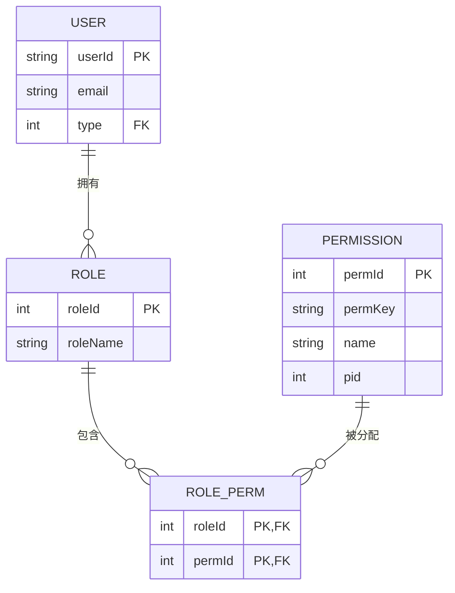
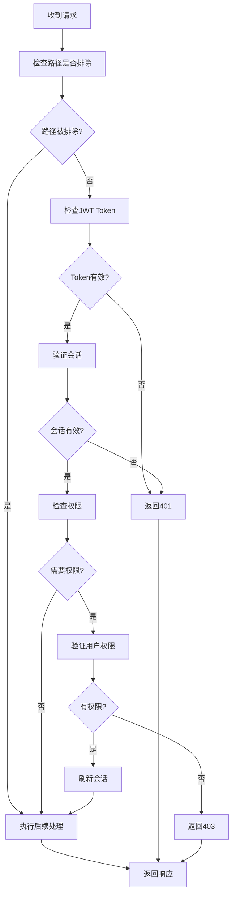

# 安全机制

<cite>
**本文档引用的文件**
- [security.js](file://mail-worker/src/security/security.js)
- [jwt-utils.js](file://mail-worker/src/utils/jwt-utils.js)
- [user-context.js](file://mail-worker/src/security/user-context.js)
- [perm-service.js](file://mail-worker/src/service/perm-service.js)
- [user-service.js](file://mail-worker/src/service/user-service.js)
</cite>

## 目录
1. [引言](#引言)
2. [安全架构概览](#安全架构概览)
3. [JWT身份认证流程](#jwt身份认证流程)
4. [Token签发与验证机制](#token签发与验证机制)
5. [用户上下文管理](#用户上下文管理)
6. [RBAC权限模型实现](#rbac权限模型实现)
7. [安全中间件拦截机制](#安全中间件拦截机制)
8. [Token刷新与会话管理](#token刷新与会话管理)
9. [防重放攻击与最佳实践](#防重放攻击与最佳实践)
10. [总结](#总结)

## 引言
本文档全面阐述云邮件系统的安全架构设计，重点分析基于JWT的身份认证体系。系统通过多层安全机制保障API接口的访问安全，包括身份认证、权限控制、会话管理和防攻击策略。文档详细说明各安全组件的协作关系与实现细节，为系统维护和安全审计提供技术参考。

## 安全架构概览
系统采用分层安全架构，由JWT认证、权限服务、用户上下文和安全中间件四大核心组件构成。所有API请求需通过安全中间件验证，确保只有合法用户能访问受保护资源。

**Diagram sources**
- [security.js](file://mail-worker/src/security/security.js#L1-L172)
- [perm-service.js](file://mail-worker/src/service/perm-service.js#L1-L37)

**Section sources**
- [security.js](file://mail-worker/src/security/security.js#L1-L172)

## JWT身份认证流程
系统采用JWT（JSON Web Token）实现无状态身份认证。登录成功后，服务器签发包含用户信息的JWT Token，客户端在后续请求中通过HTTP头传递该Token完成身份验证。

**Diagram sources**
- [security.js](file://mail-worker/src/security/security.js#L50-L150)
- [jwt-utils.js](file://mail-worker/src/utils/jwt-utils.js#L1-L88)

**Section sources**
- [security.js](file://mail-worker/src/security/security.js#L50-L150)
- [jwt-utils.js](file://mail-worker/src/utils/jwt-utils.js#L1-L88)

## Token签发与验证机制
`jwt-utils.js`模块实现了标准的JWT签发与验证功能，采用HS256算法进行数字签名，确保Token的完整性和防篡改性。

### Token签发流程
1. 构造包含用户信息的Payload
2. 添加签发时间(iat)和过期时间(exp)
3. 使用HMAC-SHA256算法生成签名
4. 组合成标准JWT格式返回

### Token验证流程
1. 拆分JWT为Header、Payload、Signature三部分
2. 验证签名有效性
3. 检查Token是否过期
4. 返回解析后的用户信息

**Diagram sources**
- [jwt-utils.js](file://mail-worker/src/utils/jwt-utils.js#L10-L88)

**Section sources**
- [jwt-utils.js](file://mail-worker/src/utils/jwt-utils.js#L10-L88)

## 用户上下文管理
`user-context.js`模块提供统一的用户信息访问接口，将认证后的用户信息注入请求上下文，便于业务逻辑获取当前用户状态。

### 上下文功能
- `getUserId()`: 获取当前用户ID
- `getUser()`: 获取完整用户信息
- `getToken()`: 获取当前请求的Token

**Diagram sources**
- [user-context.js](file://mail-worker/src/security/user-context.js#L1-L19)

**Section sources**
- [user-context.js](file://mail-worker/src/security/user-context.js#L1-L19)

## RBAC权限模型实现
`perm-service.js`模块实现了基于角色的访问控制（RBAC）模型，通过角色-权限映射实现细粒度的接口级访问控制。

### 权限数据结构
- **角色表**: 存储系统角色
- **权限表**: 存储具体权限项
- **角色权限表**: 建立角色与权限的多对多关系
- **用户角色表**: 关联用户与角色

### 权限检查流程
1. 根据用户ID查询所属角色
2. 获取角色关联的所有权限Key
3. 将权限Key映射到具体API路径
4. 验证当前请求路径是否在授权范围内

**Diagram sources**
- [perm-service.js](file://mail-worker/src/service/perm-service.js#L1-L37)

**Section sources**
- [perm-service.js](file://mail-worker/src/service/perm-service.js#L1-L37)

## 安全中间件拦截机制
`security.js`中的安全中间件是整个安全体系的核心，负责拦截所有API请求并执行完整的安全检查流程。

### 拦截流程
1. **路径排除检查**: 对登录、注册等公开接口放行
2. **Token验证**: 验证JWT Token的有效性
3. **会话验证**: 检查KV存储中的会话信息
4. **权限检查**: 对敏感接口进行RBAC权限验证
5. **会话刷新**: 更新用户活跃时间
6. **上下文注入**: 将用户信息注入请求上下文

### 排除路径列表
- `/login`: 登录接口
- `/register`: 注册接口
- `/file`: 文件访问
- `/setting/websiteConfig`: 网站配置
- `/public/genToken`: 公共Token生成

### 权限检查路径
系统对以下敏感操作进行权限检查：
- 邮件发送与删除
- 账户管理
- 角色权限配置
- 用户管理
- 系统设置

**Diagram sources**
- [security.js](file://mail-worker/src/security/security.js#L1-L172)

**Section sources**
- [security.js](file://mail-worker/src/security/security.js#L1-L172)

## Token刷新与会话管理
系统采用基于KV存储的会话管理机制，结合每日刷新策略确保会话安全。

### 会话有效期
- JWT Token有效期由`TOKEN_EXPIRE`常量定义
- 认证信息在KV存储中的TTL与Token有效期一致
- 每日首次访问时自动刷新会话时间戳

### 刷新策略
当用户每日首次访问受保护接口时：
1. 检查会话最后刷新时间
2. 若非当日刷新，则更新数据库中的活跃时间
3. 在KV存储中更新会话信息
4. 维持现有Token有效性

该策略既保证了会话的持续性，又记录了用户的活跃状态，便于安全审计。

**Section sources**
- [security.js](file://mail-worker/src/security/security.js#L130-L145)
- [user-service.js](file://mail-worker/src/service/user-service.js#L19-L360)

## 防重放攻击与最佳实践
系统通过多重机制防范常见的安全威胁，特别是重放攻击。

### 防重放机制
1. **Token时效性**: 设置合理的Token过期时间
2. **会话绑定**: Token与用户会话状态绑定
3. **签名验证**: 使用强加密算法确保Token完整性
4. **异常检测**: 服务端监控异常的Token使用模式

### 最佳实践建议
- **Token存储**: 客户端应安全存储Token，避免XSS攻击
- **HTTPS强制**: 所有API请求必须通过HTTPS传输
- **敏感操作二次验证**: 关键操作应增加二次认证
- **日志审计**: 记录所有认证和授权操作供审计
- **定期轮换密钥**: 定期更新JWT签名密钥

**Section sources**
- [security.js](file://mail-worker/src/security/security.js#L1-L172)
- [jwt-utils.js](file://mail-worker/src/utils/jwt-utils.js#L1-L88)

## 总结
本系统构建了完整的安全防护体系，通过JWT认证、RBAC权限控制和安全中间件的协同工作，实现了细粒度的访问控制。各安全组件职责分明，既保证了系统的安全性，又保持了良好的可维护性。建议定期进行安全审计，及时更新安全策略以应对新的威胁。