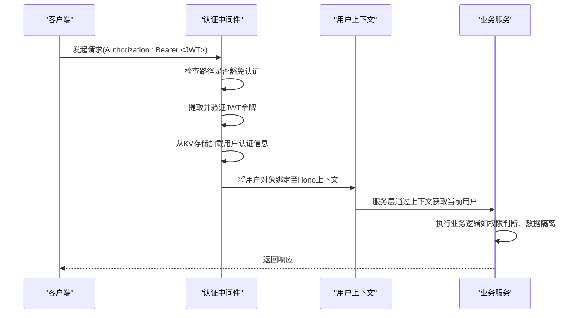
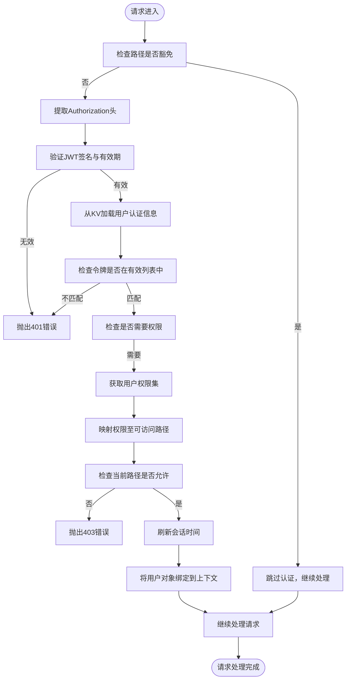
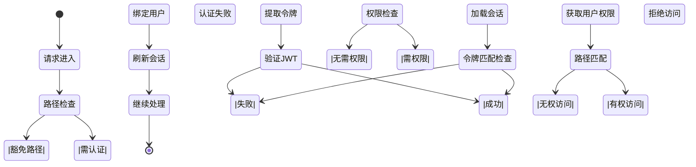
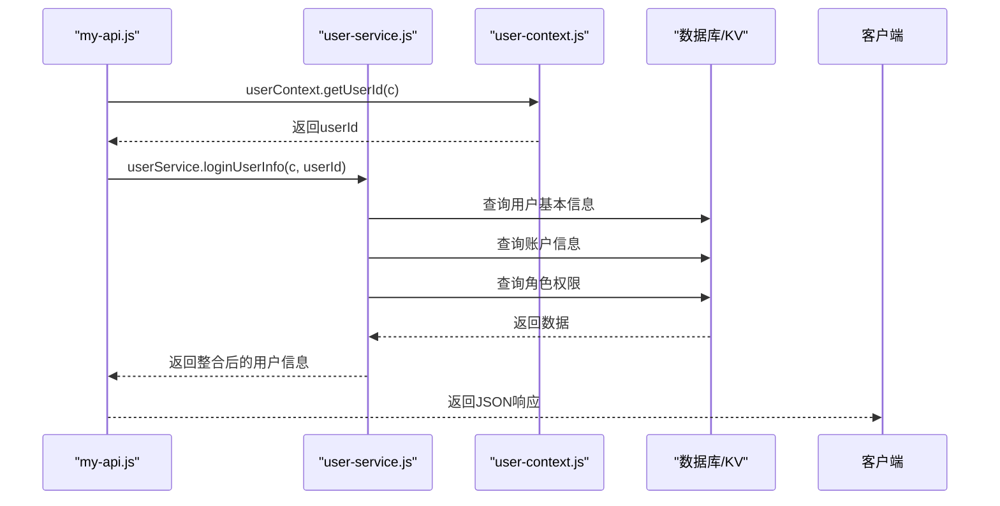

# 用户上下文管理

<cite>
**本文档中引用的文件**  
- [user-context.js](file://mail-worker/src/security/user-context.js)
- [security.js](file://mail-worker/src/security/security.js)
- [jwt-utils.js](file://mail-worker/src/utils/jwt-utils.js)
- [login-service.js](file://mail-worker/src/service/login-service.js)
- [user-service.js](file://mail-worker/src/service/user-service.js)
- [constant.js](file://mail-worker/src/const/constant.js)
- [hono.js](file://mail-worker/src/hono/hono.js)
</cite>

## 目录
1. [引言](#引言)
2. [用户上下文传递机制概述](#用户上下文传递机制概述)
3. [核心组件分析](#核心组件分析)
4. [认证中间件流程解析](#认证中间件流程解析)
5. [服务层用户信息访问](#服务层用户信息访问)
6. [多租户账户隔离实现](#多租户账户隔离实现)
7. [上下文安全与最佳实践](#上下文安全与最佳实践)
8. [结论](#结论)

## 引言
在现代Web应用架构中，用户身份信息的透明传递是保障系统安全与功能完整性的关键环节。本文档深入分析`cloud-mail`项目中用户上下文（User Context）在请求生命周期中的管理机制，重点阐述基于Hono框架的上下文绑定、JWT令牌验证、权限控制及多租户支持等核心设计。通过本指南，开发者可全面理解如何在无状态服务中安全地维护和传递用户身份信息。

## 用户上下文传递机制概述

用户上下文管理贯穿整个请求处理流程，从客户端携带JWT令牌发起请求开始，经由认证中间件解析并验证身份，最终将用户信息注入请求上下文供后续服务调用使用。该机制确保了跨服务调用时身份信息的一致性与安全性。



**Diagram sources**  
- [security.js](file://mail-worker/src/security/security.js#L20-L172)
- [user-context.js](file://mail-worker/src/security/user-context.js#L0-L18)

**Section sources**
- [security.js](file://mail-worker/src/security/security.js#L20-L172)
- [user-context.js](file://mail-worker/src/security/user-context.js#L0-L18)

## 核心组件分析

### 用户上下文模块（user-context.js）

`user-context.js` 提供了一组工具函数，用于从Hono请求上下文中安全地提取用户信息。这些函数封装了底层上下文访问逻辑，为上层服务提供统一的用户数据访问接口。

```mermaid
classDiagram
class UserContext {
+getUserId(c) : string
+getUser(c) : Object
+getToken(c) : Promise~string~
}
note right of UserContext
从Hono上下文c中获取绑定的用户对象
支持获取用户ID、完整用户信息及当前令牌
end note
```

**Diagram sources**  
- [user-context.js](file://mail-worker/src/security/user-context.js#L0-L18)

**Section sources**
- [user-context.js](file://mail-worker/src/security/user-context.js#L0-L18)

### 认证中间件（security.js）

`security.js` 实现了完整的认证拦截逻辑，作为所有受保护路由的前置守卫。它负责JWT验证、会话状态检查、权限校验及用户上下文注入。

#### 认证流程图


**Diagram sources**  
- [security.js](file://mail-worker/src/security/security.js#L20-L172)

**Section sources**
- [security.js](file://mail-worker/src/security/security.js#L20-L172)

## 认证中间件流程解析

认证中间件通过Hono的`app.use('*')`全局注册，拦截所有请求。其核心逻辑包括：

1. **路径豁免判断**：对登录、注册等公共接口直接放行
2. **JWT令牌提取与验证**：使用`jwt-utils.js`验证令牌签名与有效期
3. **会话状态校验**：通过KV存储维护用户活跃令牌列表，防止令牌盗用
4. **权限控制**：基于角色的权限系统（RBAC），动态校验用户是否有权访问目标资源
5. **上下文绑定**：成功认证后，调用`c.set('user', authInfo.user)`将用户信息注入请求上下文



**Diagram sources**  
- [security.js](file://mail-worker/src/security/security.js#L20-L172)

**Section sources**
- [security.js](file://mail-worker/src/security/security.js#L20-L172)

## 服务层用户信息访问

在服务层中，通过`user-context.js`提供的API安全地访问当前用户信息，避免直接操作上下文对象。

### 使用示例
```javascript
import userContext from '../security/user-context';

// 获取当前用户ID
const userId = userContext.getUserId(c);

// 获取完整用户对象
const user = userContext.getUser(c);

// 获取当前会话令牌（用于注销等操作）
const token = await userContext.getToken(c);
```

### 实际调用链分析


**Diagram sources**  
- [my-api.js](file://mail-worker/src/api/my-api.js#L0-L18)
- [user-service.js](file://mail-worker/src/service/user-service.js#L0-L363)
- [user-context.js](file://mail-worker/src/security/user-context.js#L0-L18)

**Section sources**
- [my-api.js](file://mail-worker/src/api/my-api.js#L0-L18)
- [user-service.js](file://mail-worker/src/service/user-service.js#L0-L363)

## 多租户账户隔离实现

系统通过以下机制实现多租户场景下的数据隔离：

1. **用户-账户绑定**：每个用户关联一个主账户（account），所有邮件、设置等数据均归属该账户
2. **管理员特权**：环境变量`c.env.admin`指定的超级管理员拥有全局访问权限
3. **查询条件过滤**：所有数据查询均基于当前用户ID或邮箱进行过滤
4. **权限动态扩展**：普通用户权限受限，而管理员用户自动获得`*`通配权限

### 数据隔离代码逻辑
```javascript
// 在 userService.loginUserInfo 中实现
const [account, roleRow, permKeys] = await Promise.all([
    accountService.selectByEmailIncludeDel(c, userRow.email),
    roleService.selectById(c, userRow.type),
    userRow.email === c.env.admin ? Promise.resolve(['*']) : permService.userPermKeys(c, userId)
]);
```

当用户邮箱匹配环境变量中的管理员邮箱时，直接赋予最高权限，绕过常规权限查询。

**Section sources**
- [user-service.js](file://mail-worker/src/service/user-service.js#L0-L363)
- [constant.js](file://mail-worker/src/const/constant.js#L0-L16)

## 上下文安全与最佳实践

### 上下文污染防范
- **只读访问**：`user-context.js`仅提供`get`方法，禁止直接修改上下文中的用户对象
- **不可变数据**：认证中间件绑定的是从KV存储加载的副本，防止服务层意外修改影响其他请求
- **类型安全**：通过`c.get('user')`确保获取的是预期结构的对象

### 空上下文处理
- **强制认证路径**：除豁免列表外，所有路径均需有效认证
- **防御性编程**：关键服务方法应验证`userId`有效性
- **错误统一处理**：Hono的`onError`机制捕获上下文访问异常并返回标准化错误

### 调试上下文传递链
1. **日志追踪**：在中间件中添加调试日志输出用户ID
2. **请求ID关联**：结合唯一请求ID追踪完整调用链
3. **开发环境验证**：利用`/my/loginUserInfo`接口验证上下文是否正确传递

### 最佳实践建议
- **避免上下文滥用**：仅存储必要身份信息，敏感数据如密码不应放入上下文
- **及时刷新会话**：定期更新`refreshTime`以延长有效会话
- **令牌轮换**：限制单用户并发令牌数（最多10个），旧令牌自动淘汰
- **权限最小化**：遵循最小权限原则，避免过度授权

**Section sources**
- [security.js](file://mail-worker/src/security/security.js#L20-L172)
- [user-context.js](file://mail-worker/src/security/user-context.js#L0-L18)
- [hono.js](file://mail-worker/src/hono/hono.js#L0-L33)

## 结论
`cloud-mail`项目通过精心设计的用户上下文管理机制，实现了安全、高效的身份传递与权限控制。`security.js`作为认证核心，`user-context.js`作为访问抽象层，二者协同工作，既保障了系统的安全性，又提升了代码的可维护性。该架构特别适用于需要支持多租户、高并发的云原生应用，为后续功能扩展奠定了坚实基础。