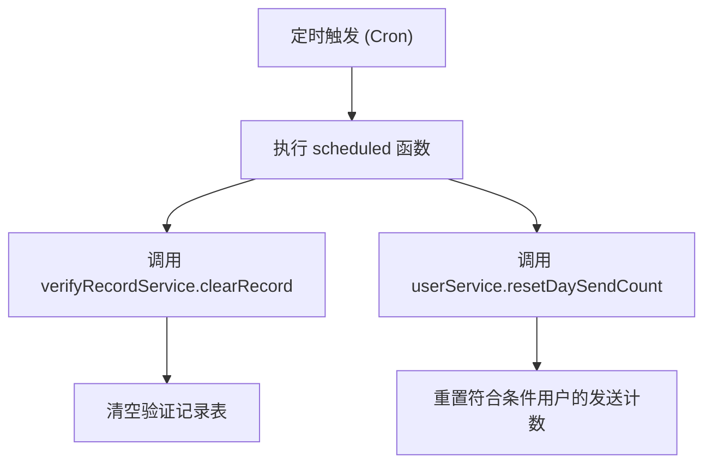
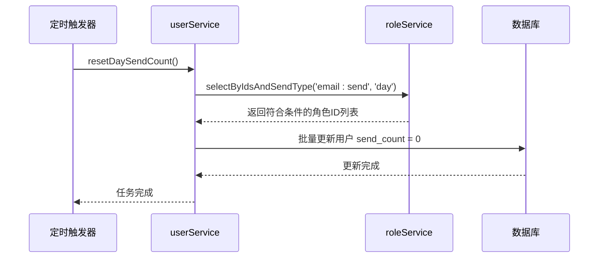
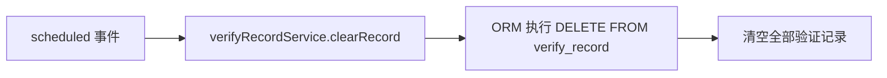
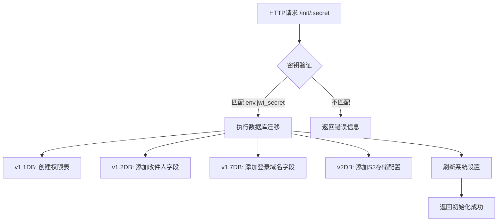

# 定时任务处理

<cite>
**本文档中引用的文件**  
- [index.js](file://mail-worker/src/index.js)
- [init.js](file://mail-worker/src/init/init.js)
- [verify-record-service.js](file://mail-worker/src/service/verify-record-service.js)
- [user-service.js](file://mail-worker/src/service/user-service.js)
- [role-service.js](file://mail-worker/src/service/role-service.js)
- [entity-const.js](file://mail-worker/src/const/entity-const.js)
</cite>

## 目录
1. [简介](#简介)
2. [定时任务注册机制](#定时任务注册机制)
3. [核心定时任务逻辑](#核心定时任务逻辑)
4. [初始化任务触发机制](#初始化任务触发机制)
5. [Cron表达式与调度配置](#cron表达式与调度配置)
6. [执行限制与错误处理](#执行限制与错误处理)
7. [监控与日志建议](#监控与日志建议)
8. [总结](#总结)

## 简介
本项目基于Cloudflare Workers平台实现后台定时任务，用于维护系统状态与数据清理。主要功能包括每日重置用户邮件发送计数、清理过期验证记录等周期性操作。通过Cloudflare Workers的`scheduled`事件机制，结合Cron表达式配置，实现高可靠性的后台任务调度。

## 定时任务注册机制

在Cloudflare Workers环境中，定时任务通过在`index.js`中导出`scheduled`函数实现。该函数会在预设时间自动触发，执行后台维护逻辑。



**图表来源**  
- [index.js](file://mail-worker/src/index.js#L15-L24)

**本节来源**  
- [index.js](file://mail-worker/src/index.js#L15-L24)

## 核心定时任务逻辑

### 每日用户发送计数重置

该任务通过`userService.resetDaySendCount`方法实现，仅对发送策略为“按日限制”的用户角色进行计数重置。



**图表来源**  
- [user-service.js](file://mail-worker/src/service/user-service.js#L350-L360)
- [role-service.js](file://mail-worker/src/service/role-service.js#L165-L177)
- [entity-const.js](file://mail-worker/src/const/entity-const.js#L9-L22)

**本节来源**  
- [user-service.js](file://mail-worker/src/service/user-service.js#L350-L360)

### 验证记录清理

`verify-record-service.js`中的`clearRecord`方法负责清空所有IP验证记录，防止数据库膨胀并确保验证机制的公平性。



**图表来源**  
- [verify-record-service.js](file://mail-worker/src/service/verify-record-service.js#L10-L12)

**本节来源**  
- [verify-record-service.js](file://mail-worker/src/service/verify-record-service.js#L10-L12)

## 初始化任务触发机制

`init.js`中的初始化任务并非由定时器触发，而是通过HTTP请求手动调用。其触发条件为请求路径包含正确密钥，用于数据库结构升级与系统初始化。



**图表来源**  
- [init.js](file://mail-worker/src/init/init.js#L5-L532)

**本节来源**  
- [init.js](file://mail-worker/src/init/init.js#L5-L532)

## Cron表达式与调度配置

虽然代码中未直接体现Cron表达式，但在`wrangler.toml`配置文件中应定义定时器触发频率。典型配置如下：

```toml
[[triggers]]
crons = ["0 0 * * *"]  # 每天午夜执行
```

此配置表示任务将在每天UTC时间00:00触发，适用于每日重置类任务。Cron表达式遵循标准格式：`分钟 小时 日 月 星期`。

**本节来源**  
- [index.js](file://mail-worker/src/index.js#L15-L24)

## 执行限制与错误处理

### 资源限制
Cloudflare Workers对定时任务有以下限制：
- 执行时间上限为1秒（免费计划）或更长（付费计划）
- 内存限制约为128MB
- 网络请求需在执行窗口内完成

### 超时处理
若任务执行超时，Cloudflare将强制终止Worker。因此关键操作应尽量轻量，或拆分为多个小任务。

### 错误重试策略
当前实现中未包含显式重试机制。建议通过以下方式增强可靠性：
- 在外部监控系统中检测任务失败
- 手动重新触发或通过API调用补偿
- 记录最后执行时间，下次执行时补偿遗漏操作

**本节来源**  
- [index.js](file://mail-worker/src/index.js#L15-L24)
- [user-service.js](file://mail-worker/src/service/user-service.js#L350-L360)
- [verify-record-service.js](file://mail-worker/src/service/verify-record-service.js#L10-L12)

## 监控与日志建议

### 日志记录
建议在关键步骤添加日志输出，例如：

```javascript
console.log('Scheduled task started');
await verifyRecordService.clearRecord({env});
console.log('Verify records cleared');
await userService.resetDaySendCount({env});
console.log('User send count reset completed');
```

### 执行状态监控
可通过以下方式监控任务状态：
1. **日志分析**：定期检查Worker日志，确认`scheduled`函数被调用
2. **外部Ping监控**：设置外部服务定期检查特定KV存储中的最后执行时间戳
3. **异常告警**：结合Cloudflare Logs、Datadog等工具设置失败告警

### 可观测性增强
建议在`env`中配置`LOG_LEVEL`，控制日志输出级别，并使用结构化日志格式便于分析。

**本节来源**  
- [index.js](file://mail-worker/src/index.js#L15-L24)
- [user-service.js](file://mail-worker/src/service/user-service.js#L350-L360)
- [verify-record-service.js](file://mail-worker/src/service/verify-record-service.js#L10-L12)

## 总结
本系统通过Cloudflare Workers的`scheduled`事件实现了关键后台任务的自动化执行。每日重置用户发送计数和清理验证记录等功能保障了系统的长期稳定运行。初始化任务通过安全密钥保护，支持数据库结构的平滑升级。未来可增强错误重试机制与执行状态监控，进一步提升任务的可靠性与可观测性。