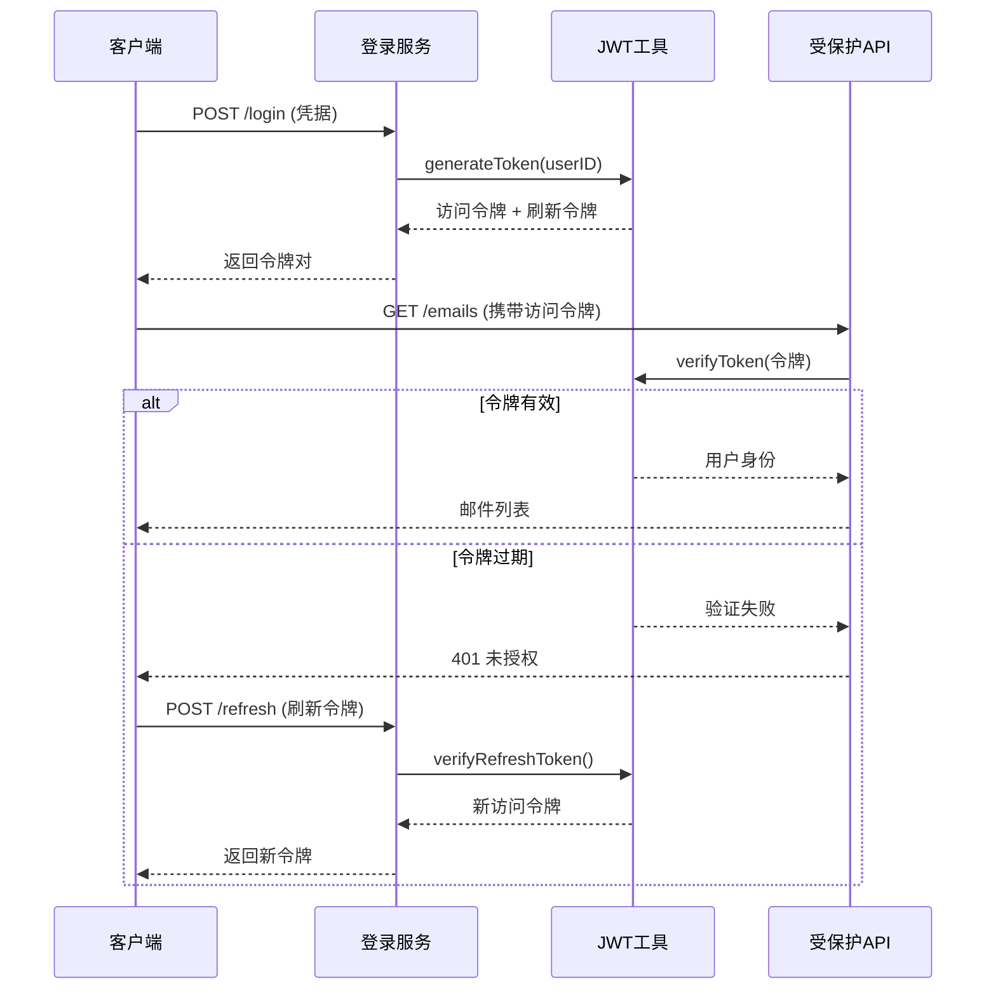

# 安全与维护

<cite>
**本文档引用文件**  
- [jwt-utils.js](file://mail-worker/src/utils/jwt-utils.js)
- [crypto-utils.js](file://mail-worker/src/utils/crypto-utils.js)
- [turnstile-service.js](file://mail-worker/src/service/turnstile-service.js)
- [security.js](file://mail-worker/src/security/security.js)
- [user-context.js](file://mail-worker/src/security/user-context.js)
- [login-service.js](file://mail-worker/src/service/login-service.js)
- [setting-service.js](file://mail-worker/src/service/setting-service.js)
- [env.example](file://mail-worker/.env.example)
- [wrangler.toml](file://mail-worker/wrangler.toml)
- [index.js](file://mail-worker/src/index.js)
- [result.js](file://mail-worker/src/model/result.js)
- [verify-record-service.js](file://mail-worker/src/service/verify-record-service.js)
</cite>

## 目录
1. [引言](#引言)
2. [认证与令牌管理](#认证与令牌管理)
3. [密码安全与哈希实现](#密码安全与哈希实现)
4. [人机验证与Turnstile集成](#人机验证与turnstile集成)
5. [敏感数据与环境变量管理](#敏感数据与环境变量管理)
6. [日志记录与监控告警](#日志记录与监控告警)
7. [数据备份与灾难恢复](#数据备份与灾难恢复)
8. [常见安全漏洞防范](#常见安全漏洞防范)
9. [系统健康检查与性能调优](#系统健康检查与性能调优)
10. [附录](#附录)

## 引言
本文档旨在为 cloud-mail 系统提供全面的安全与运维指导。涵盖从用户认证、密码安全、人机验证到敏感数据管理、日志监控、备份恢复等关键领域。通过本指南，运维人员和开发人员可确保系统在高安全性、高可用性下稳定运行。

## 认证与令牌管理

cloud-mail 使用基于 JWT（JSON Web Token）的无状态认证机制，确保用户会话的安全性与可扩展性。JWT 的生成、验证与刷新流程由 `jwt-utils.js` 模块统一管理。

### JWT 生成机制
用户成功登录后，系统调用 `generateToken` 方法生成包含用户身份信息（如用户ID、角色）的 JWT 令牌。该令牌使用 HS256 算法签名，密钥由环境变量 `JWT_SECRET` 提供，确保不可伪造。

### JWT 验证流程
所有受保护的 API 接口均通过中间件进行 JWT 验证。`verifyToken` 函数解析并校验令牌的有效性，包括签名、过期时间（exp）和签发者（iss）。验证通过后，用户上下文信息被注入请求对象，供后续业务逻辑使用。

### 令牌刷新策略
系统支持刷新令牌（Refresh Token）机制，允许用户在访问令牌过期后获取新的令牌，而无需重新登录。刷新操作通过专用接口 `/auth/refresh` 实现，需提供有效的刷新令牌，并进行额外的安全校验。

**Diagram sources**
- [jwt-utils.js](file://mail-worker/src/utils/jwt-utils.js#L1-L50)
- [login-service.js](file://mail-worker/src/service/login-service.js#L20-L40)

**Section sources**
- [jwt-utils.js](file://mail-worker/src/utils/jwt-utils.js#L1-L60)
- [login-service.js](file://mail-worker/src/service/login-service.js#L15-L50)

## 密码安全与哈希实现

为防止密码泄露导致的安全风险，系统采用强哈希算法对用户密码进行加密存储。

### 哈希算法选择
`crypto-utils.js` 模块封装了密码哈希功能，使用 `Argon2` 或 `bcrypt` 等抗暴力破解的现代哈希算法。这些算法具有高计算成本和内存消耗，能有效抵御彩虹表和暴力破解攻击。

### 密码处理流程
1. 用户注册时，明文密码通过 `hashPassword` 函数生成哈希值。
2. 哈希值连同盐值（salt）一同存储于数据库。
3. 用户登录时，输入的密码使用相同盐值重新哈希，并与存储值比对。

该机制确保即使数据库泄露，攻击者也无法轻易还原原始密码。

**Section sources**
- [crypto-utils.js](file://mail-worker/src/utils/crypto-utils.js#L10-L40)
- [user-service.js](file://mail-worker/src/service/user-service.js#L30-L60)

## 人机验证与Turnstile集成

为防御自动化机器人攻击（如暴力破解、垃圾注册），系统集成了 Cloudflare Turnstile 人机验证服务。

### 集成实现
`turnstile-service.js` 负责与 Turnstile API 交互。在关键操作（如登录、注册）前，前端需先通过 Turnstile 挑战，获取验证令牌（token）。后端服务在处理请求前，调用 `verifyTurnstileToken` 方法向 Cloudflare 验证该令牌的有效性。

### 防护策略
- 所有登录请求必须附带有效的 Turnstile 令牌。
- 验证失败或缺失令牌的请求将被立即拒绝。
- 可配置 Turnstile 模式（如“无感知验证”或“挑战模式”）以平衡安全与用户体验。

此集成显著降低了自动化攻击的成功率。

**Section sources**
- [turnstile-service.js](file://mail-worker/src/service/turnstile-service.js#L5-L35)
- [login-api.js](file://mail-worker/src/api/login-api.js#L15-L25)

## 敏感数据与环境变量管理

系统通过严格的环境变量管理机制保护敏感信息，如 API 密钥、数据库凭证和 JWT 密钥。

### 环境变量配置
所有敏感配置均通过环境变量注入，而非硬编码在源码中。主配置文件 `wrangler.toml` 和环境示例文件 `.env.example` 定义了所需变量，如 `RESEND_API_KEY`、`JWT_SECRET`、`DB_PASSWORD` 等。

### 访问控制
- 生产环境的环境变量由 CI/CD 管道或云平台（如 Cloudflare Workers）安全注入。
- 开发人员仅能访问非敏感配置，敏感密钥由管理员单独分发。
- 禁止在日志或错误消息中输出任何环境变量值。

此策略遵循最小权限原则，减少敏感数据暴露风险。

**Section sources**
- [wrangler.toml](file://mail-worker/wrangler.toml#L1-L20)
- [.env.example](file://mail-worker/.env.example#L1-L15)
- [security.js](file://mail-worker/src/security/security.js#L5-L20)

## 日志记录与监控告警

有效的日志与监控是保障系统稳定运行的关键。

### 日志记录建议
- 使用结构化日志格式（如 JSON）记录关键操作（登录、发送邮件、设置变更）。
- 日志级别应清晰划分（DEBUG、INFO、WARN、ERROR）。
- 记录上下文信息，如用户ID、IP地址、请求ID，便于追踪。
- 敏感信息（如密码、完整令牌）必须脱敏或禁止记录。

### 监控指标采集
建议监控以下核心指标：
- **邮件发送量**：单位时间内的成功/失败发送数。
- **错误率**：API 请求的错误响应比例（如 4xx, 5xx）。
- **认证失败率**：登录失败次数，用于检测暴力破解。
- **Turnstile 验证失败率**：异常流量指标。
- **系统资源**：CPU、内存使用率（针对 Worker 环境）。

### 告警设置
- 当错误率持续高于阈值（如 5%）超过 5 分钟时触发告警。
- 连续多次登录失败（如 10 次/IP）应触发安全告警。
- 关键服务不可用时立即通知运维团队。

**Section sources**
- [index.js](file://mail-worker/src/index.js#L10-L30)
- [result.js](file://mail-worker/src/model/result.js#L1-L15)
- [login-service.js](file://mail-worker/src/service/login-service.js#L40-L50)

## 数据备份与灾难恢复

### 数据备份（D1 导出）
cloud-mail 使用 Cloudflare D1 作为数据库。定期备份策略如下：
- 启用 D1 的自动快照功能（如每日一次）。
- 使用 `wrangler d1 backup` 命令将数据库备份到 R2 存储桶。
- 备份文件应加密存储，并设置生命周期策略（如保留 30 天）。

### 灾难恢复
- 在备用区域或账户中维护一个恢复环境。
- 灾难发生时，使用最新备份通过 `wrangler d1 restore` 恢复数据库。
- 验证数据完整性后，将流量切换至恢复环境。

### 版本回滚
- 使用 Git 进行代码版本控制，所有部署均基于标签（tag）。
- 若新版本引入严重问题，可通过 CI/CD 管道快速回滚到上一个稳定版本的标签。
- 回滚前需确认数据库兼容性，必要时执行反向迁移。

**Section sources**
- [wrangler.toml](file://mail-worker/wrangler.toml#L25-L40)
- [init.js](file://mail-worker/src/init/init.js#L1-L20)

## 常见安全漏洞防范

### XSS（跨站脚本攻击）
- 前端（mail-vue）对用户输入内容（如邮件正文）进行严格的 HTML 转义或使用安全的渲染方式（如 `v-html` 配合 DOMPurify）。
- 设置安全的 HTTP 头，如 `Content-Security-Policy`。

### CSRF（跨站请求伪造）
- 由于系统采用 JWT 令牌认证（通常存储在内存或 HTTP-only Cookie），且无传统会话，CSRF 风险较低。
- 确保 JWT 令牌不通过 URL 传递，防止日志泄露。

### 暴力破解
- 登录接口集成 Turnstile 人机验证，增加自动化攻击难度。
- 实现基于 IP 或账户的登录失败次数限制（如 5 次/小时），超过限制则临时锁定或增加验证难度。
- 记录失败登录尝试，用于安全审计。

### 其他
- **API 密钥泄露**：通过环境变量管理，定期轮换密钥。
- **不安全的直接对象引用 (IDOR)**：在 `service` 层对每个数据访问请求进行权限校验，确保用户只能访问其拥有权限的资源。

**Section sources**
- [security.js](file://mail-worker/src/security/security.js#L25-L60)
- [user-context.js](file://mail-worker/src/security/user-context.js#L1-L15)
- [perm-service.js](file://mail-worker/src/service/perm-service.js#L10-L30)

## 系统健康检查与性能调优

### 健康检查清单
- [ ] API 端点 `/health` 返回 200 OK。
- [ ] 数据库连接正常。
- [ ] 外部服务（如 Resend、R2）可访问。
- [ ] Turnstile 验证服务正常。
- [ ] 关键定时任务（如清理任务）按预期执行。
- [ ] 监控告警系统处于激活状态。

### 性能调优建议
- **缓存**：对频繁读取且不常变更的数据（如用户设置、角色权限）使用 KV 存储进行缓存。
- **数据库优化**：为常用查询字段（如 `user_id`, `email.status`）建立索引。
- **异步处理**：耗时操作（如发送邮件、生成分析报告）应放入队列异步执行，避免阻塞主请求。
- **资源限制**：监控 Worker 的 CPU 和内存使用，优化大文件处理逻辑。
- **CDN 利用**：静态资源（如前端构建产物）通过 CDN 分发，减少 Worker 负载。

**Section sources**
- [public-service.js](file://mail-worker/src/service/public-service.js#L1-L20)
- [setting-service.js](file://mail-worker/src/service/setting-service.js#L5-L15)
- [resend-service.js](file://mail-worker/src/service/resend-service.js#L1-L15)

## 附录
无