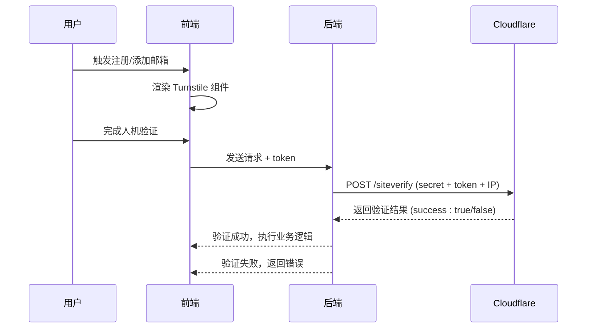
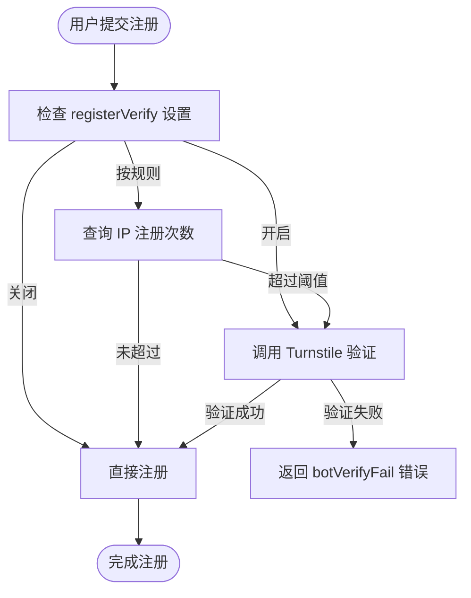

# 人机验证（Turnstile）

<cite>
**本文档引用文件**  
- [turnstile-service.js](file://mail-worker/src/service/turnstile-service.js)
- [login-service.js](file://mail-worker/src/service/login-service.js)
- [verify-record-service.js](file://mail-worker/src/service/verify-record-service.js)
- [login.js](file://mail-vue/src/request/login.js)
- [login.vue](file://mail-vue/src/views/login/index.vue)
- [sys-setting.vue](file://mail-vue/src/views/sys-setting/index.vue)
</cite>

## 目录
1. [简介](#简介)
2. [项目结构与集成位置](#项目结构与集成位置)
3. [核心验证流程](#核心验证流程)
4. [Turnstile 服务实现](#turnstile-服务实现)
5. [注册与登录接口集成](#注册与登录接口集成)
6. [前端交互与令牌获取](#前端交互与令牌获取)
7. [配置管理与验证策略](#配置管理与验证策略)
8. [IP 限流与失败处理机制](#ip-限流与失败处理机制)
9. [错误处理与用户体验](#错误处理与用户体验)
10. [总结](#总结)

## 简介
本文档全面解析 Cloudflare Turnstile 在 cloud-mail 项目中的集成与应用。Turnstile 作为无感人机验证服务，用于防止自动化脚本在注册、登录等关键操作中进行恶意攻击。文档详细说明从前端获取 `cf-turnstile-response` 到后端调用 Cloudflare 验证 API 的完整流程，涵盖验证逻辑、配置策略、错误处理及用户体验优化。

## 项目结构与集成位置
Turnstile 的集成涉及前后端多个模块：
- **前端**：位于 `mail-vue` 项目中，主要在登录/注册页面（`login.vue`）初始化并处理验证响应。
- **后端**：位于 `mail-worker` 项目中，通过 `turnstile-service.js` 提供验证服务，并在 `login-service.js` 中调用。
- **配置界面**：系统设置页面（`sys-setting.vue`）提供 Turnstile 验证策略的可视化配置。

**Section sources**
- [login.vue](file://mail-vue/src/views/login/index.vue#L105-L219)
- [sys-setting.vue](file://mail-vue/src/views/sys-setting/index.vue#L242-L268)

## 核心验证流程
Turnstile 验证流程如下：
1. 用户在注册或添加邮箱时触发验证。
2. 前端通过 Cloudflare 提供的 `turnstile.js` 渲染验证组件。
3. 验证成功后，前端获取响应令牌（`token`）并随请求发送至后端。
4. 后端调用 Cloudflare 的 `siteverify` 接口，使用 `secretKey` 校验令牌有效性。
5. 若验证失败，返回错误；成功则继续业务逻辑。



**Diagram sources**
- [turnstile-service.js](file://mail-worker/src/service/turnstile-service.js#L0-L34)
- [login.vue](file://mail-vue/src/views/login/index.vue#L150-L152)

## Turnstile 服务实现
`turnstile-service.js` 是核心验证服务，负责与 Cloudflare API 通信。

### 主要逻辑：
- 接收前端传入的 `token`。
- 从系统设置中获取 `secretKey`。
- 构造请求体，包含 `secret`、`response`（即 token）和客户端 IP（通过 `cf-connecting-ip` 头部获取）。
- 发送 POST 请求至 `https://challenges.cloudflare.com/turnstile/v0/siteverify`。
- 解析响应，若 `success` 为 `false`，抛出业务异常。

### 请求示例：
```http
POST /turnstile/v0/siteverify HTTP/1.1
Content-Type: application/x-www-form-urlencoded

secret=your_secret_key&response=client_token&remoteip=1.2.3.4
```

### 响应示例：
```json
{
  "success": true,
  "challenge_ts": "2023-01-01T00:00:00Z",
  "hostname": "example.com"
}
```

**Section sources**
- [turnstile-service.js](file://mail-worker/src/service/turnstile-service.js#L0-L34)

## 注册与登录接口集成
Turnstile 验证主要集成在注册和添加邮箱流程中。

### 注册流程（`login-service.js`）
- 根据系统设置 `registerVerify` 决定是否启用验证：
  - **启用**：直接调用 `turnstileService.verify(c, token)`。
  - **按规则启用**：结合 IP 请求次数判断是否需要验证（通过 `verifyRecordService.isOpenRegVerify`）。
- 若验证开启但未通过，抛出 `botVerifyFail` 错误。

### 添加邮箱流程（`account-service.js`）
- 类似注册流程，通过 `addVerifyCount` 控制添加邮箱时的验证策略。



**Diagram sources**
- [login-service.js](file://mail-worker/src/service/login-service.js#L97-L152)
- [verify-record-service.js](file://mail-worker/src/service/verify-record-service.js#L0-L89)

**Section sources**
- [login-service.js](file://mail-worker/src/service/login-service.js#L0-L41)

## 前端交互与令牌获取
前端通过全局 `window` 函数处理 Turnstile 事件。

### 关键函数：
- `window.onTurnstileSuccess(token)`：验证成功时，将 `token` 存入 `verifyToken` 变量。
- `window.onTurnstileError(e)`：验证失败时，记录错误并尝试重试（最多 4 次）。

### 令牌传递：
在注册请求中，`token` 作为参数发送：
```javascript
register({ email, password, token, code })
```

### 动态渲染：
使用 `turnstile.render()` 动态加载组件，失败时通过 `turnstile.reset()` 重试。

**Section sources**
- [login.vue](file://mail-vue/src/views/login/index.vue#L105-L152)

## 配置管理与验证策略
系统提供灵活的 Turnstile 验证策略配置。

### 配置项（`sys-setting.vue`）：
- **注册验证**：可选择“启用”、“禁用”或“按规则验证”。
- **添加邮箱验证**：类似注册验证，可独立配置。
- **验证计数阈值**：设置触发验证的 IP 请求次数上限。

### 策略类型：
| 类型 | 说明 | 用户体验 |
|------|------|----------|
| 无验证 | 所有用户免验证 | 最佳，但安全性低 |
| 强制验证 | 所有用户必须验证 | 体验较差，安全性高 |
| 规则验证 | 高频 IP 用户验证 | 平衡安全与体验 |

**Section sources**
- [sys-setting.vue](file://mail-vue/src/views/sys-setting/index.vue#L242-L268)

## IP 限流与失败处理机制
系统通过 `verify-record` 表实现 IP 级别的请求计数与限流。

### 数据结构（`verify-record.js`）：
- `ip`：客户端 IP（存储为整数）。
- `count`：请求次数。
- `type`：验证类型（注册或添加邮箱）。
- `updateTime`：最后更新时间。

### 服务逻辑（`verify-record-service.js`）：
- `isOpenRegVerify(c, regVerifyCount)`：检查某 IP 的注册请求是否超过阈值。
- `increaseRegCount(c)`：增加注册计数，若记录不存在则创建。

此机制有效防止低频攻击，同时避免对正常用户造成干扰。

**Section sources**
- [verify-record-service.js](file://mail-worker/src/service/verify-record-service.js#L0-L89)
- [verify-record.js](file://mail-worker/src/entity/verify-record.js#L0-L9)

## 错误处理与用户体验
### 后端错误：
- `emptyBotToken`：前端未提供 token。
- `botVerifyFail`：Cloudflare 验证失败。

### 前端处理：
- 显示友好的错误提示（通过 `ElMessage`）。
- 自动重试机制（最多 4 次）。
- 错误日志记录，便于调试。

### 优化建议：
- 对首次失败用户可提供“重试”按钮。
- 在高延迟地区可延长超时时间。
- 结合行为分析，降低误判率。

## 总结
Cloudflare Turnstile 在 cloud-mail 中的集成有效提升了系统的安全性，防止自动化脚本滥用注册和邮箱添加功能。通过灵活的配置策略和 IP 限流机制，系统在安全性和用户体验之间取得了良好平衡。未来可考虑引入更多风险信号（如用户行为、设备指纹）以进一步提升验证精度。