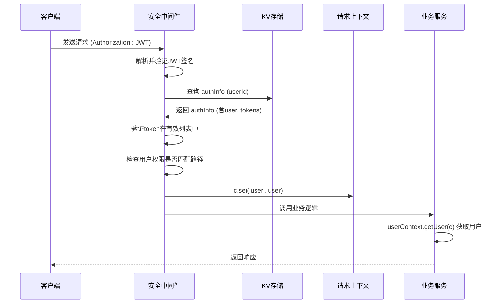
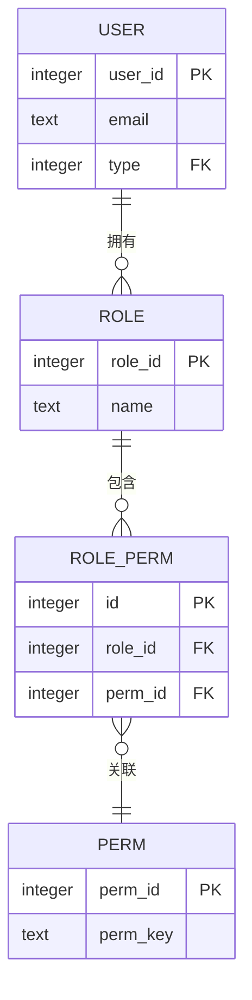

# 安全机制

<cite>
**本文档中引用的文件**  
- [jwt-utils.js](file://mail-worker/src/utils/jwt-utils.js)
- [crypto-utils.js](file://mail-worker/src/utils/crypto-utils.js)
- [user-context.js](file://mail-worker/src/security/user-context.js)
- [security.js](file://mail-worker/src/security/security.js)
- [login-service.js](file://mail-worker/src/service/login-service.js)
- [turnstile-service.js](file://mail-worker/src/service/turnstile-service.js)
- [perm-service.js](file://mail-worker/src/service/perm-service.js)
- [constant.js](file://mail-worker/src/const/constant.js)
- [entity-const.js](file://mail-worker/src/const/entity-const.js)
- [user.js](file://mail-worker/src/entity/user.js)
- [perm.js](file://mail-worker/src/entity/perm.js)
- [role.js](file://mail-worker/src/entity/role.js)
- [role-perm.js](file://mail-worker/src/entity/role-perm.js)
</cite>

## 目录
1. [简介](#简介)
2. [JWT身份认证流程](#jwt身份认证流程)
3. [用户上下文传递与验证](#用户上下文传递与验证)
4. [密码存储与哈希算法](#密码存储与哈希算法)
5. [Turnstile人机验证集成](#turnstile人机验证集成)
6. [基于角色的权限控制（RBAC）](#基于角色的权限控制rbac)
7. [Web漏洞防护策略](#web漏洞防护策略)
8. [结论](#结论)

## 简介
`cloud-mail`系统通过多层次的安全机制保障用户身份认证、数据访问控制与系统防护。本文档深入解析其核心安全实现，涵盖JWT令牌管理、密码哈希、人机验证、权限模型及常见Web攻击的防御策略，确保系统的安全性与健壮性。

## JWT身份认证流程

系统采用自定义JWT工具实现无状态身份认证，令牌用于用户登录后的所有受保护API调用。

### 令牌生成
- **签名算法**：使用`HS256`（HMAC-SHA256）对称加密算法，密钥由环境变量`jwt_secret`提供。
- **载荷结构**：包含`userId`、`token`（UUID）及标准声明`iat`（签发时间）。
- **过期策略**：令牌本身无固定过期时间，其有效性由服务器端的会话状态（存储在KV中）控制。
- **刷新机制**：每次请求时，系统检查用户最后刷新时间是否为当天。若非当天，则更新用户活跃信息并延长KV中会话的TTL（有效期为30天）。

### 令牌验证
1. 从请求头`Authorization`中提取JWT。
2. 验证签名有效性。
3. 检查载荷中的`exp`（若存在）是否过期。
4. 查询KV存储，确认该`token`是否存在于用户的有效令牌列表中。

**Section sources**
- [jwt-utils.js](file://mail-worker/src/utils/jwt-utils.js#L14-L85)
- [constant.js](file://mail-worker/src/const/constant.js#L1-L17)
- [login-service.js](file://mail-worker/src/service/login-service.js#L217-L217)

## 用户上下文传递与验证

在请求生命周期中，用户上下文通过中间件链式传递，确保后续处理逻辑能安全访问用户信息。

### 传递流程
1. **安全中间件** (`security.js`) 在请求进入时执行。
2. 验证JWT并从KV中获取完整的`authInfo`对象（包含用户信息和令牌列表）。
3. 使用`c.set('user', authInfo.user)`将用户信息注入请求上下文。
4. 后续业务逻辑通过`userContext.getUser(c)`或`userContext.getUserId(c)`从上下文中安全获取用户数据。

### 上下文验证
- 所有受保护的API路径均经过安全中间件过滤。
- 中间件检查用户权限（通过`permService.userPermKeys`）是否匹配当前请求路径。
- 只有验证通过的请求才会继续执行，否则返回401或403错误。

**Diagram sources**
- [security.js](file://mail-worker/src/security/security.js#L0-L172)
- [user-context.js](file://mail-worker/src/security/user-context.js#L0-L19)

**Section sources**
- [security.js](file://mail-worker/src/security/security.js#L0-L172)
- [user-context.js](file://mail-worker/src/security/user-context.js#L0-L19)

## 密码存储与哈希算法

系统采用加盐SHA-256哈希算法存储用户密码，确保即使数据库泄露，原始密码也难以被破解。

### 哈希实现
- **算法**：`SHA-256`，通过Web Crypto API的`crypto.subtle.digest`实现。
- **加盐**：使用`crypto.getRandomValues`生成16字节的随机盐值，并通过`btoa`编码为Base64字符串。
- **哈希过程**：将`salt + password`拼接后进行SHA-256哈希，结果再次通过`btoa`编码存储。
- **验证过程**：使用数据库中存储的盐值对用户输入的密码进行相同哈希，比较结果是否一致。

### 安全参数
- **盐值长度**：16字节，确保唯一性。
- **哈希强度**：虽然SHA-256计算速度快，但结合随机盐值可有效抵御彩虹表攻击。未来可考虑升级至Argon2或bcrypt以增加计算成本。

**Section sources**
- [crypto-utils.js](file://mail-worker/src/utils/crypto-utils.js#L2-L37)
- [login-service.js](file://mail-worker/src/service/login-service.js#L217-L217)

## Turnstile人机验证集成

为防止注册和登录接口遭受自动化机器人攻击，系统集成了Cloudflare Turnstile人机验证。

### 集成点
- **注册接口** (`/register`)：当全局设置`registerVerify`为`OPEN`或达到`COUNT`阈值时触发验证。
- **添加邮箱接口**：类似地，在特定条件下触发。

### 验证流程
1. 前端在表单中嵌入Turnstile widget，用户完成验证后获得`token`。
2. `token`随注册/登录请求一同发送至后端。
3. 后端`turnstile-service`调用Cloudflare的验证API (`https://challenges.cloudflare.com/turnstile/v0/siteverify`)。
4. 提交`secret`（从系统设置中获取）、`response`（即`token`）和`remoteip`（客户端IP）。
5. 若API返回`success: true`，则验证通过；否则抛出`botVerifyFail`错误。

**Section sources**
- [turnstile-service.js](file://mail-worker/src/service/turnstile-service.js#L4-L32)
- [login-service.js](file://mail-worker/src/service/login-service.js#L217-L217)

## 基于角色的权限控制（RBAC）

系统采用RBAC模型，通过角色、权限和用户三者关联，实现细粒度的API访问控制。

### 模型结构
- **权限 (perm)**：定义最小操作单元（如`email:send`），存储于`perm`表。
- **角色 (role)**：包含一组权限，通过`role_perm`关联表与权限绑定。
- **用户 (user)**：归属于一个角色，继承该角色的所有权限。

### 权限验证流程
1. **路径匹配**：安全中间件检查请求路径是否在`requirePerms`列表中。
2. **获取权限键**：调用`permService.userPermKeys(c, userId)`，通过数据库联表查询获取用户拥有的所有权限键。
3. **映射路径**：通过`premKey`对象将权限键（如`email:send`）映射回其对应的API路径列表（如`['/email/send']`）。
4. **访问决策**：检查当前请求路径是否在用户权限映射出的路径列表中。若不在且用户非管理员，则拒绝访问（403）。

**Diagram sources**
- [perm.js](file://mail-worker/src/entity/perm.js#L0-L10)
- [role.js](file://mail-worker/src/entity/role.js#L0-L19)
- [role-perm.js](file://mail-worker/src/entity/role-perm.js#L0-L7)
- [user.js](file://mail-worker/src/entity/user.js#L0-L22)

**Section sources**
- [perm-service.js](file://mail-worker/src/service/perm-service.js#L9-L34)
- [security.js](file://mail-worker/src/security/security.js#L0-L172)

## Web漏洞防护策略

系统通过编码实践和配置，防范常见的Web安全漏洞。

### 输入验证
- **邮箱验证**：使用正则表达式严格校验邮箱格式 (`verifyUtils.isEmail`)。
- **域名验证**：校验域名格式，并检查注册邮箱域名是否在允许列表内 (`c.env.domain`)。

### 防止SQL注入
- **参数化查询**：核心数据操作使用`drizzle-orm`，该库自动处理参数化查询，有效防止SQL注入。
- **动态SQL**：在少数使用原生SQL的地方（如`public-service.js`），通过字符串拼接构建SQL，存在潜在风险，但输入已通过`verifyUtils`和`emailUtils`严格校验。

### 防止XSS与CSRF
- **XSS**：前端Vue框架默认对插值进行HTML转义。后端`email-utils.js`提供`htmlToText`方法，可将HTML内容转为纯文本，用于安全展示。
- **CSRF**：系统主要为API服务，依赖JWT进行身份认证。JWT存储在内存或安全的HTTP-only Cookie中（前端实现决定），并通过`Authorization`头发送，可有效抵御CSRF攻击。

### 安全头设置
- **IP与User-Agent提取**：通过`reqUtils.getIp`和`reqUtils.getUserAgent`安全地提取客户端信息，用于日志记录和风控，避免直接信任请求头。

**Section sources**
- [verify-utils.js](file://mail-worker/src/utils/verify-utils.js#L0-L7)
- [email-utils.js](file://mail-worker/src/utils/email-utils.js#L2-L21)
- [req-utils.js](file://mail-worker/src/utils/req-utils.js#L1-L42)
- [public-service.js](file://mail-worker/src/service/public-service.js#L96-L160)

## 结论
`cloud-mail`系统构建了一套全面的安全机制。其基于JWT和服务器端会话管理的身份认证、加盐哈希的密码存储、Cloudflare Turnstile的人机验证以及基于RBAC的细粒度权限控制，共同构成了坚固的安全防线。通过严格的输入验证和ORM的使用，有效防范了常见Web漏洞。未来可考虑将密码哈希算法升级至更安全的Argon2或bcrypt以进一步提升安全性。