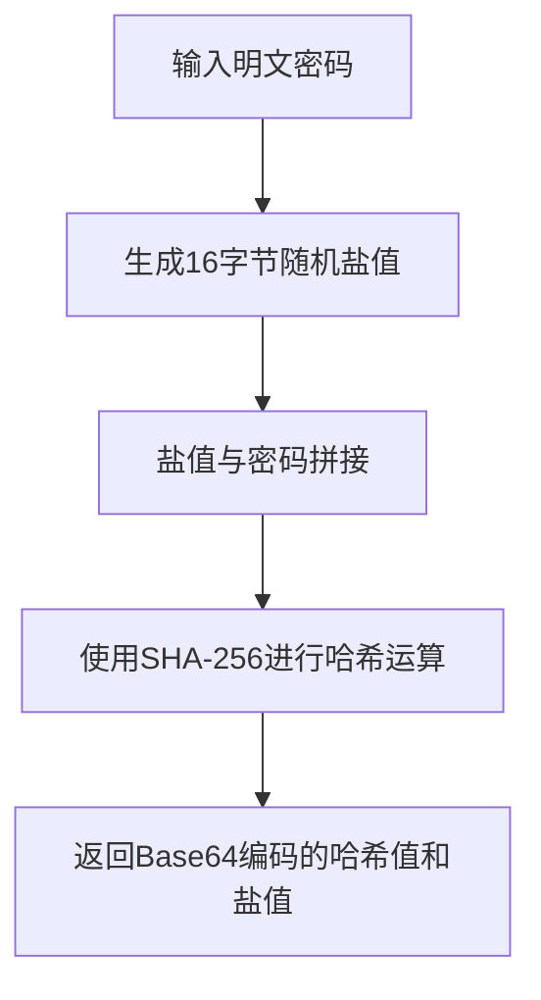
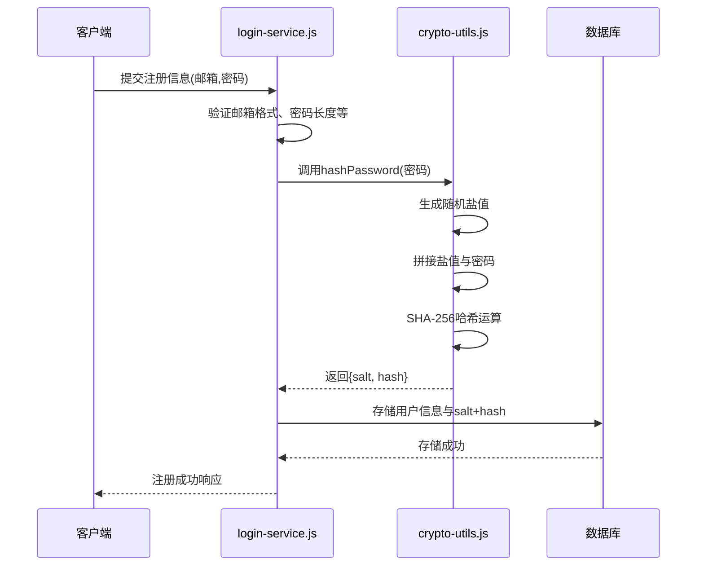
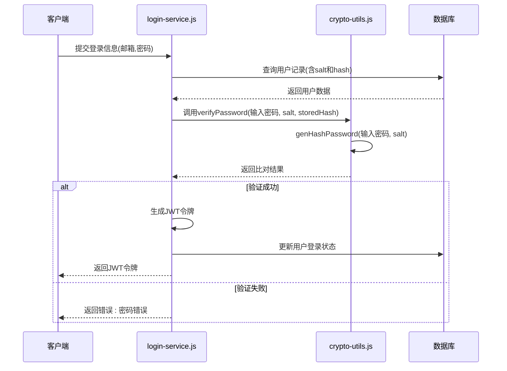
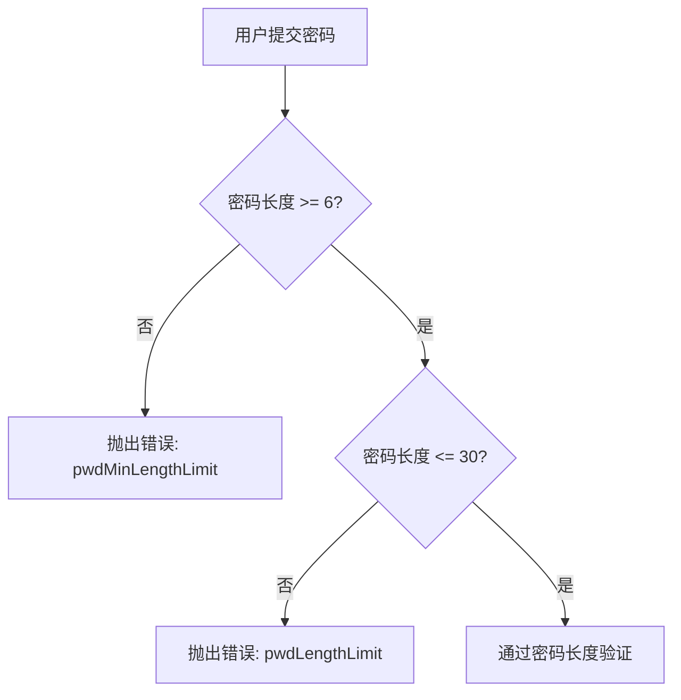

<cite>
**本文档中引用的文件**
- [crypto-utils.js](file://mail-worker/src/utils/crypto-utils.js)
- [login-service.js](file://mail-worker/src/service/login-service.js)
</cite>

## 目录
1. [密码安全机制概述](#密码安全机制概述)
2. [密码哈希算法实现](#密码哈希算法实现)
3. [用户注册流程中的密码处理](#用户注册流程中的密码处理)
4. [用户登录时的密码验证](#用户登录时的密码验证)
5. [密码强度策略](#密码强度策略)
6. [安全机制分析与性能权衡](#安全机制分析与性能权衡)

## 密码安全机制概述

本节深入分析 cloud-mail 项目中的密码存储与处理安全机制。系统采用分层安全策略，结合哈希加密、盐值保护和密码策略控制，确保用户凭证的安全性。核心安全逻辑分布在 `crypto-utils.js` 和 `login-service.js` 两个文件中，前者负责密码的加密与验证，后者管理用户注册与登录的完整业务流程。

**Section sources**
- [crypto-utils.js](file://mail-worker/src/utils/crypto-utils.js)
- [login-service.js](file://mail-worker/src/service/login-service.js)

## 密码哈希算法实现

系统在 `crypto-utils.js` 中实现了基于 SHA-256 的密码哈希算法。该实现通过生成随机盐值并将其与密码拼接后进行哈希运算，有效防止彩虹表攻击。尽管未采用 Argon2 或 bcrypt 等更高级的抗暴力破解算法，但其设计仍遵循了基本的安全实践。

盐值通过 `crypto.getRandomValues` 生成，确保了高熵和不可预测性。哈希过程使用 Web Crypto API 的 `crypto.subtle.digest` 方法，该方法在 Cloudflare Workers 环境中具有良好的兼容性和性能表现。

**Diagram sources**
- [crypto-utils.js](file://mail-worker/src/utils/crypto-utils.js#L10-L30)

**Section sources**
- [crypto-utils.js](file://mail-worker/src/utils/crypto-utils.js#L1-L41)

## 用户注册流程中的密码处理

在用户注册过程中，系统通过 `login-service.js` 中的 `register` 方法调用密码加密功能。当用户提交邮箱和密码后，系统首先进行一系列验证，包括邮箱格式、密码长度和域名限制等。

验证通过后，系统调用 `saltHashUtils.hashPassword` 方法生成包含盐值和哈希值的对象。该哈希结果与用户信息一同存储到数据库中，而原始密码不会被保留。此流程确保了即使数据库泄露，攻击者也无法直接获取用户密码。

**Diagram sources**
- [login-service.js](file://mail-worker/src/service/login-service.js#L15-L100)
- [crypto-utils.js](file://mail-worker/src/utils/crypto-utils.js#L15-L25)

**Section sources**
- [login-service.js](file://mail-worker/src/service/login-service.js#L15-L100)

## 用户登录时的密码验证

用户登录时，系统在 `login-service.js` 的 `login` 方法中执行密码验证。流程如下：首先根据用户邮箱查询数据库获取存储的盐值和哈希值，然后使用相同的哈希算法对用户输入的密码进行处理，最后比对生成的哈希值与数据库中存储的哈希值是否一致。

该验证过程是恒定时间比较，避免了时序攻击的风险。系统通过 `cryptoUtils.verifyPassword` 方法实现验证逻辑，确保安全性的同时保持代码的可维护性。

**Diagram sources**
- [login-service.js](file://mail-worker/src/service/login-service.js#L200-L230)
- [crypto-utils.js](file://mail-worker/src/utils/crypto-utils.js#L27-L35)

**Section sources**
- [login-service.js](file://mail-worker/src/service/login-service.js#L200-L250)

## 密码强度策略

系统在 `login-service.js` 中实现了明确的密码强度策略。注册时强制要求密码长度不少于6个字符，且不超过30个字符。这些策略通过简单的长度检查实现，虽然未包含复杂度要求（如必须包含数字、特殊字符等），但有效防止了过短或过长密码带来的安全风险。

此外，系统还对邮箱用户名部分的长度进行了限制（不超过30字符），并验证邮箱域名是否在允许列表中，这些措施共同构成了基础的身份验证安全防线。

**Diagram sources**
- [login-service.js](file://mail-worker/src/service/login-service.js#L40-L50)

**Section sources**
- [login-service.js](file://mail-worker/src/service/login-service.js#L40-L60)

## 安全机制分析与性能权衡

系统选择 SHA-256 而非 Argon2 或 bcrypt 的主要原因是 Cloudflare Workers 环境的限制。Web Crypto API 原生支持 SHA 系列算法，而 Argon2 等内存密集型算法在无状态的边缘计算环境中可能带来性能和资源消耗问题。

尽管 SHA-256 速度快，但通过添加唯一盐值有效防止了批量破解。系统的安全模型依赖于多层防护：密码策略限制、盐值保护、HTTPS 传输加密以及定期的安全审计。这种设计在安全性和性能之间取得了平衡，适合大规模邮件服务的场景。

未来可考虑引入自适应哈希算法，在安全要求更高的场景下提供更强的保护，同时保持对现有系统的兼容性。

**Section sources**
- [crypto-utils.js](file://mail-worker/src/utils/crypto-utils.js)
- [login-service.js](file://mail-worker/src/service/login-service.js)