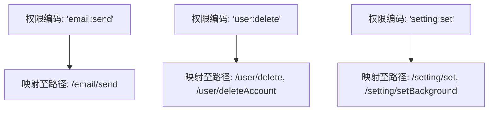
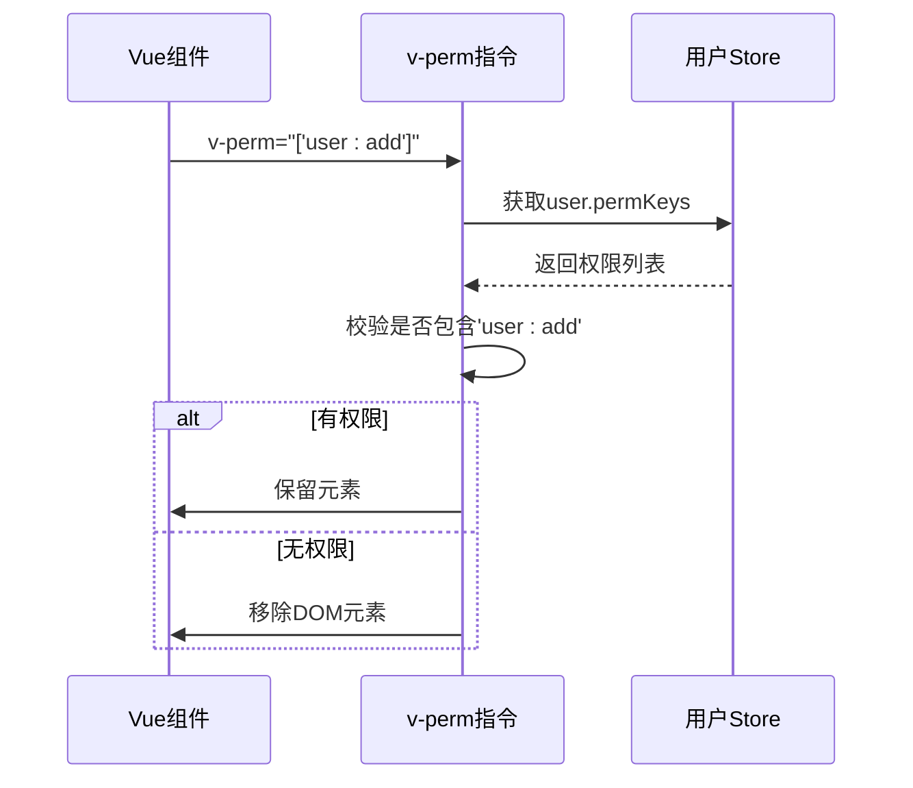
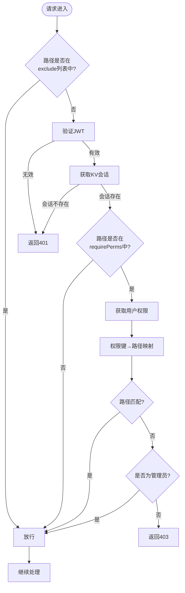
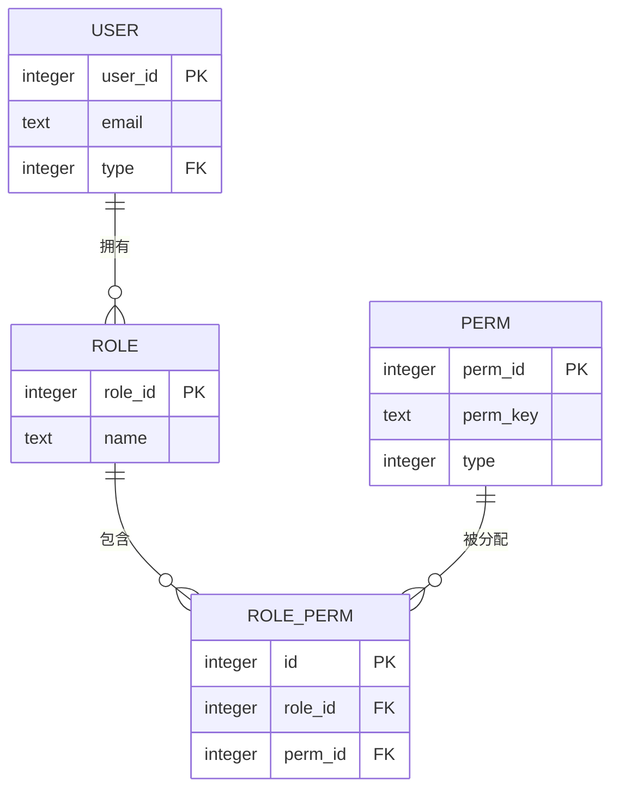
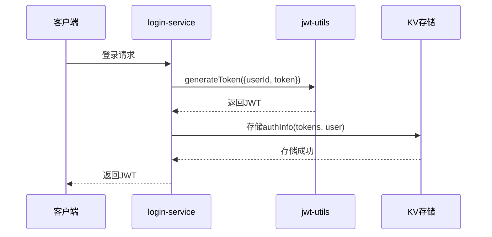

# 权限控制（RBAC）

<cite>
**本文档引用文件**  
- [perm.js](file://mail-vue/src/perm/perm.js)
- [main.js](file://mail-vue/src/main.js)
- [security.js](file://mail-worker/src/security/security.js)
- [perm-service.js](file://mail-worker/src/service/perm-service.js)
- [login-service.js](file://mail-worker/src/service/login-service.js)
- [user-service.js](file://mail-worker/src/service/user-service.js)
- [jwt-utils.js](file://mail-worker/src/utils/jwt-utils.js)
- [user-context.js](file://mail-worker/src/security/user-context.js)
- [perm.js](file://mail-worker/src/entity/perm.js)
- [role-perm.js](file://mail-worker/src/entity/role-perm.js)
- [role.js](file://mail-worker/src/entity/role.js)
- [entity-const.js](file://mail-worker/src/const/entity-const.js)
- [constant.js](file://mail-worker/src/const/constant.js)
- [zh.js](file://mail-worker/src/i18n/zh.js)
</cite>

## 目录
1. [简介](#简介)
2. [权限编码规则与粒度控制策略](#权限编码规则与粒度控制策略)
3. [前端权限控制机制](#前端权限控制机制)
4. [后端权限校验流程](#后端权限校验流程)
5. [角色-权限关联管理](#角色-权限关联管理)
6. [JWT 中权限信息的注入与解析](#jwt-中权限信息的注入与解析)
7. [动态路由权限加载与 UI 元素显隐控制](#动态路由权限加载与-ui-元素显隐控制)
8. [管理员权限提升机制](#管理员权限提升机制)
9. [权限变更后的令牌刷新处理](#权限变更后的令牌刷新处理)
10. [边界场景处理](#边界场景处理)

## 简介
cloud-mail 系统采用基于角色的访问控制（RBAC）模型，从前端指令 `v-perm` 到后端中间件 `security.js` 实现全链路权限控制。系统通过角色绑定权限，用户继承角色权限，并在登录时将权限信息注入 JWT 载荷中。后端通过中间件解析 JWT 并校验请求路径对应的权限，实现细粒度访问控制。

**Section sources**
- [perm.js](file://mail-vue/src/perm/perm.js#L1-L36)
- [security.js](file://mail-worker/src/security/security.js#L1-L172)

## 权限编码规则与粒度控制策略
权限编码采用 `资源:操作` 的命名规范，如 `user:create`、`email:delete`，确保语义清晰且易于扩展。权限类型在数据库中通过 `perm.type` 字段区分，按钮级权限（BUTTON）用于前端显隐控制，菜单级权限用于路由控制。

权限映射关系由 `premKey` 对象维护，将权限键（permKey）映射到一组 API 路径，实现一对多的权限控制策略。例如，`email:send` 权限对应 `/email/send` 接口。



**Diagram sources**
- [security.js](file://mail-worker/src/security/security.js#L40-L80)

**Section sources**
- [security.js](file://mail-worker/src/security/security.js#L40-L80)
- [entity-const.js](file://mail-worker/src/const/entity-const.js#L1-L123)

## 前端权限控制机制
前端通过自定义指令 `v-perm` 实现 UI 元素的显隐控制。该指令在元素挂载时获取当前用户的权限列表 `permKeys`，并判断是否包含指定权限。若用户拥有 `*` 通配权限，则跳过校验；否则根据权限是否存在决定是否移除 DOM 元素。

此外，`permsToRouter` 函数用于根据用户权限动态生成可访问的路由列表，实现菜单级权限控制。



**Diagram sources**
- [perm.js](file://mail-vue/src/perm/perm.js#L1-L36)

**Section sources**
- [perm.js](file://mail-vue/src/perm/perm.js#L1-L36)
- [main.js](file://mail-vue/src/main.js#L1-L17)

## 后端权限校验流程
后端通过 `security.js` 中间件实现权限校验。流程如下：
1. 排除无需认证的路径（如登录、注册）
2. 验证 JWT 令牌有效性
3. 从 KV 存储中获取用户会话信息
4. 对于需权限的路径（`requirePerms`），调用 `permService.userPermKeys` 获取用户权限
5. 将权限键转换为可访问路径列表，进行匹配校验
6. 非管理员用户若无匹配权限则抛出 403 错误



**Diagram sources**
- [security.js](file://mail-worker/src/security/security.js#L1-L172)

**Section sources**
- [security.js](file://mail-worker/src/security/security.js#L1-L172)

## 角色-权限关联管理
权限数据存储于 `perm` 表，角色与权限的关联通过 `role_perm` 表维护多对多关系。`perm-service.js` 提供 `tree` 方法构建权限树形结构，用于前端权限分配界面展示。

`userPermKeys` 方法通过四表联查（user → role → role_perm → perm）获取用户所有按钮级权限键，支持权限继承。



**Diagram sources**
- [perm.js](file://mail-worker/src/entity/perm.js#L1-L10)
- [role-perm.js](file://mail-worker/src/entity/role-perm.js#L1-L7)
- [role.js](file://mail-worker/src/entity/role.js#L1-L19)
- [perm-service.js](file://mail-worker/src/service/perm-service.js#L1-L37)

**Section sources**
- [perm-service.js](file://mail-worker/src/service/perm-service.js#L1-L37)
- [role-service.js](file://mail-worker/src/service/role-service.js#L1-L180)

## JWT 中权限信息的注入与解析
用户登录成功后，`login-service.js` 调用 `jwtUtils.generateToken` 生成 JWT，载荷中仅包含 `userId` 和随机 `token`，权限信息不直接存储于 JWT 中，而是通过 `KV` 存储维护会话状态。

`user-context.js` 提供 `getUser` 方法从上下文中获取已解析的用户信息，该信息由 `security.js` 中间件在权限校验后注入。



**Diagram sources**
- [login-service.js](file://mail-worker/src/service/login-service.js#L208-L257)
- [jwt-utils.js](file://mail-worker/src/utils/jwt-utils.js#L1-L87)
- [user-context.js](file://mail-worker/src/security/user-context.js#L1-L18)

**Section sources**
- [login-service.js](file://mail-worker/src/service/login-service.js#L208-L257)
- [jwt-utils.js](file://mail-worker/src/utils/jwt-utils.js#L1-L87)
- [user-context.js](file://mail-worker/src/security/user-context.js#L1-L18)

## 动态路由权限加载与 UI 元素显隐控制
前端通过 `permsToRouter` 函数将用户权限转换为可访问的路由列表，实现动态路由加载。`v-perm` 指令则用于控制按钮、菜单等 UI 元素的显隐。

例如，用户拥有 `user:add` 权限时，`v-perm="'user:add'"` 的按钮将显示；否则从 DOM 中移除。

```mermaid
flowchart TD
A[用户登录] --> B[获取permKeys]
B --> C{permKeys.includes('*')?}
C --> |是| D[加载所有路由]
C --> |否| E[调用permsToRouter]
E --> F[生成可访问路由列表]
F --> G[动态注册路由]
H[v-perm指令] --> I[获取permKeys]
I --> J{包含指定权限?}
J --> |是| K[保留DOM元素]
J --> |否| L[移除DOM元素]
```

**Diagram sources**
- [perm.js](file://mail-vue/src/perm/perm.js#L1-L36)

**Section sources**
- [perm.js](file://mail-vue/src/perm/perm.js#L1-L36)

## 管理员权限提升机制
系统通过环境变量 `c.env.admin` 配置管理员邮箱。当用户邮箱匹配时，其权限被强制提升为 `*`（通配权限），并赋予 `ADMIN_ROLE` 配置的特殊发送权限。

在 `userService.loginUserInfo` 中，若用户为管理员，则 `permKeys` 直接设为 `['*']`，绕过常规权限查询。

**Section sources**
- [user-service.js](file://mail-worker/src/service/user-service.js#L1-L363)
- [constant.js](file://mail-worker/src/const/constant.js#L1-L17)

## 权限变更后的令牌刷新处理
权限变更（如角色调整）后，系统通过 `KV` 存储中的 `tokens` 列表实现令牌刷新。当用户权限变更时，旧 JWT 仍有效直至过期，但 `KV` 中的 `authInfo` 已更新。

`security.js` 在每次请求时校验 `token` 是否存在于 `authInfo.tokens` 中，若用户权限变更导致 `authInfo` 重建，则旧令牌失效，用户需重新登录。

**Section sources**
- [login-service.js](file://mail-worker/src/service/login-service.js#L208-L257)
- [security.js](file://mail-worker/src/security/security.js#L1-L172)

## 边界场景处理
系统处理以下边界场景：
- **管理员权限**：通过邮箱匹配实现无条件权限提升
- **权限缓存一致性**：权限变更后通过 `KV` 会话更新实现令牌失效
- **通配权限**：`*` 权限覆盖所有校验
- **会话过期**：JWT 过期或 `KV` 会话不存在均返回 401
- **并发令牌**：支持最多 10 个并发登录令牌

**Section sources**
- [security.js](file://mail-worker/src/security/security.js#L1-L172)
- [login-service.js](file://mail-worker/src/service/login-service.js#L208-L257)
- [user-service.js](file://mail-worker/src/service/user-service.js#L1-L363)