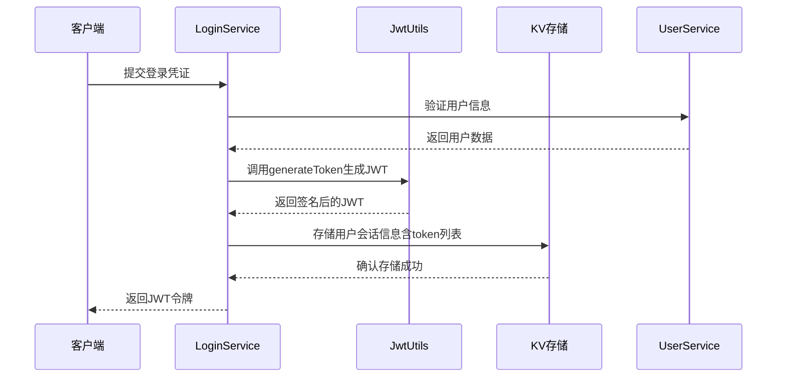
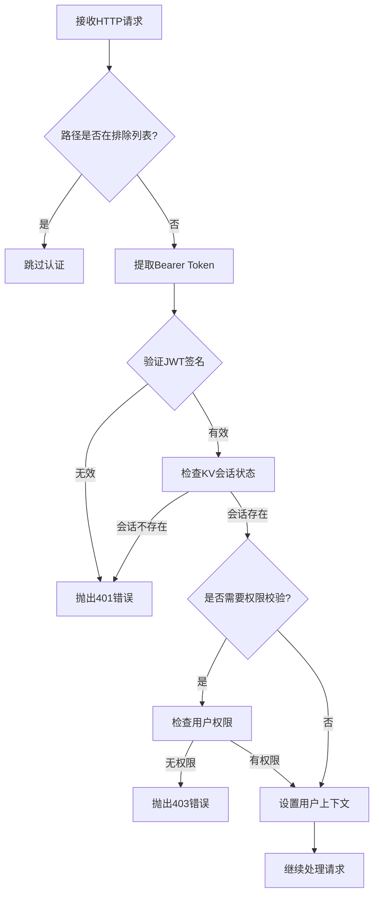
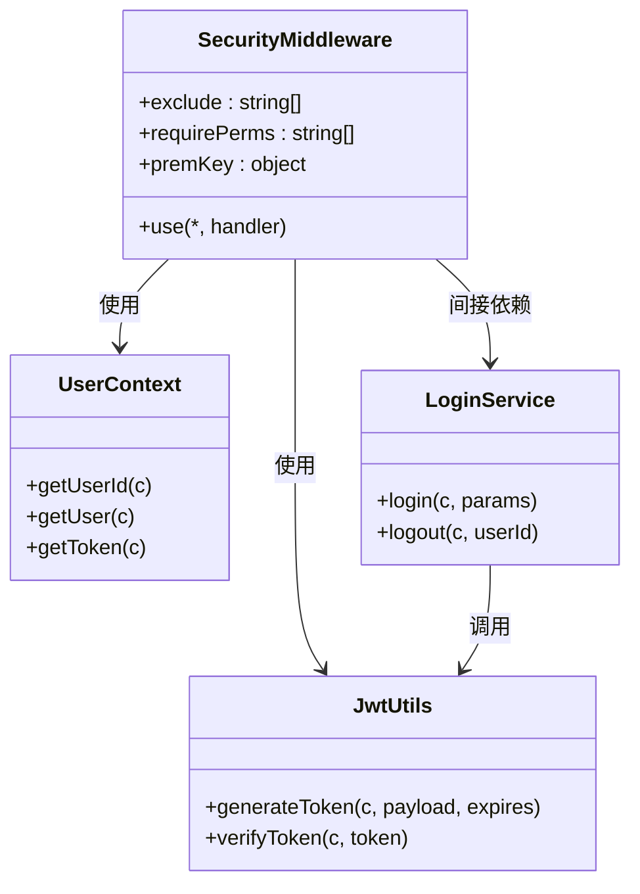

# 认证与授权

<cite>
**本文档引用文件**  
- [security.js](file://mail-worker/src/security/security.js)
- [jwt-utils.js](file://mail-worker/src/utils/jwt-utils.js)
- [login-service.js](file://mail-worker/src/service/login-service.js)
- [user-service.js](file://mail-worker/src/service/user-service.js)
- [user-context.js](file://mail-worker/src/security/user-context.js)
- [constant.js](file://mail-worker/src/const/constant.js)
</cite>

## 目录
1. [JWT认证机制概述](#jwt认证机制概述)
2. [JWT令牌生成流程](#jwt令牌生成流程)
3. [JWT验证中间件实现](#jwt验证中间件实现)
4. [令牌刷新策略与安全性](#令牌刷新策略与安全性)
5. [权限控制机制](#权限控制机制)
6. [认证失败响应规范](#认证失败响应规范)
7. [安全防护措施](#安全防护措施)

## JWT认证机制概述

cloud-mail系统采用基于JWT（JSON Web Token）的无状态认证机制，实现用户身份验证与权限控制。用户登录成功后，服务端生成包含用户身份信息的JWT令牌并返回客户端。后续请求需在HTTP头中携带该令牌，系统通过中间件自动验证其有效性，确保请求来源的合法性。

该机制结合HS256签名算法保障令牌完整性，利用KV存储维护用户会话状态，实现高效、安全的身份认证流程。

**本节来源**  
- [security.js](file://mail-worker/src/security/security.js#L1-L172)
- [jwt-utils.js](file://mail-worker/src/utils/jwt-utils.js#L1-L88)

## JWT令牌生成流程

### Payload结构设计

JWT令牌的Payload部分包含以下关键字段：
- `userId`：用户唯一标识
- `token`：随机生成的UUID，用于绑定当前会话
- `iat`（Issued At）：签发时间戳
- `exp`（Expiration Time）：过期时间戳（可选）

该结构由`login-service.js`中的`login`方法调用`jwt-utils.js`的`generateToken`函数生成。

### HS256签名算法应用

系统使用HMAC-SHA256（HS256）算法对JWT进行签名，确保令牌内容不可篡改。签名密钥从环境变量`jwt_secret`读取，通过Web Crypto API完成加密操作。

### 令牌有效期与刷新策略

- **有效期**：默认24小时（由`constant.TOKEN_EXPIRE`定义）
- **刷新机制**：每日首次请求时自动刷新`refreshTime`，并更新KV存储中的用户信息
- **多设备支持**：每个用户最多保留10个有效令牌，超出后自动移除最旧令牌



**图示来源**  
- [login-service.js](file://mail-worker/src/service/login-service.js#L200-L250)
- [jwt-utils.js](file://mail-worker/src/utils/jwt-utils.js#L5-L40)
- [user-service.js](file://mail-worker/src/service/user-service.js#L300-L320)

## JWT验证中间件实现

### Bearer Token验证流程

`security.js`中的全局中间件负责验证请求头中的Bearer Token：

1. 从请求头`Authorization`或自定义头`TOKEN_HEADER`获取JWT
2. 调用`jwt-utils.verifyToken`解析并验证令牌有效性
3. 检查KV存储中是否存在对应用户会话
4. 验证用户权限（如需）
5. 将用户信息注入请求上下文

### 用户身份信息解析

通过`user-context.js`提供的工具方法可获取当前请求的用户信息：
- `getUserId(c)`：获取当前用户ID
- `getUser(c)`：获取完整用户对象
- `getToken(c)`：解析并返回当前会话token



**图示来源**  
- [security.js](file://mail-worker/src/security/security.js#L30-L150)
- [jwt-utils.js](file://mail-worker/src/utils/jwt-utils.js#L45-L85)
- [user-context.js](file://mail-worker/src/security/user-context.js#L5-L15)

## 令牌刷新策略与安全性

### 刷新接口设计

系统未提供独立的刷新接口，而是采用**隐式刷新机制**：
- 每日首次请求时检测`refreshTime`
- 若非当日时间，则更新用户活跃时间并持久化KV存储
- 此机制避免了频繁的令牌刷新请求

### 安全性考虑

#### 刷新频率限制
- 通过`refreshTime`字段限制每日仅更新一次用户信息
- 防止恶意用户频繁触发数据库写操作

#### 旧令牌失效处理
- 用户登出时从KV存储的`tokens`数组中移除对应token
- 账号禁用或删除时清除整个KV会话数据
- 保证令牌一旦注销即刻失效

#### 会话管理
- 所有有效会话token集中存储于KV数据库
- 支持多设备登录（最多10个并发会话）
- 通过UUID确保会话唯一性

**本节来源**  
- [login-service.js](file://mail-worker/src/service/login-service.js#L230-L250)
- [user-service.js](file://mail-worker/src/service/user-service.js#L300-L310)
- [security.js](file://mail-worker/src/security/security.js#L130-L140)

## 权限控制机制

### 权限映射表

系统通过`premKey`对象建立权限标识与API路径的映射关系，例如：
- `'email:send'` → `['/email/send']`
- `'user:delete'` → `['/user/delete','/user/deleteAccount']`

### 权限验证流程

1. 中间件检测请求路径是否在`requirePerms`列表中
2. 若需权限校验，查询用户拥有的`permKeys`
3. 将`permKeys`转换为可访问路径列表
4. 检查当前请求路径是否在允许范围内
5. 管理员账号（env.admin）默认拥有所有权限

### 特殊权限处理

- **公开接口**：以`/public`开头的接口通过独立的`publicToken`验证
- **免认证接口**：登录、注册等路径在`exclude`列表中，无需JWT验证
- **超级管理员**：环境变量指定的管理员邮箱享有`*`通配权限



**图示来源**  
- [security.js](file://mail-worker/src/security/security.js#L10-L25)
- [jwt-utils.js](file://mail-worker/src/utils/jwt-utils.js#L1-L88)
- [user-context.js](file://mail-worker/src/security/user-context.js#L1-L20)
- [login-service.js](file://mail-worker/src/service/login-service.js#L200-L250)

## 认证失败响应规范

### 响应状态码

| 状态码 | 含义 | 触发场景 |
|--------|------|----------|
| 401 | Unauthorized | 令牌缺失、格式错误、签名无效、已过期 |
| 403 | Forbidden | 权限不足、非管理员访问受限接口 |

### 错误响应格式

```json
{
  "error": "错误信息（国际化）",
  "code": HTTP状态码
}
```

### 典型错误场景

- `authExpired`：令牌过期或会话不存在
- `unauthorized`：用户无权访问该资源
- `publicTokenFail`：公开接口token验证失败
- `isBanUser`：用户已被禁用

所有错误信息通过`i18n`模块实现多语言支持，确保国际化体验一致性。

**本节来源**  
- [security.js](file://mail-worker/src/security/security.js#L100-L120)
- [login-service.js](file://mail-worker/src/service/login-service.js#L50-L70)
- [biz-error.js](file://mail-worker/src/error/biz-error.js)

## 安全防护措施

### 重放攻击防范

- **短期令牌**：24小时有效期降低重放风险
- **会话绑定**：每个令牌与特定UUID绑定，登出后立即失效
- **HTTPS强制**：生产环境应强制使用HTTPS传输令牌

### 中间人攻击防护

- **不存储敏感信息**：JWT payload中不包含密码等敏感数据
- **环境密钥隔离**：签名密钥通过环境变量注入，不硬编码在代码中
- **KV存储加密**：用户会话数据在KV存储中以JSON加密形式保存

### 其他安全实践

- **输入验证**：登录前验证邮箱格式、密码长度等
- **失败锁定**：虽未实现账户锁定，但通过turnstile人机验证防止暴力破解
- **活动追踪**：记录用户最后活跃IP、设备信息，便于安全审计

**本节来源**  
- [security.js](file://mail-worker/src/security/security.js)
- [jwt-utils.js](file://mail-worker/src/utils/jwt-utils.js)
- [login-service.js](file://mail-worker/src/service/login-service.js)
- [constant.js](file://mail-worker/src/const/constant.js)