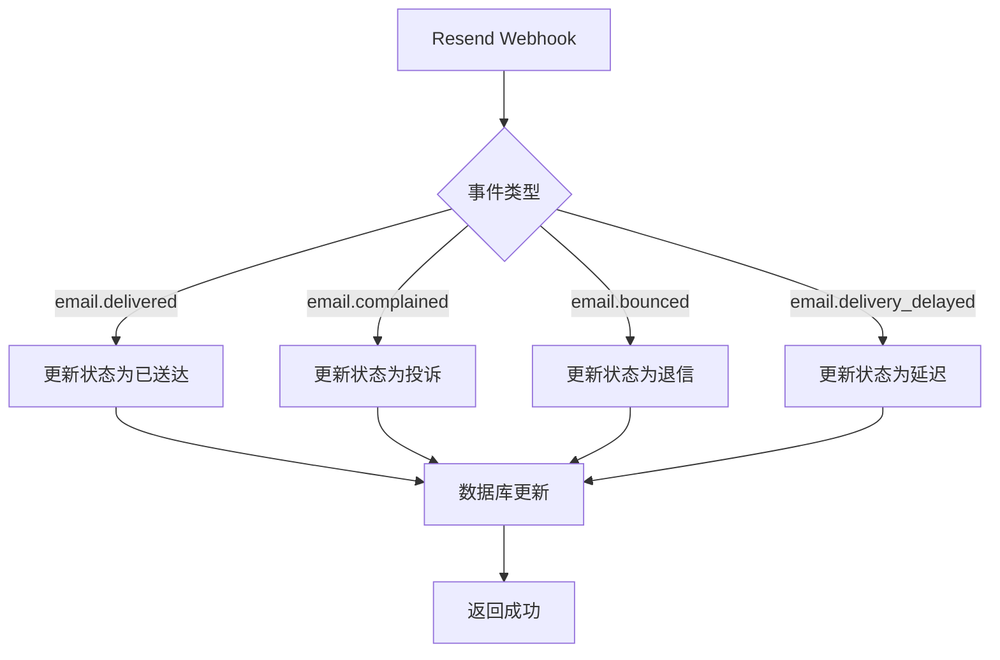
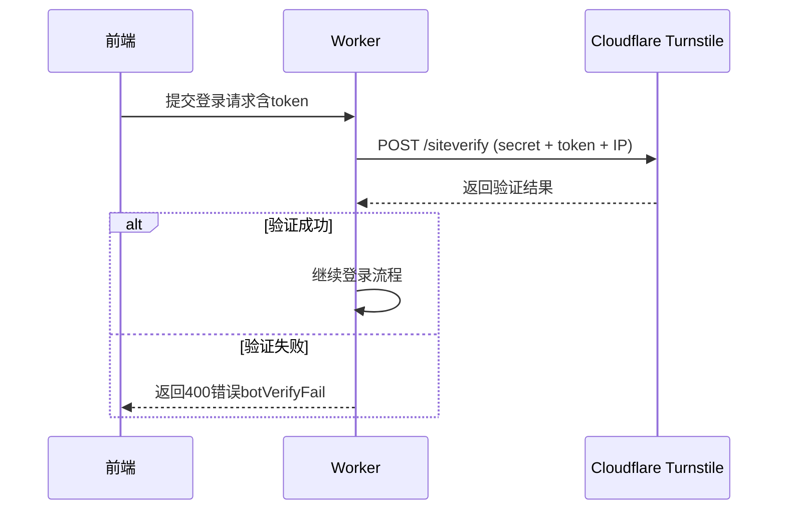

# 常见问题排查

<cite>
**本文档引用文件**  
- [biz-error.js](file://mail-worker/src/error/biz-error.js)
- [wrangler.toml](file://mail-worker/wrangler.toml)
- [resend-service.js](file://mail-worker/src/service/resend-service.js)
- [turnstile-service.js](file://mail-worker/src/service/turnstile-service.js)
- [index.js](file://mail-vue/src/axios/index.js)
- [constant.js](file://mail-worker/src/const/constant.js)
- [entity-const.js](file://mail-worker/src/const/entity-const.js)
- [kv-const.js](file://mail-worker/src/const/kv-const.js)
- [verify-utils.js](file://mail-vue/src/utils/verify-utils.js)
</cite>

## 目录
1. [简介](#简介)
2. [部署与初始化问题](#部署与初始化问题)
3. [D1数据库连接异常](#d1数据库连接异常)
4. [邮件发送失败（Resend API错误）](#邮件发送失败resend-api错误)
5. [登录验证不通过（Turnstile配置错误）](#登录验证不通过turnstile配置错误)
6. [跨域与前端资源加载失败](#跨域与前端资源加载失败)
7. [业务错误码解析与排查路径](#业务错误码解析与排查路径)
8. [高频问题诊断步骤](#高频问题诊断步骤)
9. [健康检查脚本示例](#健康检查脚本示例)

## 简介
本指南旨在为`cloud-mail`系统的部署、运行和使用过程中可能遇到的典型问题提供系统性排查方案。涵盖Worker部署失败、D1数据库连接异常、邮件发送失败、Turnstile验证失败、跨域问题及前端资源加载失败等常见故障。结合`biz-error`中定义的业务错误码，提供精准的排查路径与修复建议，并推荐使用Cloudflare Dashboard的Logs与Metrics进行问题定位。

## 部署与初始化问题

### Worker部署失败（wrangler报错）
当使用Wrangler部署时出现错误，常见原因包括：
- `wrangler.toml`配置错误（如D1数据库ID、KV命名空间ID不正确）
- 缺少必需环境变量（如`jwt_secret`、`admin`邮箱未配置）
- 构建命令执行失败（前端打包失败）

**排查步骤：**
1. 检查`wrangler.toml`中`database_id`、`id`（KV）、`bucket_name`等配置是否正确。
2. 确保`[vars]`部分已正确填写`jwt_secret`和`admin`。
3. 执行`pnpm --prefix ../mail-vue run build`验证前端能否正常打包。
4. 查看Cloudflare Dashboard中的部署日志（Logs）确认具体错误信息。

**Section sources**
- [wrangler.toml](file://mail-worker/wrangler.toml#L1-L40)

## D1数据库连接异常

### 问题表现
- 接口返回`501`错误码
- 日志中出现`D1 binding not found`或`database not accessible`
- 初始化失败，无法创建表结构

### 可能原因
- D1数据库未正确绑定或ID错误
- 数据库处于非活跃状态
- SQL执行超时或语法错误

### 解决方案
1. 登录Cloudflare Dashboard，确认D1数据库状态为“Active”。
2. 核对`wrangler.toml`中`database_id`是否与实际一致。
3. 检查Worker代码中D1操作是否使用了正确的binding名称（默认为`db`）。
4. 使用`db.prepare().bind().all()`测试连接。

**Section sources**
- [wrangler.toml](file://mail-worker/wrangler.toml#L8-L10)
- [constant.js](file://mail-worker/src/const/constant.js)

## 邮件发送失败（Resend API错误）

### Resend Webhook状态处理
系统通过Resend的Webhook接收邮件投递状态，相关逻辑在`resend-service.js`中实现。



**Diagram sources**
- [resend-service.js](file://mail-worker/src/service/resend-service.js#L3-L45)

### 常见错误码与处理
| 错误码 | 含义 | 排查建议 |
|-------|------|---------|
| 400 | 请求参数错误 | 检查Resend API密钥是否正确配置 |
| 401 | 认证失败 | 确认Resend API密钥权限 |
| 429 | 请求频率超限 | 检查Resend配额限制 |
| 500 | 内部服务器错误 | 查看Cloudflare Logs中详细错误堆栈 |

**Section sources**
- [resend-service.js](file://mail-worker/src/service/resend-service.js#L1-L46)

## 登录验证不通过（Turnstile配置错误）

### 验证流程
系统使用Cloudflare Turnstile进行机器人验证，核心逻辑在`turnstile-service.js`中。



**Diagram sources**
- [turnstile-service.js](file://mail-worker/src/service/turnstile-service.js#L1-L35)
- [verify-utils.js](file://mail-vue/src/utils/verify-utils.js)

### 常见问题
- **错误信息：`botVerifyFail`（错误码400）**
  - 原因：Turnstile `secretKey`未配置或错误
  - 解决：在系统设置中正确填写Turnstile的Secret Key
- **错误信息：`emptyBotToken`**
  - 原因：前端未正确传递验证token
  - 解决：检查前端验证码组件是否正常加载并提交token

**Section sources**
- [turnstile-service.js](file://mail-worker/src/service/turnstile-service.js#L1-L35)

## 跨域与前端资源加载失败

### 跨域问题
系统通过Hono处理CORS，若出现跨域错误：
- 检查`wrangler.toml`中`[assets]`配置是否启用`run_worker_first = true`
- 确保前端请求的域名与Worker绑定域名一致

### 前端资源加载失败
- **表现**：页面空白、CSS/JS加载404
- **原因**：静态资源目录配置错误或未正确打包
- **解决方案**：
  1. 确认`wrangler.toml`中`directory = "./dist"`路径正确
  2. 执行`pnpm --prefix ../mail-vue run build`重新打包
  3. 检查部署后`dist`目录是否包含`index.html`及静态资源

**Section sources**
- [wrangler.toml](file://mail-worker/wrangler.toml#L24-L27)
- [index.js](file://mail-vue/src/axios/index.js#L1-L123)

## 业务错误码解析与排查路径

### BizError定义
系统统一使用`BizError`类处理业务异常，定义于`biz-error.js`。

```javascript
class BizError extends Error {
	constructor(message, code) {
		super(message);
		this.code = code ? code : 501;
		this.name = 'BizError';
	}
}
```

**Section sources**
- [biz-error.js](file://mail-worker/src/error/biz-error.js#L1-L9)

### 常见业务错误码
| 错误码 | 含义 | 排查路径 |
|-------|------|---------|
| 400 | 参数错误或验证失败 | 检查请求参数、Turnstile token、JWT格式 |
| 401 | 未授权 | 检查token是否过期或未登录 |
| 403 | 权限不足 | 检查用户角色权限配置 |
| 501 | 业务逻辑失败 | 查看Logs中具体错误信息，如数据库操作失败 |
| 502 | 后端服务不可用 | 检查Worker是否正常运行，D1/R2连接状态 |

**Section sources**
- [biz-error.js](file://mail-worker/src/error/biz-error.js)
- [index.js](file://mail-vue/src/axios/index.js#L40-L120)

## 高频问题诊断步骤

### 初始化失败
1. 检查`wrangler.toml`中`[build]`命令是否能本地执行成功。
2. 查看部署日志是否有`D1`或`KV`绑定失败信息。
3. 确认`[vars]`中`jwt_secret`和`admin`已配置。

### 权限不足（403）
1. 登录数据库检查`user`表中用户角色是否正确。
2. 检查`role-perm`表中角色权限映射。
3. 清除浏览器缓存并重新登录。

**Section sources**
- [wrangler.toml](file://mail-worker/wrangler.toml)
- [entity-const.js](file://mail-worker/src/const/entity-const.js)

## 健康检查脚本示例

### 健康检查API
可调用`/api/public/health`接口检查系统状态。

```bash
curl -X GET https://your-domain.com/api/public/health
```

预期返回：
```json
{
  "code": 200,
  "message": "OK",
  "data": {
    "status": "healthy",
    "timestamp": "2025-04-05T12:00:00Z"
  }
}
```

### 自动化检查脚本（Shell）
```bash
#!/bin/bash
URL="https://your-domain.com/api/public/health"
RESPONSE=$(curl -s -o /dev/null -w "%{http_code}" $URL)

if [ $RESPONSE -eq 200 ]; then
  echo "✅ 系统健康"
else
  echo "❌ 系统异常，HTTP状态码: $RESPONSE"
  exit 1
fi
```

**Section sources**
- [public-api.js](file://mail-worker/src/api/public-api.js)
- [public-service.js](file://mail-worker/src/service/public-service.js)