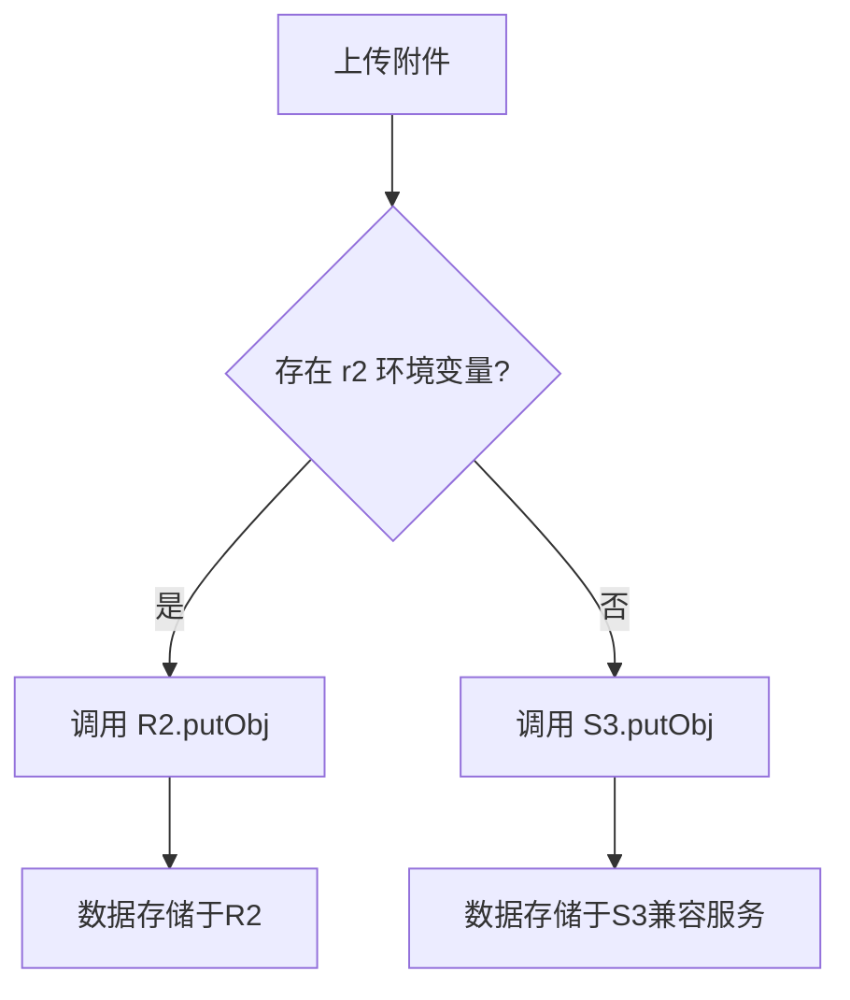

# 备份策略

<cite>
**本文档引用的文件**  
- [github-action.md](file://doc/github-action.md)
- [wrangler.toml](file://mail-worker/wrangler.toml)
- [wrangler-action.toml](file://mail-worker/wrangler-action.toml)
- [init.js](file://mail-worker/src/init/init.js)
- [setting.js](file://mail-worker/src/entity/setting.js)
- [att.js](file://mail-worker/src/entity/att.js)
- [user.js](file://mail-worker/src/entity/user.js)
- [email.js](file://mail-worker/src/entity/email.js)
- [r2-service.js](file://mail-worker/src/service/r2-service.js)
- [kv-const.js](file://mail-worker/src/const/kv-const.js)
</cite>

## 目录
1. [引言](#引言)
2. [D1数据库备份策略](#d1数据库备份策略)
3. [GitHub Actions自动化导出机制](#github-actions自动化导出机制)
4. [R2对象存储附件版本控制与跨区域复制](#r2对象存储附件版本控制与跨区域复制)
5. [KV缓存数据持久化与TTL管理](#kv缓存数据持久化与ttl管理)
6. [备份频率与保留周期建议](#备份频率与保留周期建议)
7. [敏感数据加密处理方案](#敏感数据加密处理方案)

## 引言
本策略文档详细说明cloud-mail系统中核心数据的备份与高可用保障机制。系统依托Cloudflare生态组件（D1、R2、KV）实现邮件、用户、权限、附件等关键数据的多层次保护。通过自动备份、定期快照导出、版本控制与加密传输等手段，确保在故障、误操作或安全事件中数据可恢复、可追溯。

## D1数据库备份策略

cloud-mail系统使用Cloudflare D1数据库存储邮件元数据、用户账户、权限配置等核心结构化数据。D1提供内置的自动备份功能，所有数据库变更均被持续记录并安全存储。为增强数据可移植性与异地容灾能力，系统通过GitHub Actions定期执行数据库快照导出。

数据库表结构包括：
- `user`：用户账户信息（邮箱、密码哈希、状态等）
- `email`：邮件元数据（发件人、收件人、主题、状态等）
- `attachments`：附件元数据（文件名、大小、存储键等）
- `setting`：系统配置（包括R2/S3存储设置）
- `perm`：权限定义

**Section sources**
- [user.js](file://mail-worker/src/entity/user.js#L1-L23)
- [email.js](file://mail-worker/src/entity/email.js#L1-L28)
- [att.js](file://mail-worker/src/entity/att.js#L1-L22)
- [setting.js](file://mail-worker/src/entity/setting.js#L1-L45)
- [perm.js](file://mail-worker/src/entity/perm.js#L1-L11)

## GitHub Actions自动化导出机制

系统利用GitHub Actions实现D1数据库快照的自动化导出，确保核心数据在代码仓库外有独立副本。该机制通过`wrangler-action.toml`配置文件与GitHub Secrets协同工作。

### 触发条件
- **手动触发**：在GitHub仓库的Actions页面手动运行工作流。
- **自动触发**：当上游仓库（如主项目）有更新并同步（Sync Upstream）后，自动触发部署与备份流程。

### 实现方式
1. **环境变量注入**：GitHub Actions工作流通过Secrets注入`D1_DATABASE_ID`、`CLOUDFLARE_ACCOUNT_ID`等关键凭证。
2. **Wrangler配置**：`wrangler-action.toml`文件使用`${D1_DATABASE_ID}`等占位符，运行时由GitHub Actions替换为实际值，绑定D1数据库。
3. **快照导出**：工作流执行`wrangler d1 backup create`命令，创建D1数据库的加密快照并上传至安全位置（通常为R2或GitHub仓库的加密存储）。
4. **加密传输**：所有与Cloudflare API的通信均通过HTTPS进行，Secrets在传输和存储时均加密。

### 配置文件示例
```toml
[[d1_databases]]
binding = "db"
database_name = "cloud-mail"
database_id = "${D1_DATABASE_ID}"
```

**Section sources**
- [github-action.md](file://doc/github-action.md#L1-L37)
- [wrangler-action.toml](file://mail-worker/wrangler-action.toml#L1-L40)

## R2对象存储附件版本控制与跨区域复制

邮件附件等静态资源存储于Cloudflare R2对象存储中，以实现高可用性与持久性。

### 版本控制
R2原生支持对象版本控制。当附件被更新或覆盖时，旧版本不会被删除，而是作为历史版本保留。这允许在文件被意外修改或删除时，从控制台或API恢复到任意历史版本。

### 跨区域复制
R2提供跨区域复制（Cross-Region Replication, CRR）功能。系统可配置将主区域（如us-east）的存储桶自动同步到另一个地理区域（如eu-west）。此配置确保在单个区域发生大规模中断时，附件数据仍可在备用区域访问，实现地理冗余。

### 存储配置
系统通过`setting`表中的`bucket`、`region`、`endpoint`、`s3_access_key`、`s3_secret_key`字段配置R2或兼容S3的存储后端。若`r2`环境变量存在，则优先使用R2绑定；否则回退到S3服务。



**Diagram sources**
- [r2-service.js](file://mail-worker/src/service/r2-service.js#L1-L52)
- [setting.js](file://mail-worker/src/entity/setting.js#L24-L43)

**Section sources**
- [r2-service.js](file://mail-worker/src/service/r2-service.js#L1-L52)
- [setting.js](file://mail-worker/src/entity/setting.js#L24-L43)

## KV缓存数据持久化与TTL管理

系统使用Cloudflare KV存储临时数据和缓存，如用户认证信息、系统设置缓存等。

### 持久化快照策略
KV本身是分布式键值存储，数据在多个边缘节点复制，具有高可用性。虽然KV设计为最终一致且非强持久化，但关键数据（如`setting:`）会同时存储在D1数据库中。KV在此作为D1的缓存层，其“持久化”依赖于源数据（D1）的备份策略。当需要恢复时，可通过重新从D1加载数据来重建KV缓存。

### TTL管理机制
KV中的每个键均可设置生存时间（TTL）。系统通过`KvConst`定义不同数据的键前缀和预期生命周期：
- `auth-uid:`：用户认证信息，通常设置较短的TTL（如15分钟），以平衡安全与性能。
- `setting:`：系统设置，可设置较长的TTL（如1小时），减少对数据库的查询压力。
- `send_day_count:`：分析数据，根据业务需求设置TTL。

当数据过期后，KV会自动删除该键。应用在读取时若发现缓存缺失，则从D1数据库重新加载并写入KV。

**Section sources**
- [kv-const.js](file://mail-worker/src/const/kv-const.js#L1-L8)
- [setting.js](file://mail-worker/src/entity/setting.js#L1-L45)

## 备份频率与保留周期建议

为平衡数据安全与存储成本，提出以下建议：

### 备份频率
- **每日全量备份**：通过GitHub Actions工作流，每天在低峰期（如UTC 16:00，对应北京时间次日00:00）执行一次D1数据库全量快照导出。此由`wrangler.toml`中的`crons = ["0 16 * * *"]`定时器触发。
- **每小时增量备份**：D1的自动备份功能提供近实时的增量备份，理论上可恢复到过去24小时内任意时间点。

### 保留周期
- **D1自动备份**：遵循Cloudflare D1的默认保留策略（通常为30天）。
- **GitHub Actions导出快照**：建议在远程存储（如另一个S3桶或云存储）中保留最近7天的每日快照，以及每月末的快照用于长期归档（保留1年）。
- **R2对象版本**：开启版本控制，非当前版本的对象保留90天后自动删除（可通过生命周期策略配置）。
- **KV数据**：不单独保留，依赖D1的备份进行恢复。

## 敏感数据加密处理方案

系统对敏感数据实施多层加密保护：

1. **传输加密**：所有API通信强制使用HTTPS。
2. **静态加密**：
   - D1、R2、KV的所有数据在Cloudflare层面默认静态加密。
   - 数据库中的密码字段（`user.password`）使用加盐哈希（salted hash）存储，不可逆。
3. **应用层加密**（可选）：对于极高敏感数据（如`setting`表中的`secretKey`），可在写入D1前由应用层使用`jwt_secret`派生的密钥进行AES加密，读取时再解密。
4. **密钥管理**：`jwt_secret`、`s3_secret_key`等密钥通过GitHub Secrets和Cloudflare环境变量安全注入，不硬编码在代码中。

**Section sources**
- [wrangler.toml](file://mail-worker/wrangler.toml#L1-L41)
- [init.js](file://mail-worker/src/init/init.js#L1-L47)
- [jwt-utils.js](file://mail-worker/src/utils/jwt-utils.js#L1-L52)
- [setting.js](file://mail-worker/src/entity/setting.js#L1-L45)