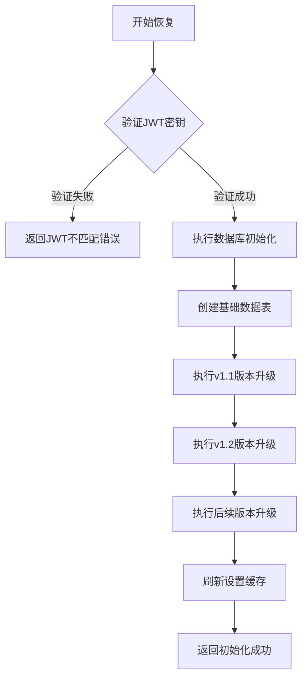
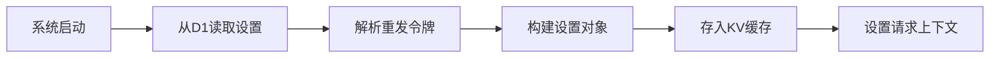
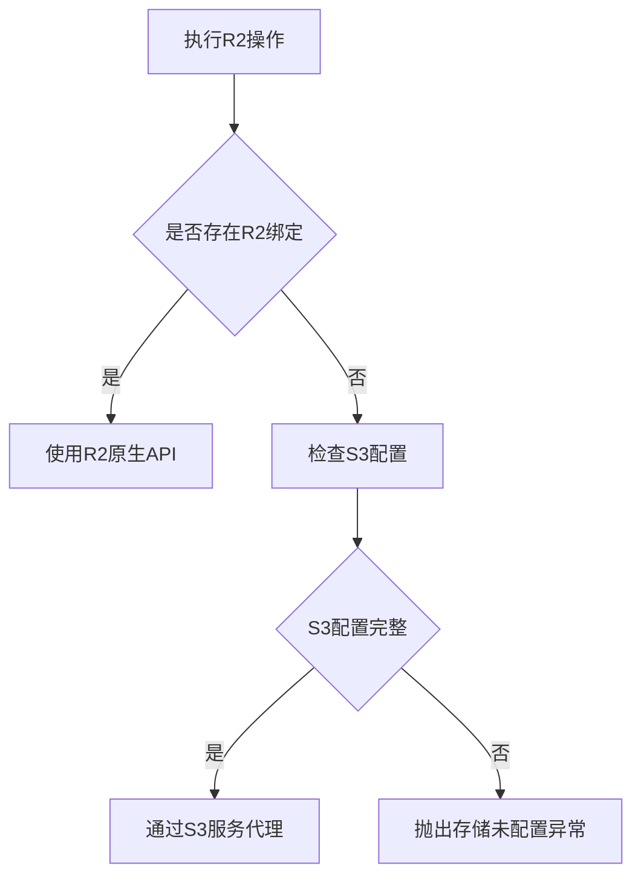

# 恢复流程

<cite>
**本文档引用的文件**
- [init.js](file://mail-worker/src/init/init.js)
- [setting-service.js](file://mail-worker/src/service/setting-service.js)
- [r2-service.js](file://mail-worker/src/service/r2-service.js)
- [kv-const.js](file://mail-worker/src/const/kv-const.js)
- [init-api.js](file://mail-worker/src/api/init-api.js)
</cite>

## 目录
1. [引言](#引言)
2. [D1数据库恢复流程](#d1数据库恢复流程)
3. [KV缓存层重建](#kv缓存层重建)
4. [R2附件存储回滚](#r2附件存储回滚)
5. [服务恢复验证清单](#服务恢复验证清单)
6. [常见错误与注意事项](#常见错误与注意事项)
7. [结论](#结论)

## 引言
本文档旨在为cloud-mail系统在遭遇数据丢失或服务中断时提供标准恢复流程。文档详细说明了从D1数据库备份快照中还原数据的操作步骤，包括环境准备、模式校验、数据导入与一致性验证。同时描述了KV缓存层在恢复后的重建过程，以及R2附件存储的版本回滚方法。最后提供完整的服务恢复验证清单，并强调恢复过程中应避免的常见错误。

## D1数据库恢复流程

### 环境准备
在执行数据库恢复前，必须确保运行环境已正确配置。系统依赖D1数据库作为主要数据存储，需确认D1绑定已正确设置。若环境检查发现D1未绑定，系统将返回"Cannot read properties of undefined (reading 'prepare')"错误。

**Section sources**
- [init.js](file://mail-worker/src/init/init.js#L0-L532)
- [hono.js](file://mail-worker/src/hono/hono.js#L0-L30)

### 模式校验与初始化
系统通过`init`接口进行数据库模式校验和初始化。该过程需要提供与环境变量`jwt_secret`匹配的密钥才能执行。初始化流程按版本逐步执行数据库结构变更，确保数据表结构与当前代码版本兼容。

**Diagram sources**
- [init.js](file://mail-worker/src/init/init.js#L10-L532)

### 数据导入与一致性验证
数据库恢复包含多个阶段的结构迁移，从基础表创建到字段添加和索引优化。系统首先创建核心数据表（email、user、account等），然后逐步添加新版本所需的字段和约束。对于邮件数据，系统会自动处理收件人字段的格式转换，将旧的`receive_email`字段迁移到新的`recipient`JSON格式。

**Section sources**
- [init.js](file://mail-worker/src/init/init.js#L417-L459)
- [init.js](file://mail-worker/src/init/init.js#L248-L280)

## KV缓存层重建

### 缓存重建机制
KV缓存层在系统恢复后需要重新加载必要状态。系统使用Cloudflare KV存储关键配置和会话信息。主要缓存键包括：`auth-uid:`（用户认证信息）、`setting:`（系统设置）、`send_day_count:`（每日发送计数）和`public_key:`（公钥信息）。

### 设置缓存刷新
`settingService.refresh`方法负责将数据库中的系统设置同步到KV缓存。该过程首先从D1数据库查询设置数据，然后将其序列化为JSON格式存储到KV中，同时在请求上下文中设置缓存副本以提高访问效率。

**Section sources**
- [setting-service.js](file://mail-worker/src/service/setting-service.js#L0-L180)
- [kv-const.js](file://mail-worker/src/const/kv-const.js#L0-L7)

## R2附件存储回滚

### 存储配置检查
R2附件存储的回滚操作依赖于正确的存储配置。系统通过`r2Service.hasOSS`方法检查存储可用性，优先使用直接绑定的R2环境，若未配置则回退到S3兼容接口。检查内容包括bucket、region、endpoint以及访问密钥等必要参数。

### 回滚操作方法
R2存储回滚通过`r2Service`提供的标准接口执行：
- `putObj`：上传对象到R2存储
- `getObj`：从R2获取对象
- `delete`：删除指定对象

当系统检测到直接R2绑定时，使用原生R2 API；否则通过`s3Service`代理到S3兼容接口。

**Diagram sources**
- [r2-service.js](file://mail-worker/src/service/r2-service.js#L0-L53)

**Section sources**
- [r2-service.js](file://mail-worker/src/service/r2-service.js#L0-L53)
- [setting-service.js](file://mail-worker/src/service/setting-service.js#L120-L145)

## 服务恢复验证清单

### API连通性测试
验证所有API端点的可访问性，特别是初始化接口`/init/:secret`的响应状态。

### 用户登录验证
测试用户认证流程，确保KV缓存中的`auth-uid:`键能正确处理会话。

### 邮件读取与发送功能检查
验证邮件CRUD操作：
- 邮件列表查询
- 邮件内容读取
- 新邮件发送
- 附件上传与下载

**Section sources**
- [init-api.js](file://mail-worker/src/api/init-api.js#L0-L6)
- [setting-service.js](file://mail-worker/src/service/setting-service.js#L20-L45)

## 常见错误与注意事项

### 版本不匹配
确保恢复使用的备份快照版本与当前部署代码版本兼容。系统通过一系列版本升级函数（v1_1DB、v1_2DB等）处理模式变更，版本不匹配可能导致字段缺失或数据迁移失败。

### 权限缺失
恢复过程需要以下权限：
- D1数据库写入权限
- KV存储读写权限
- R2/S3存储访问权限

### 环境变量配置
必须正确设置以下环境变量：
- `jwt_secret`：初始化接口认证密钥
- `domain`：域名配置
- R2或S3存储相关凭证

**Section sources**
- [init.js](file://mail-worker/src/init/init.js#L10-L15)
- [hono.js](file://mail-worker/src/hono/hono.js#L15-L25)

## 结论
cloud-mail系统的恢复流程是一个多阶段、多组件协同的过程。成功的恢复不仅需要完整的数据备份，还需要正确的环境配置和权限设置。建议在非生产环境先行演练恢复流程，确保团队熟悉各步骤和潜在问题的解决方案。