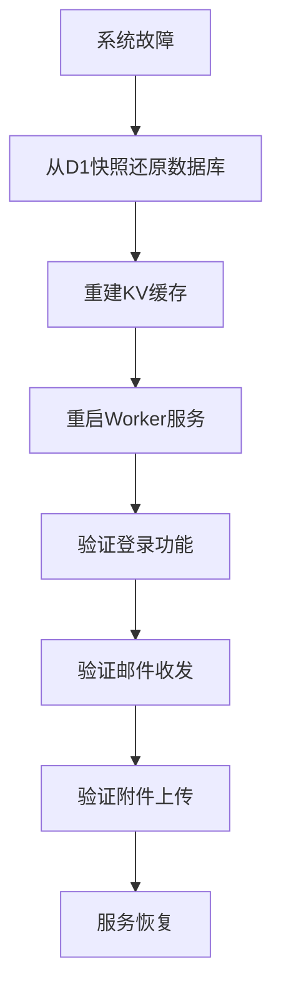

# 数据备份与恢复

<cite>
**本文档引用的文件**
- [github-action.md](file://doc/github-action.md)
- [wrangler.toml](file://mail-worker/wrangler.toml)
- [constant.js](file://mail-worker/src/const/constant.js)
- [kv-const.js](file://mail-worker/src/const/kv-const.js)
- [setting-service.js](file://mail-worker/src/service/setting-service.js)
- [r2-service.js](file://mail-worker/src/service/r2-service.js)
- [email-service.js](file://mail-worker/src/service/email-service.js)
- [orm.js](file://mail-worker/src/entity/orm.js)
- [email.js](file://mail-worker/src/entity/email.js)
</cite>

## 目录
1. [引言](#引言)
2. [D1数据库备份与恢复策略](#d1数据库备份与恢复策略)
3. [R2对象存储冗余与版本控制](#r2对象存储冗余与版本控制)
4. [系统故障恢复流程](#系统故障恢复流程)
5. [版本回滚机制](#版本回滚机制)
6. [备份恢复演练建议](#备份恢复演练建议)

## 引言
本文件旨在为cloud-mail系统设计全面的数据持久化与灾难恢复策略。系统采用Cloudflare生态中的D1数据库、R2对象存储和KV命名空间实现数据存储与缓存。文档详细说明了如何通过自动化机制保护核心数据，包括数据库备份、附件冗余存储、服务恢复流程及版本回滚方案，确保系统在故障或人为错误时具备快速恢复能力。

## D1数据库备份与恢复策略

cloud-mail系统使用Cloudflare D1数据库作为核心数据存储，存储用户账户、邮件元数据、设置等关键信息。根据`wrangler.toml`配置，D1数据库通过`db`绑定与Worker服务集成，确保数据持久化。

为实现数据保护，建议采用以下备份机制：

1. **定期导出与自动化脚本**：利用Cloudflare Workers的定时触发器（Cron Triggers），可在`wrangler.toml`中配置每日执行数据库导出任务。通过编写自动化脚本调用D1的`dump`或`query` API，将数据库快照导出为SQL文件或JSON格式，并上传至安全的外部存储（如S3兼容存储或私有服务器）。

2. **GitHub Actions集成**：参考`github-action.md`文档，部署流程已通过GitHub Actions自动化。可在CI/CD流水线中扩展备份步骤，例如在每次部署前自动触发数据库快照，确保变更前有可用备份。Secrets中配置的`D1_DATABASE_ID`可用于在Action中调用D1 API进行备份操作。

3. **快照保留策略**：建议保留至少7天的每日快照和1个月的每周快照，以平衡存储成本与恢复需求。快照文件应加密存储，并限制访问权限。

**Section sources**
- [wrangler.toml](file://mail-worker/wrangler.toml#L1-L40)
- [github-action.md](file://doc/github-action.md#L0-L37)

## R2对象存储冗余与版本控制

邮件附件存储在R2对象存储中，通过`r2`绑定在`wrangler.toml`中配置。R2提供高可用性和持久性，但为增强数据保护，应配置以下策略：

1. **冗余策略**：R2默认在多个地理位置复制数据，确保高可用性。在`r2-service.js`中，系统通过`c.env.r2.put(key, content)`写入附件，利用R2的内置冗余机制。即使单个数据中心故障，数据仍可从其他位置恢复。

2. **版本控制配置**：建议在R2存储桶中启用版本控制。当附件被更新或删除时，旧版本将保留，防止意外覆盖或删除。恢复时可通过指定版本ID获取历史文件。

3. **生命周期管理**：可配置生命周期规则，将不常访问的附件自动迁移至低成本存储层级，或在指定时间后删除旧版本，以优化存储成本。

4. **跨区域复制（CRR）**：为实现跨区域灾难恢复，可配置R2的跨区域复制，将附件自动同步到另一个地理区域的存储桶中。

**Section sources**
- [wrangler.toml](file://mail-worker/wrangler.toml#L35-L38)
- [r2-service.js](file://mail-worker/src/service/r2-service.js#L0-L53)
- [setting-service.js](file://mail-worker/src/service/setting-service.js#L0-L180)

## 系统故障恢复流程

当系统发生故障时，应按以下流程进行恢复：

1. **数据库快照还原**：
   - 从最近的D1数据库快照中恢复数据。可通过Cloudflare CLI或API执行`d1 database restore`命令，指定备份文件和目标数据库ID。
   - 验证数据完整性，确保用户、邮件、设置等表已正确恢复。

2. **KV缓存重建**：
   - KV命名空间（`kv`绑定）用于缓存系统设置和用户认证信息，如`KvConst.SETTING`和`KvConst.AUTH_INFO`。
   - 恢复后，KV内容不会自动同步。需调用`settingService.refresh(c)`方法，从D1数据库重新加载设置并写入KV。
   - 用户登录状态需重新生成，旧JWT令牌将失效。

3. **服务重启与验证**：
   - 重启Worker服务，确保所有绑定（D1、R2、KV）正常连接。
   - 验证核心功能：用户登录、邮件收发、附件上传。
   - 检查定时任务（如`crons = ["0 16 * * *"]`）是否正常执行。

**Diagram sources**
- [wrangler.toml](file://mail-worker/wrangler.toml#L1-L40)
- [setting-service.js](file://mail-worker/src/service/setting-service.js#L0-L180)
- [kv-const.js](file://mail-worker/src/const/kv-const.js#L0-L8)

**Section sources**
- [wrangler.toml](file://mail-worker/wrangler.toml#L1-L40)
- [setting-service.js](file://mail-worker/src/service/setting-service.js#L0-L180)
- [kv-const.js](file://mail-worker/src/const/kv-const.js#L0-L8)

## 版本回滚机制

当新版本引入严重缺陷时，需执行版本回滚：

1. **Worker代码降级**：
   - 在GitHub仓库中，将`mail-worker`目录的代码回滚到上一个稳定版本的提交。
   - 触发GitHub Actions重新部署，使用`wrangler-action.toml`配置将旧版本发布到Cloudflare Workers。

2. **前端资源降级**：
   - `mail-vue`项目打包后的静态资源由`assets`绑定提供。
   - 回滚时，需重新构建旧版本的Vue项目，并将`dist`目录上传至部署流程，替换现有资源。

3. **数据兼容性检查**：
   - 回滚前需确认数据库模式（Schema）兼容性。若新版本修改了D1表结构（如`email.js`中的字段），回滚可能导致数据不一致。
   - 建议在回滚前备份当前数据库，并评估模式变更影响。

**Section sources**
- [wrangler-action.toml](file://mail-worker/wrangler-action.toml#L0-L40)
- [wrangler.toml](file://mail-worker/wrangler.toml#L1-L40)
- [email.js](file://mail-worker/src/entity/email.js#L0-L27)

## 备份恢复演练建议

为确保灾难恢复策略的有效性，建议定期执行备份恢复演练：

1. **演练频率**：每季度至少执行一次完整演练。
2. **操作步骤**：
   - 模拟数据库损坏，从备份快照恢复D1。
   - 验证KV缓存重建流程。
   - 检查R2附件的可访问性。
   - 测试用户登录和邮件功能。
3. **验证清单**：
   - [ ] 数据库连接正常
   - [ ] 核心表数据完整
   - [ ] KV缓存已重建
   - [ ] 附件可正常上传下载
   - [ ] 用户可成功登录
   - [ ] 邮件收发功能正常
4. **记录与改进**：详细记录演练过程、耗时和问题，持续优化恢复流程。

**Section sources**
- [setting-service.js](file://mail-worker/src/service/setting-service.js#L0-L180)
- [r2-service.js](file://mail-worker/src/service/r2-service.js#L0-L53)