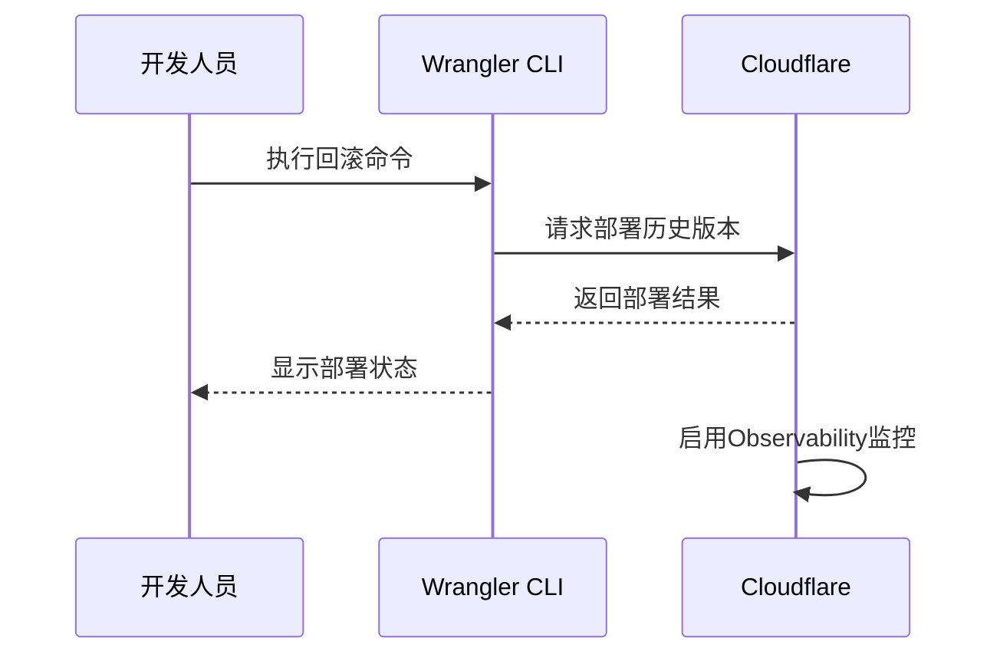
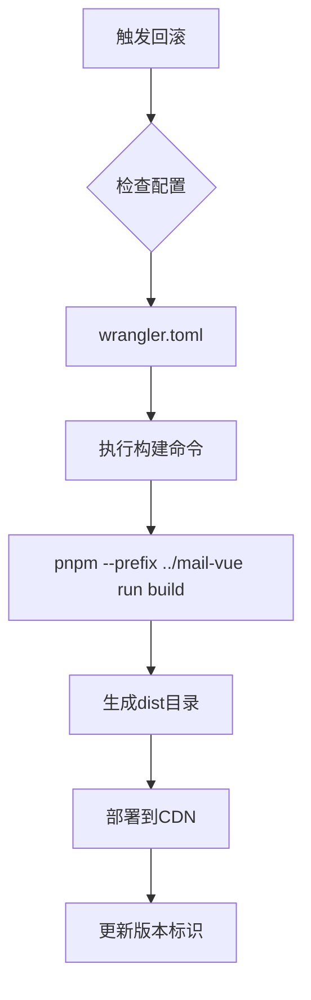
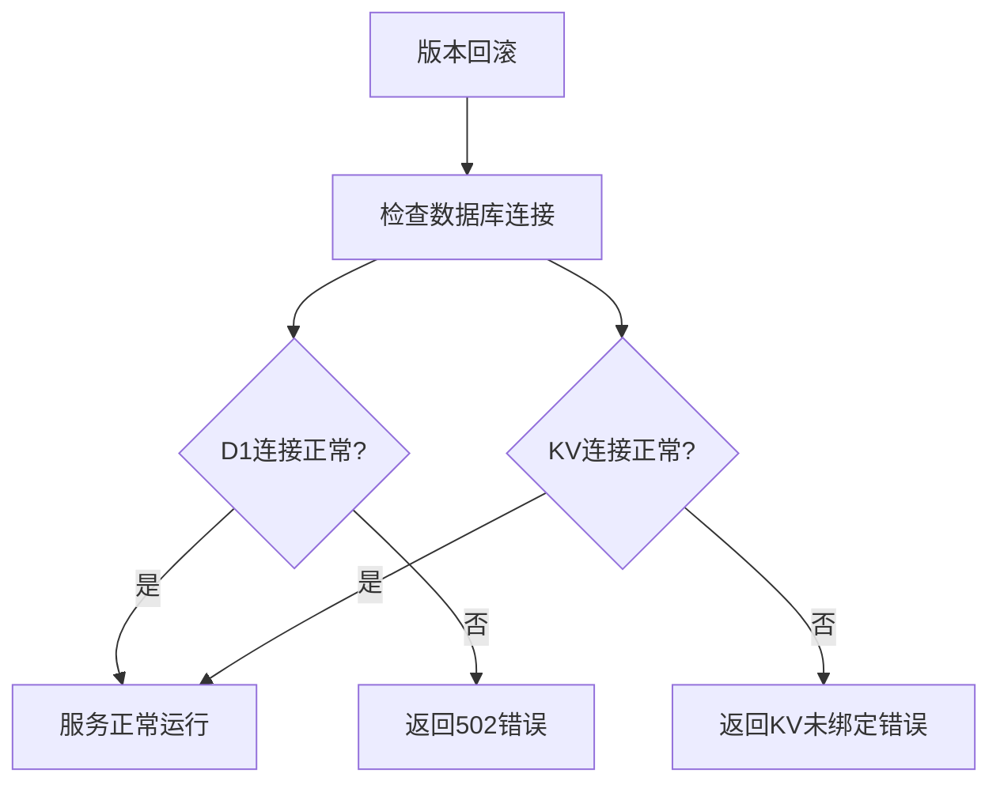

# 版本回滚

<cite>
**本文档引用的文件**  
- [wrangler.toml](file://mail-worker/wrangler.toml)
- [wrangler-action.toml](file://mail-worker/wrangler-action.toml)
- [vite.config.js](file://mail-vue/vite.config.js)
- [github-action.md](file://doc/github-action.md)
- [index.js](file://mail-worker/src/index.js)
- [webs.js](file://mail-worker/src/hono/webs.js)
- [hono.js](file://mail-worker/src/hono/hono.js)
</cite>

## 目录
1. [简介](#简介)
2. [Cloudflare Worker版本回滚机制](#cloudflare-worker版本回滚机制)
3. [前端静态资源版本控制与回滚](#前端静态资源版本控制与回滚)
4. [数据库兼容性管理](#数据库兼容性管理)
5. [变更管理流程建议](#变更管理流程建议)
6. [结论](#结论)

## 简介
本文档详细说明cloud-mail系统在升级失败或出现严重缺陷时的版本回滚策略。涵盖后端Cloudflare Worker、前端Vue应用的回滚方法，强调数据库兼容性的重要性，并提供变更管理的最佳实践建议，确保系统稳定性和可维护性。

## Cloudflare Worker版本回滚机制

cloud-mail系统通过Wrangler CLI和GitHub Actions流水线实现Cloudflare Worker的快速版本回滚。系统利用Cloudflare的版本历史功能，可快速部署到上一个已知稳定的版本。

### 版本标识与部署命令
通过`wrangler.toml`配置文件定义Worker的基本属性，包括名称、主入口文件和构建命令。在CI/CD流程中，每次部署都会生成唯一的版本标识。

使用Wrangler CLI进行回滚的操作命令如下：
```bash
wrangler deploy --config wrangler-action.toml --env production
```
通过指定配置文件和环境，可快速重新部署指定版本。

### 状态监控与验证
部署后，系统通过Observability功能监控Worker运行状态。`hono.js`中的错误处理机制会捕获并返回结构化错误信息，便于快速诊断问题。



**Diagram sources**
- [wrangler.toml](file://mail-worker/wrangler.toml#L1-L41)
- [wrangler-action.toml](file://mail-worker/wrangler-action.toml)

**Section sources**
- [wrangler.toml](file://mail-worker/wrangler.toml#L1-L41)
- [index.js](file://mail-worker/src/index.js#L1-L25)

## 前端静态资源版本控制与回滚

前端Vue应用通过Vite构建系统和CDN实现静态资源的版本控制与回滚。

### 构建与部署配置
`vite.config.js`文件配置了构建输出目录和基础路径，确保资源的正确引用。构建过程由Worker的`wrangler.toml`文件中的build命令自动触发。

```javascript
build: {
    outDir: env.VITE_OUT_DIR || 'dist',
    emptyOutDir: true
}
```

### 资源同步回滚
当回滚Worker版本时，对应的前端资源也会从`dist`目录重新部署，确保HTML、JS、CSS文件版本一致。`assets`绑定确保静态资源与Worker版本同步。



**Diagram sources**
- [vite.config.js](file://mail-vue/vite.config.js#L1-L62)
- [wrangler.toml](file://mail-worker/wrangler.toml#L35-L40)

**Section sources**
- [vite.config.js](file://mail-vue/vite.config.js#L1-L62)
- [wrangler.toml](file://mail-worker/wrangler.toml#L35-L40)

## 数据库兼容性管理

系统使用D1数据库和KV命名空间，回滚时必须确保数据库结构的向前兼容性。

### 数据库绑定配置
`wrangler.toml`文件中定义了D1数据库和KV命名空间的绑定，确保不同版本间的数据访问一致性。

```toml
[[d1_databases]]
binding = "db"
database_name = "email"
database_id = "b1b1a63a-6ef5-4e6d-8e8c-b6d9e8feb810"

[[kv_namespaces]]
binding = "kv"
id = "0fa01d4b299e481b9de060ece9e7785c"
```

### 兼容性检查
`hono.js`中的错误处理机制会检测数据库连接问题，并返回相应的错误信息，防止因数据库不兼容导致的服务中断。



**Diagram sources**
- [wrangler.toml](file://mail-worker/wrangler.toml#L6-L15)
- [hono.js](file://mail-worker/src/hono/hono.js#L1-L34)

**Section sources**
- [wrangler.toml](file://mail-worker/wrangler.toml#L6-L15)
- [hono.js](file://mail-worker/src/hono/hono.js#L1-L34)

## 变更管理流程建议

### 审批流程
建议实施双人审批机制，所有生产环境部署需经过至少两名授权人员审核。

### 通知机制
部署前后应通过邮件或即时通讯工具通知相关团队成员，包括：
- 部署时间窗口
- 影响范围
- 回滚预案

### 事后复盘
每次回滚操作后应进行复盘会议，分析根本原因，包括：
- 缺陷产生的技术原因
- 测试覆盖的不足
- 监控告警的有效性
- 改进部署流程的建议

**Section sources**
- [github-action.md](file://doc/github-action.md#L1-L38)

## 结论
cloud-mail系统的版本回滚机制通过Wrangler CLI和GitHub Actions实现了后端Worker和前端静态资源的协同回滚。通过严格的数据库兼容性管理和规范的变更流程，确保了系统在出现问题时能够快速恢复，保障服务的稳定性和可靠性。