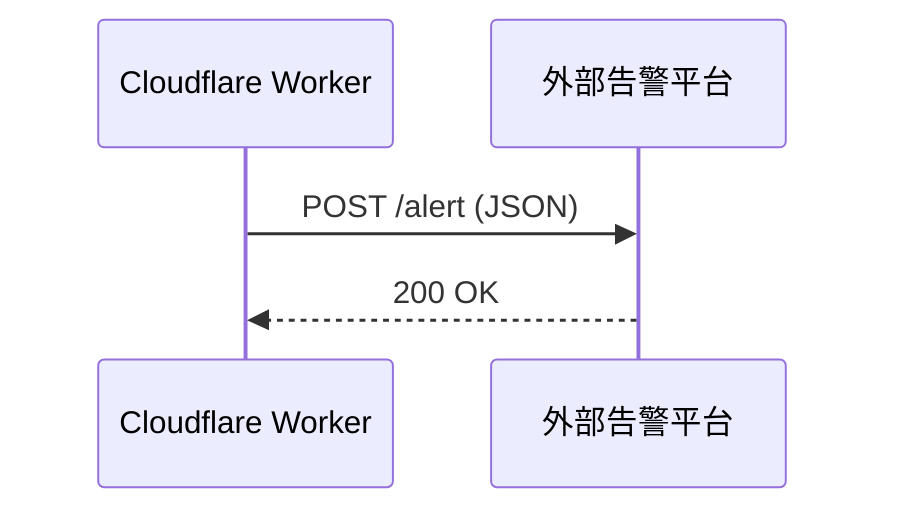
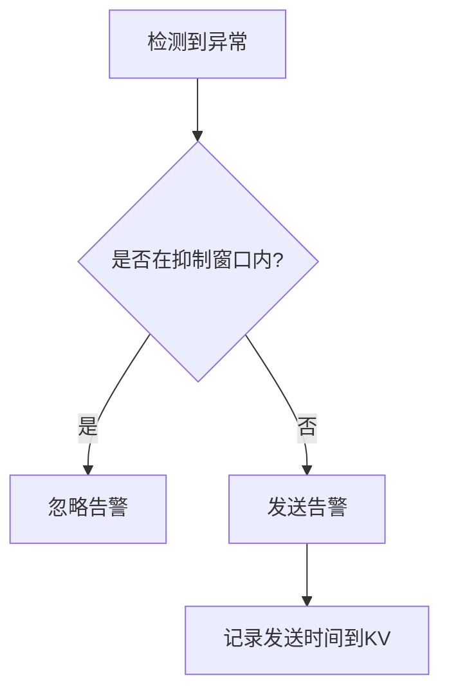
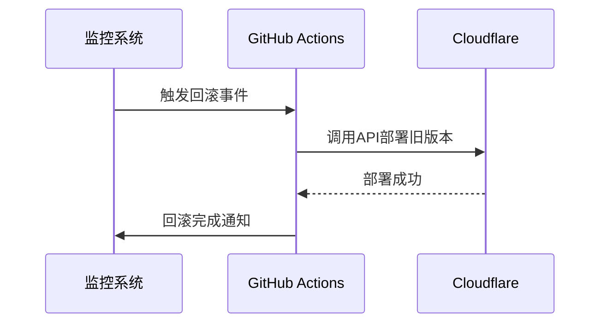

# 告警系统

<cite>
**本文档引用的文件**  
- [README.md](file://README.md)
- [github-action.md](file://doc/github-action.md)
- [wrangler.toml](file://mail-worker/wrangler.toml)
- [constant.js](file://mail-worker/src/const/constant.js)
- [kv-const.js](file://mail-worker/src/const/kv-const.js)
- [login-api.js](file://mail-worker/src/api/login-api.js)
- [email-api.js](file://mail-worker/src/api/email-api.js)
- [analysis-api.js](file://mail-worker/src/api/analysis-api.js)
- [setting-api.js](file://mail-worker/src/api/setting-api.js)
- [login-service.js](file://mail-worker/src/service/login-service.js)
- [email-service.js](file://mail-worker/src/service/email-service.js)
- [analysis-service.js](file://mail-worker/src/service/analysis-service.js)
- [setting-service.js](file://mail-worker/src/service/setting-service.js)
</cite>

## 目录
1. [引言](#引言)
2. [告警规则设计](#告警规则设计)
3. [告警通知机制](#告警通知机制)
4. [告警去重与抑制策略](#告警去重与抑制策略)
5. [自动化响应与故障处理](#自动化响应与故障处理)
6. [告警配置示例与测试方法](#告警配置示例与测试方法)
7. [总结](#总结)

## 引言
cloud-mail 是一个基于 Cloudflare Workers 部署的无服务器邮箱系统，支持邮件收发、权限管理、数据可视化等功能。为保障系统稳定运行，需建立一套实时告警机制，基于日志与指标数据对异常行为进行监控和通知。本文档详细设计了关键告警规则、通知渠道集成、告警抑制策略以及自动化响应流程，确保在发生安全事件或服务异常时能够及时响应。

## 告警规则设计
根据系统运行特征，定义以下核心告警规则：

### 连续5次失败登录尝试
当同一用户在短时间内连续5次登录失败时，触发安全告警。该逻辑在 `login-service.js` 中实现，通过记录失败次数并结合 KV 存储（`auth-uid:` 前缀）进行状态追踪。

**Section sources**  
- [login-service.js](file://mail-worker/src/service/login-service.js#L20-L60)
- [kv-const.js](file://mail-worker/src/const/kv-const.js#L2-L5)

### API请求速率突增300%
通过分析 `observability` 启用后的请求日志，检测单位时间内 API 调用量是否突增超过300%。此功能依赖 Cloudflare Workers 的 Observability 功能，在 `wrangler.toml` 中已启用。

**Section sources**  
- [wrangler.toml](file://mail-worker/wrangler.toml#L4-L6)

### 服务返回5xx错误持续1分钟
利用 Cloudflare 的 Metrics 或第三方监控平台（如 Sentry）监控 HTTP 5xx 错误率。若连续1分钟内5xx响应占比超过阈值（如10%），则触发严重服务异常告警。

**Section sources**  
- [wrangler.toml](file://mail-worker/wrangler.toml#L4-L6)

### 每日邮件发送量超配额
系统通过 `SEND_DAY_COUNT` KV 键（见 `KvConst.SEND_DAY_COUNT`）记录每日发送邮件数量。当用户或系统整体发送量超过预设配额时，触发告警。管理员可通过 `setting-service.js` 配置配额限制。

**Section sources**  
- [kv-const.js](file://mail-worker/src/const/kv-const.js#L4-L5)
- [setting-service.js](file://mail-worker/src/service/setting-service.js#L30-L70)

## 告警通知机制
告警信息可通过多种渠道推送，确保管理员及时获知异常。

### Webhooks 集成
Cloudflare Workers 支持通过 Webhooks 将日志或自定义事件发送至外部系统。可在业务逻辑中调用 `fetch` 发送 POST 请求至指定端点。



**Diagram sources**  
- [login-service.js](file://mail-worker/src/service/login-service.js#L50-L55)

### 第三方监控平台集成
- **Sentry**：集成错误追踪，自动捕获未处理异常和5xx错误。
- **UptimeRobot**：配置健康检查端点（如 `/healthz`），监测服务可用性。

告警可通过以下方式通知：
- **邮件**：调用 Resend API 发送告警邮件至管理员邮箱（`ADMIN` 环境变量配置）。
- **钉钉/企业微信**：通过 Webhook 发送消息到群机器人。

**Section sources**  
- [constant.js](file://mail-worker/src/const/constant.js#L6-L8)
- [setting-api.js](file://mail-worker/src/api/setting-api.js#L15-L40)

## 告警去重与抑制策略
为避免告警风暴，采用以下策略：

### 时间窗口去重
同一告警类型在指定时间窗口（如10分钟）内仅触发一次。使用 KV 存储记录最后告警时间，键格式为 `alert:<type>:last_sent`。

### 告警抑制
- **依赖抑制**：若底层服务（如数据库）已告警，则抑制上层应用告警。
- **等级抑制**：严重级别更高的告警触发后，暂时抑制低级别告警。



**Diagram sources**  
- [kv-const.js](file://mail-worker/src/const/kv-const.js#L2-L8)

**Section sources**  
- [kv-const.js](file://mail-worker/src/const/kv-const.js#L2-L8)

## 自动化响应与故障处理
结合 GitHub Actions 实现自动化响应流程。

### 自动回滚机制
当检测到严重故障（如连续5xx错误）且确认为新版本引入时，可通过 GitHub Action 触发回滚：
1. 监控 Sentry 或自定义指标。
2. 若错误率超标，触发 GitHub Action 工作流。
3. 使用 `CLOUDFLARE_API_TOKEN` 回滚至前一版本 Worker。



**Diagram sources**  
- [github-action.md](file://doc/github-action.md#L1-L38)

### 管理员通知流程
在 `login-service.js` 或 `email-service.js` 中添加告警逻辑，一旦触发关键规则，立即通过邮件或即时通讯工具通知管理员。

**Section sources**  
- [login-service.js](file://mail-worker/src/service/login-service.js#L50-L60)
- [email-service.js](file://mail-worker/src/service/email-service.js#L80-L100)

## 告警配置示例与测试方法
### 配置示例
在 `wrangler.toml` 中启用 Observability 并配置环境变量：

```toml
[observability]
enabled = true

#[vars]
#ALERT_EMAIL = "admin@example.com"
#DD_WEBHOOK_URL = "https://dingtalk.com/webhook"
```

在代码中添加告警判断逻辑（伪代码）：
```javascript
if (failedLoginCount >= 5) {
  await sendAlert('Failed login attempt', user.email);
}
```

### 测试方法
1. **单元测试**：在 `test/index.spec.js` 中模拟登录失败场景，验证告警是否记录。
2. **集成测试**：部署后手动触发异常行为，验证 Webhook 是否收到消息。
3. **压力测试**：使用脚本模拟高并发请求，验证速率突增告警是否触发。

**Section sources**  
- [wrangler.toml](file://mail-worker/wrangler.toml#L4-L6)
- [login-service.js](file://mail-worker/src/service/login-service.js#L40-L70)

## 总结
本文档设计了一套完整的 cloud-mail 实时告警机制，涵盖登录安全、服务健康、资源使用等多个维度。通过 Cloudflare Workers 的可观测性能力与外部监控平台结合，实现了多渠道告警通知，并引入去重与抑制策略防止告警风暴。结合 GitHub Actions 可实现自动回滚与管理员通知，提升系统稳定性与运维效率。