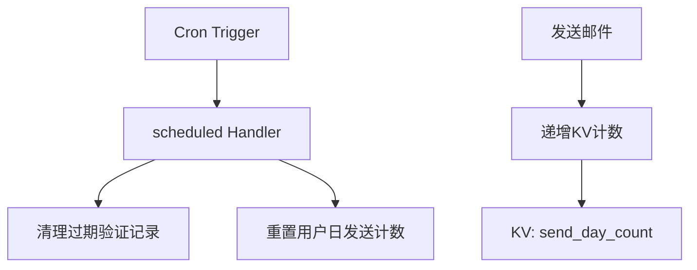
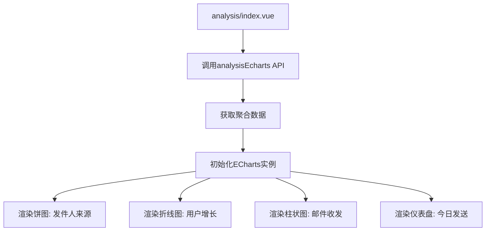
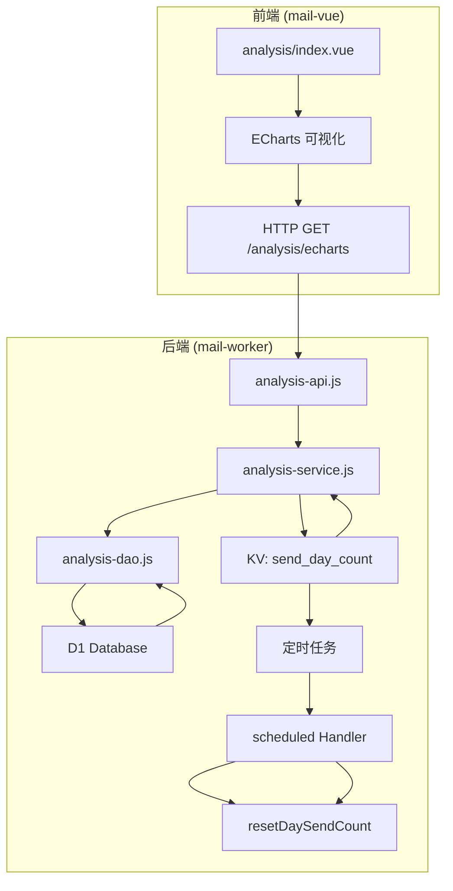

# 指标监控

<cite>
**本文档引用文件**  
- [analysis-api.js](file://mail-worker/src/api/analysis-api.js)
- [analysis-service.js](file://mail-worker/src/service/analysis-service.js)
- [analysis-dao.js](file://mail-worker/src/dao/analysis-dao.js)
- [index.js](file://mail-worker/src/index.js)
- [kv-const.js](file://mail-worker/src/const/kv-const.js)
- [index.vue](file://mail-vue/src/views/analysis/index.vue)
- [analysis.js](file://mail-vue/src/request/analysis.js)
- [index.js](file://mail-vue/src/echarts/index.js)
</cite>

## 目录
1. [简介](#简介)
2. [核心指标采集机制](#核心指标采集机制)
3. [数据聚合与定时任务](#数据聚合与定时任务)
4. [前端可视化实现](#前端可视化实现)
5. [性能优化建议](#性能优化建议)
6. [系统架构图](#系统架构图)
7. [结论](#结论)

## 简介
cloud-mail系统通过Cloudflare Workers内置能力构建了一套完整的指标监控体系，用于实时跟踪邮件服务的关键性能指标。该体系涵盖每分钟请求量、HTTP错误率、平均响应延迟、每日邮件发送总数及活跃用户数等核心指标。系统采用D1数据库进行持久化存储，并结合KV缓存实现高效数据聚合。前端通过ECharts组件在`analysis/index.vue`中实现多维度可视化展示，包括趋势图、饼图和实时数据表格，为系统运维和业务分析提供有力支持。

## 核心指标采集机制

cloud-mail系统利用Cloudflare Workers的D1数据库与KV命名空间，通过SQL查询直接从持久化数据中提取关键指标。系统定义了多个核心指标的采集逻辑，包括：

- **邮件收发总量**：统计所有接收和发送的邮件数量。
- **用户与账户总数**：统计系统内注册用户和邮箱账户的总数。
- **活跃与删除状态统计**：区分正常状态与已删除状态的数据条目。
- **按日统计增长趋势**：基于创建时间对用户、收件、发件进行按日聚合。

这些指标通过DAO层的SQL语句直接从`email`、`user`和`account`表中聚合计算得出，确保数据准确性和一致性。

**Section sources**
- [analysis-dao.js](file://mail-worker/src/dao/analysis-dao.js#L1-L47)

## 数据聚合与定时任务

系统通过Cloudflare Workers的`Scheduled Handler`机制实现定时数据聚合任务。在`src/index.js`中定义了`scheduled`函数，该函数作为Cron Trigger的入口，定期执行以下任务：

1. **清理过期验证记录**：调用`verifyRecordService.clearRecord`清除过期的用户验证记录。
2. **重置用户日发送计数**：调用`userService.resetDaySendCount`将所有用户的日发送计数归零，确保每日限额从零开始计算。

此外，系统使用KV命名空间`send_day_count`来缓存每日邮件发送总数。该计数在邮件发送时通过原子操作递增，并在前端分析接口中直接读取，避免了实时聚合的性能开销。

**Diagram sources**
- [index.js](file://mail-worker/src/index.js#L19-L23)
- [kv-const.js](file://mail-worker/src/const/kv-const.js#L1-L7)
- [user-service.js](file://mail-worker/src/service/user-service.js#L358-L363)

**Section sources**
- [index.js](file://mail-worker/src/index.js#L19-L23)
- [user-service.js](file://mail-worker/src/service/user-service.js#L358-L363)
- [kv-const.js](file://mail-worker/src/const/kv-const.js#L1-L7)

## 前端可视化实现

前端监控仪表盘在`mail-vue/src/views/analysis/index.vue`中实现，通过ECharts组件展示多维度数据。系统通过`analysisEcharts` API获取后端聚合数据，并渲染为以下可视化组件：

- **统计卡片**：显示邮件收发总量、账户数、用户数等关键数字，使用`el-statistic`组件实现数字滚动动画。
- **发件人来源饼图**：展示接收邮件的发件人分布，使用ECharts饼图呈现前6大来源。
- **用户增长折线图**：显示过去15天的用户注册趋势，使用平滑折线图并填充渐变区域。
- **邮件收发柱状图**：堆叠柱状图展示每日接收与发送邮件数量。
- **今日发送量仪表盘**：使用环形仪表盘直观显示当日邮件发送总数。

前端通过`echarts/index.js`统一注册ECharts模块（柱状图、饼图、折线图、仪表盘），并通过`analysis.js`封装API请求，确保代码模块化和可维护性。

**Diagram sources**
- [index.vue](file://mail-vue/src/views/analysis/index.vue#L0-L799)
- [analysis.js](file://mail-vue/src/request/analysis.js#L0-L4)
- [index.js](file://mail-vue/src/echarts/index.js#L0-L25)

**Section sources**
- [index.vue](file://mail-vue/src/views/analysis/index.vue#L0-L799)
- [analysis.js](file://mail-vue/src/request/analysis.js#L0-L4)
- [index.js](file://mail-vue/src/echarts/index.js#L0-L25)

## 性能优化建议

为确保监控系统自身不影响主服务性能，建议采取以下优化策略：

1. **合理设置指标采样频率**：对于非实时性要求高的指标（如用户增长趋势），可降低数据采集频率，避免频繁数据库查询。
2. **采用预聚合策略**：对于高频访问的指标（如日发送总数），使用KV缓存存储预计算结果，避免每次请求都执行复杂SQL聚合。
3. **控制前端轮询间隔**：前端仪表盘应避免短间隔轮询，建议采用页面可见时加载一次的策略，或设置不低于30秒的轮询间隔。
4. **SQL查询优化**：在DAO层使用`CROSS JOIN`一次性获取多个聚合结果，减少数据库连接开销。
5. **时区处理优化**：在服务端统一处理时区转换，避免前端多次计算，减少数据传输量。
6. **数据过滤与补全**：在服务端对缺失日期进行补全（如`filterEmptyDay`方法），确保前端图表数据连续，减少前端逻辑复杂度。

通过上述优化，可在保证监控数据准确性和实时性的同时，最大限度降低对主邮件服务的性能影响。

## 系统架构图

**Diagram sources**
- [analysis-api.js](file://mail-worker/src/api/analysis-api.js#L1-L8)
- [analysis-service.js](file://mail-worker/src/service/analysis-service.js#L1-L90)
- [analysis-dao.js](file://mail-worker/src/dao/analysis-dao.js#L1-L104)
- [index.js](file://mail-worker/src/index.js#L19-L23)

## 结论
cloud-mail系统的指标监控体系通过紧密结合Cloudflare Workers的D1、KV和Scheduled Trigger能力，构建了一个高效、可靠的监控解决方案。系统实现了从数据采集、聚合、存储到前端可视化的完整闭环，为服务稳定性保障和业务决策提供了坚实的数据基础。通过合理的架构设计和性能优化，该监控系统能够在不影响主服务的前提下，持续提供精准的运营洞察。