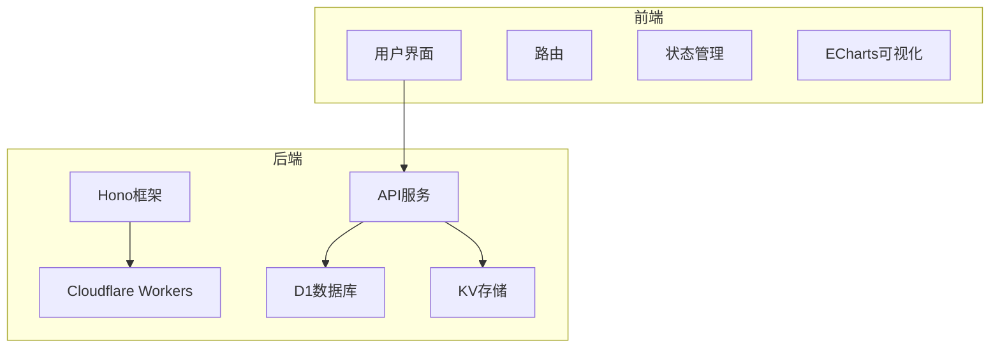
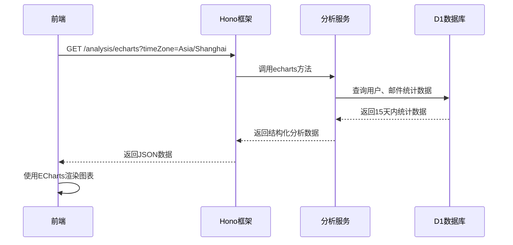
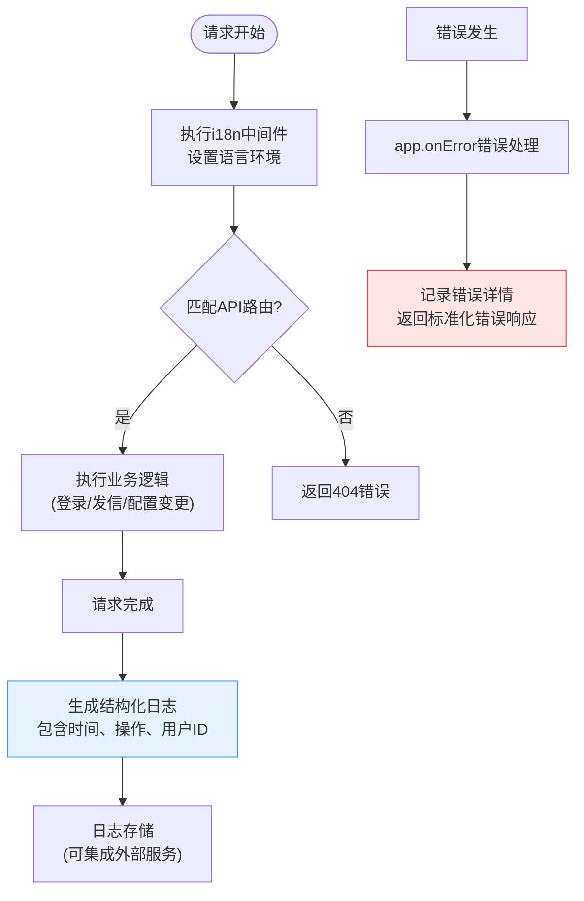
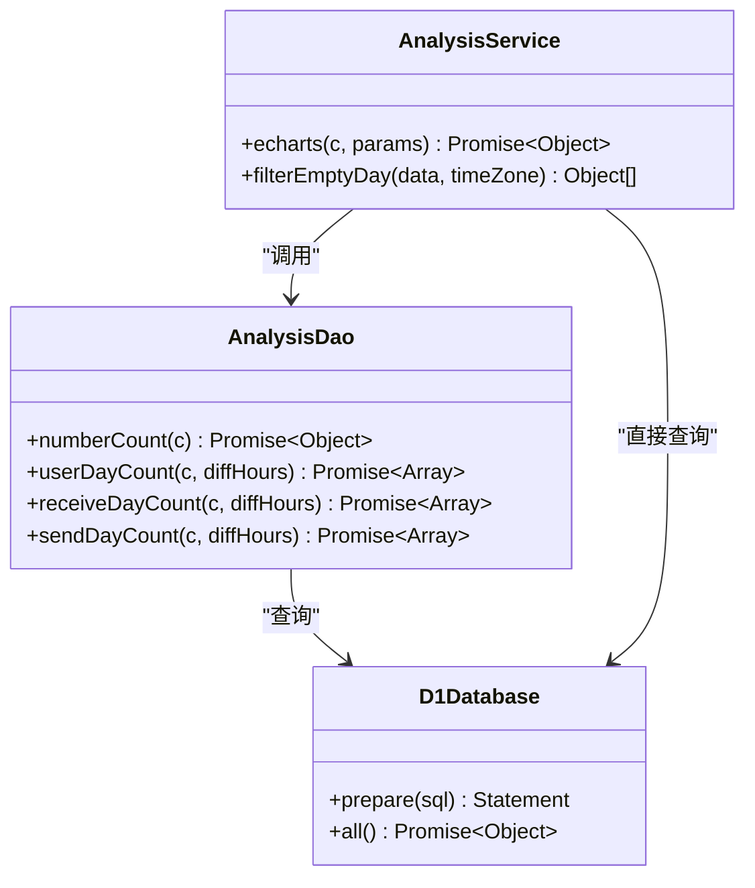
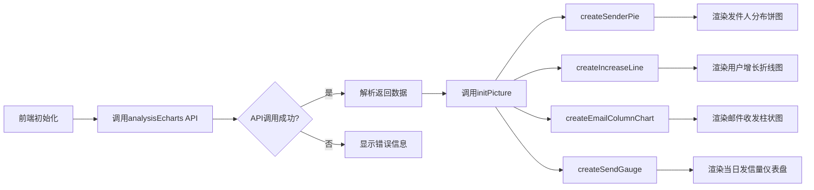
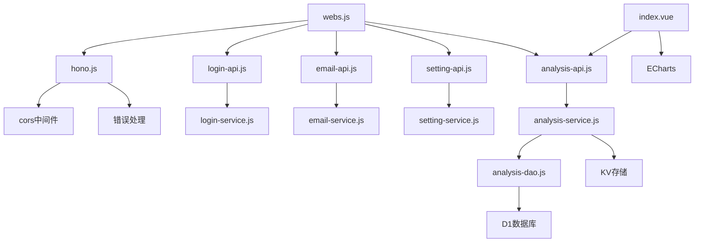

# 日志与监控

<cite>
**本文档引用的文件**   
- [hono.js](file://mail-worker/src/hono/hono.js)
- [login-api.js](file://mail-worker/src/api/login-api.js)
- [email-api.js](file://mail-worker/src/api/email-api.js)
- [setting-api.js](file://mail-worker/src/api/setting-api.js)
- [analysis-api.js](file://mail-worker/src/api/analysis-api.js)
- [analysis-service.js](file://mail-worker/src/service/analysis-service.js)
- [analysis-dao.js](file://mail-worker/src/dao/analysis-dao.js)
- [i18n.js](file://mail-worker/src/i18n/i18n.js)
- [index.vue](file://mail-vue/src/views/analysis/index.vue)
</cite>

## 目录
1. [简介](#简介)
2. [项目结构](#项目结构)
3. [核心组件](#核心组件)
4. [架构概述](#架构概述)
5. [详细组件分析](#详细组件分析)
6. [依赖分析](#依赖分析)
7. [性能考虑](#性能考虑)
8. [故障排除指南](#故障排除指南)
9. [结论](#结论)
10. [附录](#附录)（如有必要）

## 简介
本文档旨在为cloud-mail系统制定全面的日志记录与系统监控方案。通过分析Hono框架中的中间件实现，说明如何输出结构化日志以记录关键操作（如登录、发信、配置变更）的请求与响应信息。文档将指导如何利用Cloudflare Workers的Metrics API采集核心指标（如请求量、错误率、响应延迟、每日邮件发送数），并结合前端ECharts可视化组件构建系统健康仪表盘。同时，建议集成外部监控服务（如Sentry、Datadog）进行错误追踪与性能分析，并提供告警规则配置示例，实现对异常登录尝试、API调用激增、服务不可用等场景的实时通知。

## 项目结构
cloud-mail项目采用前后端分离架构，前端基于Vue框架构建用户界面，后端使用Cloudflare Workers运行在边缘网络。后端服务通过Hono框架提供RESTful API，处理邮件管理、用户认证、系统分析等核心功能。数据持久化通过D1数据库和KV存储实现，前端通过ECharts实现数据可视化。

**图示来源**
- [hono.js](file://mail-worker/src/hono/hono.js)
- [index.vue](file://mail-vue/src/views/analysis/index.vue)

**本节来源**
- [hono.js](file://mail-worker/src/hono/hono.js)
- [index.vue](file://mail-vue/src/views/analysis/index.vue)

## 核心组件
系统核心组件包括基于Hono的API路由、用户认证服务、邮件处理服务、系统分析服务和前端可视化组件。关键操作如登录、发信和配置变更均通过结构化日志记录，系统健康状态通过分析服务采集并由ECharts展示。

**本节来源**
- [login-api.js](file://mail-worker/src/api/login-api.js)
- [email-api.js](file://mail-worker/src/api/email-api.js)
- [setting-api.js](file://mail-worker/src/api/setting-api.js)
- [analysis-service.js](file://mail-worker/src/service/analysis-service.js)

## 架构概述
系统采用微服务架构，所有API请求通过Hono框架的中间件进行处理。关键操作日志通过中间件自动记录，系统指标通过D1数据库查询获取，并通过`/analysis/echarts`接口提供给前端。前端使用ECharts渲染多种图表，包括用户增长线图、邮件收发柱状图和当日发信量仪表盘。

**图示来源**
- [analysis-api.js](file://mail-worker/src/api/analysis-api.js)
- [analysis-service.js](file://mail-worker/src/service/analysis-service.js)
- [analysis-dao.js](file://mail-worker/src/dao/analysis-dao.js)

## 详细组件分析

### 日志记录中间件分析
系统通过Hono框架的中间件机制实现日志记录。`i18n.js`文件中的中间件不仅处理多语言，还为后续的日志记录提供了上下文。虽然当前代码未直接显示详细的日志中间件，但Hono的`app.onError`机制已在`hono.js`中实现，能够捕获并记录系统错误。

**图示来源**
- [hono.js](file://mail-worker/src/hono/hono.js#L0-L30)
- [i18n.js](file://mail-worker/src/i18n/i18n.js#L0-L30)

**本节来源**
- [hono.js](file://mail-worker/src/hono/hono.js)
- [i18n.js](file://mail-worker/src/i18n/i18n.js)

### 系统监控与分析服务
系统监控功能主要通过`analysis-service.js`和`analysis-dao.js`实现。分析服务通过D1数据库查询获取关键指标，包括总邮件数、用户数、账户数以及15天内的增长趋势。这些数据通过`/analysis/echarts`接口提供给前端。

**图示来源**
- [analysis-service.js](file://mail-worker/src/service/analysis-service.js)
- [analysis-dao.js](file://mail-worker/src/dao/analysis-dao.js)

**本节来源**
- [analysis-service.js](file://mail-worker/src/service/analysis-service.js)
- [analysis-dao.js](file://mail-worker/src/dao/analysis-dao.js)

### 前端可视化组件
前端使用ECharts组件库构建系统健康仪表盘。`analysis/index.vue`文件中定义了多种图表，包括用户增长折线图、邮件来源饼图、收发邮件柱状图和当日发信量仪表盘。这些图表通过调用`/analysis/echarts`接口获取数据并实时渲染。

**图示来源**
- [index.vue](file://mail-vue/src/views/analysis/index.vue)

**本节来源**
- [index.vue](file://mail-vue/src/views/analysis/index.vue)

## 依赖分析
系统依赖关系清晰，前端依赖ECharts进行数据可视化，后端依赖Hono框架处理HTTP请求，D1数据库存储结构化数据，KV存储用于缓存和临时数据。各API服务模块通过`webs.js`统一注册到Hono应用中。

**图示来源**
- [hono.js](file://mail-worker/src/hono/hono.js)
- [webs.js](file://mail-worker/src/hono/webs.js)
- [analysis-service.js](file://mail-worker/src/service/analysis-service.js)

**本节来源**
- [hono.js](file://mail-worker/src/hono/hono.js)
- [webs.js](file://mail-worker/src/hono/webs.js)
- [analysis-service.js](file://mail-worker/src/service/analysis-service.js)

## 性能考虑
系统性能优化主要体现在数据库查询和前端渲染两个方面。后端通过D1数据库的prepare语句优化查询性能，并使用`Promise.all`并行执行多个查询。前端通过防抖(debounce)机制优化窗口大小变化时的图表重绘，避免频繁的性能消耗。

## 故障排除指南
当系统监控出现问题时，应首先检查API接口是否正常返回数据。可通过直接访问`/analysis/echarts`接口验证后端服务状态。若前端图表不显示，检查浏览器控制台是否有JavaScript错误，并确认ECharts库是否正确加载。对于日志记录问题，检查Hono的`app.onError`是否正确捕获并记录错误。

**本节来源**
- [hono.js](file://mail-worker/src/hono/hono.js#L10-L30)
- [index.vue](file://mail-vue/src/views/analysis/index.vue)

## 结论
cloud-mail系统已具备基本的日志记录和监控能力。通过Hono框架的中间件机制，可以进一步完善结构化日志输出，记录所有关键操作的详细信息。系统已通过`/analysis/echarts`接口提供核心指标，前端使用ECharts成功构建了健康仪表盘。建议下一步集成Sentry或Datadog等外部监控服务，实现更强大的错误追踪和性能分析功能，并配置实时告警规则，确保系统稳定运行。

## 附录

### 告警规则配置示例
以下为建议的告警规则配置：

| 告警场景 | 指标 | 阈值 | 通知方式 |
|---------|------|------|---------|
| 异常登录尝试 | 登录失败次数 | 5分钟内>10次 | 邮件、短信 |
| API调用激增 | 请求量 | 1分钟内增长300% | 企业微信、钉钉 |
| 服务不可用 | HTTP 5xx错误率 | 5分钟内>5% | 电话、短信 |
| 邮件发送异常 | 发送失败率 | 1小时内>20% | 邮件、企业微信 |

**本节来源**
- [login-api.js](file://mail-worker/src/api/login-api.js)
- [email-api.js](file://mail-worker/src/api/email-api.js)