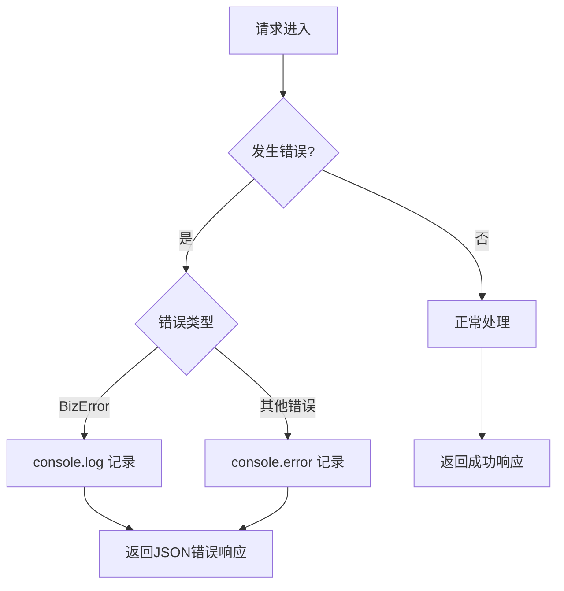

# 日志策略

<cite>
**本文档引用的文件**   
- [hono.js](file://mail-worker/src/hono/hono.js)
- [login-service.js](file://mail-worker/src/service/login-service.js)
- [email.js](file://mail-worker/src/email/email.js)
- [init.js](file://mail-worker/src/init/init.js)
- [date-uitil.js](file://mail-worker/src/utils/date-uitil.js)
</cite>

## 目录
1. [简介](#简介)
2. [Hono框架日志中间件实现](#hono框架日志中间件实现)
3. [核心操作日志记录](#核心操作日志记录)
4. [日志格式化与输出](#日志格式化与输出)
5. [日志脱敏方案](#日志脱敏方案)
6. [环境差异配置](#环境差异配置)

## 简介
本策略文档详细说明了cloud-mail项目中基于Hono框架的结构化日志记录方案。文档涵盖了日志中间件的实现、关键操作的日志记录方式、JSON格式输出、敏感信息脱敏以及开发与生产环境的差异化配置，旨在为系统监控、故障排查和安全审计提供可靠的数据支持。

## Hono框架日志中间件实现

cloud-mail项目通过Hono框架的`onError`事件处理器实现了自定义的日志记录功能。该中间件在请求处理过程中捕获所有异常，并根据错误类型输出不同级别的日志信息。

在`hono.js`文件中，`app.onError`回调函数是日志记录的核心。当发生业务错误（`BizError`）时，系统使用`console.log`输出错误消息，这通常用于记录预期内的用户操作错误。对于其他未预期的系统错误，则使用`console.error`进行记录，这有助于快速发现和定位系统缺陷。

**Diagram sources**
- [hono.js](file://mail-worker/src/hono/hono.js#L10-L28)

**Section sources**
- [hono.js](file://mail-worker/src/hono/hono.js#L1-L33)

## 核心操作日志记录

### 登录操作日志
登录服务（`login-service.js`）在用户认证过程中记录了关键的操作日志。当用户登录成功时，系统会记录JWT令牌的生成；当登录失败时，会根据不同的原因（如用户不存在、密码错误、账户被禁用等）记录相应的`BizError`日志。这些日志对于监控账户安全和分析登录行为至关重要。

### 邮件发送操作日志
邮件服务（`email.js`）在处理邮件接收和转发时，会记录详细的错误日志。例如，当向Telegram或外部邮箱转发邮件失败时，系统会使用`console.error`记录失败原因和状态码。这些日志帮助运维人员及时发现邮件投递问题。

### 权限校验操作日志
在数据库初始化和版本升级脚本（`init.js`）中，当执行数据库操作失败时，系统会使用`console.error`记录具体的错误消息。这有助于在系统部署或升级过程中快速定位和解决数据库兼容性问题。

**Section sources**
- [login-service.js](file://mail-worker/src/service/login-service.js#L148-L257)
- [email.js](file://mail-worker/src/email/email.js#L152-L223)
- [init.js](file://mail-worker/src/init/init.js#L39-L149)

## 日志格式化与输出

项目中的日志输出遵循结构化原则，关键信息包括：
- **请求方法与路径**：通过Hono的上下文对象可获取
- **状态码**：在错误响应中明确返回
- **响应时间**：可通过请求开始和结束的时间戳计算
- **用户ID**：从JWT令牌或用户上下文中提取
- **操作类型**：通过日志消息内容体现

日志级别使用场景：
- **debug**：用于开发阶段的详细调试信息（当前代码中未直接体现，但可通过`console.log`扩展）
- **info**：记录重要业务操作，如`console.log(err.message)`用于业务错误
- **warn**：记录潜在问题，如`console.warn`用于跳过某些操作
- **error**：记录系统错误和严重问题，如`console.error`

为了便于Cloudflare Workers Logs或Sentry、Datadog等第三方服务采集，日志输出应为JSON格式。虽然当前代码直接使用`console.log/error`，但其输出的结构化错误信息（如`result.fail`）已具备JSON化的基础，可通过Cloudflare的内置日志功能进行采集和解析。

**Section sources**
- [hono.js](file://mail-worker/src/hono/hono.js#L10-L12)
- [init.js](file://mail-worker/src/init/init.js#L89-L114)

## 日志脱敏方案

为确保敏感信息安全，项目实施了严格的日志脱敏策略：
- **密码**：在`login-service.js`中，密码经过哈希处理后存储，日志中仅记录"密码错误"等通用信息，绝不记录明文或哈希值。
- **JWT令牌**：在`logout`操作中，虽然会获取当前令牌，但日志中仅记录操作本身，不会输出令牌内容。
- **其他敏感信息**：在数据库操作失败时，`init.js`中的`console.error(e.message)`仅输出错误消息，避免泄露数据库结构等敏感细节。

**Section sources**
- [login-service.js](file://mail-worker/src/service/login-service.js#L208-L257)
- [init.js](file://mail-worker/src/init/init.js#L39-L149)

## 环境差异配置

项目通过环境变量和条件判断实现了开发与生产环境的日志输出差异：
- **生产环境**：主要输出`info`和`error`级别的日志，确保日志量可控且重点突出。
- **开发环境**：可以启用更详细的日志，如`console.warn`用于提示非致命的配置问题或跳过操作，帮助开发者快速调试。

这种差异化的配置通过代码中的条件分支（如`if (err.name === 'Biz