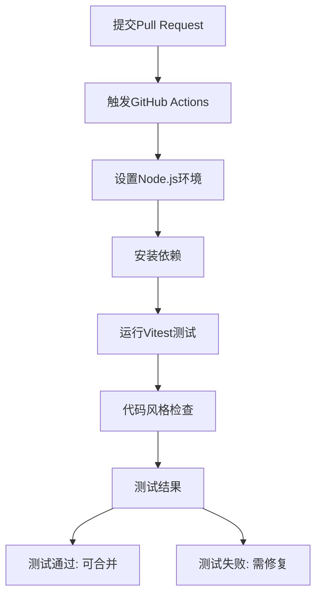
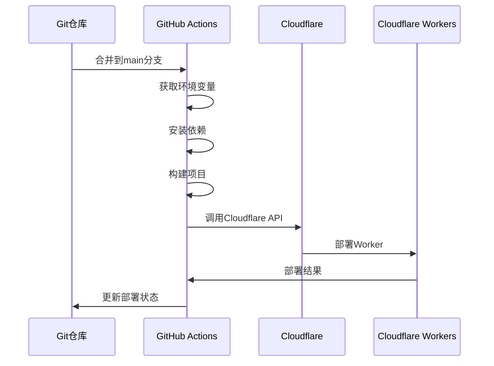
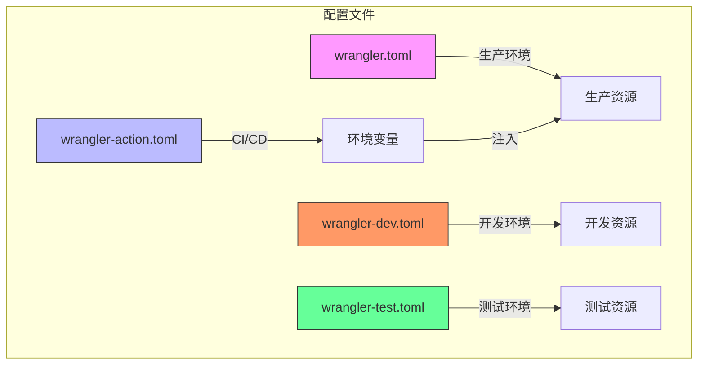

# CI/CD流程

<cite>
**本文档引用的文件**  
- [github-action.md](file://doc/github-action.md)
- [index.spec.js](file://mail-worker/test/index.spec.js)
- [vitest.config.js](file://mail-worker/vitest.config.js)
- [wrangler.toml](file://mail-worker/wrangler.toml)
- [wrangler-action.toml](file://mail-worker/wrangler-action.toml)
- [wrangler-dev.toml](file://mail-worker/wrangler-dev.toml)
- [wrangler-test.toml](file://mail-worker/wrangler-test.toml)
- [package.json](file://mail-worker/package.json)
</cite>

## 目录
1. [CI/CD概述](#cicd概述)
2. [PR测试流程](#pr测试流程)
3. [部署流程](#部署流程)
4. [Wrangler配置文件差异](#wrangler配置文件差异)
5. [日志查看与故障排查](#日志查看与故障排查)
6. [总结](#总结)

## CI/CD概述

本项目采用GitHub Actions实现持续集成与持续部署（CI/CD），确保代码质量并自动化部署至Cloudflare Workers生产环境。当开发者提交Pull Request（PR）时，自动触发测试流程，运行Vitest单元测试并检查代码风格。当代码合并至main分支后，自动触发部署流程，将mail-worker部署到生产环境。

**Section sources**  
- [github-action.md](file://doc/github-action.md#L0-L37)

## PR测试流程

当PR被提交时，GitHub Actions会自动运行测试工作流。该流程基于Vitest测试框架，执行单元测试和集成测试，确保代码功能正确性。

测试配置文件`vitest.config.js`中指定了使用`@cloudflare/vitest-pool-workers`测试池，并配置了Wrangler的配置路径。测试脚本通过`package.json`中的`test`命令调用，使用`wrangler deploy`命令配合`wrangler-test.toml`配置文件部署到测试环境进行验证。

测试用例位于`test/index.spec.js`，包含两种测试风格：单元测试风格和集成测试风格。单元测试直接调用worker的`fetch`方法，集成测试通过`SELF.fetch`模拟真实请求。

**Diagram sources**  
- [vitest.config.js](file://mail-worker/vitest.config.js#L0-L10)
- [index.spec.js](file://mail-worker/test/index.spec.js#L0-L19)
- [package.json](file://mail-worker/package.json#L0-L28)

**Section sources**  
- [vitest.config.js](file://mail-worker/vitest.config.js#L0-L10)
- [index.spec.js](file://mail-worker/test/index.spec.js#L0-L19)

## 部署流程

当代码合并到main分支后，自动化部署流程被触发。该流程使用`wrangler-action.toml`配置文件将mail-worker部署到Cloudflare Workers生产环境。

部署流程首先从GitHub Secrets中读取必要的环境变量，包括`CLOUDFLARE_API_TOKEN`、`CLOUDFLARE_ACCOUNT_ID`、`D1_DATABASE_ID`、`KV_NAMESPACE_ID`、`R2_BUCKET_NAME`等。然后使用Wrangler CLI工具执行部署命令，将代码推送到Cloudflare Workers。

部署过程中，Wrangler会根据`wrangler-action.toml`中的配置，绑定D1数据库、KV命名空间、R2存储桶等资源，并设置定时任务（crons）和静态资源处理规则。

**Diagram sources**  
- [wrangler-action.toml](file://mail-worker/wrangler-action.toml#L0-L39)
- [github-action.md](file://doc/github-action.md#L0-L37)

**Section sources**  
- [wrangler-action.toml](file://mail-worker/wrangler-action.toml#L0-L39)
- [github-action.md](file://doc/github-action.md#L0-L37)

## Wrangler配置文件差异

项目中存在多个Wrangler配置文件，用于不同环境的部署和开发：

- `wrangler.toml`：生产环境配置文件，包含实际的D1数据库ID、KV命名空间ID等生产资源信息。
- `wrangler-action.toml`：CI/CD部署专用配置文件，使用环境变量占位符（如`${D1_DATABASE_ID}`），在GitHub Actions运行时从secrets中注入实际值。
- `wrangler-dev.toml`：开发环境配置文件，用于本地开发，包含开发用的数据库和域名配置。
- `wrangler-test.toml`：测试环境配置文件，用于PR测试流程，包含独立的测试数据库和配置。

这些配置文件的主要差异在于资源绑定的ID和域名配置。生产环境和CI/CD环境使用实际资源，而开发和测试环境使用独立的资源，避免相互影响。

**Diagram sources**  
- [wrangler.toml](file://mail-worker/wrangler.toml#L0-L40)
- [wrangler-action.toml](file://mail-worker/wrangler-action.toml#L0-L39)
- [wrangler-dev.toml](file://mail-worker/wrangler-dev.toml#L0-L30)
- [wrangler-test.toml](file://mail-worker/wrangler-test.toml#L0-L40)

**Section sources**  
- [wrangler.toml](file://mail-worker/wrangler.toml#L0-L40)
- [wrangler-action.toml](file://mail-worker/wrangler-action.toml#L0-L39)
- [wrangler-dev.toml](file://mail-worker/wrangler-dev.toml#L0-L30)
- [wrangler-test.toml](file://mail-worker/wrangler-test.toml#L0-L40)

## 日志查看与故障排查

### 查看Action执行日志
在GitHub仓库的"Actions"标签页中，可以查看所有工作流的执行历史。点击具体的工作流运行实例，可以查看详细的日志输出，包括每个步骤的执行情况、耗时和输出信息。

### 常见部署失败原因及排查
1. **D1绑定错误**：检查`wrangler-action.toml`中的`database_id`是否正确，确保GitHub Secrets中的`D1_DATABASE_ID`值与Cloudflare控制台中的D1数据库ID一致。
2. **KV命名冲突**：确保KV命名空间ID正确，且没有与其他项目冲突。检查`wrangler-action.toml`中的`id`值是否与`KV_NAMESPACE_ID` secrets匹配。
3. **权限不足**：确保`CLOUDFLARE_API_TOKEN`具有Workers和相关资源的完整权限。
4. **环境变量缺失**：检查所有必需的secrets是否已正确配置，包括`CLOUDFLARE_ACCOUNT_ID`、`R2_BUCKET_NAME`等。

### 实用技巧
- 在部署失败时，首先检查GitHub Actions日志中的错误信息。
- 使用`wrangler dev`命令在本地测试配置文件是否正确。
- 通过Cloudflare控制台验证D1、KV、R2等资源的状态和配置。
- 利用`wrangler tail`命令实时查看Worker的日志输出。

**Section sources**  
- [github-action.md](file://doc/github-action.md#L0-L37)
- [wrangler-action.toml](file://mail-worker/wrangler-action.toml#L0-L39)

## 总结

本项目的CI/CD流程通过GitHub Actions实现了自动化测试和部署，确保了代码质量和部署效率。通过合理的Wrangler配置文件管理，实现了开发、测试、生产环境的隔离。开发者应熟悉各配置文件的用途，掌握日志查看和故障排查技巧，以快速响应CI/CD异常，确保系统的稳定运行。