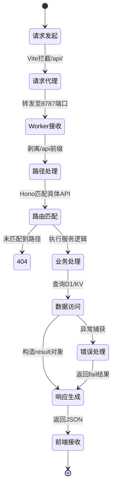

# 前后端联调方法

<cite>
**本文档引用文件**  
- [vite.config.js](file://mail-vue/vite.config.js)
- [index.js](file://mail-worker/src/index.js)
- [webs.js](file://mail-worker/src/hono/webs.js)
- [hono.js](file://mail-worker/src/hono/hono.js)
- [result.js](file://mail-worker/src/model/result.js)
- [wrangler-dev.toml](file://mail-worker/wrangler-dev.toml)
- [package.json](file://mail-worker/package.json)
</cite>

## 目录
1. [简介](#简介)
2. [项目结构与启动流程](#项目结构与启动流程)
3. [前后端开发服务器启动方式](#前后端开发服务器启动方式)
4. [API请求代理机制](#api请求代理机制)
5. [路由转发逻辑分析](#路由转发逻辑分析)
6. [实际调试示例](#实际调试示例)
7. [问题排查方法](#问题排查方法)
8. [模拟接口与测试边界情况](#模拟接口与测试边界情况)
9. [总结](#总结)

## 简介
本文档详细说明在前后端分离架构下，如何进行高效的前后端联调。重点介绍如何同时启动前端Vite开发服务器和后端Cloudflare Worker（通过Wrangler），并确保前端的API请求能够正确代理到本地运行的Worker实例。通过配置Vite的proxy机制，避免跨域问题，并以登录、获取邮件列表等请求为例，展示完整的调试流程。

## 项目结构与启动流程
本项目采用前后端分离架构：
- 前端位于 `mail-vue/` 目录，使用Vue 3 + Vite构建
- 后端位于 `mail-worker/` 目录，基于Cloudflare Workers + Hono框架实现

前端通过 `/api/` 前缀发起请求，由Vite开发服务器代理至本地运行的Worker服务，实现无缝联调。

**Section sources**
- [vite.config.js](file://mail-vue/vite.config.js#L1-L61)
- [package.json](file://mail-worker/package.json#L1-L28)

## 前后端开发服务器启动方式
要实现联调，需并行启动两个开发环境：

### 启动前端Vite服务器
```bash
cd mail-vue
pnpm dev
```
该命令启动Vite开发服务器，默认监听 `http://localhost:3001`。

### 启动后端Wrangler环境
```bash
cd mail-worker
pnpm dev:worker
```
或等价命令：
```bash
wrangler dev --config wrangler-dev.toml
```
此命令启动本地Worker模拟环境，默认监听 `http://127.0.0.1:8787`。

**Section sources**
- [package.json](file://mail-worker/package.json#L6-L10)
- [wrangler-dev.toml](file://mail-worker/wrangler-dev.toml#L1-L31)

## API请求代理机制
前端在开发过程中发送的 `/api/*` 请求会自动被Vite代理至Worker服务，避免CORS跨域限制。

虽然当前 `vite.config.js` 中未显式配置proxy，但可通过扩展其server配置实现请求代理。标准做法如下：

```js
server: {
  proxy: {
    '/api': {
      target: 'http://127.0.0.1:8787',
      changeOrigin: true,
      rewrite: (path) => path.replace(/^\/api/, '')
    }
  }
}
```

此配置将所有以 `/api` 开头的请求转发至Worker本地服务，并重写路径去除 `/api` 前缀。

**Section sources**
- [vite.config.js](file://mail-vue/vite.config.js#L10-L15)

## 路由转发逻辑分析
Worker入口文件 `src/index.js` 实现了核心路由转发逻辑：

当请求路径以 `/api/` 开头时：
1. 将 `/api` 替换为空字符串，剥离前缀
2. 构造新的Request对象
3. 将请求交由Hono应用实例处理

```js
if (url.pathname.startsWith('/api/')) {
  url.pathname = url.pathname.replace('/api', '')
  req = new Request(url.toString(), req)
  return app.fetch(req, env, ctx);
}
```

Hono应用在 `webs.js` 中注册了所有API模块，如 `login-api`、`email-api` 等，确保请求能被正确路由至对应处理器。

```mermaid
flowchart TD
A[前端请求 /api/login] --> B{Vite Dev Server}
B --> C[/api/ 匹配成功]
C --> D[代理至 http://127.0.0.1:8787/login]
D --> E[Worker 接收请求]
E --> F{路径是否以 /api/ 开头}
F --> |是| G[剥离 /api 前缀]
G --> H[交由 Hono 路由处理]
H --> I[调用 login-api 处理器]
I --> J[返回 JSON 响应]
```

**Diagram sources**
- [index.js](file://mail-worker/src/index.js#L7-L15)
- [webs.js](file://mail-worker/src/hono/webs.js#L3-L18)

## 实际调试示例
### 登录请求调试
1. 前端调用 `/api/login` 接口
2. Vite自动代理请求至 `http://127.0.0.1:8787/login`
3. Worker处理登录逻辑，返回用户信息或错误

### 获取邮件列表
1. 前端请求 `/api/email/list`
2. 被代理至 `/email/list`
3. Worker从D1数据库查询邮件数据并返回

响应格式统一由 `result.js` 定义：
```js
{ code: 200, message: 'success', data: [...] }
```

错误时返回：
```js
{ code: 500, message: '错误信息' }
```

**Section sources**
- [index.js](file://mail-worker/src/index.js#L7-L15)
- [result.js](file://mail-worker/src/model/result.js#L1-L10)

## 问题排查方法
### 使用浏览器开发者工具
- 查看Network面板中的请求状态码、响应内容
- 检查请求是否被正确代理（查看Remote Address是否为8787端口）
- 验证请求头、Cookie等信息是否正确携带

### 使用console.log调试
在Worker代码中添加日志输出：
```js
console.log('Received login request:', req.method, url);
```
日志将显示在Wrangler终端中，便于追踪执行流程。

### 常见问题
- **502错误**：提示“KV数据库未绑定”，检查 `wrangler-dev.toml` 中KV命名空间配置
- **500错误**：D1数据库未绑定，确认D1数据库ID和绑定名称
- **404错误**：检查API路径是否正确注册到Hono应用



**Diagram sources**
- [hono.js](file://mail-worker/src/hono/hono.js#L7-L25)
- [result.js](file://mail-worker/src/model/result.js#L1-L10)

## 模拟接口与测试边界情况
为便于前端独立测试，可采取以下方法：

### 临时修改Worker返回值
在对应API处理函数中直接返回模拟数据：
```js
// login-api.js
return c.json(result.ok({ userId: 'test123', role: 'admin' }));
```

### 请求拦截与错误注入
在Hono中间件中注入测试逻辑：
```js
app.use('/api/test-error', (c) => {
  return c.json(result.fail('网络异常', 500));
});
```

### 使用环境变量控制行为
通过 `wrangler-dev.toml` 定义变量，Worker根据变量决定是否启用模拟模式。

**Section sources**
- [hono.js](file://mail-worker/src/hono/hono.js#L7-L25)
- [wrangler-dev.toml](file://mail-worker/wrangler-dev.toml#L20-L30)

## 总结
通过合理配置Vite代理与Worker路由逻辑，可实现高效、稳定的前后端联调体验。关键在于：
1. 正确启动两个开发服务器
2. 理解 `/api/` 前缀的代理与剥离机制
3. 利用浏览器工具和日志进行问题排查
4. 灵活使用模拟数据支持前端独立开发

该架构为前后端并行开发提供了坚实基础，显著提升开发效率。