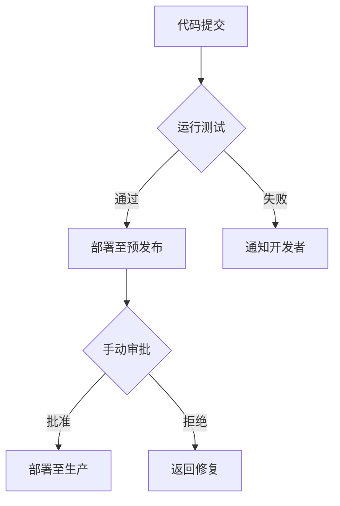

# 开发者指南

<cite>
**本文档中引用的文件**  
- [mail-vue/package.json](file://mail-vue/package.json)
- [mail-vue/vite.config.js](file://mail-vue/vite.config.js)
- [mail-worker/package.json](file://mail-worker/package.json)
- [mail-worker/wrangler.toml](file://mail-worker/wrangler.toml)
- [mail-worker/vitest.config.js](file://mail-worker/vitest.config.js)
- [doc/github-action.md](file://doc/github-action.md)
- [README.md](file://README.md)
</cite>

## 目录
1. [简介](#简介)
2. [本地开发环境搭建](#本地开发环境搭建)
3. [前后端独立启动与联调](#前后端独立启动与联调)
4. [新功能开发流程](#新功能开发流程)
5. [自动化测试与部署](#自动化测试与部署)
6. [调试技巧](#调试技巧)
7. [协作规范](#协作规范)
8. [附录](#附录)

## 简介
`cloud-mail` 是一个基于 Vue 前端与 Cloudflare Worker 后端的现代化邮件管理系统。项目采用前后端分离架构，前端使用 Vite + Vue 3 构建，后端基于 Hono 框架运行在 Cloudflare Workers 上，结合 D1 数据库与 R2 存储服务。本指南旨在为参与开发的工程师提供完整的开发指导，涵盖环境配置、联调技巧、开发流程、自动化部署及团队协作规范。

## 本地开发环境搭建

### Node.js 与 pnpm 安装
1. 安装 **Node.js 18+**（推荐使用 LTS 版本）
2. 全局安装 **pnpm**：
   ```bash
   npm install -g pnpm
   ```

### Wrangler CLI 配置
1. 安装 Cloudflare Wrangler：
   ```bash
   npm install -g wrangler
   ```
2. 登录 Cloudflare 账户：
   ```bash
   wrangler login
   ```
3. 验证安装：
   ```bash
   wrangler --version
   ```

### 项目依赖安装
在项目根目录执行：
```bash
cd mail-vue && pnpm install
cd ../mail-worker && pnpm install
```

**Section sources**
- [mail-vue/package.json](file://mail-vue/package.json)
- [mail-worker/package.json](file://mail-worker/package.json)

## 前后端独立启动与联调

### 前端启动（Vite）
```bash
cd mail-vue
pnpm dev
```
默认启动地址：`http://localhost:5173`

### 后端启动（Wrangler Dev）
```bash
cd mail-worker
wrangler dev --config wrangler-dev.toml
```
默认启动地址：`http://localhost:8787`

### 联调代理设置
前端 `vite.config.js` 中已配置代理，将 `/api` 请求转发至 Worker 服务：

```js
server: {
  proxy: {
    '/api': {
      target: 'http://localhost:8787',
      changeOrigin: true
    }
  }
}
```

此配置确保前端开发时可无缝调用本地 Worker 接口。

**Section sources**
- [mail-vue/vite.config.js](file://mail-vue/vite.config.js)
- [mail-worker/wrangler-dev.toml](file://mail-worker/wrangler-dev.toml)

## 新功能开发流程

### 1. 分支创建
```bash
git checkout -b feature/your-feature-name
```
命名规范：`feature/功能描述`、`fix/问题描述`、`docs/文档说明`

### 2. 代码编写
- 前端代码位于 `mail-vue/src`，遵循 Vue 3 Composition API
- 后端 API 位于 `mail-worker/src/api`，服务逻辑在 `service` 目录
- 实体定义在 `entity` 目录，常量在 `const` 目录

### 3. 单元测试（Vitest）
Worker 项目使用 Vitest 进行单元测试：

```bash
cd mail-worker
pnpm test
```

测试文件位于 `test/` 目录，示例：
- `index.spec.js`：主入口测试
- 各服务模块应有对应测试文件

建议新增功能时同步编写测试用例，确保逻辑正确性。

### 4. 提交 PR
1. 提交代码：
   ```bash
   git add .
   git commit -m "feat: add user profile editing"
   git push origin feature/user-profile
   ```
2. 在 GitHub 创建 Pull Request
3. 等待 CI 通过后由团队成员审查合并

**Section sources**
- [mail-worker/vitest.config.js](file://mail-worker/vitest.config.js)
- [mail-worker/src/api/user-api.js](file://mail-worker/src/api/user-api.js)
- [mail-worker/src/service/user-service.js](file://mail-worker/src/service/user-service.js)

## 自动化测试与部署

### GitHub Actions 工作流
CI/CD 配置位于 `.github/workflows`（未列出）或 `doc/github-action.md`。

典型流程包括：
1. 代码推送触发测试
2. `pnpm test` 执行单元测试
3. 测试通过后自动部署至预发布环境
4. 手动审批后部署至生产环境

使用 `wrangler-action.toml` 配置生产部署参数。



**Diagram sources**
- [doc/github-action.md](file://doc/github-action.md)
- [mail-worker/wrangler-action.toml](file://mail-worker/wrangler-action.toml)

## 调试技巧

### 查看 Worker 日志
```bash
wrangler tail
```
实时查看生产或预发布环境的日志输出，支持过滤：

```bash
wrangler tail --status error
```

### D1 数据库查询
使用 Wrangler 执行 SQL 查询：

```bash
wrangler d1 execute <DB_NAME> --command="SELECT * FROM user LIMIT 10"
```

或进入交互模式：
```bash
wrangler d1 execute <DB_NAME> --local
```

### KV 状态检查
查看 KV 命名空间内容：

```bash
wrangler kv:namespace list --binding=MY_KV
wrangler kv:key get --binding=MY_KV "user:123"
```

### 本地模拟 KV 与 D1
`wrangler-dev.toml` 中配置了本地模拟环境，确保开发时可正常访问存储服务。

**Section sources**
- [mail-worker/wrangler-dev.toml](file://mail-worker/wrangler-dev.toml)
- [mail-worker/src/const/kv-const.js](file://mail-worker/src/const/kv-const.js)

## 协作规范

### 代码风格
- 前端：遵循 ESLint + Prettier，使用 Vue 3 最佳实践
- 后端：JavaScript 标准风格，函数式编程优先
- 文件命名：小写 + 连字符（如 `user-service.js`）

### 提交信息格式
采用 Conventional Commits 规范：
```
<type>: <description>
```
常见类型：
- `feat`：新功能
- `fix`：Bug 修复
- `docs`：文档更新
- `style`：代码格式调整
- `refactor`：重构
- `test`：测试相关
- `chore`：构建或辅助工具变更

### 测试覆盖率要求
- 核心服务（如用户、邮件、权限）单元测试覆盖率 ≥ 80%
- 新增代码必须包含测试用例
- PR 审查需确认测试通过且覆盖率达标

### 分支管理
- 主分支：`main`（受保护）
- 预发布分支：`release/*`
- 功能分支：`feature/*`
- 修复分支：`hotfix/*`

**Section sources**
- [mail-vue/package.json](file://mail-vue/package.json)
- [mail-worker/package.json](file://mail-worker/package.json)

## 附录
- [Cloudflare Workers 文档](https://developers.cloudflare.com/workers/)
- [Hono 框架文档](https://hono.dev)
- [Vite 官方文档](https://vitejs.dev)
- [Vue 3 指南](https://vuejs.org/guide/introduction.html)