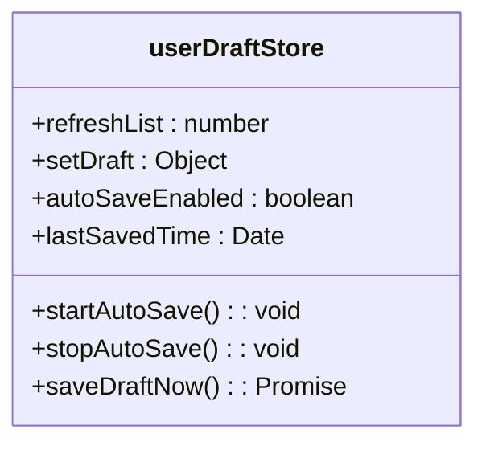
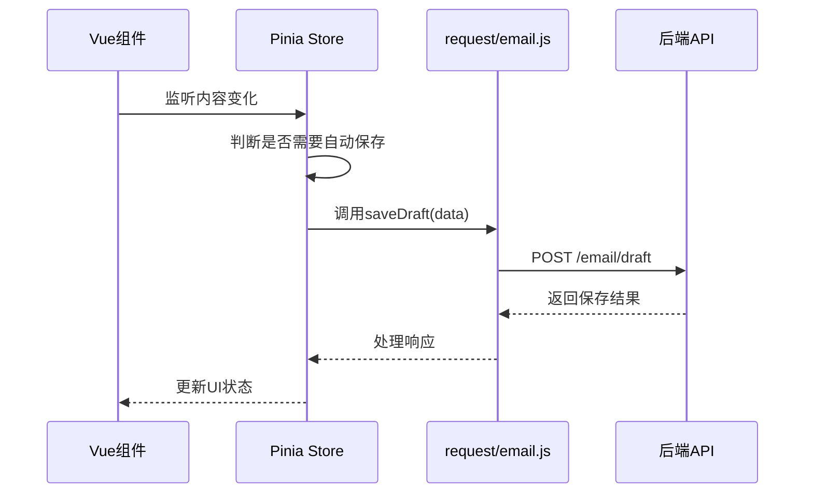
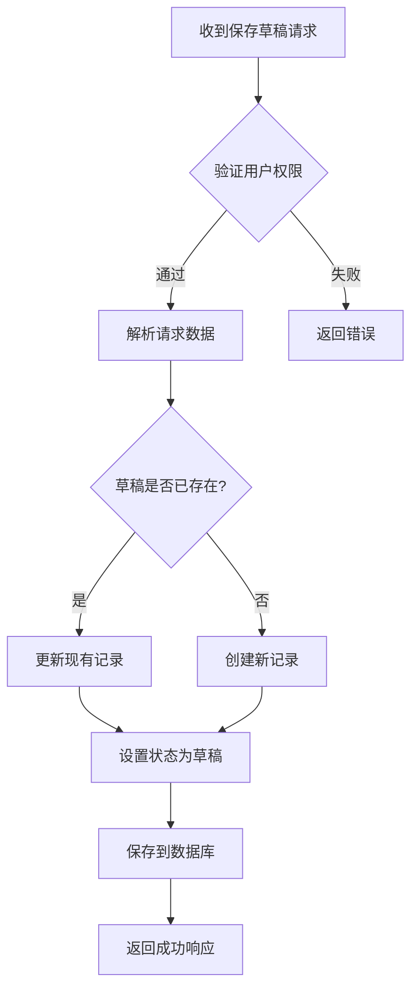
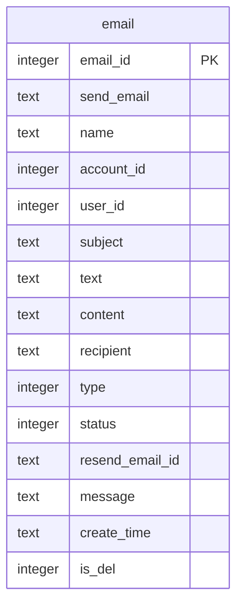

# 新功能开发流程

<cite>
**本文档引用的文件**
- [draft.js](file://mail-vue/src/store/draft.js)
- [email-api.js](file://mail-worker/src/api/email-api.js)
- [email-service.js](file://mail-worker/src/service/email-service.js)
- [email.js](file://mail-worker/src/entity/email.js)
- [email.js](file://mail-vue/src/request/email.js)
</cite>

## 目录
1. [简介](#简介)
2. [Git分支管理规范](#git分支管理规范)
3. [前端开发流程](#前端开发流程)
4. [后端开发流程](#后端开发流程)
5. [代码提交规范](#代码提交规范)
6. [Pull Request与代码审查](#pull-request与代码审查)
7. [总结](#总结)

## 简介
本文档旨在为“邮件草稿自动保存”功能的开发提供标准化流程指导。通过该示例，全面展示从Git分支创建、前后端代码实现、代码格式化与提交，到Pull Request发起的完整开发周期。文档涵盖前端Vue组件开发、Pinia状态管理、API调用，以及后端路由定义、Service业务逻辑编写和Entity数据模型操作等关键环节。

## Git分支管理规范
新功能开发应基于主分支创建特性分支，采用`feature/功能名`的命名约定。例如，开发“邮件草稿自动保存”功能时，应在本地执行以下命令：
```bash
git checkout main
git pull origin main
git checkout -b feature/邮件草稿自动保存
```
此命名规范清晰地标识了分支的用途，便于团队成员识别和管理。

**Section sources**
- [main.go](file://go.mod#L1-L5)

## 前端开发流程
前端开发主要涉及Vue组件的创建、Pinia store状态的更新以及API接口的调用。

### 创建Vue组件
在`mail-vue`项目中，应创建或修改与邮件撰写相关的Vue组件（如`views/write/index.vue`），以集成自动保存功能。组件需监听编辑器内容的变化，并在满足条件时触发保存逻辑。

### 更新Pinia Store状态
项目使用Pinia进行状态管理。`draft.js`文件定义了草稿相关的全局状态。`userDraftStore`包含`refreshList`和`setDraft`等状态字段，用于控制草稿列表的刷新和当前草稿的设置。新功能可能需要扩展此store以存储自动保存的状态或定时器。



**Diagram sources**
- [draft.js](file://mail-vue/src/store/draft.js#L1-L8)

### 调用API接口
前端通过`request/email.js`文件中定义的`http`实例与后端通信。`emailSend`函数展示了如何使用`axios`发送POST请求。对于自动保存功能，需要新增一个`saveDraft`函数，用于向后端的`/email/draft`端点发送草稿数据。



**Diagram sources**
- [email.js](file://mail-vue/src/request/email.js#L1-L22)
- [draft.js](file://mail-vue/src/store/draft.js#L1-L8)

**Section sources**
- [draft.js](file://mail-vue/src/store/draft.js#L1-L8)
- [email.js](file://mail-vue/src/request/email.js#L1-L22)

## 后端开发流程
后端开发包括新增API路由、编写Service业务逻辑和操作Entity数据模型。

### 新增API路由
在`mail-worker/src/api/`目录下，`email-api.js`文件负责定义邮件相关的API路由。参考已有的`/email/send` POST路由，应添加一个新的`/email/draft` POST路由，用于接收前端发送的草稿数据，并将其转发给`emailService`进行处理。

**Section sources**
- [email-api.js](file://mail-worker/src/api/email-api.js#L1-L32)

### 编写Service业务逻辑
`email-service.js`文件是业务逻辑的核心。`emailService`对象包含了`send`、`list`、`delete`等方法。对于自动保存功能，需要在`emailService`中添加`saveDraft`方法。该方法应处理草稿数据的验证、存储，并可能更新或创建数据库中的邮件记录。



**Diagram sources**
- [email-service.js](file://mail-worker/src/service/email-service.js#L1-L667)

**Section sources**
- [email-service.js](file://mail-worker/src/service/email-service.js#L1-L667)

### 操作Entity数据模型
`email.js`文件在`mail-worker/src/entity/`目录下定义了数据库表结构。`email`表的实体模型包含了`subject`、`content`、`status`等字段。自动保存功能需要确保`status`字段能正确标识草稿状态（例如，使用`emailConst.status.DRAFT`）。Service层的方法将使用此模型与数据库进行交互。



**Diagram sources**
- [email.js](file://mail-worker/src/entity/email.js#L1-L28)

## 代码提交规范
在推送代码前，必须遵守以下规范。

### 代码格式化
使用Prettier对代码进行格式化，确保代码风格统一。在项目根目录下，Prettier配置会自动应用。

### 静态代码检查
遵循ESLint规则，运行`eslint`命令检查代码，消除潜在的错误和不规范的写法。

### Commit Message规范
采用Conventional Commits规范编写清晰的提交信息。提交信息应以类型开头，例如`feat:`、`fix:`、`docs:`等，后跟冒号和简短描述。例如：
```bash
git add .
git commit -m "feat: 实现邮件草稿自动保存功能"
```

## Pull Request与代码审查
功能开发和测试完成后，将本地分支推送到远程仓库：
```bash
git push origin feature/邮件草稿自动保存
```
随后，在GitHub上基于此分支创建Pull Request (PR)。PR的描述应清晰说明功能变更、实现细节和测试情况。团队成员将对代码进行审查，提出修改意见。只有在所有审查通过后，PR才能被合并到`main`分支。

**Section sources**
- [github-action.md](file://doc/github-action.md#L1-L10)

## 总结
本文档通过“邮件草稿自动保存”功能的开发实例，系统地阐述了从分支创建到代码合并的标准化流程。遵循此流程有助于保证代码质量、提高团队协作效率，并确保新功能的顺利集成。