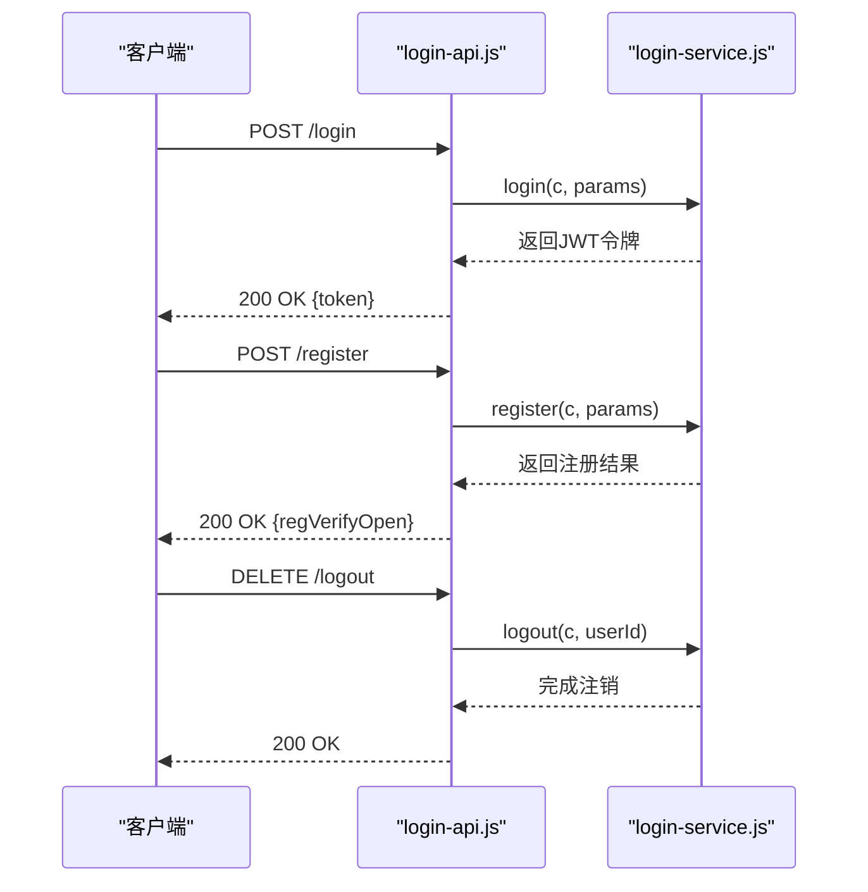
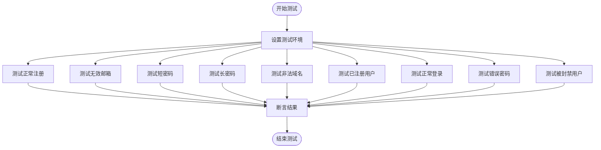
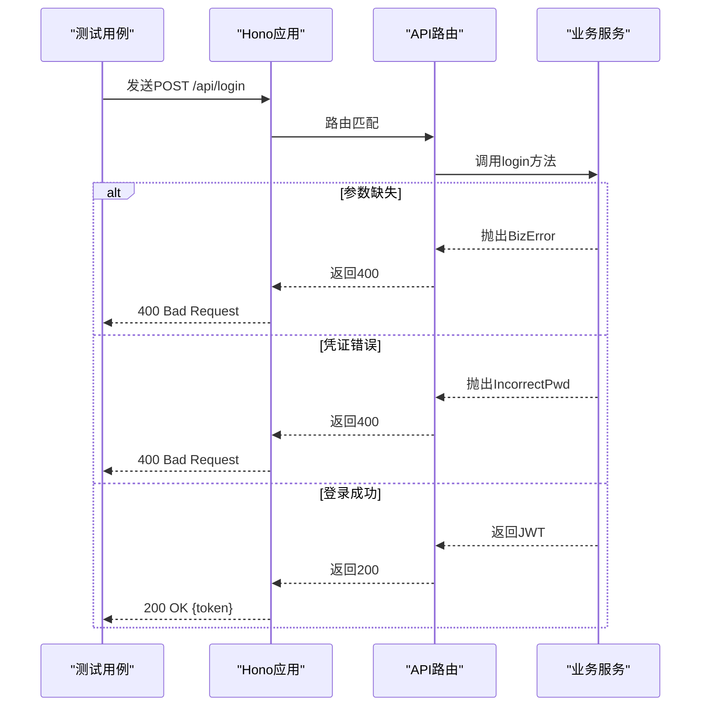
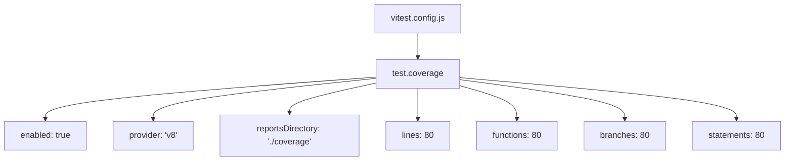

# 测试策略

<cite>
**本文档中引用的文件**  
- [login-service.js](file://mail-worker/src/service/login-service.js)
- [login-api.js](file://mail-worker/src/api/login-api.js)
- [vitest.config.js](file://mail-worker/vitest.config.js)
- [index.spec.js](file://mail-worker/test/index.spec.js)
- [hono.js](file://mail-worker/src/hono/hono.js)
- [package.json](file://mail-worker/package.json)
- [wrangler-test.toml](file://mail-worker/wrangler-test.toml)
</cite>

## 目录
1. [简介](#简介)
2. [项目结构与测试环境](#项目结构与测试环境)
3. [核心测试组件分析](#核心测试组件分析)
4. [单元测试与集成测试实践](#单元测试与集成测试实践)
5. [API接口测试策略](#api接口测试策略)
6. [测试覆盖率配置](#测试覆盖率配置)
7. [测试执行与报告生成](#测试执行与报告生成)
8. [关键模块测试要求](#关键模块测试要求)
9. [结论](#结论)

## 简介
本文档旨在为 `cloud-mail` 项目建立全面的测试策略，确保代码质量。通过使用 Vitest 框架进行单元测试和集成测试，重点覆盖后端 Service 层（如 `login-service.js`）和 API 接口（如 `login-api.js`）。文档将介绍最佳实践、异常分支覆盖、HTTP 请求模拟、测试覆盖率要求及操作命令。

## 项目结构与测试环境

```mermaid
graph TB
subgraph "前端"
Vue[mail-vue]
end
subgraph "后端"
Worker[mail-worker]
subgraph "测试"
Test[test]
Config[vitest.config.js]
end
subgraph "API"
API[src/api]
end
subgraph "Service"
Service[src/service]
end
subgraph "Hono框架"
Hono[src/hono]
end
end
Vue --> Worker
Test --> Service
Test --> API
API --> Service
Hono --> API
```

**图示来源**  
- [vitest.config.js](file://mail-worker/vitest.config.js#L1-L10)
- [package.json](file://mail-worker/package.json#L1-L28)
- [wrangler-test.toml](file://mail-worker/wrangler-test.toml#L1-L39)

**本节来源**  
- [mail-worker/test](file://mail-worker/test)
- [mail-worker/vitest.config.js](file://mail-worker/vitest.config.js#L1-L10)
- [mail-worker/package.json](file://mail-worker/package.json#L1-L28)

## 核心测试组件分析

### 登录服务实现分析
`login-service.js` 包含用户注册、登录和注销的核心逻辑，包含多个条件分支和外部依赖，是测试的重点。

**本节来源**  
- [login-service.js](file://mail-worker/src/service/login-service.js#L1-L259)

### API路由配置分析
`login-api.js` 定义了 `/login`、`/register` 和 `/logout` 三个接口，通过 Hono 框架绑定到 `login-service` 的服务方法。



**图示来源**  
- [login-api.js](file://mail-worker/src/api/login-api.js#L1-L18)
- [login-service.js](file://mail-worker/src/service/login-service.js#L1-L259)

**本节来源**  
- [login-api.js](file://mail-worker/src/api/login-api.js#L1-L18)
- [hono.js](file://mail-worker/src/hono/hono.js#L1-L30)

## 单元测试与集成测试实践

### Service层单元测试
为 `login-service.js` 编写测试用例，覆盖正常流程与异常分支：

- 正常注册流程
- 密码长度不足异常
- 邮箱格式错误异常
- 用户已存在异常
- 注册功能关闭异常
- 登录凭证错误异常
- 用户被封禁异常



**图示来源**  
- [login-service.js](file://mail-worker/src/service/login-service.js#L1-L259)

**本节来源**  
- [login-service.js](file://mail-worker/src/service/login-service.js#L1-L259)

## API接口测试策略

### 使用Hono测试工具模拟HTTP请求
利用 Vitest 和 Hono 的测试能力，模拟 HTTP 请求验证 API 接口：

- 验证响应状态码（200, 400, 403, 502）
- 验证响应数据结构符合预期
- 验证错误处理机制
- 模拟不同请求头（如 accept-language）



**图示来源**  
- [login-api.js](file://mail-worker/src/api/login-api.js#L1-L18)
- [hono.js](file://mail-worker/src/hono/hono.js#L1-L30)

**本节来源**  
- [login-api.js](file://mail-worker/src/api/login-api.js#L1-L18)
- [hono.js](file://mail-worker/src/hono/hono.js#L1-L30)

## 测试覆盖率配置

在 `vitest.config.js` 中配置测试覆盖率，确保关键模块达到80%以上覆盖率要求。



**图示来源**  
- [vitest.config.js](file://mail-worker/vitest.config.js#L1-L10)

**本节来源**  
- [vitest.config.js](file://mail-worker/vitest.config.js#L1-L10)

## 测试执行与报告生成

### 运行测试命令
使用以下命令运行测试：

```bash
pnpm test
```

该命令在 `package.json` 中定义，会启动测试环境并执行所有测试用例。

### 生成测试报告
测试完成后，Vitest 会自动生成覆盖率报告，默认输出到 `coverage/` 目录，包含 HTML、JSON 等多种格式。

**本节来源**  
- [package.json](file://mail-worker/package.json#L1-L28)
- [vitest.config.js](file://mail-worker/vitest.config.js#L1-L10)

## 关键模块测试要求

| 模块 | 覆盖率要求 | 测试重点 |
|------|-----------|---------|
| **安全模块** | ≥80% | JWT生成、密码哈希、权限验证 |
| **权限模块** | ≥80% | 角色权限、域名限制、封禁状态 |
| **邮件发送** | ≥80% | 附件处理、R2存储、转发逻辑 |
| **注册登录** | ≥80% | 所有异常分支、验证码验证 |

**本节来源**  
- [login-service.js](file://mail-worker/src/service/login-service.js#L1-L259)
- [security.js](file://mail-worker/src/security/security.js)
- [role-service.js](file://mail-worker/src/service/role-service.js)

## 结论
通过建立全面的测试策略，使用 Vitest 框架对 `cloud-mail` 项目的关键模块进行充分测试，可以有效保障代码质量。建议所有新功能开发都遵循"测试先行"原则，确保核心业务逻辑的稳定性和可靠性。