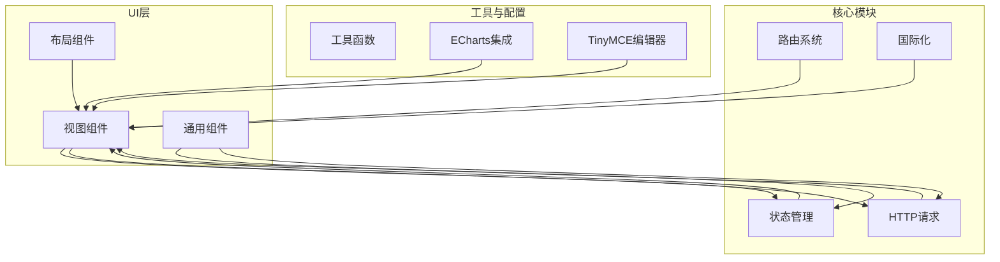
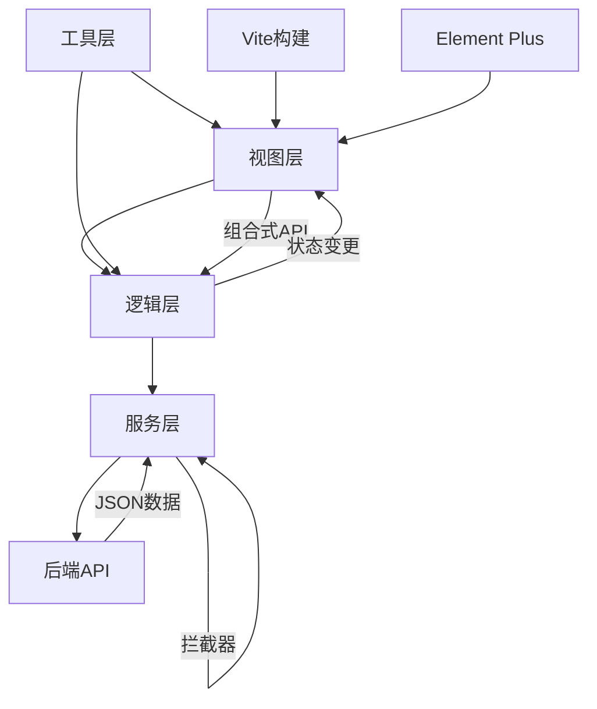
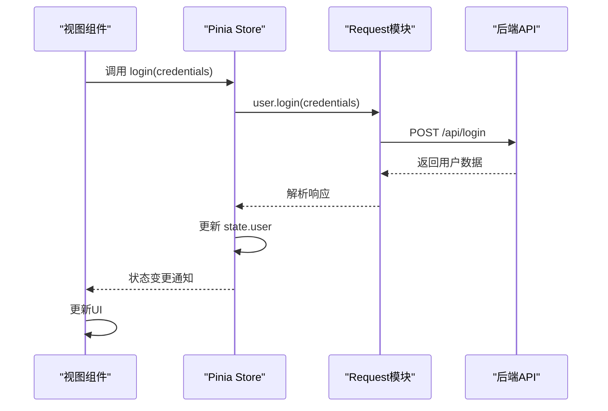
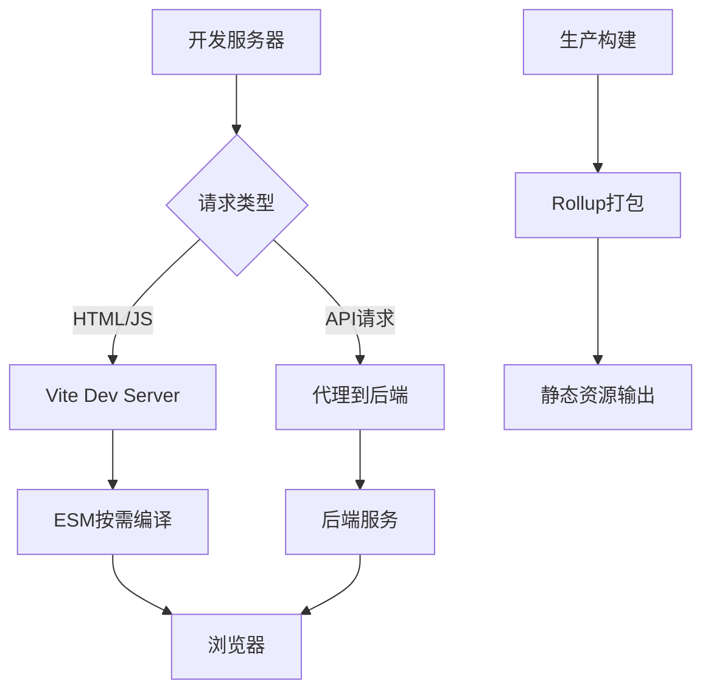
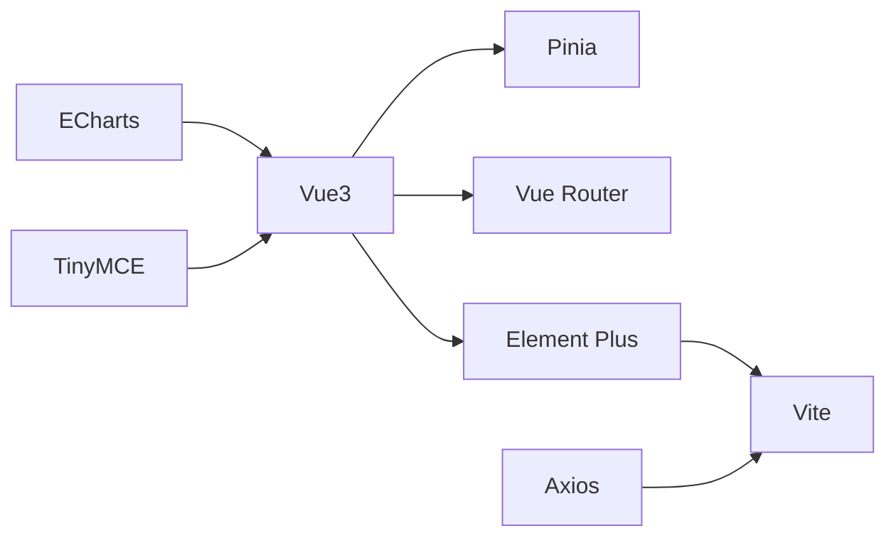

# 前端技术栈

<cite>
**本文档引用的文件**  
- [main.js](file://mail-vue/src/main.js)
- [App.vue](file://mail-vue/src/App.vue)
- [vite.config.js](file://mail-vue/vite.config.js)
- [package.json](file://mail-vue/package.json)
- [router/index.js](file://mail-vue/src/router/index.js)
- [store/user.js](file://mail-vue/src/store/user.js)
- [request/user.js](file://mail-vue/src/request/user.js)
- [axios/index.js](file://mail-vue/src/axios/index.js)
- [echarts/index.js](file://mail-vue/src/echarts/index.js)
- [i18n/index.js](file://mail-vue/src/i18n/index.js)
- [tiny-editor/index.vue](file://mail-vue/src/components/tiny-editor/index.vue)
- [views/analysis/index.vue](file://mail-vue/src/views/analysis/index.vue)
</cite>

## 目录
1. [简介](#简介)
2. [项目结构](#项目结构)
3. [核心组件](#核心组件)
4. [架构概览](#架构概览)
5. [详细组件分析](#详细组件分析)
6. [依赖分析](#依赖分析)
7. [性能考量](#性能考量)
8. [故障排除指南](#故障排除指南)
9. [结论](#结论)

## 简介
cloud-mail前端采用现代化的Vue生态技术栈，构建了一个高效、可维护且用户体验优良的邮件管理系统。本项目基于Vue3的组合式API进行组件开发，使用Pinia作为状态管理方案，Element Plus提供一致的UI交互体验，Vite作为构建工具显著提升开发效率。系统通过Axios封装统一的HTTP请求层，集成ECharts实现数据可视化，并使用TinyMCE富文本编辑器支持复杂邮件内容编辑。同时，项目支持多语言切换与路由权限控制，具备良好的扩展性与安全性。

## 项目结构
cloud-mail前端项目遵循模块化设计原则，src目录下按功能划分组件、视图、状态管理、请求服务等模块。核心结构包括：
- `components/`：通用UI组件，如编辑器、加载动画、滚动容器等
- `views/`：页面级组件，对应不同路由视图
- `store/`：Pinia状态模块，按业务域划分用户、邮件、设置等状态
- `request/`：API请求封装，每个文件对应一个后端资源
- `router/`：Vue Router配置，包含路由定义与权限控制逻辑
- `utils/`：工具函数集合，如时间处理、验证、文件操作等
- `i18n/`：国际化语言包，支持中英文切换
- `axios/`：Axios实例配置与拦截器封装
- `echarts/`：图表配置与主题管理
- `layout/`：应用布局组件，如侧边栏、头部、主区域等

**图示来源**
- [router/index.js](file://mail-vue/src/router/index.js#L1-L50)
- [store/user.js](file://mail-vue/src/store/user.js#L1-L40)
- [axios/index.js](file://mail-vue/src/axios/index.js#L1-L30)
- [views/analysis/index.vue](file://mail-vue/src/views/analysis/index.vue#L1-L20)

**本节来源**
- [mail-vue/src](file://mail-vue/src)

## 核心组件
项目中关键组件包括：
- `tiny-editor`：基于TinyMCE封装的富文本编辑器，支持皮肤、插件和语言包定制
- `email-scroll`：虚拟滚动邮件列表，优化大量邮件渲染性能
- `shadow-html`：安全渲染HTML内容的组件，防止XSS攻击
- `send-percent`：发送进度可视化组件
- `hamburger`：移动端侧边栏开关按钮

状态管理通过多个Pinia store模块实现，包括`user`、`email`、`setting`、`writer`等，分别管理用户信息、邮件数据、系统设置和编辑器状态。

**本节来源**
- [mail-vue/src/components/tiny-editor/index.vue](file://mail-vue/src/components/tiny-editor/index.vue#L1-L100)
- [mail-vue/src/store/user.js](file://mail-vue/src/store/user.js#L1-L50)
- [mail-vue/src/store/email.js](file://mail-vue/src/store/email.js#L1-L50)

## 架构概览
系统采用分层架构，从上至下分为视图层、逻辑层、服务层和工具层。视图层由Vue组件构成，通过组合式API组织逻辑；逻辑层包含Pinia状态管理与业务逻辑处理；服务层通过Axios与后端API通信；工具层提供通用功能支持。

**图示来源**
- [main.js](file://mail-vue/src/main.js#L1-L20)
- [App.vue](file://mail-vue/src/App.vue#L1-L30)
- [axios/index.js](file://mail-vue/src/axios/index.js#L1-L40)
- [store/user.js](file://mail-vue/src/store/user.js#L1-L20)

## 详细组件分析

### Vue3组合式API应用
在组件开发中广泛使用`<script setup>`语法糖，通过`ref`、`reactive`、`computed`、`watch`等API组织响应式逻辑。例如在邮件列表组件中，使用`ref`管理分页状态，`computed`计算过滤后的邮件列表，`watch`监听路由变化重新加载数据。

**本节来源**
- [mail-vue/src/views/email/index.vue](file://mail-vue/src/views/email/index.vue#L1-L100)
- [mail-vue/src/views/all-email/index.vue](file://mail-vue/src/views/all-email/index.vue#L1-L100)

### Pinia状态管理机制
Pinia用于集中管理用户、邮件、设置等模块的状态。每个store模块定义`state`、`getters`、`actions`，实现数据流的单向流动。例如`user` store中，`login` action发起登录请求，成功后更新`state`中的用户信息，视图组件通过`getters`获取用户权限并控制UI显示。

**图示来源**
- [store/user.js](file://mail-vue/src/store/user.js#L15-L80)
- [request/user.js](file://mail-vue/src/request/user.js#L10-L40)

**本节来源**
- [mail-vue/src/store/user.js](file://mail-vue/src/store/user.js#L1-L100)
- [mail-vue/src/request/user.js](file://mail-vue/src/request/user.js#L1-L50)

### Element Plus使用规范
Element Plus作为UI组件库，在表单、弹窗、表格等场景中提供一致的交互体验。项目中遵循以下规范：
- 表单使用`<el-form>`配合`<el-form-item>`，通过`rules`属性定义验证规则
- 弹窗使用`<el-dialog>`，通过`v-model`绑定显示状态
- 表格使用`<el-table>`，通过`el-table-column`定义列，支持排序、筛选
- 按钮使用`<el-button>`，根据场景选择类型（primary、success、warning等）

**本节来源**
- [mail-vue/src/views/user/index.vue](file://mail-vue/src/views/user/index.vue#L1-L100)
- [mail-vue/src/views/setting/index.vue](file://mail-vue/src/views/setting/index.vue#L1-L100)

### Vite构建工具配置
Vite通过`vite.config.js`进行配置，提升开发体验与构建性能。关键配置包括：
- `server.proxy`：配置API代理，解决开发环境跨域问题
- `resolve.alias`：设置路径别名，如`@`指向`src`目录
- `build.outDir`：指定构建输出目录
- `build.rollupOptions`：配置代码分割与静态资源处理

**图示来源**
- [vite.config.js](file://mail-vue/vite.config.js#L1-L50)

**本节来源**
- [mail-vue/vite.config.js](file://mail-vue/vite.config.js#L1-L60)

### Axios请求封装策略
Axios在`src/axios/index.js`中进行全局配置与拦截器封装：
- 请求拦截器：添加认证token、设置请求头
- 响应拦截器：统一处理成功/失败响应，错误码映射为用户友好提示
- 错误处理：网络异常、超时、认证失败等场景的降级处理
- 数据格式约定：请求体为JSON，响应体统一包装为`{ code, data, message }`结构

**本节来源**
- [mail-vue/src/axios/index.js](file://mail-vue/src/axios/index.js#L1-L100)

### ECharts图表渲染
在分析页面中，通过`src/echarts/index.js`封装ECharts实例，实现邮件发送量、用户活跃度等数据的可视化。采用按需引入方式减少包体积，定义通用主题与默认配置。

**本节来源**
- [mail-vue/src/echarts/index.js](file://mail-vue/src/echarts/index.js#L1-L50)
- [mail-vue/src/views/analysis/index.vue](file://mail-vue/src/views/analysis/index.vue#L1-L100)

### TinyMCE富文本编辑器
`tiny-editor`组件封装TinyMCE，实现以下定制化：
- 皮肤配置：使用`oxide-dark`暗色主题
- 插件管理：启用`code`、`nonbreaking`、`pagebreak`、`save`、`visualblocks`等插件
- 语言包：支持中英文切换，对应`zh_CN.js`、`en.js`
- 内容安全：通过`valid_elements`和`extended_valid_elements`限制HTML标签，防止XSS

**本节来源**
- [mail-vue/src/components/tiny-editor/index.vue](file://mail-vue/src/components/tiny-editor/index.vue#L1-L150)
- [mail-vue/public/tinymce/langs](file://mail-vue/public/tinymce/langs)
- [mail-vue/public/tinymce/skins](file://mail-vue/public/tinymce/skins)

### 具体代码示例

#### Store模块定义与调用
用户状态模块在`store/user.js`中定义，包含登录、登出、信息更新等action。在组件中通过`useUserStore()`获取实例并调用方法。

**本节来源**
- [mail-vue/src/store/user.js](file://mail-vue/src/store/user.js#L1-L60)

#### 路由权限控制逻辑
在`router/index.js`中通过路由守卫实现权限控制，未登录用户重定向到登录页，根据用户角色控制特定页面访问。

**本节来源**
- [mail-vue/src/router/index.js](file://mail-vue/src/router/index.js#L1-L80)

#### 国际化切换实现
通过`i18n/index.js`集成Vue I18n，支持中英文切换。语言包分别定义在`zh.js`和`en.js`中，通过`$t()`方法在模板中使用翻译文本。

**本节来源**
- [mail-vue/src/i18n/index.js](file://mail-vue/src/i18n/index.js#L1-L40)
- [mail-vue/src/i18n/zh.js](file://mail-vue/src/i18n/zh.js#L1-L100)
- [mail-vue/src/i18n/en.js](file://mail-vue/src/i18n/en.js#L1-L100)

## 依赖分析
项目依赖关系清晰，核心依赖包括：
- Vue3：框架核心
- Pinia：状态管理
- Vue Router：路由系统
- Element Plus：UI组件库
- Vite：构建工具
- Axios：HTTP客户端
- ECharts：图表库
- TinyMCE：富文本编辑器

**图示来源**
- [package.json](file://mail-vue/package.json#L10-L50)

**本节来源**
- [mail-vue/package.json](file://mail-vue/package.json#L1-L100)

## 性能考量
- Vite利用浏览器原生ESM支持，实现快速冷启动与热更新
- 虚拟滚动组件优化大量邮件渲染性能
- Axios拦截器统一处理请求缓存与错误重试
- ECharts按需引入与懒加载提升页面性能
- 图片等静态资源通过R2或S3存储，减轻前端负载

## 故障排除指南
- **页面空白**：检查Vite开发服务器是否正常启动，浏览器控制台是否有JS错误
- **API 401错误**：确认用户已登录，token是否过期
- **富文本编辑器不显示**：检查TinyMCE资源路径是否正确，CSP策略是否允许内联脚本
- **图表不渲染**：确认ECharts实例容器有固定高度，数据格式是否正确
- **国际化不生效**：检查语言包是否正确导入，i18n实例是否正确挂载

**本节来源**
- [mail-vue/src/main.js](file://mail-vue/src/main.js#L1-L30)
- [mail-vue/src/axios/index.js](file://mail-vue/src/axios/index.js#L1-L50)
- [mail-vue/src/echarts/index.js](file://mail-vue/src/echarts/index.js#L1-L30)

## 结论
cloud-mail前端技术栈选型合理，各组件集成紧密，形成了高效、可维护的开发体系。Vue3组合式API提升了代码组织能力，Pinia实现了清晰的状态管理，Element Plus保证了UI一致性，Vite极大优化了开发体验。通过合理的封装与规范，项目具备良好的扩展性与稳定性，为后续功能迭代奠定了坚实基础。