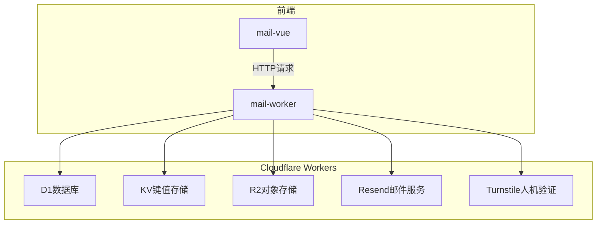
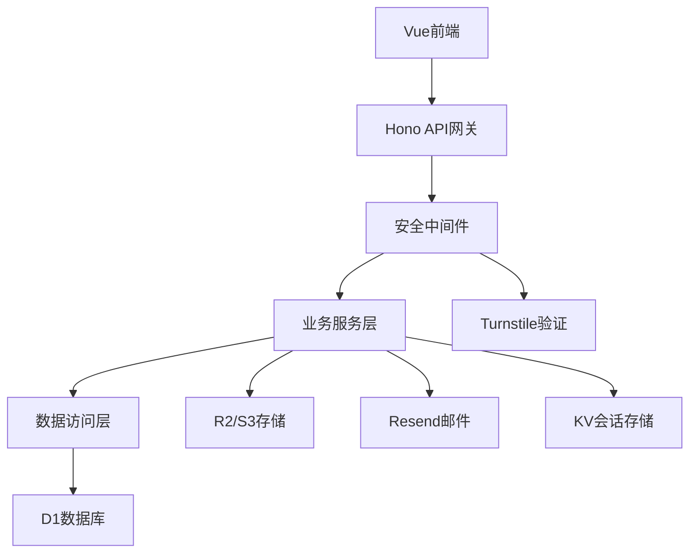
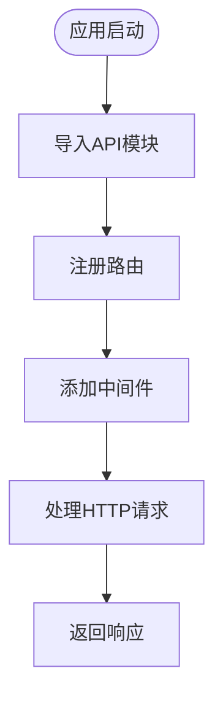
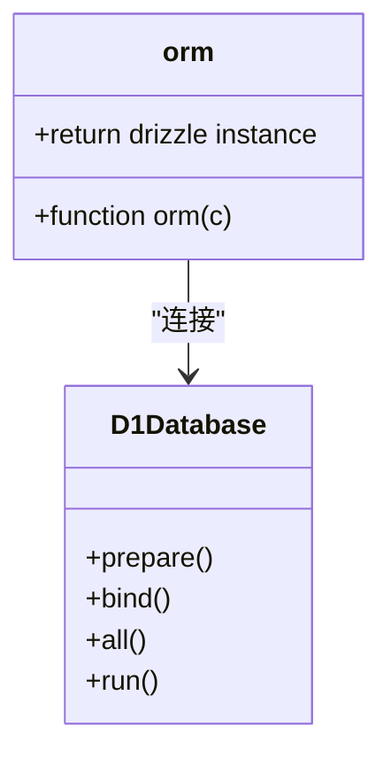
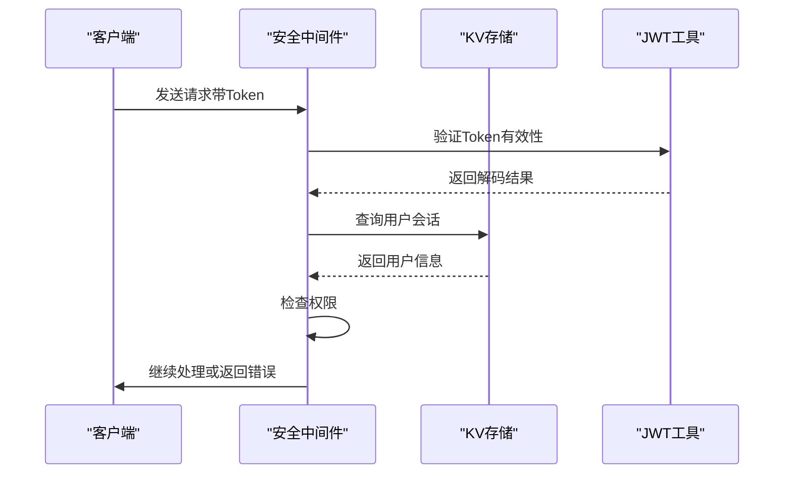
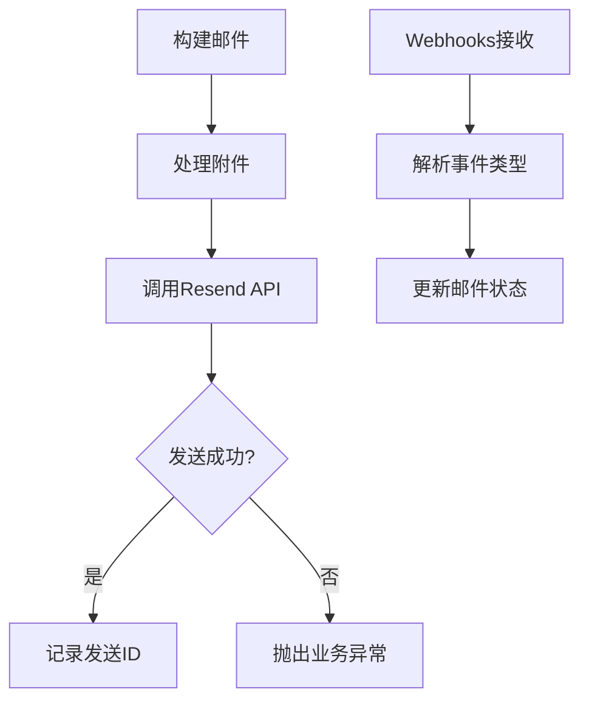
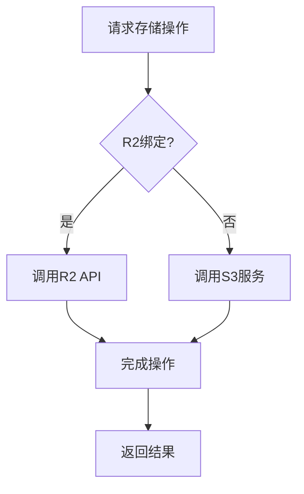
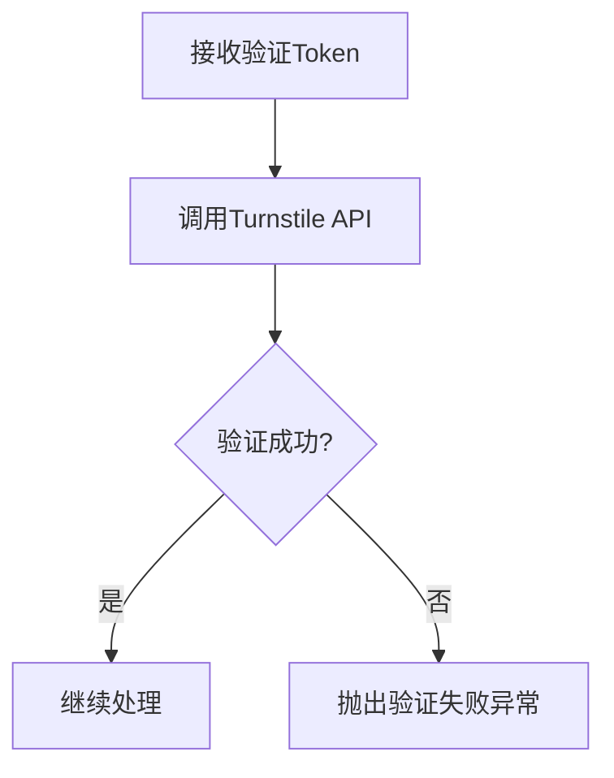

# 后端技术栈

<cite>
**本文档引用的文件**
- [hono.js](file://mail-worker/src/hono/hono.js)
- [webs.js](file://mail-worker/src/hono/webs.js)
- [orm.js](file://mail-worker/src/entity/orm.js)
- [security.js](file://mail-worker/src/security/security.js)
- [jwt-utils.js](file://mail-worker/src/utils/jwt-utils.js)
- [login-service.js](file://mail-worker/src/service/login-service.js)
- [user-context.js](file://mail-worker/src/security/user-context.js)
- [resend-service.js](file://mail-worker/src/service/resend-service.js)
- [email-service.js](file://mail-worker/src/service/email-service.js)
- [r2-service.js](file://mail-worker/src/service/r2-service.js)
- [s3-service.js](file://mail-worker/src/service/s3-service.js)
- [turnstile-service.js](file://mail-worker/src/service/turnstile-service.js)
- [wrangler.toml](file://mail-worker/wrangler.toml)
- [att-service.js](file://mail-worker/src/service/att-service.js)
- [email.js](file://mail-worker/src/email/email.js)
</cite>

## 目录
1. [简介](#简介)
2. [项目结构](#项目结构)
3. [核心组件](#核心组件)
4. [架构概览](#架构概览)
5. [详细组件分析](#详细组件分析)
6. [依赖分析](#依赖分析)
7. [性能考虑](#性能考虑)
8. [故障排除指南](#故障排除指南)
9. [结论](#结论)

## 简介
本项目为基于 Cloudflare Workers 的云邮件系统，采用 Hono 框架构建轻量级后端服务。系统集成了 D1 数据库、R2 对象存储、KV 键值存储等 Cloudflare 原生服务，结合 Resend 邮件服务实现高效邮件收发。通过 Drizzle ORM 提供类型安全的数据库操作，JWT 实现用户认证，Turnstile 提供人机验证防护。前端使用 Vue 框架，整体架构充分体现了 Serverless 架构的优势。

## 项目结构
项目包含两个主要模块：`mail-vue`（前端）和 `mail-worker`（后端）。后端运行在 Cloudflare Workers 环境中，通过 API 提供服务。



**Diagram sources**
- [wrangler.toml](file://mail-worker/wrangler.toml#L1-L40)

## 核心组件
系统核心组件包括 Hono 路由框架、Drizzle ORM 数据访问层、JWT 安全认证模块、Resend 邮件服务集成、R2/S3 文件存储服务以及 Turnstile 人机验证机制。

**Section sources**
- [hono.js](file://mail-worker/src/hono/hono.js#L1-L34)
- [orm.js](file://mail-worker/src/entity/orm.js#L1-L6)

## 架构概览
系统采用分层架构设计，从前端到后端各组件协同工作。



**Diagram sources**
- [hono.js](file://mail-worker/src/hono/hono.js#L1-L34)
- [security.js](file://mail-worker/src/security/security.js#L1-L173)

## 详细组件分析

### Hono框架与路由注册
Hono 框架作为轻量级 Web 框架，在 Cloudflare Workers 环境中提供高效的路由注册与中间件处理能力。`webs.js` 文件通过导入各个 API 模块实现自动路由注册，形成模块化的 API 分组。



**Diagram sources**
- [webs.js](file://mail-worker/src/hono/webs.js#L1-L22)
- [hono.js](file://mail-worker/src/hono/hono.js#L1-L34)

**Section sources**
- [webs.js](file://mail-worker/src/hono/webs.js#L1-L22)

### Drizzle ORM与D1数据库
Drizzle ORM 在 `entity/orm.js` 中封装了对 D1 数据库的访问，通过 `drizzle(c.env.db)` 创建数据库实例，实现类型安全的数据库操作。该设计支持 Schema 定义、关系映射和查询优化。



**Diagram sources**
- [orm.js](file://mail-worker/src/entity/orm.js#L1-L6)
- [package.json](file://mail-worker/package.json#L1-L28)

### JWT认证流程
安全模块在 `security.js` 中实现了完整的 JWT 认证流程，包括 token 生成、验证和用户上下文注入。认证中间件对请求进行拦截，验证 token 有效性并注入用户信息。



**Diagram sources**
- [security.js](file://mail-worker/src/security/security.js#L1-L173)
- [jwt-utils.js](file://mail-worker/src/utils/jwt-utils.js#L1-L87)

**Section sources**
- [security.js](file://mail-worker/src/security/security.js#L1-L173)
- [jwt-utils.js](file://mail-worker/src/utils/jwt-utils.js#L1-L87)
- [user-context.js](file://mail-worker/src/security/user-context.js#L1-L18)

### Resend邮件服务集成
邮件服务通过 Resend API 实现邮件发送功能，在 `email-service.js` 中处理邮件构建、附件处理和发送逻辑。`resend-service.js` 处理 Webhooks 回调，更新邮件状态。



**Diagram sources**
- [email-service.js](file://mail-worker/src/service/email-service.js#L196-L330)
- [resend-service.js](file://mail-worker/src/service/resend-service.js#L1-L47)

**Section sources**
- [email-service.js](file://mail-worker/src/service/email-service.js#L196-L330)
- [resend-service.js](file://mail-worker/src/service/resend-service.js#L1-L47)

### R2对象存储与性能优化
R2 服务在 `r2-service.js` 中实现对象存储功能，支持 Cloudflare R2 和兼容 S3 的存储服务。通过条件判断优先使用 R2，提供灵活的存储方案。



**Diagram sources**
- [r2-service.js](file://mail-worker/src/service/r2-service.js#L1-L54)
- [s3-service.js](file://mail-worker/src/service/s3-service.js#L1-L56)

**Section sources**
- [r2-service.js](file://mail-worker/src/service/r2-service.js#L1-L54)
- [s3-service.js](file://mail-worker/src/service/s3-service.js#L1-L56)

### Turnstile人机验证
Turnstile 服务在 `turnstile-service.js` 中实现人机验证功能，通过调用 Cloudflare Turnstile API 验证用户身份，防止自动化攻击。



**Diagram sources**
- [turnstile-service.js](file://mail-worker/src/service/turnstile-service.js#L1-L34)

**Section sources**
- [turnstile-service.js](file://mail-worker/src/service/turnstile-service.js#L1-L34)

## 依赖分析
系统依赖关系清晰，各组件职责分明。

```mermaid
graph TD
A[hono] --> B[drizzle-orm]
A --> C[i18next]
A --> D[uuid]
A --> E[dayjs]
B --> F[@cloudflare/workers-types]
G[resend] --> H[fetch]
I[aws-sdk] --> J[S3Client]
```

**Diagram sources**
- [package.json](file://mail-worker/package.json#L1-L28)

**Section sources**
- [package.json](file://mail-worker/package.json#L1-L28)

## 性能考虑
系统在性能方面进行了多项优化：
- 使用 KV 存储缓存用户会话，减少数据库查询
- R2/S3 存储附件，减轻数据库负担
- 批量处理邮件发送，提高效率
- 合理设置缓存策略，提升响应速度

## 故障排除指南
常见问题及解决方案：
- **D1数据库未绑定**：检查 `wrangler.toml` 中 D1 配置
- **KV数据库未绑定**：确认 KV 命名空间配置正确
- **JWT密钥缺失**：确保环境变量 `jwt_secret` 已设置
- **邮件发送失败**：检查 Resend API 密钥配置
- **存储访问错误**：验证 R2 或 S3 配置参数

**Section sources**
- [hono.js](file://mail-worker/src/hono/hono.js#L1-L34)
- [wrangler.toml](file://mail-worker/wrangler.toml#L1-L40)

## 结论
cloud-mail 后端系统充分利用了 Cloudflare Workers 的 Serverless 架构优势，通过 Hono 框架实现高效路由，Drizzle ORM 提供类型安全的数据访问，JWT 实现安全认证，Resend 和 R2 提供专业的邮件和存储服务。整体架构设计合理，组件职责清晰，具备良好的可维护性和扩展性。