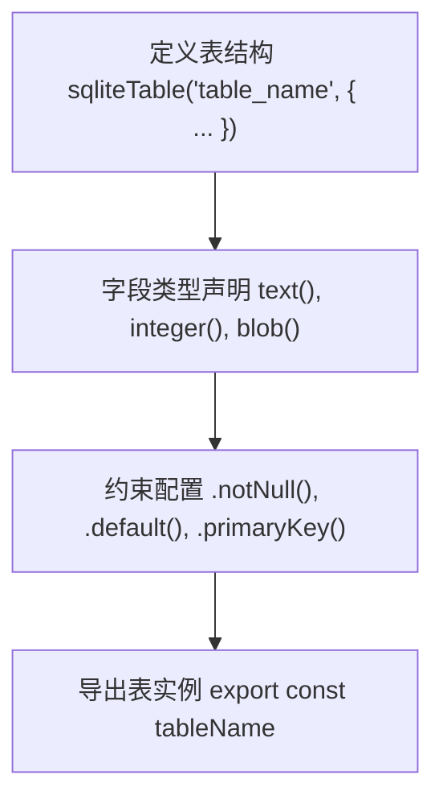
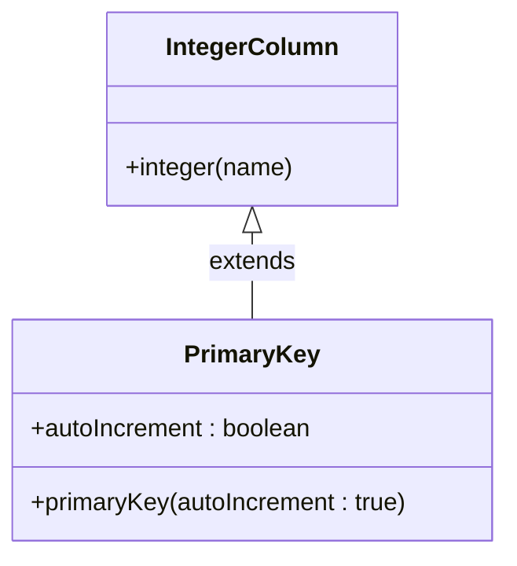
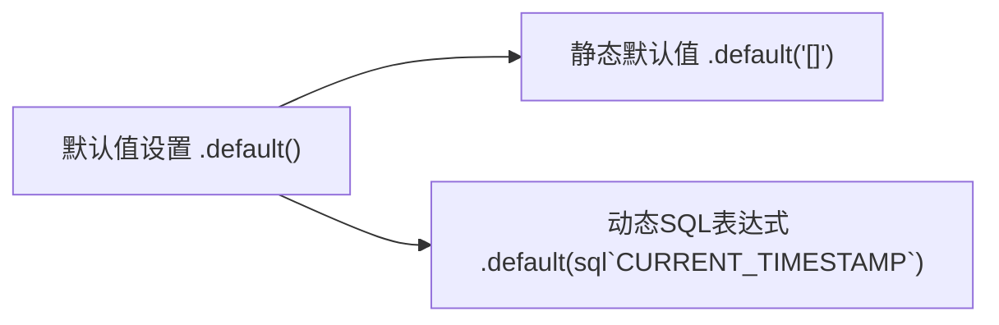
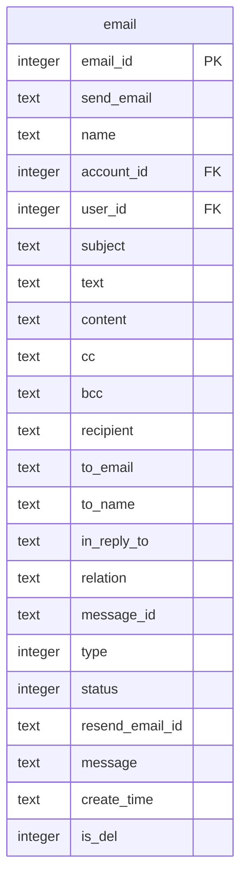
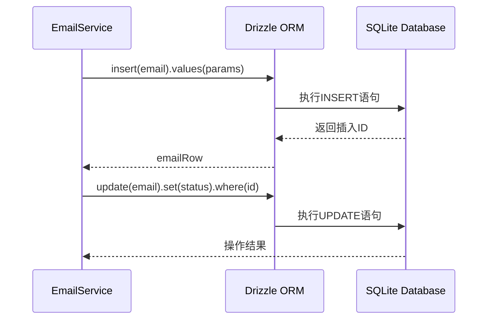

# Drizzle ORM映射实现

<cite>
**本文档引用文件**  
- [orm.js](file://mail-worker/src/entity/orm.js)
- [email.js](file://mail-worker/src/entity/email.js)
- [user.js](file://mail-worker/src/entity/user.js)
- [att.js](file://mail-worker/src/entity/att.js)
- [setting.js](file://mail-worker/src/entity/setting.js)
- [account.js](file://mail-worker/src/entity/account.js)
- [reg-key.js](file://mail-worker/src/entity/reg-key.js)
- [role.js](file://mail-worker/src/entity/role.js)
- [role-perm.js](file://mail-worker/src/entity/role-perm.js)
- [perm.js](file://mail-worker/src/entity/perm.js)
- [star.js](file://mail-worker/src/entity/star.js)
</cite>

## 目录
1. [简介](#简介)
2. [Drizzle ORM初始化机制](#drizzle-orm初始化机制)
3. [表结构定义规范](#表结构定义规范)
4. [字段类型映射与约束配置](#字段类型映射与约束配置)
5. [主键与自增策略](#主键与自增策略)
6. [默认值与时间戳处理](#默认值与时间戳处理)
7. [索引与外键约束](#索引与外键约束)
8. [email表结构详解](#email表结构详解)
9. [ORM查询构建器支持](#orm查询构建器支持)
10. [服务层中的表对象使用](#服务层中的表对象使用)
11. [结论](#结论)

## 简介
本项目采用Drizzle ORM作为数据库抽象层，通过声明式DSL定义SQLite数据库表结构。所有表定义位于`mail-worker/src/entity`目录下，每个实体文件导出一个或多个表实例，供服务层进行数据操作。Drizzle ORM提供了类型安全的查询构建能力，支持字段级类型映射、约束声明、默认值设置及SQL表达式嵌入。

## Drizzle ORM初始化机制
ORM实例通过`orm.js`文件中的工厂函数创建，接收上下文对象并返回Drizzle数据库实例。

**Section sources**
- [orm.js](file://mail-worker/src/entity/orm.js#L1-L5)

## 表结构定义规范
所有表使用`sqliteTable`函数定义，接受表名和字段配置对象。字段配置采用键值对形式，键为TS属性名，值为Drizzle列定义。

**Diagram sources**
- [email.js](file://mail-worker/src/entity/email.js#L2-L26)
- [user.js](file://mail-worker/src/entity/user.js#L2-L21)

**Section sources**
- [email.js](file://mail-worker/src/entity/email.js#L2-L26)
- [user.js](file://mail-worker/src/entity/user.js#L2-L21)

## 字段类型映射与约束配置
Drizzle提供强类型字段映射，支持多种SQLite数据类型：

- `text()`: 映射TEXT类型，适用于字符串、JSON数组等
- `integer()`: 映射INTEGER类型，用于数值、状态码
- `blob()`: 映射BLOB类型（本项目未使用）

字段可链式调用约束方法：
- `.notNull()`: 非空约束
- `.default(value)`: 默认值设置
- `.unique()`: 唯一性约束（本项目未显式使用）

**Section sources**
- [email.js](file://mail-worker/src/entity/email.js#L2-L26)
- [setting.js](file://mail-worker/src/entity/setting.js#L2-L44)

## 主键与自增策略
主键通过`.primaryKey({ autoIncrement: true })`声明，自动启用自增策略。所有主键字段均为INTEGER类型，符合SQLite最佳实践。

**Diagram sources**
- [email.js](file://mail-worker/src/entity/email.js#L4-L4)
- [user.js](file://mail-worker/src/entity/user.js#L3-L3)

**Section sources**
- [email.js](file://mail-worker/src/entity/email.js#L4-L4)
- [user.js](file://mail-worker/src/entity/user.js#L3-L3)

## 默认值与时间戳处理
默认值通过`.default()`方法设置，支持静态值和动态SQL表达式。时间戳字段使用`sql`模板字符串嵌入`CURRENT_TIMESTAMP`。

**Diagram sources**
- [email.js](file://mail-worker/src/entity/email.js#L18-L18)
- [user.js](file://mail-worker/src/entity/user.js#L7-L7)

**Section sources**
- [email.js](file://mail-worker/src/entity/email.js#L18-L18)
- [user.js](file://mail-worker/src/entity/user.js#L7-L7)

## 索引与外键约束
本项目未在Drizzle DSL中显式定义索引或外键，依赖应用层逻辑维护数据完整性。SQLite的外键需手动启用，当前实现通过业务服务层保证关联一致性。

**Section sources**
- [att.js](file://mail-worker/src/entity/att.js#L2-L21)
- [star.js](file://mail-worker/src/entity/star.js#L2-L11)

## email表结构详解
`email`表是核心实体，存储邮件元数据与内容：

- `headers`字段：虽未直接命名，但`message`字段TEXT类型设计用于存储原始邮件头信息
- `bodyHtml`字段：由`content`字段承担，TEXT类型支持长文本HTML内容存储
- `recipient`, `cc`, `bcc`字段：默认存储JSON字符串数组，实现复杂结构序列化

**Diagram sources**
- [email.js](file://mail-worker/src/entity/email.js#L2-L26)

**Section sources**
- [email.js](file://mail-worker/src/entity/email.js#L2-L26)

## ORM查询构建器支持
Drizzle ORM提供链式查询构建器，支持：
- `insert().values()`: 数据插入
- `select().from().where()`: 条件查询
- `update().set().where()`: 数据更新
- `delete().from().where()`: 数据删除

查询具备类型推导能力，确保字段名与值类型安全。

**Section sources**
- [email-service.js](file://mail-worker/src/service/email-service.js)

## 服务层中的表对象使用
服务层导入表实例执行CRUD操作。例如`emailService`使用`email`表对象处理邮件持久化，通过事务协调主表与附件表的一致性。

**Diagram sources**
- [email-service.js](file://mail-worker/src/service/email-service.js#L20-L60)
- [email.js](file://mail-worker/src/entity/email.js#L2-L26)

**Section sources**
- [email-service.js](file://mail-worker/src/service/email-service.js#L20-L60)
- [email.js](file://mail-worker/src/entity/email.js#L2-L26)

## 结论
cloud-mail项目通过Drizzle ORM实现了类型安全的数据库访问层。表结构定义清晰，字段映射合理，利用TEXT类型存储序列化数据适应灵活需求。尽管未使用复杂索引与外键，但通过服务层逻辑保障数据一致性。`orm.js`封装提供了统一的数据库访问入口，便于在Cloudflare Workers环境中集成D1数据库。