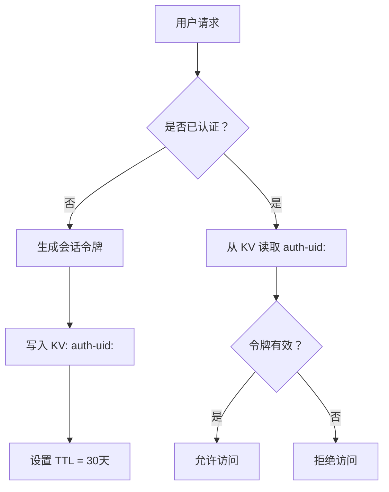
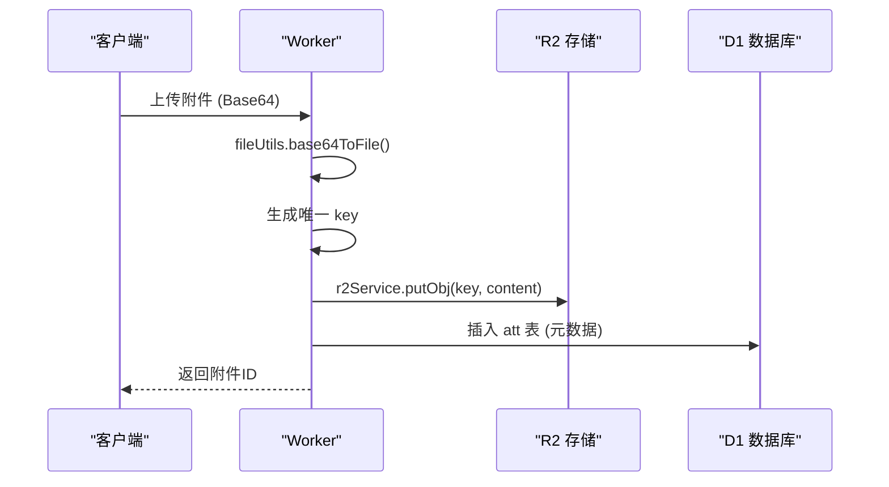
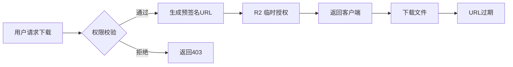

# KV与R2存储策略

<cite>
**本文档引用文件**  
- [r2-service.js](file://mail-worker/src/service/r2-service.js)
- [file-utils.js](file://mail-worker/src/utils/file-utils.js)
- [verify-record-service.js](file://mail-worker/src/service/verify-record-service.js)
- [att.js](file://mail-worker/src/entity/att.js)
- [kv-const.js](file://mail-worker/src/const/kv-const.js)
- [constant.js](file://mail-worker/src/const/constant.js)
</cite>

## 目录
1. [简介](#简介)
2. [Cloudflare KV 使用策略](#cloudflare-kv-使用策略)
3. [R2 存储集成机制](#r2-存储集成机制)
4. [文件路径生成与安全校验](#文件路径生成与安全校验)
5. [附件安全下载机制](#附件安全下载机制)
6. [D1、KV、R2 适用场景对比](#d1kv-r2-适用场景对比)
7. [最佳实践建议](#最佳实践建议)

## 简介
cloud-mail 系统充分利用 Cloudflare 提供的 KV（Key-Value 存储）与 R2（对象存储）服务，分别处理轻量级缓存数据和大文件附件存储。本文档详细阐述 KV 与 R2 的使用策略、集成方式及最佳实践，涵盖会话管理、配置缓存、验证记录、附件上传与安全访问等核心功能。

## Cloudflare KV 使用策略

Cloudflare KV 在 cloud-mail 系统中主要用于存储轻量级、高频访问的临时数据，具备低延迟读写与自动过期（TTL）机制，适用于以下场景：

- **会话令牌存储**：通过 `KvConst.AUTH_INFO` 前缀存储用户认证信息，结合 JWT 机制实现无状态会话管理。
- **系统配置快照**：使用 `KvConst.SETTING` 前缀缓存系统设置，减少对数据库的频繁查询。
- **临时验证记录**：如 `verify-record` 表记录用户注册或添加操作的频率，KV 可用于缓存 IP 访问计数，提升验证效率。

KV 的 TTL 机制确保数据自动过期，避免长期占用存储空间。例如，登录令牌可通过 `constant.TOKEN_EXPIRE` 设置 30 天过期时间，系统在写入 KV 时自动附加 TTL。

**Diagram sources**
- [kv-const.js](file://mail-worker/src/const/kv-const.js#L2-L7)
- [constant.js](file://mail-worker/src/const/constant.js#L3-L7)

**Section sources**
- [kv-const.js](file://mail-worker/src/const/kv-const.js#L1-L8)
- [constant.js](file://mail-worker/src/const/constant.js#L1-L16)

## R2 存储集成机制

R2 在系统中承担附件文件的持久化存储职责，通过 `r2-service` 实现与 Cloudflare R2 的无缝集成。

### 附件上传流程
当用户上传文件时，系统执行以下步骤：
1. 前端通过 Base64 编码传输文件数据。
2. 后端调用 `file-utils.base64ToFile` 解析 MIME 类型与扩展名。
3. `r2-service.putObj` 生成唯一键名（key），并将二进制流写入 R2。
4. 元数据（文件名、大小、Content-Type 等）存入 D1 数据库的 `att` 表。

### R2 服务兼容性
`r2-service` 支持 Cloudflare R2 与标准 S3 协议的双模式：
- 若 `c.env.r2` 存在，直接使用 R2 API。
- 否则回退至 S3 兼容接口，通过 `s3Service.putObj` 写入第三方对象存储。

**Diagram sources**
- [r2-service.js](file://mail-worker/src/service/r2-service.js#L10-L38)
- [att.js](file://mail-worker/src/entity/att.js#L3-L21)
- [file-utils.js](file://mail-worker/src/utils/file-utils.js#L20-L56)

**Section sources**
- [r2-service.js](file://mail-worker/src/service/r2-service.js#L1-L53)
- [att.js](file://mail-worker/src/entity/att.js#L1-L21)

## 文件路径生成与安全校验

`file-utils` 模块提供关键的文件处理能力，确保附件存储的安全性与一致性。

### 路径生成逻辑
- 使用 `getExtFileName` 提取文件扩展名，避免路径注入。
- 通过 `base64ToFile` 自动识别 MIME 类型并生成安全文件名，格式为 `{type}_{timestamp}.{ext}`，如 `image_1712345678901.jpg`。
- 所有附件存储路径前缀由 `constant.ATTACHMENT_PREFIX` 统一管理，确保集中控制。

### 安全校验机制
- 严格校验 Base64 数据格式，仅允许 `image/*` 与 `video/*` 类型。
- 拒绝包含路径遍历字符（如 `../`）的文件名。
- 使用 SHA-256 哈希校验文件完整性（`getBuffHash`），防止数据篡改。

**Section sources**
- [file-utils.js](file://mail-worker/src/utils/file-utils.js#L1-L61)
- [constant.js](file://mail-worker/src/const/constant.js#L8-L9)

## 附件安全下载机制

为避免直接暴露 R2 对象 URL，系统采用预签名 URL（Presigned URL）实现安全下载：

1. 用户请求下载附件时，后端验证其权限（通过 D1 查询 `att` 表）。
2. 调用 R2 的 `getSignedUrl` 接口生成限时有效的下载链接（通常有效期为 5-15 分钟）。
3. 将预签名 URL 返回给前端，前端重定向或通过 `fetch` 下载。
4. 链接过期后自动失效，防止未授权访问。

此机制确保即使 URL 被泄露，也无法长期访问敏感文件。

**Diagram sources**
- [r2-service.js](file://mail-worker/src/service/r2-service.js#L30-L35)
- [att.js](file://mail-worker/src/entity/att.js#L3-L21)

## D1、KV、R2 适用场景对比

| 特性 | D1 (SQLite) | KV (Key-Value) | R2 (对象存储) |
|------|-------------|----------------|----------------|
| **数据类型** | 结构化数据（用户、邮件、附件元数据） | 简单键值对（会话、配置、计数） | 非结构化大文件（附件、图片） |
| **读写性能** | 中等，适合复杂查询 | 极高，毫秒级延迟 | 高，适合大文件流式读写 |
| **存储成本** | 低 | 低（按请求计费） | 低（按存储量与流量计费） |
| **适用场景** | 持久化核心业务数据 | 缓存、会话、临时状态 | 大文件存储、静态资源 |
| **访问方式** | SQL 查询 | Key-Value 读写 | HTTP(S) 预签名 URL |
| **数据大小** | 单行 KB 级 | 单值 ≤ 25MB | 对象 ≤ 5GB |

**Section sources**
- [att.js](file://mail-worker/src/entity/att.js#L1-L21)
- [kv-const.js](file://mail-worker/src/const/kv-const.js#L1-L8)
- [r2-service.js](file://mail-worker/src/service/r2-service.js#L1-L53)

## 最佳实践建议

1. **KV 使用建议**：
   - 仅用于缓存高频读取、低写入的轻量数据。
   - 合理设置 TTL，避免内存泄漏。
   - 避免存储敏感信息，必要时加密。

2. **R2 使用建议**：
   - 所有文件上传必须通过 `file-utils` 进行类型与路径校验。
   - 附件元数据必须与 R2 对象键名在 D1 中保持一致。
   - 下载必须通过预签名 URL，禁止直接暴露 R2 公共链接。

3. **整体策略**：
   - D1 负责“数据关系”，KV 负责“状态缓存”，R2 负责“文件存储”。
   - 三者协同实现高可用、低成本、安全的云邮件系统架构。